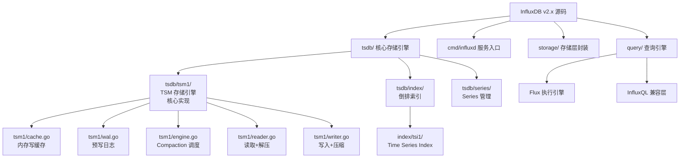
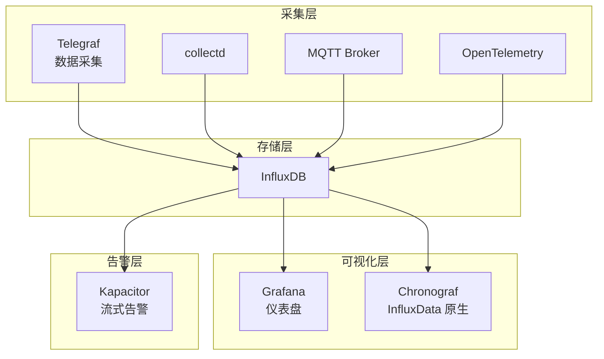
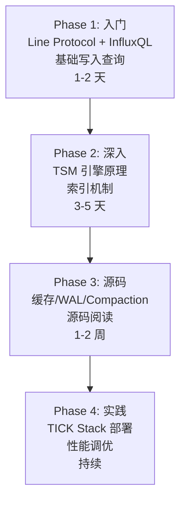

# InfluxDB 学习资源

## 学习目标

- 获取 InfluxDB 的优质学习资源
- 建立系统化的源码阅读路径
- 掌握深入理解时序数据库的方法

## 官方资源

### 文档与社区

| 资源 | 链接 | 说明 |
|------|------|------|
| 官方文档 | [https://docs.influxdata.com/influxdb/](https://docs.influxdata.com/influxdb/) | 完整的架构、API、运维文档 |
| GitHub | [https://github.com/influxdata/influxdb](https://github.com/influxdata/influxdb) | 源码，28k Stars |
| 社区论坛 | [https://community.influxdata.com/](https://community.influxdata.com/) | 问答与讨论 |
| InfluxDB 博客 | [https://www.influxdata.com/blog/](https://www.influxdata.com/blog/) | 技术博客、案例研究 |
| 官方规范 | [https://docs.influxdata.com/influxdb/cloud/reference/spec/](https://docs.influxdata.com/influxdb/cloud/reference/spec/) | Line Protocol 完整规范 |

### 学习平台

- **InfluxDB University**：[https://university.influxdata.com/](https://university.influxdata.com/) — 免费课程，含认证
- **Flux 文档**：[https://docs.influxdata.com/flux/](https://docs.influxdata.com/flux/) — 函数式查询语言参考
- **Telegraf 插件列表**：[https://github.com/influxdata/telegraf/tree/master/plugins](https://github.com/influxdata/telegraf/tree/master/plugins) — 200+ 数据采集插件

## 源码研读路径

### 源码阅读建议顺序

1. **入口**：`cmd/influxd/main.go` → 理解启动流程
2. **数据结构**：`models/points.go` → 理解 Point 和 Line Protocol 解析
3. **写入路径**：`tsdb/tsm1/cache.go` → `wal.go` → `engine.go`（写入流程）
4. **读取路径**：`tsdb/tsm1/reader.go` → `engine.go`（查询流程）
5. **压缩合并**：`tsdb/tsm1/compact.go` → 理解 LSM 风格的 Compaction
6. **索引**：`tsdb/index/tsi1/` → 理解倒排索引实现
7. **查询**：`query/` 或 `storage/` → 理解 Flux 或 InfluxQL 执行

### 核心代码文件速查

| 文件 | 功能 | 关键行数 |
|------|------|---------|
| `tsdb/tsm1/engine.go` | TSM 引擎主循环，Compaction 调度 | ~2000 |
| `tsdb/tsm1/cache.go` | 内存缓存，WAL 写入，快照 | ~800 |
| `tsdb/tsm1/wal.go` | 预写日志，断点恢复 | ~500 |
| `tsdb/tsm1/reader.go` | 数据读取，解压，迭代 | ~600 |
| `tsdb/tsm1/writer.go` | 数据写入，压缩块构建 | ~400 |
| `tsdb/tsm1/compact.go` | Compaction 策略，合并逻辑 | ~1500 |
| `tsdb/index/tsi1/tag_value_index.go` | Tag 倒排索引 | ~1000 |
| `models/points.go` | Point 结构体，解析 | ~1000 |

## 推荐书籍与论文

### 书籍

| 书名 | 作者 | 说明 |
|------|------|------|
| 《Time Series Databases: New Ways to Store and Access Data》 | Ted Dunning | 时序数据库入门，讲解基本原理 |
| 《Database Internals》 | Alex Petrov | LSM-Tree 架构深入，含 LevelDB/Cassandra/InfluxDB 对比 |
| 《Designing Data-Intensive Applications》 | Martin Kleppmann | 分布式系统基础，对理解 InfluxDB 企业版有帮助 |
| 《The Art of Multiprocessor Programming》 | Herlihy & Shavit | 并发编程，对理解 InfluxDB 的并发写入有帮助 |

### 关键论文

| 论文 | 作者 | 与 InfluxDB 的关系 |
|------|------|-------------------|
| [The Log-Structured Merge-Tree (LSM-Tree)](https://www.cs.umb.edu/~poneil/lsmtree.pdf) | O'Neil et al., 1996 | TSM 的基础理论 |
| [Bigtable: A Distributed Storage System for Structured Data](https://static.googleusercontent.com/media/research.google.com/en//archive/bigtable-osdi06.pdf) | Google, 2006 | SSTable 格式参考 |
| [B-tree Indexes and CPU Caches](https://15721.courses.cs.cmu.edu/spring2023/papers/07-oltpindexes/graefe-btree.pdf) | Graefe, 2011 | 索引优化，对 InfluxDB 的索引实现有参考 |
| [Column-Stores vs. Row-Stores: How Different Are They Really?](https://dl.acm.org/doi/10.1145/1376616.1376712) | Abadi et al., 2008 | 列式存储理论，InfluxDB 的压缩策略参考 |
| [Monarch: Google's Planet-Scale In-Memory Time Series Database](https://www.vldb.org/pvldb/vol13/p3181-adams.pdf) | Adams et al., 2020 | Google 的时序数据库，分布式方案参考 |

## 社区资源

### 开源工具生态

### 社区项目

- **Telegraf**：[https://github.com/influxdata/telegraf](https://github.com/influxdata/telegraf) — 数据采集代理，200+ 输入/输出插件
- **Kapacitor**：[https://github.com/influxdata/kapacitor](https://github.com/influxdata/kapacitor) — 流式告警引擎
- **Chronograf**：[https://github.com/influxdata/chronograf](https://github.com/influxdata/chronograf) — 可视化面板（已维护模式）
- **InfluxDB Rust 客户端**：[https://github.com/influxdata/influxdb-rust](https://github.com/influxdata/influxdb-rust) — 高性能 Rust 客户端
- **InfluxDB Python 客户端**：[https://github.com/influxdata/influxdb-client-python](https://github.com/influxdata/influxdb-client-python) — 官方 Python SDK
- **Flux 标准库**：[https://github.com/influxdata/flux](https://github.com/influxdata/flux) — Flux 查询语言运行时

### 技术博客与案例

| 博客 | 链接 | 推荐内容 |
|------|------|---------|
| 官方技术博客 | [https://www.influxdata.com/blog/](https://www.influxdata.com/blog/) | "TSM Storage Engine Explained" 系列 |
| 美团技术博客 | [https://tech.meituan.com/](https://tech.meituan.com/) | 时序数据库选型实践 |
| 饿了么运维 | [https://www.elastic.co/cn/blog/](https://www.elastic.co/cn/blog/) | 时序数据库监控实践 |
| VM 博客 | [https://victoriametrics.com/blog/](https://victoriametrics.com/blog/) | 时序数据库性能对比 |

## 学习路径

### Phase 1 入门 Checklist

- [ ] 阅读官方文档 "Getting Started"
- [ ] 理解 Measurement/Tag/Field/Timestamp 四要素
- [ ] 手写 Line Protocol 写入数据
- [ ] 掌握 InfluxQL 基础查询（SELECT, WHERE, GROUP BY time）
- [ ] 使用 Docker 本地部署 InfluxDB

### Phase 2 深入 Checklist

- [ ] 理解 TSM 引擎的 Cache → WAL → TSM File 三阶段
- [ ] 掌握 Series 概念和倒排索引
- [ ] 理解连续查询和保留策略
- [ ] 实验：手动写入数据并观察磁盘文件变化
- [ ] 分析高基数场景下的性能衰减

### Phase 3 源码 Checklist

- [ ] 阅读 `models/points.go`，理解 Point 结构
- [ ] 跟踪写入路径 `cache.go → wal.go → engine.go`
- [ ] 跟踪读取路径 `reader.go → engine.go`
- [ ] 理解 Compaction 调度策略
- [ ] 阅读 TSI 倒排索引实现

## 要点总结

- 官方文档是首要学习资源，InfluxDB University 提供免费课程
- 源码阅读应遵循 写入路径 → 读取路径 → Compaction → 索引 的顺序
- LSM-Tree 论文是理解 TSM 的理论基础
- Telegraf + InfluxDB + Grafana 是最常见的生产部署组合
- Flux 语言是 InfluxDB 2.x 的查询核心，与 InfluxQL 并存

## 思考题

1. InfluxDB 的 TSM 引擎与 LevelDB 的 LSM-Tree 实现有哪些关键差异？
2. TSI（Time Series Index）的倒排索引与搜索引擎的倒排索引有何异同？
3. Flux 查询语言的设计哲学是什么？为什么 InfluxData 要开发新语言而不是直接使用 SQL？