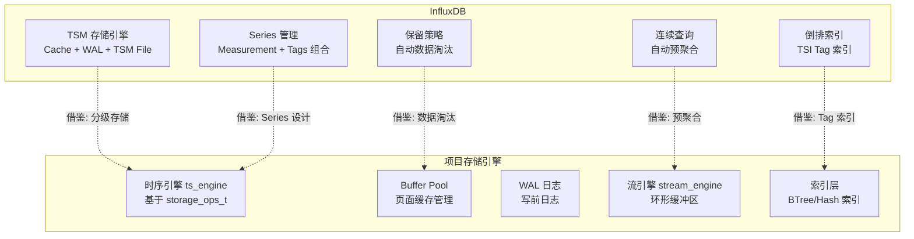
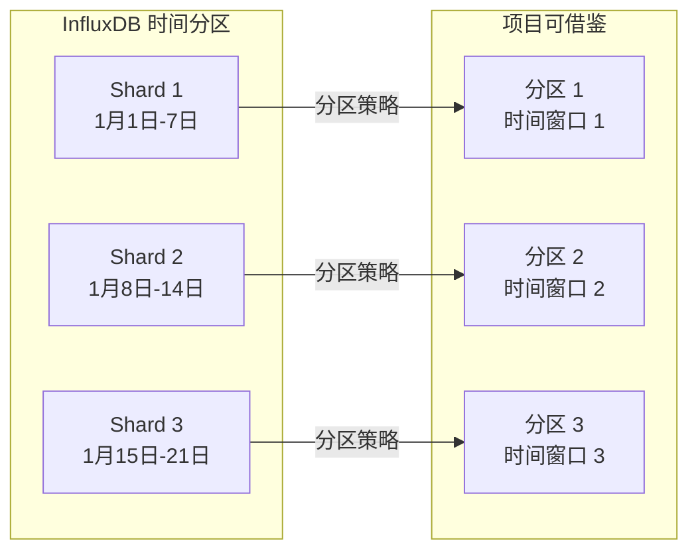
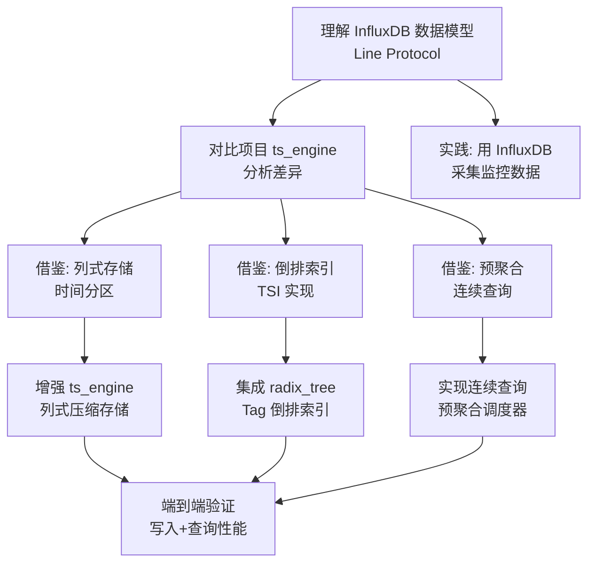

# InfluxDB 与项目关联

## 学习目标

- 分析 InfluxDB 设计对项目存储引擎的启发性
- 找出项目中可借鉴的时序存储技术
- 建立 InfluxDB 与项目各模块的关联

## 架构对比



### 引擎层对比

| 维度 | InfluxDB | 项目 |
|------|----------|------|
| **存储引擎** | TSM（LSM-Tree 变体） | `ts_engine_t` + `storage_ops_t` |
| **写入缓存** | Cache（内存）+ WAL | Buffer Pool + WAL |
| **数据模型** | Measurement + Tag + Field + Timestamp | `ts_engine_db_t` + 列定义 |
| **查询语言** | InfluxQL / Flux | 扫描 API + 聚合函数 |
| **索引** | TSI 倒排索引（Tag 维度） | BTree / Hash 索引 |
| **预聚合** | 连续查询（CQ） | 待实现 |
| **数据保留** | 保留策略（RP） | 待实现 |

## 可借鉴的设计

### 1. 列式存储与时间分区

InfluxDB 按时间对数据进行列式组织，每个时间块内的同类数据连续存储，大幅提升压缩率。

**InfluxDB 的做法**：
- TSM 文件按时间块（Shard）组织
- 每个 Block 内按 Series 连续存储
- 使用 XOR 压缩（浮点数）、Simple8b（整数）、Snappy（通用）

**项目可借鉴**：

```c
// 当前项目：点存储，每点独立存储
ts_engine_insert(rel, point, len);

// 借鉴 InfluxDB：批量列式存储
// 思路：将同一时间窗口内的同类指标批量写入
typedef struct ts_block_s {
    int64_t  start_time;        // 块起始时间
    int64_t  end_time;          // 块结束时间
    int32_t  series_id;         // Series 标识
    double  *values;            // 列式连续存储
    uint64_t num_values;        // 值数量
    uint64_t compressed_size;   // 压缩后大小
} ts_block_t;

// 时间分区策略
// shard_duration = 7d 表示每 7 天一个 Shard
// 查询时只扫描相关 Shard，减少 I/O
```



### 2. 预聚合机制

InfluxDB 的连续查询（Continuous Query）在写入时自动计算聚合结果，极大提升查询性能。

**InfluxDB 的连续查询**：

```sql
-- 每小时计算一次 CPU 平均值，存入降采样表
CREATE CONTINUOUS QUERY "cq_cpu_1h" ON "monitoring"
BEGIN
    SELECT mean("cpu_usage") AS "avg_cpu"
    INTO "monitoring.downsample.cpu_hourly"
    FROM "cpu"
    GROUP BY time(1h), "host"
END
```

**项目可借鉴**：

```c
// 现有 ts_engine 的聚合查询接口
int ts_engine_query(void *rel,
                    int64_t start_time, int64_t end_time,
                    ts_granularity_t granularity,
                    ts_aggregate_func_t func,
                    ts_query_results_t *results);

// 借鉴：预聚合表设计
// 思路：在写入原始数据时，同步更新预聚合结果
typedef struct ts_preagg_config_s {
    char            source_metric[64];    // 源指标名称
    char            target_metric[64];    // 预聚合目标指标
    ts_granularity_t granularity;         // 聚合粒度
    ts_aggregate_func_t func;             // 聚合函数
    int64_t         schedule_interval_ms; // 调度间隔（毫秒）
} ts_preagg_config_t;

// 预聚合调度器
// 1. 定期扫描最近写入的原始数据
// 2. 按时间窗口计算聚合值
// 3. 写入预聚合表
// 4. 查询时优先使用预聚合数据
```

### 3. Series 管理与倒排索引

InfluxDB 将 Series 定义为 `measurement + tags` 的唯一组合，通过 TSI 倒排索引加速 Tag 过滤。

**InfluxDB 的 Series 模型**：

```
Series 1: temperature,sensor_id=1,location=beijing
Series 2: temperature,sensor_id=1,location=shanghai
Series 3: temperature,sensor_id=2,location=beijing
Series 4: humidity,sensor_id=1,location=beijing

TSI 索引结构：
  Tag: location=beijing ──→ Series 1, Series 3, Series 4
  Tag: location=shanghai ──→ Series 2
  Tag: sensor_id=1 ──→ Series 1, Series 2, Series 4
```

**项目可借鉴**：

```c
// 借鉴：Tag 倒排索引
// 项目现有 tree_index 模块中的 radix_tree 可用来实现倒排索引

typedef struct ts_tag_index_s {
    char            tag_key[64];           // Tag 键名
    char            tag_value[256];        // Tag 值
    int32_t        *series_ids;            // 匹配的 Series ID 数组
    uint32_t        num_series;            // Series 数量
    uint32_t        capacity;              // 容量
} ts_tag_index_t;

// 查询流程：
// 1. 解析 WHERE 条件，提取 Tag 过滤条件
// 2. 通过 TSI 倒排索引找到匹配的 Series ID
// 3. 根据 Series ID 定位数据块
// 4. 扫描数据块，返回结果
```

### 4. 数据保留与淘汰策略

InfluxDB 的保留策略（Retention Policy）自动管理数据生命周期。

| 保留策略 | 说明 | 项目对应 |
|---------|------|---------|
| `DURATION 7d` | 数据保留 7 天 | 项目 `ts_engine` 暂未实现 |
| `DURATION 52w` | 降采样数据保留 52 周 | 待实现 |
| `REPLICATION 1` | 副本数 | 暂不涉及（单机） |
| `SHARD DURATION 1d` | Shard 持续时间 | 待实现的时间分区 |

**项目可借鉴的淘汰策略**：

```c
// 借鉴 InfluxDB 的保留策略
typedef struct ts_retention_policy_s {
    char     metric_name[64];    // 指标名称
    int64_t  duration_ms;        // 保留时长（毫秒）
    int64_t  shard_duration_ms;  // 分区时长
    bool     is_default;         // 是否默认策略
} ts_retention_policy_t;

// 淘汰流程：
// 1. 定期检查数据文件的时间戳
// 2. 超过保留时长的文件标记为待删除
// 3. 在低负载时段执行物理删除
// 4. 更新元数据
```

## 与项目各模块的关联

### 1. 与 `index/` 模块的关联

| 项目索引 | InfluxDB 对应 | 可借鉴点 |
|---------|--------------|----------|
| BTree（`btree.h`） | 基于时间戳的索引 | 时间戳作为主键的 BTree 索引 |
| Radix Tree（`radix_tree.h`） | TSI 倒排索引 | 用 Radix Tree 实现 Tag 值到 Series 的映射 |
| Hash 索引 | 无对应 | 辅助查找 |

### 2. 与 `storage/` 模块的关联

| 项目存储 | InfluxDB 对应 | 可借鉴点 |
|---------|--------------|----------|
| Buffer Pool（`buf.h`） | TSM Cache | 写缓存 + 脏页管理 |
| WAL（`wal.h`） | TSM WAL | 预写日志 + 断点恢复 |
| 页面管理（`page.h`） | TSM Block | 数据块组织 + 压缩 |
| 磁盘 IO（`disk.h`） | TSM File | 顺序写入 + 随机读取 |

### 3. 与 `algo/` 模块的关联

| 项目算法 | 适用场景 | 说明 |
|---------|---------|------|
| `distance/` | 时序相似度计算 | 动态时间规整（DTW）用于时序模式匹配 |
| `sort/` | 时间排序 | 时间戳排序加速 |
| `Kmeans/` | 时序聚类 | 对时序数据进行模式聚类 |
| `quantization/` | 数据压缩 | 可以参考 InfluxDB 的浮点 XOR 压缩 |

### 4. 与 `ts_engine` 的对比

**项目现有时序引擎**（`ts_engine.h`）：
- 支持 5 种聚合函数（SUM/AVG/MIN/MAX/COUNT）
- 4 种时间粒度（秒/分/时/天）
- 时间戳对齐工具（`ts_align_timestamp`）
- 基于 `storage_ops_t` 接口

**可增强的方向**：

```c
// 1. 增加 Tag 过滤支持
int ts_engine_query_with_tags(void *rel,
    int64_t start_time, int64_t end_time,
    ts_granularity_t granularity,
    ts_aggregate_func_t func,
    const query_condition_t *conditions,  // 新增 Tag 过滤
    int num_conditions,
    ts_query_results_t *results);

// 2. 增加连续查询能力
typedef struct ts_continuous_query_s {
    char name[64];
    char source_metric[64];
    char target_metric[64];
    ts_granularity_t granularity;
    ts_aggregate_func_t func;
    bool active;
} ts_continuous_query_t;

// 3. 增加保留策略管理
int ts_engine_set_retention(const char *metric,
                            int64_t duration_ms,
                            int64_t shard_duration_ms);
```

## 学习与实践路径



### 推荐实践步骤

1. **部署 InfluxDB**：使用 Docker 部署，熟悉 Line Protocol 和 InfluxQL
2. **导入数据**：使用 Telegraf 采集系统指标，观察 InfluxDB 的写入模式
3. **分析磁盘文件**：查看 TSM 文件结构，理解压缩和存储格式
4. **对比实验**：对同一数据集，用 InfluxDB 和项目 ts_engine 分别查询，对比性能
5. **代码迁移**：选择 1-2 个 InfluxDB 设计（如预聚合、倒排索引），在项目中实现

## 要点总结

- InfluxDB 的 TSM 引擎为时序场景优化，核心是 Cache + WAL + TSM File 三级结构
- 项目的 `ts_engine` 已具备基础时序能力，但在列式存储、预聚合、倒排索引方面有增强空间
- 项目的 `tree_index` 模块（radix_tree）可用来实现 InfluxDB 风格的 TSI 倒排索引
- 项目的 Buffer Pool 和 WAL 机制与 InfluxDB 的 Cache/WAL 架构相似，但缺少时间分区
- 重点借鉴：列式时间分区、自动预聚合、Tag 倒排索引、数据保留策略

## 思考题

1. 项目现有的 `ts_engine` 基于 `storage_ops_t` 通用接口设计，这种设计比 InfluxDB 的专用实现有什么优缺点？
2. 如何用项目的 `radix_tree` 实现 InfluxDB 的 TSI 倒排索引？时间复杂度如何？
3. 如果要在项目中实现 InfluxDB 风格的连续查询，调度器应该基于时间轮还是基于事件驱动？
4. 项目的 Buffer Pool 中使用 Clock-Sweep 置换算法，而 InfluxDB 的 Cache 使用什么策略？哪种更适合时序场景？