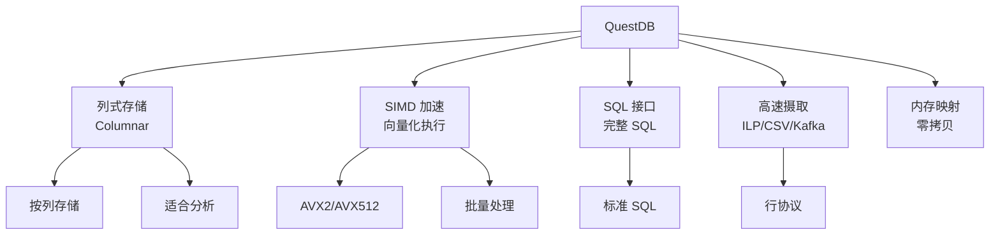

# QuestDB 项目概览

## 学习目标

- 了解 QuestDB 作为高性能时序数据库的定位
- 掌握 QuestDB 的列式存储和 SIMD 加速设计

## 项目定位

> QuestDB 是一个高性能时序数据库，使用 Java/C++ 实现，支持 SQL 查询和高速数据摄取。

**基本信息**：
- 开发方：QuestDB Ltd.
- 首次发布：2014 年
- 开源协议：Apache 2.0
- GitHub Stars：约 12k

## 核心设计



## 核心特性

```sql
-- 创建时序表
CREATE TABLE sensor_data AS (
    SELECT
        CAST(x AS TIMESTAMP) ts,
        CAST(x % 100 AS INT) sensor_id,
        CAST(RAND() * 100 AS DOUBLE) temperature
    FROM long_sequence(1000000)
);

-- SQL 标准查询
SELECT
    date_trunc('hour', ts) AS hour,
    sensor_id,
    AVG(temperature) AS avg_temp,
    COUNT(*) AS cnt
FROM sensor_data
WHERE ts BETWEEN '2024-01-01' AND '2024-01-02'
GROUP BY hour, sensor_id
ORDER BY hour;

-- 采样查询
SELECT SAMPLE BY 1h FROM sensor_data;
```

## 要点总结

- 列式存储，适合分析查询
- SIMD 向量化执行加速
- 完整 SQL 支持
- 高速数据摄取（百万行/秒）

## 思考题

1. QuestDB 的列式存储相比行式存储有何优势？
2. SIMD 加速在时序查询中如何体现？
3. QuestDB 的内存映射设计对性能有何影响？