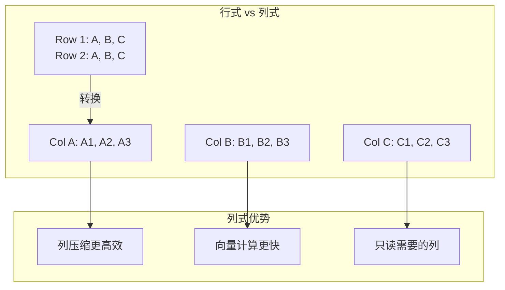

# QuestDB 架构设计

## 学习目标

- 理解 QuestDB 的列式存储引擎
- 掌握 QuestDB 的 SIMD 向量化执行

## 列式存储



## 存储结构

```c
// QuestDB 存储格式
// 每个分区存储为 O(1) 个文件

// 目录结构
// partition_2024-01-01/
//   2024-01-01.column_name.c
//   2024-01-01.column_name.o
//   _sym_table.o  (符号表)

// Column 文件结构
// [null-map][offset-map][data-blocks]
// - null-map: NULL 值位图
// - offset-map: VARLEN 数据的偏移
// - data-blocks: 实际数据（可压缩）
```

## SIMD 向量化

```c
// SIMD 加速示例：AVX2 计算平均值

// 标量计算（逐个处理）
double avg = 0;
for (int i = 0; i < n; i++) {
    avg += values[i];
}
avg /= n;

// SIMD 向量计算（批量处理）
__m256d sum = _mm256_setzero_pd();
for (int i = 0; i < n; i += 4) {
    __m256d values = _mm256_loadu_pd(&values[i]);
    sum = _mm256_add_pd(sum, values);
}
// 最后水平求和
```

## 要点总结

- 列式存储适合分析型查询
- SIMD 向量化批量处理数据
- 符号表（Symbol Table）优化字符串
- 内存映射实现零拷贝读取