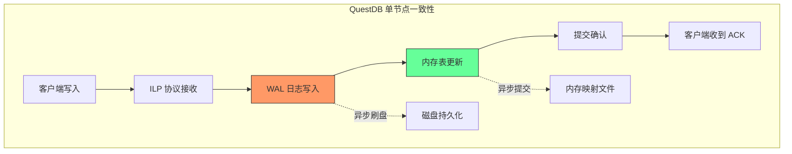
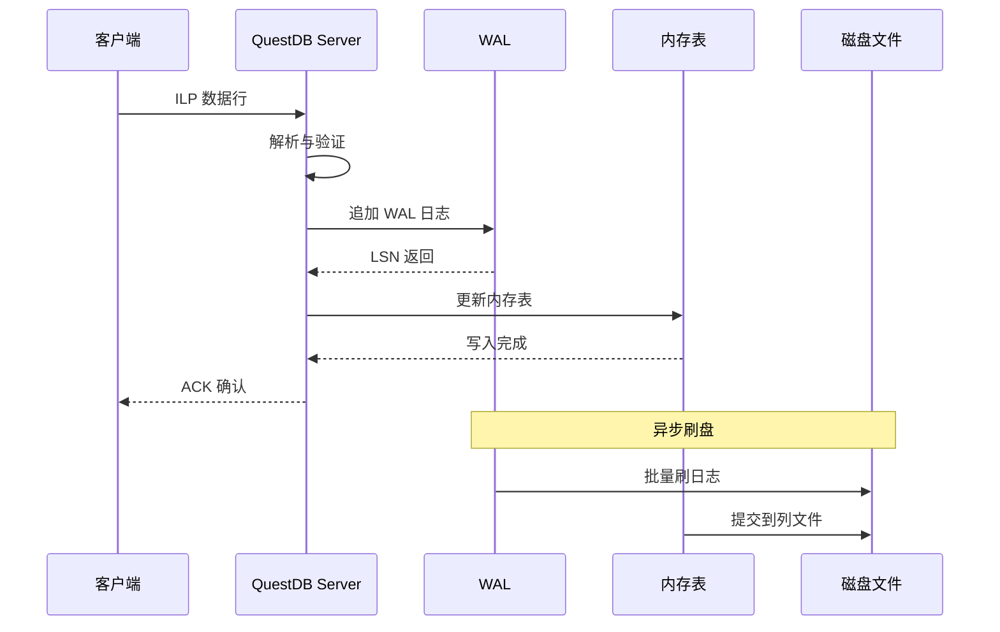
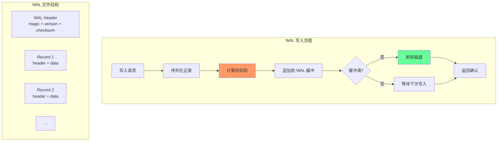
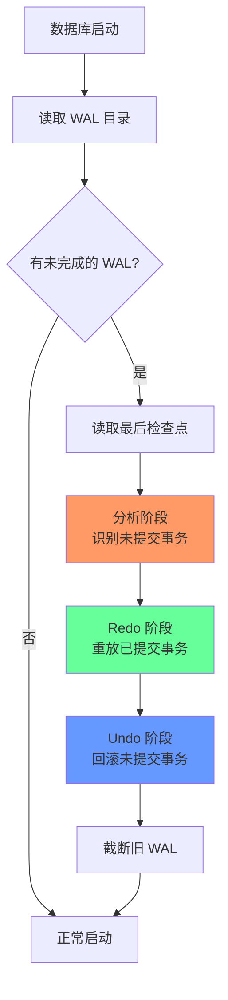
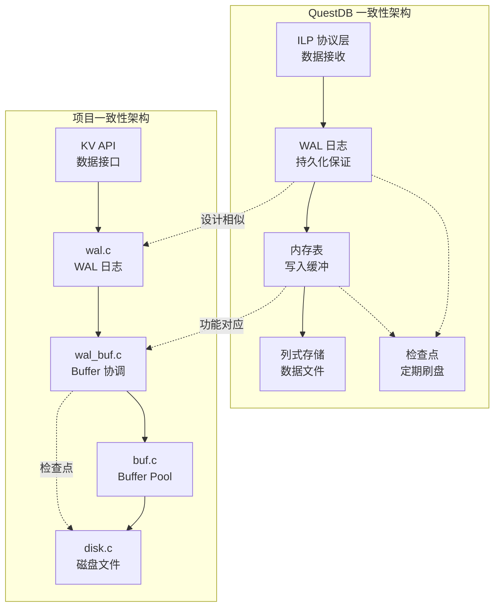

# QuestDB 事务与一致性模型

## 学习目标

- 理解时序数据库的一致性模型设计
- 掌握 QuestDB 的写入一致性机制
- 了解 WAL 在数据完整性中的作用
- 建立与项目 `wal.c`/`wal_buf.c` 模块的关联

## 核心概念

### 一致性模型谱系

时序数据库因场景特性（高写入吞吐、追加写入模式、分析型查询），常采用与传统 OLTP 数据库不同的一致性模型。


| 一致性级别 | 特点 | 适用场景 | 典型实现 |
|-----------|------|---------|---------|
| **强一致性** | 所有副本同步完成后返回 | 金融交易、库存管理 | PostgreSQL、MySQL |
| **顺序一致性** | 保证操作顺序，不保证实时可见 | 分布式队列 | Kafka |
| **最终一致性** | 异步复制，最终收敛 | 监控日志、IoT 数据 | InfluxDB、QuestDB |
| **弱一致性** | 不保证数据可见性 | 短暂性数据 | 消息队列 |

### QuestDB 的一致性选择

QuestDB 作为高性能时序数据库，采用**单节点强一致性 + 分布式最终一致性**的混合模型：



**设计要点**：

1. **写入路径保证原子性**：单条记录写入要么成功要么失败，无中间状态
2. **WAL 保证持久性**：日志先于数据刷盘，崩溃后可恢复
3. **追加写入模型**：时序数据天然追加，避免复杂的并发控制
4. **无传统事务**：不支持跨行事务，简化一致性模型

## 写入一致性机制

### ILP 协议写入流程

QuestDB 通过 InfluxDB Line Protocol (ILP) 高速写入数据：



**关键保证**：

1. **WAL 先写**：数据日志写入 WAL 后才返回 ACK
2. **批量提交**：积累一定量后批量刷盘，提升吞吐
3. **内存屏障**：写入与查询之间的内存可见性保证

### 批量提交机制

QuestDB 使用 ODBC 或 HTTP 批量写入时，采用组提交（Group Commit）优化：

```c
// QuestDB 批量提交流程（简化示意）

typedef struct batch_writer_s {
    int64_t        batch_size;       // 批量大小
    int64_t        timeout_ms;       // 超时时间
    int64_t        current_count;    // 当前批次计数
    
    wal_t         *wal;              // WAL 句柄
    column_table_t *table;           // 列式表
} batch_writer_t;

// 批量写入函数
int batch_writer_write(batch_writer_t *bw, const char *line) {
    // 1. 解析行数据
    parsed_line_t parsed;
    if (parse_ilp_line(line, &parsed) != 0) {
        return -1;
    }
    
    // 2. 写入 WAL
    uint64_t lsn = wal_write_insert(bw->wal, parsed.data, parsed.len);
    if (lsn == 0) {
        return -1;
    }
    
    // 3. 写入内存表
    column_table_append(bw->table, &parsed);
    
    // 4. 批量计数
    bw->current_count++;
    
    // 5. 达到批量阈值或超时，触发提交
    if (bw->current_count >= bw->batch_size) {
        batch_writer_commit(bw);
    }
    
    return 0;
}

// 批量提交
int batch_writer_commit(batch_writer_t *bw) {
    // 1. 刷 WAL 日志
    wal_flush(bw->wal);
    
    // 2. 刷内存表到磁盘
    column_table_flush(bw->table);
    
    // 3. 重置计数
    bw->current_count = 0;
    
    return 0;
}
```

**与项目的关联**：

项目的 `wal.c` 模块提供了类似的 WAL 写入接口，可参考 QuestDB 的批量提交优化：

```c
// 项目 wal.c 对应接口

// 写入单条日志
uint64_t wal_write_insert(wal_t *wal, uint32_t txn_id,
                          const void *key, size_t key_len,
                          const void *value, size_t value_len);

// 批量刷盘
int wal_flush(wal_t *wal);
```

## 数据完整性保证

### WAL 设计

QuestDB 的 WAL（Write-Ahead Log）是数据完整性的核心保障：



**WAL 记录格式**：

```
┌─────────────────────────────────────────────────────────┐
│ WAL Header (64 bytes)                                   │
│  - magic: 0x57414C31 ("WAL1")                           │
│  - version: 1                                           │
│  - checksum: 头部校验和                                  │
├─────────────────────────────────────────────────────────┤
│ Log Record                                              │
│  ┌─────────────────────────────────────────────────┐    │
│  │ Record Header                                   │    │
│  │  - type: 记录类型 (1 byte)                      │    │
│  │  - timestamp: 时间戳 (8 bytes)                  │    │
│  │  - table_id: 表 ID (4 bytes)                    │    │
│  │  - data_len: 数据长度 (4 bytes)                 │    │
│  │  - checksum: 记录校验和 (4 bytes)               │    │
│  ├─────────────────────────────────────────────────┤    │
│  │ Record Data                                     │    │
│  │  - 列数据（按列式存储格式）                       │    │
│  └─────────────────────────────────────────────────┘    │
└─────────────────────────────────────────────────────────┘
```

### Checksum 校验

QuestDB 对每条 WAL 记录计算校验和，确保数据完整性：

```c
// QuestDB checksum 计算（简化示意）

#include <stdint.h>

// CRC32 校验和
uint32_t crc32_checksum(const uint8_t *data, size_t len) {
    uint32_t crc = 0xFFFFFFFF;
    
    for (size_t i = 0; i < len; i++) {
        crc ^= data[i];
        for (int j = 0; j < 8; j++) {
            if (crc & 1) {
                crc = (crc >> 1) ^ 0xEDB88320;
            } else {
                crc >>= 1;
            }
        }
    }
    
    return ~crc;
}

// 写入 WAL 记录时计算校验和
int wal_write_record(wal_t *wal, const void *data, size_t len) {
    wal_record_header_t header;
    header.type = RECORD_TYPE_INSERT;
    header.timestamp = get_current_timestamp();
    header.table_id = current_table_id;
    header.data_len = len;
    
    // 计算 data 的校验和
    header.checksum = crc32_checksum(data, len);
    
    // 写入 header + data
    wal_append(wal, &header, sizeof(header));
    wal_append(wal, data, len);
    
    return 0;
}

// 读取 WAL 记录时验证校验和
int wal_read_record(wal_t *wal, void *data, size_t len) {
    wal_record_header_t header;
    wal_read(wal, &header, sizeof(header));
    
    wal_read(wal, data, header.data_len);
    
    // 验证校验和
    uint32_t computed = crc32_checksum(data, header.data_len);
    if (computed != header.checksum) {
        // 校验失败，数据损坏
        return -1;
    }
    
    return 0;
}
```

**与项目的关联**：

项目的 `wal.c` 模块同样实现了 checksum 校验：

```c
// 项目 wal.h 中的记录头定义
typedef struct wal_record_header_s {
    uint8_t  type;           // 日志类型
    uint8_t  size[3];        // 记录大小（小端序，3字节）
    uint64_t lsn;            // 日志序列号
    uint32_t txn_id;         // 事务ID
    uint32_t prev_lsn;       // 上一条日志的 LSN
    uint32_t checksum;       // 记录校验和
} wal_record_header_t;
```

### 崩溃恢复

QuestDB 的崩溃恢复流程：



**恢复阶段详解**：

1. **分析阶段**：扫描 WAL，识别哪些事务已提交、哪些未提交
2. **Redo 阶段**：重放已提交事务的修改，保证持久性
3. **Undo 阶段**：回滚未提交事务的修改，保证原子性

```c
// QuestDB 恢复逻辑（简化示意）

typedef struct recovery_state_s {
    uint64_t last_checkpoint_lsn;
    uint64_t *committed_txns;
    int32_t   committed_count;
    uint64_t *uncommitted_txns;
    int32_t   uncommitted_count;
} recovery_state_t;

// 崩溃恢复主函数
int questdb_recover(const char *data_dir) {
    recovery_state_t state;
    
    // 1. 分析阶段
    wal_analyze(data_dir, &state);
    
    // 2. Redo 阶段
    for (int i = 0; i < state.committed_count; i++) {
        uint64_t txn_id = state.committed_txns[i];
        wal_redo_txn(data_dir, txn_id);
    }
    
    // 3. Undo 阶段
    for (int i = 0; i < state.uncommitted_count; i++) {
        uint64_t txn_id = state.uncommitted_txns[i];
        wal_undo_txn(data_dir, txn_id);
    }
    
    return 0;
}

// WAL 分析
int wal_analyze(const char *data_dir, recovery_state_t *state) {
    wal_reader_t *reader = wal_reader_open(data_dir);
    wal_record_t record;
    
    while (wal_reader_next(reader, &record) == 0) {
        switch (record.type) {
            case RECORD_BEGIN:
                // 新事务开始
                break;
            case RECORD_COMMIT:
                // 事务提交，标记为已提交
                state->committed_txns[state->committed_count++] = record.txn_id;
                break;
            case RECORD_ABORT:
                // 事务回滚，标记为已回滚
                break;
            default:
                // 数据记录
                break;
        }
    }
    
    wal_reader_close(reader);
    return 0;
}
```

**与项目的关联**：

项目的 `wal.c` 和 `wal_buf.c` 模块提供了完整的崩溃恢复 API：

```c
// 项目 wal.h 中的恢复接口

// 分析 WAL 文件，收集恢复所需信息
int wal_analyze(const char *path, wal_recovery_info_t *info);

// 执行 redo（重做已提交事务的修改）
int wal_redo(const char *path, uint64_t start_lsn,
             wal_apply_fn apply_fn, void *ctx);

// 执行 undo（撤销未提交事务的修改）
int wal_undo(const char *path, uint32_t txn_id, uint64_t start_lsn,
             wal_apply_fn apply_fn, void *ctx);

// 项目 wal_buf.h 中的恢复接口

// 初始化恢复状态
int wal_buf_recovery_init(wal_buf_t *wb);

// 执行 redo
int wal_buf_do_redo(wal_buf_t *wb, uint64_t start_lsn);

// 执行 undo
int wal_buf_do_undo(wal_buf_t *wb, uint32_t txn_id);
```

## 与项目模块的关联

### 架构对比



### 模块映射

| QuestDB 组件 | 项目模块 | 功能对比 |
|-------------|---------|---------|
| WAL Writer | `wal.c` | 日志写入、LSN 管理、刷盘 |
| WAL Recovery | `wal.c` | 分析、redo、undo |
| Memory Table | `wal_buf.c` | 脏页追踪、提交协调 |
| Column Files | `disk.c` + `page.c` | 数据持久化 |
| Checkpoint | `wal_buf_checkpoint()` | 检查点机制 |

### 可借鉴的设计

**1. WAL 格式优化**

QuestDB 的 WAL 针对时序场景优化，项目可借鉴：

```c
// 当前项目 WAL 记录头（24 字节）
typedef struct wal_record_header_s {
    uint8_t  type;           // 日志类型
    uint8_t  size[3];        // 记录大小
    uint64_t lsn;            // 日志序列号
    uint32_t txn_id;         // 事务ID
    uint32_t prev_lsn;       // 上一条日志的 LSN
    uint32_t checksum;       // 记录校验和
} wal_record_header_t;

// 借鉴 QuestDB：增加时序专用字段
typedef struct ts_wal_record_header_s {
    uint8_t  type;           // 日志类型
    uint8_t  size[3];        // 记录大小
    uint64_t lsn;            // 日志序列号
    uint64_t timestamp;      // 时序时间戳（新增）
    uint32_t table_id;       // 时序表 ID（新增）
    uint32_t checksum;       // 记录校验和
} ts_wal_record_header_t;

// 优势：
// 1. 按时间戳组织日志，加速时间范围恢复
// 2. 按 table_id 分组恢复，支持并行恢复
```

**2. 批量提交优化**

QuestDB 的组提交机制可提升项目写入吞吐：

```c
// 当前项目：单条写入
int kv_put(kv_t *db, const char *key, const char *value) {
    uint64_t lsn = wal_write_insert(db->wal, key, value);
    wal_flush(db->wal);  // 每次都刷盘，性能低
    // ...
}

// 借鉴 QuestDB：批量提交
typedef struct kv_batch_s {
    kv_t        *db;
    int64_t      batch_size;
    int64_t      current_count;
    uint64_t     first_lsn;
} kv_batch_t;

int kv_batch_put(kv_batch_t *batch, const char *key, const char *value) {
    uint64_t lsn = wal_write_insert(batch->db->wal, key, value);
    if (batch->current_count == 0) {
        batch->first_lsn = lsn;  // 记录批次起始 LSN
    }
    batch->current_count++;
    
    // 达到批量阈值才刷盘
    if (batch->current_count >= batch->batch_size) {
        wal_flush(batch->db->wal);
        batch->current_count = 0;
    }
    
    return 0;
}
```

**3. Checkpoint 优化**

QuestDB 的检查点策略适合时序场景：

```c
// 当前项目：同步检查点
int wal_buf_checkpoint(wal_buf_t *wb) {
    // 刷所有脏页，阻塞写入
    for (int i = 0; i < wb->dirty_count; i++) {
        buffer_flush_page(wb->buffer_pool, wb->dirty_pages[i]);
    }
    wal_write_checkpoint(wb->wal, wb->dirty_pages, wb->dirty_count);
    return 0;
}

// 借鉴 QuestDB：非阻塞检查点
int wal_buf_checkpoint_fuzzy(wal_buf_t *wb) {
    // 1. 记录检查点开始 LSN
    uint64_t start_lsn = wal_get_lsn(wb->wal);
    
    // 2. 写入检查点开始记录
    wal_write_checkpoint_begin(wb->wal, start_lsn);
    
    // 3. 非阻塞刷脏页
    for (int i = 0; i < wb->dirty_count; i++) {
        // 异步刷盘，不阻塞
        buffer_flush_page_async(wb->buffer_pool, wb->dirty_pages[i]);
    }
    
    // 4. 等待所有刷盘完成
    buffer_wait_all_flushes(wb->buffer_pool);
    
    // 5. 写入检查点结束记录
    wal_write_checkpoint_end(wb->wal);
    
    return 0;
}
```

## 要点总结

- QuestDB 采用**单节点强一致性 + 分布式最终一致性**的混合模型，适合时序场景
- WAL 是数据完整性的核心，通过 checksum 校验和崩溃恢复保证持久性
- 批量提交机制显著提升写入吞吐，适合时序数据高频写入特性
- 项目的 `wal.c` 和 `wal_buf.c` 模块可借鉴 QuestDB 的时序优化设计
- 重点借鉴：WAL 时序字段、批量提交、非阻塞检查点

## 思考题

1. QuestDB 为什么不实现完整的 ACID 事务？这种设计在什么场景下会有限制？
2. 项目的 `wal_buf_checkpoint()` 是同步的，如何改造为非阻塞检查点？
3. 如果要在项目中实现类似 QuestDB 的批量提交机制，需要修改哪些接口？
4. WAL 的 checksum 校验对性能有多大影响？是否有更高效的校验算法？
