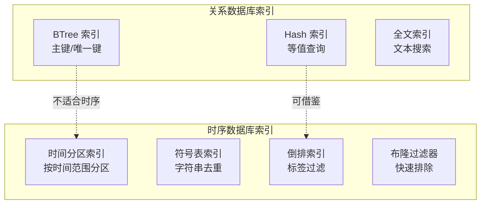
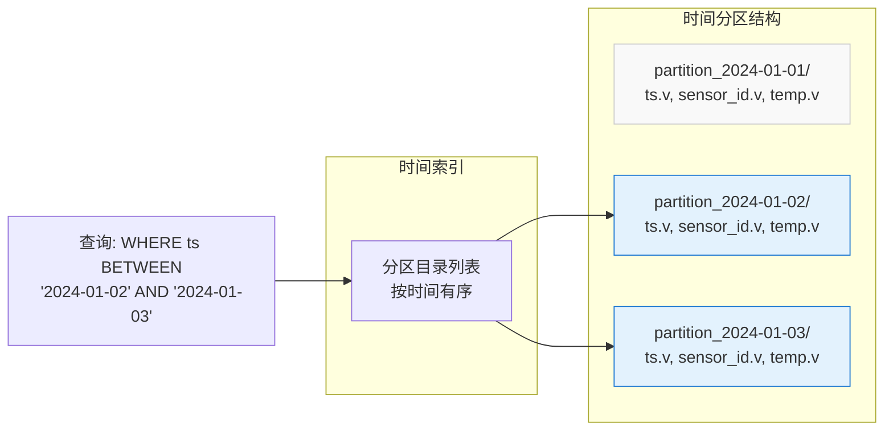
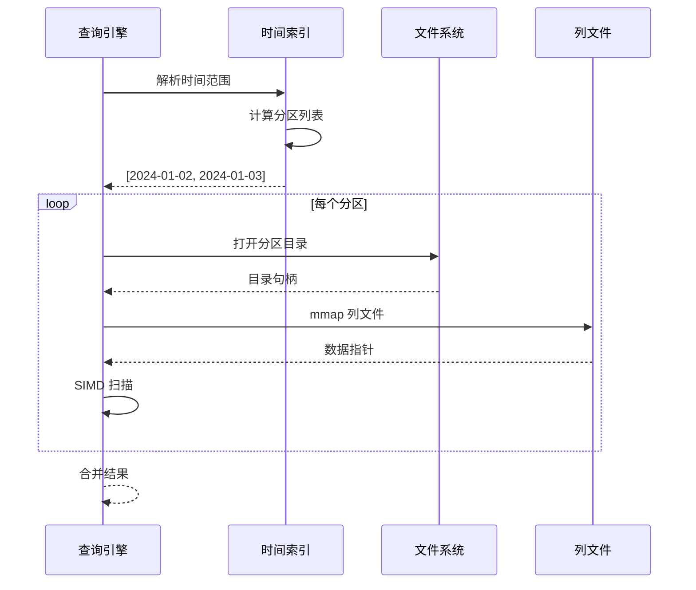
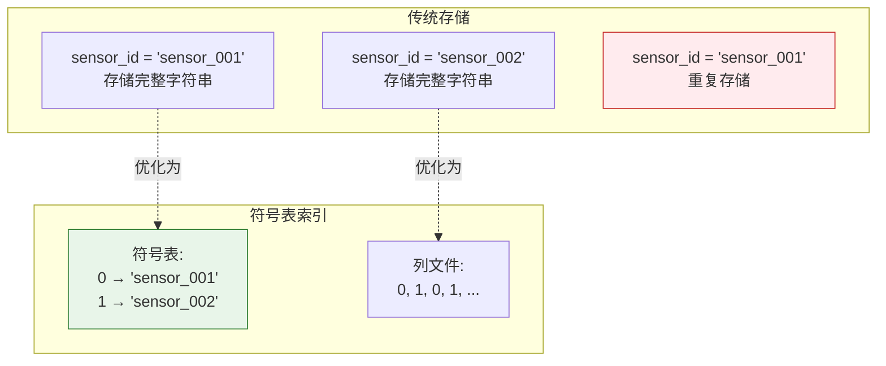
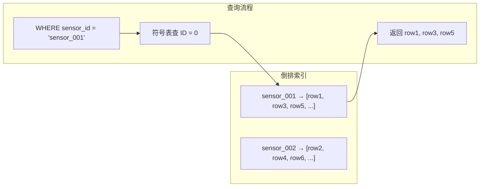
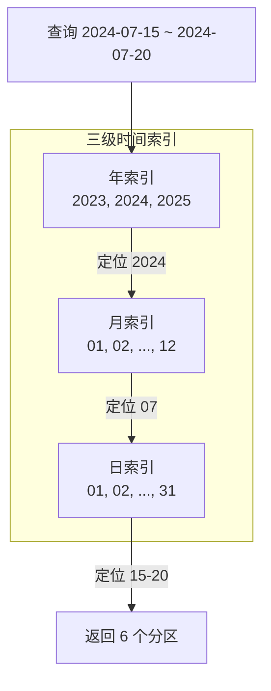
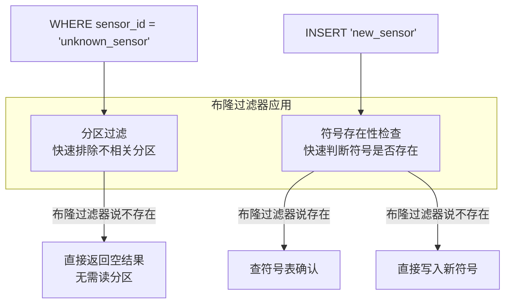

# QuestDB 索引策略

## 学习目标

- 理解时序数据库索引设计的特殊性和核心原则
- 掌握 QuestDB 时间索引、符号表索引的实现原理
- 了解布隆过滤器在时序索引中的应用场景
- 对比项目 index/ 模块与 QuestDB 索引的差异和可借鉴点

## 核心概念

### 时序索引的设计原则

时序数据库的索引设计与传统关系数据库有本质区别：



**时序索引核心特征**：

| 特征 | 说明 | 对比关系数据库 |
|------|------|---------------|
| 写入模式 | 追加写入，几乎无随机写入 | 关系数据库大量随机写入 |
| 查询模式 | 时间范围查询为主 | 关系数据库各种查询模式 |
| 数据分布 | 时间有序，热点数据在最新分区 | 关系数据库数据分布多样 |
| 删除模式 | 批量删除旧分区（TTL） | 关系数据库随机删除 |

### QuestDB 索引体系

```mermaid
graph TB
    subgraph "QuestDB 索引体系"
        A[时间分区索引<br/>自动创建]
        B[符号表索引<br/>SYMBOL 类型]
        C[列文件索引<br/>O(1) 文件访问]
        D[布隆过滤器<br/>快速排除]
    end

    subgraph "索引应用场景"
        S1[时间范围查询<br/>WHERE ts BETWEEN]
        S2[标签过滤<br/>WHERE sensor_id = 's1']
        S3[全列扫描<br/>SELECT *]
        S4[存在性检查<br/>WHERE has_value]
    end

    A --> S1
    B --> S2
    C --> S3
    D --> S4
```

---

## 一、时间分区索引

### 设计原理

QuestDB 自动按时间（天/小时）分区数据，每个分区是一个独立目录，查询时根据时间范围直接定位到对应分区，无需扫描全表。



### 分区定位算法

```c
// QuestDB 时间分区定位（简化示意）

// 时间戳 → 分区目录名
void timestamp_to_partition_name(int64_t timestamp_ms, 
                                  const char *partition_format,
                                  char *out_name) {
    // partition_format: "DAY", "HOUR", "MONTH"
    time_t ts = timestamp_ms / 1000;
    struct tm *tm_info = gmtime(&ts);
    
    if (strcmp(partition_format, "DAY") == 0) {
        sprintf(out_name, "%04d-%02d-%02d", 
                tm_info->tm_year + 1900,
                tm_info->tm_mon + 1,
                tm_info->tm_mday);
    } else if (strcmp(partition_format, "HOUR") == 0) {
        sprintf(out_name, "%04d-%02d-%02dT%02d", 
                tm_info->tm_year + 1900,
                tm_info->tm_mon + 1,
                tm_info->tm_mday,
                tm_info->tm_hour);
    }
}

// 查询分区列表
int find_partitions_for_range(const char *table_path,
                              int64_t start_ms,
                              int64_t end_ms,
                              char **partition_paths,
                              int *count) {
    // 1. 遍历分区目录
    DIR *dir = opendir(table_path);
    struct dirent *entry;
    
    *count = 0;
    while ((entry = readdir(dir)) != NULL) {
        // 2. 解析分区名中的时间
        int64_t partition_start = parse_partition_time(entry->d_name);
        int64_t partition_end = partition_start + PARTITION_DURATION;
        
        // 3. 检查是否与查询范围重叠
        if (partition_end >= start_ms && partition_start <= end_ms) {
            partition_paths[*count] = strdup(entry->d_name);
            (*count)++;
        }
    }
    closedir(dir);
    
    return 0;
}
```

### 查询路径示例

```sql
-- 查询 2024-01-02 到 2024-01-03 的数据
SELECT * FROM sensor_data
WHERE ts BETWEEN '2024-01-02' AND '2024-01-03';
```



---

## 二、符号表索引（SYMBOL Index）

### 设计原理

SYMBOL 类型是 QuestDB 对高基数字符串的优化方案：



**符号表结构**：

```c
// QuestDB 符号表实现（简化示意）

typedef struct symbol_table {
    // 符号数组（ID → 字符串）
    char **symbols;
    int32_t num_symbols;
    int32_t capacity;
    
    // 哈希表（字符串 → ID）
    struct {
        char *key;
        int32_t value;
    } *hash_table;
    int32_t hash_size;
    
    // 持久化文件
    int64_t data_fd;    // 字符串数据文件
    int64_t index_fd;   // 索引文件
} symbol_table_t;

// 插入符号
int32_t symbol_table_put(symbol_table_t *st, const char *str) {
    // 1. 查哈希表
    int32_t hash = hash_string(str);
    int32_t slot = hash % st->hash_size;
    
    // 线性探测
    while (st->hash_table[slot].key != NULL) {
        if (strcmp(st->hash_table[slot].key, str) == 0) {
            return st->hash_table[slot].value;  // 已存在
        }
        slot = (slot + 1) % st->hash_size;
    }
    
    // 2. 新符号
    int32_t id = st->num_symbols;
    st->symbols[id] = strdup(str);
    st->hash_table[slot].key = st->symbols[id];
    st->hash_table[slot].value = id;
    st->num_symbols++;
    
    // 3. 持久化
    int32_t len = strlen(str);
    write(st->data_fd, &len, sizeof(int32_t));
    write(st->data_fd, str, len);
    
    return id;
}

// 符号表索引文件结构
// _sym_sensor_id.d: [len1][str1][len2][str2]...
// _sym_sensor_id.i: [offset1][offset2]...
```

### 倒排索引

符号表还支持构建倒排索引，加速 `WHERE sensor_id = 's1'` 查询：



```c
// 倒排索引结构（简化）
typedef struct inverted_index {
    // 符号 ID → 行号列表
    struct {
        int32_t symbol_id;
        int32_t *row_ids;
        int32_t count;
    } *postings;
    int32_t num_symbols;
} inverted_index_t;

// 查询
int inverted_index_query(inverted_index_t *idx, 
                         int32_t symbol_id,
                         int32_t **row_ids,
                         int32_t *count) {
    // 二分查找或直接索引
    *row_ids = idx->postings[symbol_id].row_ids;
    *count = idx->postings[symbol_id].count;
    return 0;
}
```

---

## 三、多级时间分区索引

### 设计原理

对于超长时间跨度，QuestDB 支持多级分区索引，类似日历层次结构：



### 层次化索引结构

```c
// 多级时间索引（简化示意）

typedef struct time_partition_index {
    // 年级索引
    struct {
        int32_t year;
        int64_t offset;  // 指向月索引
    } *year_index;
    int32_t num_years;
    
    // 月级索引
    struct {
        int32_t month;
        int64_t offset;  // 指向日索引
    } *month_index;
    int32_t num_months;
    
    // 日级索引
    struct {
        int32_t day;
        char partition_path[256];
    } *day_index;
    int32_t num_days;
} time_partition_index_t;

// 多级查询
int multi_level_query(time_partition_index_t *idx,
                      int32_t start_year, int32_t start_month, int32_t start_day,
                      int32_t end_year, int32_t end_month, int32_t end_day,
                      char **partition_paths,
                      int32_t *count) {
    *count = 0;
    
    // 1. 年级过滤
    for (int y = start_year; y <= end_year; y++) {
        if (!year_in_range(idx, y)) continue;
        
        // 2. 月级过滤
        int m_start = (y == start_year) ? start_month : 1;
        int m_end = (y == end_year) ? end_month : 12;
        
        for (int m = m_start; m <= m_end; m++) {
            // 3. 日级过滤
            int d_start = (y == start_year && m == start_month) ? start_day : 1;
            int d_end = (y == end_year && m == end_month) ? end_day : 31;
            
            for (int d = d_start; d <= d_end; d++) {
                partition_paths[*count] = get_partition_path(idx, y, m, d);
                (*count)++;
            }
        }
    }
    
    return 0;
}
```

---

## 四、布隆过滤器在时序索引中的应用

### 应用场景

布隆过滤器在时序数据库中有两个核心应用：



### 分区布隆过滤器

```c
// 分区布隆过滤器（简化示意）

typedef struct partition_bloom_filter {
    uint8_t *bits;
    int32_t num_bits;
    int32_t num_hash_functions;
    
    // 存储该分区中存在的符号 ID
} partition_bloom_filter_t;

// 创建分区布隆过滤器
partition_bloom_filter_t *partition_bloom_create(int32_t expected_items, 
                                                   double false_positive_rate) {
    partition_bloom_filter_t *bf = malloc(sizeof(partition_bloom_filter_t));
    
    // 计算最优参数
    int32_t m = -expected_items * log(false_positive_rate) / (log(2) * log(2));
    int32_t k = m / expected_items * log(2);
    
    bf->num_bits = m;
    bf->num_hash_functions = k;
    bf->bits = calloc(m / 8 + 1, 1);
    
    return bf;
}

// 添加符号
void partition_bloom_add(partition_bloom_filter_t *bf, int32_t symbol_id) {
    for (int i = 0; i < bf->num_hash_functions; i++) {
        int32_t hash = hash_i(symbol_id, i) % bf->num_bits;
        bf->bits[hash / 8] |= (1 << (hash % 8));
    }
}

// 检查符号是否存在
bool partition_bloom_might_contain(partition_bloom_filter_t *bf, int32_t symbol_id) {
    for (int i = 0; i < bf->num_hash_functions; i++) {
        int32_t hash = hash_i(symbol_id, i) % bf->num_bits;
        if (!(bf->bits[hash / 8] & (1 << (hash % 8)))) {
            return false;  // 一定不存在
        }
    }
    return true;  // 可能存在
}

// 查询优化示例
int query_with_bloom(const char *table_path,
                     const char *sensor_id,
                     query_result_t *result) {
    // 1. 查符号表获取 ID
    int32_t symbol_id = symbol_table_get(table_path, sensor_id);
    if (symbol_id < 0) {
        // 符号不存在，直接返回空
        result->count = 0;
        return 0;
    }
    
    // 2. 遍历分区，用布隆过滤器过滤
    char **partition_paths;
    int num_partitions;
    list_partitions(table_path, &partition_paths, &num_partitions);
    
    for (int i = 0; i < num_partitions; i++) {
        partition_bloom_filter_t *bf = load_bloom_filter(partition_paths[i]);
        
        if (!partition_bloom_might_contain(bf, symbol_id)) {
            // 该分区一定不包含该符号，跳过
            continue;
        }
        
        // 可能有，需要读取分区验证
        scan_partition(partition_paths[i], symbol_id, result);
    }
    
    return 0;
}
```

### 布隆过滤器参数选择

| 预期元素数 | 误判率 | 最优位数组大小 | 最优哈希函数数 |
|-----------|--------|--------------|--------------|
| 1000 | 1% | 9585 bits (~1.2 KB) | 7 |
| 10000 | 1% | 95850 bits (~12 KB) | 7 |
| 100000 | 1% | 958500 bits (~117 KB) | 7 |
| 100000 | 0.1% | 1437758 bits (~176 KB) | 10 |

---

## 五、与项目 index/ 模块的对比

### 索引类型对比

```mermaid
graph TB
    subgraph "QuestDB 索引"
        Q1[时间分区索引<br/>自动创建]
        Q2[符号表索引<br/>字符串去重]
        Q3[列文件索引<br/>O(1) 访问]
        Q4[布隆过滤器<br/>快速排除]
    end

    subgraph "项目 index/ 模块"
        P1[BTree<br/>btreeam.h]
        P2[BRIN<br/>块范围索引]
        P3[Bitmap<br/>位图索引]
        P4[Hash/CCEH<br/>哈希索引]
        P5[Bloom<br/>布隆过滤器]
    end

    Q1 -.->|类似| P2
    Q2 -.->|借鉴| P4
    Q3 -.->|不同理念| P1
    Q4 -.->|相同| P5
```

### 详细对比表

| 对比维度 | QuestDB | 项目 index/ | 可借鉴点 |
|---------|---------|------------|---------|
| **时间索引** | 时间分区索引，自动按天/小时分区 | BRIN 块范围索引 | 借鉴自动分区创建机制 |
| **字符串索引** | SYMBOL 符号表 + 倒排索引 | Hash/CCEH 哈希索引 | 借鉴字符串去重 + 整数映射 |
| **范围查询** | 分区直接定位 + mmap 顺序扫描 | BTree 范围扫描 | 时序场景可简化为分区定位 |
| **存在性检查** | 布隆过滤器快速排除 | bloom.h 布隆过滤器 | 已有实现，可直接使用 |
| **标签过滤** | 符号表倒排索引 | Bitmap 位图索引 | 借鉴倒排索引加速标签查询 |
| **存储格式** | 列式存储 + 符号表 | 行式存储 + BTree | 列式更适合时序分析 |

### 项目索引模块分析

#### BRIN 索引（`brin.h`）

BRIN 索引与 QuestDB 时间分区索引理念相似：

```c
// 项目 BRIN 索引 API
brin_index_t *brin_create(int page_size, int pages_per_range);
int brin_insert(brin_index_t *idx, int page_num, const void *key, int doc_id);
int brin_range_query(const brin_index_t *idx, const void *min_key, const void *max_key,
                     int *results, int *count);
```

**可借鉴点**：
- QuestDB 的分区自动创建机制
- 分区边界智能推断

#### Bitmap 索引（`bitmap_index.h`）

Bitmap 索引可用于标签过滤：

```c
// 项目 Bitmap 索引 API
bitmap_index_t *bitmap_create(int n_docs, int n_values);
int bitmap_set(bitmap_index_t *idx, int doc_id, int value);
int bitmap_eq(const bitmap_index_t *idx, int value, int *doc_ids, int *count);
int bitmap_and(const bitmap_index_t *idx, int value1, int value2, int *doc_ids, int *count);
```

**可借鉴点**：
- 结合符号表，将标签值映射为 Bitmap 索引值
- 多标签 AND/OR 查询优化

#### Hash 索引（`cceh.h`）

CCEH 可用于符号表的哈希查找：

```c
// 项目 CCEH 哈希索引 API
cceh_index_t *cceh_index_create(uint32_t segment_capacity, uint32_t initial_global_depth);
int cceh_index_insert(cceh_index_t *index, const void *key, uint32_t keylen,
                      const void *value, uint32_t valuelen);
int cceh_index_lookup(const cceh_index_t *index, const void *key, uint32_t keylen,
                      void **value_out, uint32_t *valuelen_out);
```

**可借鉴点**：
- 直接作为符号表的哈希表实现
- 利用 CCEH 的 Cache-Conscious 特性优化性能

#### BTree 索引（`btreeam.h`）

BTree 是项目的核心索引，但在时序场景可简化：

```c
// 项目 BTree 索引 API
int btinsert(Relation rel, const void **values, int nkeys, void *heap_ptr);
BTScanDesc bt_beginscan(Relation rel, int nkeys, ScanKey key);
void *bt_getnext(BTScanDesc scan, ScanDirection direction);
```

**对比分析**：
- BTree 适合高并发事务场景
- 时序场景可简化为时间分区 + 顺序扫描

---

## 六、总结

### 要点总结

1. **时间分区索引**：QuestDB 自动按时间分区，查询时直接定位分区，无需全表扫描
2. **符号表索引**：将字符串映射为整数 ID，节省存储并加速查询
3. **倒排索引**：为符号表构建倒排索引，加速 `WHERE tag = 'value'` 查询
4. **布隆过滤器**：快速排除不相关分区或不存在的符号，减少不必要的 I/O
5. **与项目对比**：项目 BRIN 类以时间分区，Hash 可用于符号表，Bitmap 可用于标签过滤

### 设计选型建议

| 场景 | 推荐索引 | 说明 |
|------|---------|------|
| 时间范围查询 | 时间分区索引 | 时序数据库默认选择 |
| 标签等值查询 | 符号表 + 倒排索引 | 字符串去重后用整数索引 |
| 多标签组合查询 | Bitmap 索引 | 位运算加速 AND/OR |
| 存在性检查 | 布隆过滤器 | 快速排除不存在的值 |
| 高基数时间戳 | BTree 索引 | 需要精确范围查询时 |

---

## 思考题

1. **时间分区 vs BTree**：在什么场景下应该使用 BTree 索引而不是时间分区索引？
2. **符号表边界情况**：符号表的基数（不同值的数量）达到什么量级时，符号表索引会退化？
3. **布隆过滤器误判**：布隆过滤器的误判对查询结果有什么影响？如何处理？
4. **项目迁移**：如果要为项目的 `ts_engine` 增加符号表索引，需要修改哪些接口？
5. **多级索引**：多级时间索引相比单级时间索引，在什么场景下收益最大？
