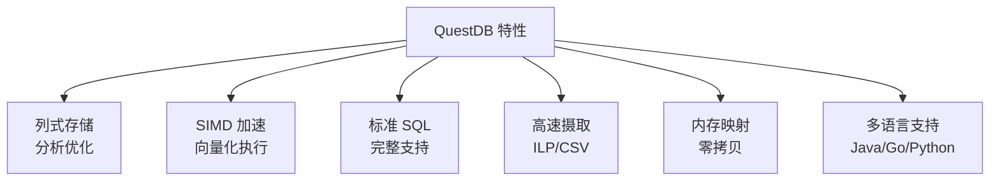

# QuestDB 关键特性

## 特性总览



## 高速数据摄取

```bash
# InfluxDB Line Protocol
echo "temperature,sensor_id=1,location=beijing value=22.5 $(date +%s)000000000" | \
nc -u localhost 9009

# CSV 导入
curl -F data=@sensor.csv http://localhost:9000/import

# PostgreSQL Wire 协议
psql -h localhost -p 8812 -U admin -d qdb
```

## SQL 标准支持

```sql
-- JOIN
SELECT s.sensor_id, avg.temperature
FROM sensors s
JOIN (
    SELECT sensor_id, AVG(temperature) as temperature
    FROM sensor_data
    WHERE ts > NOW() - INTERVAL '1 day'
    GROUP BY sensor_id
) avg ON s.sensor_id = avg.sensor_id;

-- 窗口函数
SELECT ts, sensor_id, temperature,
    AVG(temperature) OVER (
        PARTITION BY sensor_id
        ORDER BY ts
        ROWS BETWEEN 9 PRECEDING AND CURRENT ROW
    ) AS moving_avg
FROM sensor_data;
```

## 要点总结

- 列式存储，压缩率高
- SIMD 向量化执行
- 标准 SQL，无学习成本
- 百万行/秒摄取速度