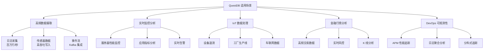
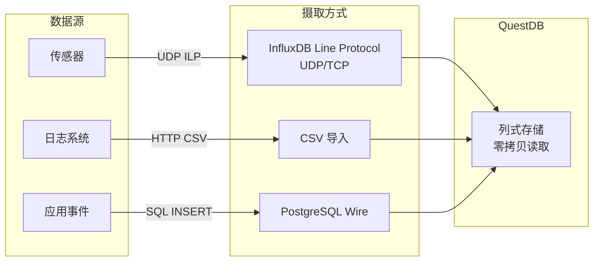
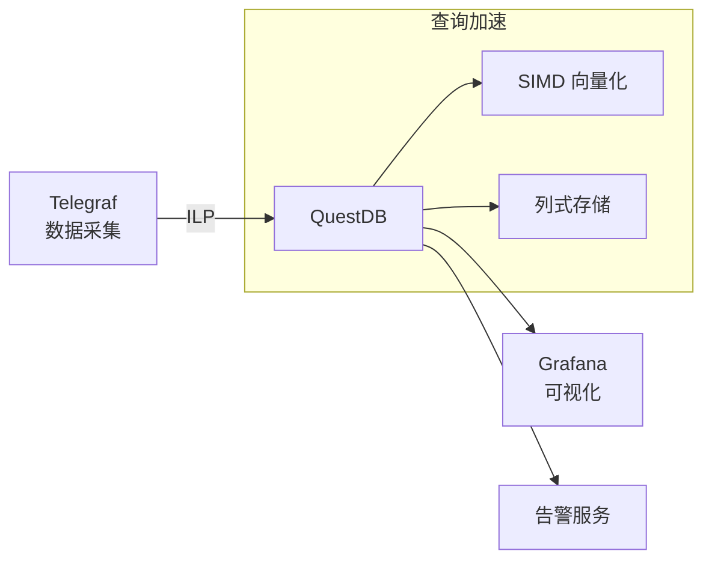
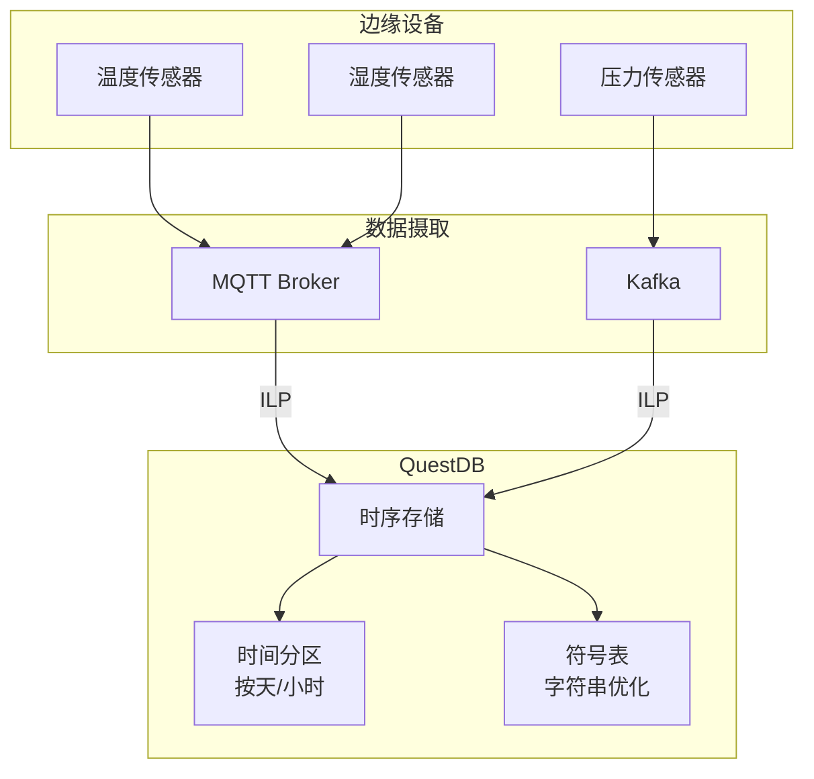
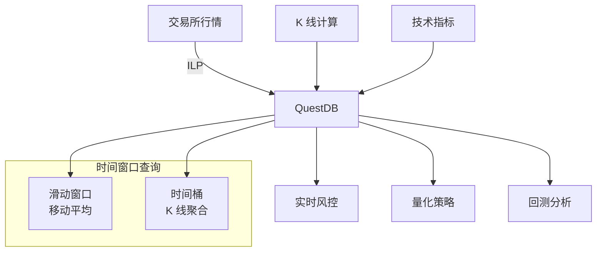
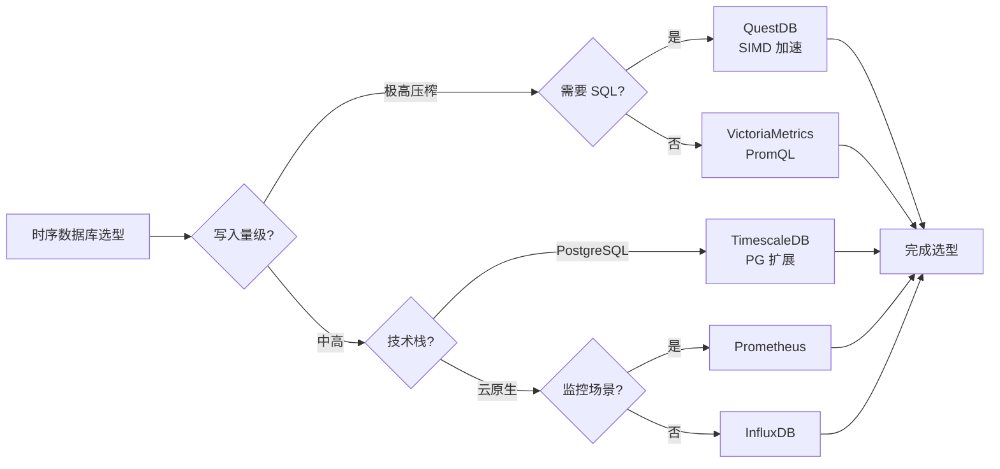
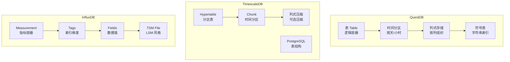
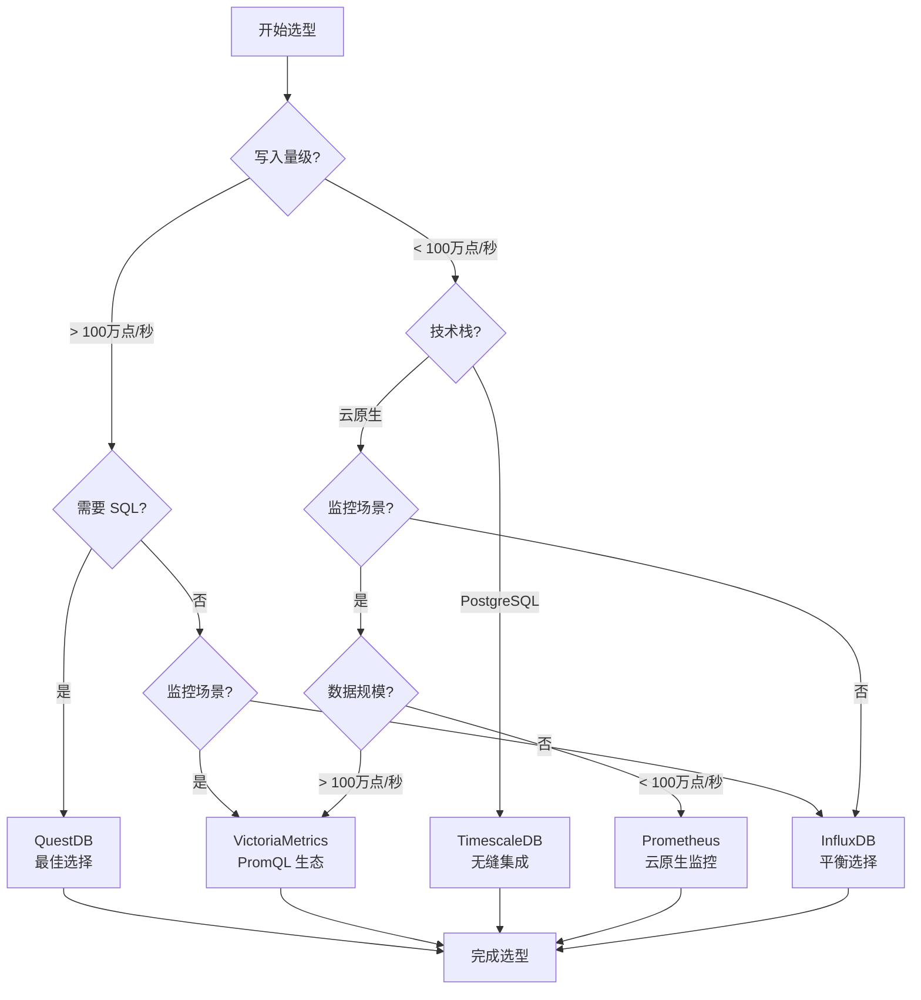

# QuestDB 使用场景与选型对比

## 学习目标

- 理解 QuestDB 在各场景中的具体应用方式
- 掌握 QuestDB 与其他时序数据库的选型决策
- 了解不同场景下的最佳实践

## 适用场景总览



## 场景详解

### 1. 高频数据摄取场景



**核心优势**：
- ILP 协议：百万行/秒摄取速度
- 无锁队列设计：并发写入无需锁竞争
- 零拷贝读取：内存映射，减少 CPU 开销

**典型配置**：

```bash
# 高吞吐 ILP 配置
# questdb.conf
http.bind.to=0.0.0.0:9000
tcp.enabled=true
tcp.net.active.limit=256
line.tcp.enabled=true
line.tcp.writer.queue.size=128L
line.tcp.commit.rate=10000
```

```python
# Python 高速写入示例
import socket
import time

# UDP 方式（最高吞吐）
sock = socket.socket(socket.AF_INET, socket.SOCK_DGRAM)

start = time.time()
for i in range(1000000):
    metric = f"temperature,sensor_id={i%100} value={20.0 + i%10} {int(time.time()*1e9)}"
    sock.sendto(metric.encode(), ('localhost', 9009))
    
print(f"写入速度: {1000000/(time.time()-start):.0f} 行/秒")
```

### 2. 实时监控分析



**监控指标表设计**：

```sql
-- 创建监控指标表（自动按时间分区）
CREATE TABLE metrics (
    ts TIMESTAMP,
    hostname SYMBOL,
    metric_name SYMBOL,
    value DOUBLE,
    tags STRING
) TIMESTAMP(ts) PARTITION BY DAY;

-- 创建符号表索引（加速字符串查询）
ALTER TABLE metrics ALTER COLUMN hostname ADD INDEX;
ALTER TABLE metrics ALTER COLUMN metric_name ADD INDEX;

-- 实时聚合查询
SELECT 
    date_trunc('minute', ts) AS minute,
    hostname,
    metric_name,
    AVG(value) AS avg_value,
    MIN(value) AS min_value,
    MAX(value) AS max_value,
    COUNT(*) AS sample_count
FROM metrics
WHERE ts > NOW() - INTERVAL '1 hour'
SAMPLE BY 1m;
```

**SIMD 加速示例**：

```sql
-- 查询执行时自动使用 SIMD 加速
-- 向量化计算批量处理 256 位寄存器
SELECT 
    AVG(temperature),
    STDDEV(temperature),
    PERCENTILE(temperature, 95)
FROM sensor_data
WHERE ts > NOW() - INTERVAL '1 day';

-- 执行计划显示 SIMD 使用
-- EXPLAIN SELECT ... 将显示:
-- "vector model: true"
-- "column sizes: 8192 values per iteration"
```

### 3. IoT 数据处理



**IoT 表设计最佳实践**：

```sql
-- IoT 数据表设计
CREATE TABLE sensor_readings (
    ts TIMESTAMP,                    -- 时间戳（主键之一）
    device_id SYMBOL,                -- 设备 ID（使用 SYMBOL 优化）
    location SYMBOL,                 -- 位置（使用 SYMBOL 优化）
    temperature DOUBLE,              -- 温度
    humidity DOUBLE,                 -- 湿度
    pressure DOUBLE,                 -- 压力
    battery_level INT,               -- 电池电量
    firmware_version STRING          -- 固件版本（低基数字符串）
) TIMESTAMP(ts) PARTITION BY DAY;

-- SYMBOL 类型优化说明：
-- 1. 高基数字符串（如 device_id）使用 SYMBOL
-- 2. QuestDB 自动维护符号表，存储为 INT 索引
-- 3. 查询时自动解码，写入时自动去重
-- 4. 相比 STRING 类型节省 10-50x 存储空间

-- 按设备查询最近数据
SELECT * FROM sensor_readings
WHERE device_id = 'sensor-001'
ORDER BY ts DESC
LIMIT 100;

-- 按区域统计
SELECT 
    location,
    AVG(temperature) AS avg_temp,
    AVG(humidity) AS avg_humidity,
    COUNT(*) AS reading_count
FROM sensor_readings
WHERE ts > NOW() - INTERVAL '1 hour'
GROUP BY location;
```

### 4. 金融行情分析



**高频交易数据存储**：

```sql
-- Tick 级别行情表
CREATE TABLE tick_data (
    ts TIMESTAMP,
    symbol SYMBOL,           -- 股票代码
    exchange SYMBOL,         -- 交易所
    price DOUBLE,            -- 成交价格
    volume LONG,             -- 成交量
    bid_price DOUBLE,        -- 买一价
    ask_price DOUBLE,        -- 卖一价
    trade_direction BYTE     -- 买卖方向
) TIMESTAMP(ts) PARTITION BY HOUR;

-- K 线计算（SAMPLE BY）
SELECT 
    date_trunc('minute', ts) AS minute,
    symbol,
    FIRST(price) AS open,    -- 开盘价
    MAX(price) AS high,      -- 最高价
    MIN(price) AS low,       -- 最低价
    LAST(price) AS close,    -- 收盘价
    SUM(volume) AS volume    -- 成交量
FROM tick_data
WHERE symbol = 'AAPL'
SAMPLE BY 1m;

-- 技术指标计算（窗口函数）
SELECT 
    ts,
    symbol,
    price,
    AVG(price) OVER (
        PARTITION BY symbol
        ORDER BY ts
        ROWS BETWEEN 19 PRECEDING AND CURRENT ROW
    ) AS ma_20,
    STDDEV(price) OVER (
        PARTITION BY symbol
        ORDER BY ts
        ROWS BETWEEN 19 PRECEDING AND CURRENT ROW
    ) AS std_20
FROM tick_data
WHERE symbol = 'AAPL';
```

## 时序数据库对比



### 功能对比表

| 特性 | QuestDB | TimescaleDB | InfluxDB | VictoriaMetrics | Prometheus |
|------|---------|-------------|----------|-----------------|------------|
| **存储引擎** | 列式+内存映射 | PostgreSQL 分区 | TSM | Mergerowset | TSDB |
| **查询语言** | SQL | SQL | InfluxQL/Flux | PromQL | PromQL |
| **写入吞吐** | 极高（百万行/秒） | 高 | 高 | 极高 | 中 |
| **SIMD 加速** | 原生支持 | 无 | 无 | 部分 | 无 |
| **SQL 标准** | 完整 | 完整 | 部分 | 无 | 无 |
| **高基数支持** | 好（SYMBOL） | 好 | 差 | 好 | 差 |
| **分布式** | 企业版 | 企业版 | 企业版 | 原生集群 | 需联邦 |
| **压缩比** | ~10x | 40-90% | 3-5x | ~10x | ~10x |
| **学习曲线** | 低（SQL） | 低 | 中 | 低 | 中 |
| **运维复杂度** | 低 | 中（依赖 PG） | 低 | 低 | 低 |

### 存储模型对比



## 选型决策流程



### 典型场景选型建议

| 场景 | 推荐选择 | 理由 |
|------|----------|------|
| 高频日志采集 + SQL 分析 | QuestDB | 百万行/秒摄取，标准 SQL 查询 |
| 已有 PostgreSQL 技术栈 | TimescaleDB | 无缝集成，运维成本低 |
| Prometheus 生态监控 | VictoriaMetrics | 兼容 PromQL，高性能存储 |
| 云原生监控告警 | Prometheus | 生态系统完整，社区活跃 |
| IoT 高吞吐写入 | QuestDB | ILP 协议高效，SIMD 加速查询 |
| 金融高频交易分析 | QuestDB | 时间窗口查询，低延迟响应 |
| 简单体量时序存储 | InfluxDB | 部署简单，文档友好 |

## 最佳实践

### 1. 表设计优化

```sql
-- 推荐：使用 SYMBOL 优化高基数字符串
CREATE TABLE metrics (
    ts TIMESTAMP,
    hostname SYMBOL,           -- 高基数使用 SYMBOL
    metric_name SYMBOL,        -- 高基数使用 SYMBOL
    value DOUBLE,
    tags STRING                -- 低基数或不查询用 STRING
) TIMESTAMP(ts) PARTITION BY DAY;

-- 添加索引加速常用查询
ALTER TABLE metrics ALTER COLUMN hostname ADD INDEX;
ALTER TABLE metrics ALTER COLUMN metric_name ADD INDEX;

-- 避免：过度使用 STRING 类型
-- STRING 存储原始字符串，查询性能差
```

### 2. 摄取优化

```bash
# 推荐：使用 ILP UDP 协议最大化吞吐
# 零拷贝、无锁队列设计

# 配置 questdb.conf
line.tcp.enabled=true
line.udp.enabled=true
line.udp.bind.to=0.0.0.0:9009

# 批量写入（减少网络往返）
# 每批次 1000-10000 行
```

```python
# 批量写入示例
import socket

sock = socket.socket(socket.AF_INET, socket.SOCK_DGRAM)
batch = []

for i in range(10000):
    batch.append(f"metric,host=server{i%100} value={i}")
    
    if len(batch) >= 1000:
        message = '\n'.join(batch).encode()
        sock.sendto(message, ('localhost', 9009))
        batch = []
```

### 3. 查询优化

```sql
-- 推荐：使用 SAMPLE BY 替代 GROUP BY
-- SAMPLE BY 原生支持时序聚合

SELECT 
    date_trunc('hour', ts) AS hour,
    AVG(value)
FROM metrics
SAMPLE BY 1h;

-- 推荐：利用 SYMBOL 索引过滤
SELECT * FROM metrics
WHERE hostname = 'server-001'  -- 使用索引
  AND ts > NOW() - INTERVAL '1 hour';

-- 避免：全表扫描
SELECT * FROM metrics
WHERE tags LIKE '%production%';  -- STRING 列无法索引
```

## 要点总结

- QuestDB 最适合高吞吐摄取 + SQL 分析场景，ILP 协议是其核心优势
- SYMBOL 类型优化高基数字符串，节省存储并加速查询
- SIMD 向量化执行自动加速聚合计算，无需用户干预
- 列式存储 + 内存映射实现零拷贝读取，减少 CPU 开销
- 选型核心：高压榨 + SQL → QuestDB；PG 技术栈 → TimescaleDB；监控场景 → VM/Prometheus

## 思考题

1. QuestDB 的 ILP 协议相比 InfluxDB 的 ILP 有哪些增强？对写入性能有什么影响？
2. SYMBOL 类型在什么场景下不适合使用？如果字符串值不断增加会发生什么？
3. QuestDB 的 SIMD 加速对哪些类型的查询最有效？哪些查询无法利用 SIMD？