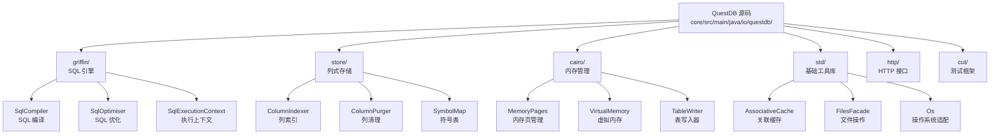
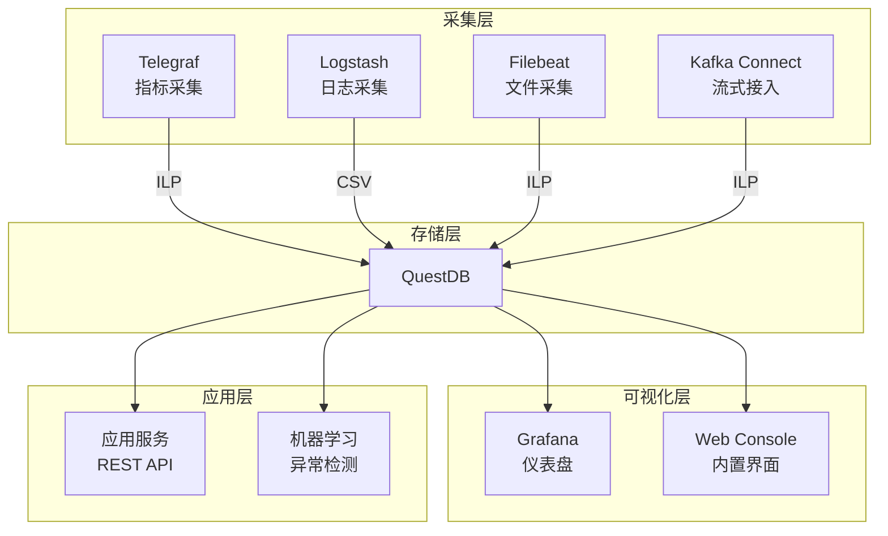
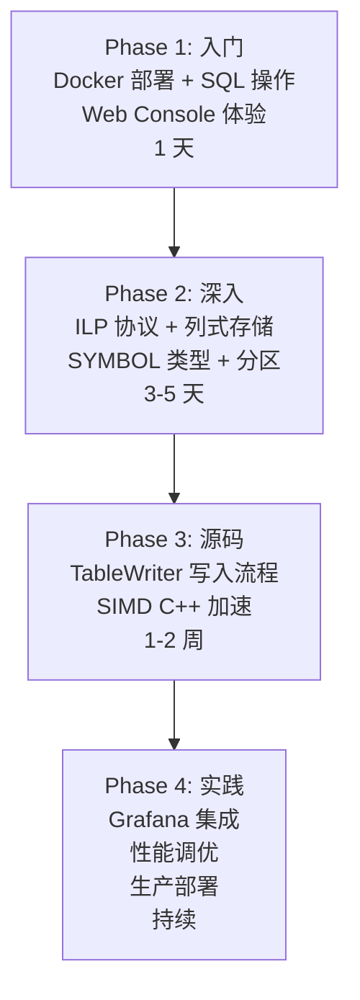

# QuestDB 学习资源

## 学习目标

- 获取 QuestDB 的优质学习资源
- 建立系统化的源码阅读路径
- 掌握深入理解 QuestDB 的方法

## 官方资源

### 文档与社区

| 资源 | 链接 | 说明 |
|------|------|------|
| 官方文档 | [https://questdb.io/docs/](https://questdb.io/docs/) | 完整的架构、API、运维文档 |
| GitHub | [https://github.com/questdb/questdb](https://github.com/questdb/questdb) | 源码，Java/C++ 混合，12k+ Stars |
| 官方博客 | [https://questdb.io/blog/](https://questdb.io/blog/) | 技术博客、性能对比、最佳实践 |
| 社区论坛 | [https://community.questdb.io/](https://community.questdb.io/) | 问答与讨论 |
| Slack | [questdb.slack.com](https://questdb.slack.com/) | 实时交流 |
| 中文文档 | [https://questdb.io/docs/](https://questdb.io/docs/) | 目前官方文档为英文，社区有部分中文翻译 |

### 学习平台

- **Web Console**：`http://localhost:9000` — 自带可视化查询界面，无需安装客户端
- **Playground**：[https://demo.questdb.io/](https://demo.questdb.io/) — 在线体验，预置数据集
- **Docker 快速启动**：[https://questdb.io/get-started/](https://questdb.io/get-started/)
- **Grafana 插件**：[https://grafana.com/grafana/plugins/questdb-questdb-datasource/](https://grafana.com/grafana/plugins/questdb-questdb-datasource/)

## 源码研读路径

### 项目结构

QuestDB 使用 Java 和 C++ 混合开发，核心存储和 SIMD 加速部分用 C++ 实现，SQL 引擎和网络层用 Java 实现。



### 源码阅读建议顺序

1. **入口**：`SqlCompiler.compile()` → 理解 SQL 编译流程
2. **存储**：`TableWriter.write()` → 理解列式写入流程
3. **分区**：`PartitionCursor` → 理解时间分区机制
4. **内存**：`VirtualMemory` → 理解零拷贝内存映射
5. **SIMD**：`/core/src/main/c/` → 理解 C++ SIMD 加速实现

### 核心 Java 代码文件速查

| 文件 | 功能 | 关键行数 |
|------|------|---------|
| `cairo/TableWriter.java` | 表写入器，数据持久化核心 | ~3000 |
| `cairo/TableReader.java` | 表读取器，数据读取核心 | ~2000 |
| `cairo/vm/MemoryPages.java` | 内存页管理，内存映射实现 | ~1500 |
| `cairo/vm/VirtualMemory.java` | 虚拟内存抽象，列存储基础 | ~2000 |
| `cairo/PartitionCursor.java` | 分区游标，时间范围过滤 | ~800 |
| `cairo/ColumnIndexer.java` | 列索引构建，Bitmap 索引 | ~1200 |
| `cairo/SymbolMap.java` | 符号表管理，字符串去重 | ~1000 |
| `griffin/SqlCompiler.java` | SQL 编译入口 | ~2500 |
| `griffin/SqlOptimiser.java` | SQL 优化器，查询重写 | ~3000 |
| `griffin/SqlExecutionContext.java` | 执行上下文，运行时状态 | ~1500 |
| `std/AssociativeCache.java` | 关联缓存，列缓存加速 | ~600 |
| `std/FilesFacade.java` | 文件操作接口，平台适配 | ~500 |
| `http/HttpServer.java` | HTTP 服务，REST API | ~2000 |
| `cut/HttpClient.java` | HTTP 客户端，测试工具 | ~1000 |

### 核心 C++ 代码文件速查

| 文件 | 功能 | 关键行数 |
|------|------|---------|
| `core/src/main/c/jni/ooo.cpp` | JNI 桥接，Java 调用 C++ | ~3000 |
| `core/src/main/c/simd/avx2_agg.cpp` | AVX2 聚合加速（SUM/AVG） | ~800 |
| `core/src/main/c/simd/avx2_filter.cpp` | AVX2 过滤加速（WHERE） | ~600 |
| `core/src/main/c/simd/avx512_agg.cpp` | AVX-512 聚合加速 | ~1000 |
| `core/src/main/c/simd/sse_agg.cpp` | SSE 聚合加速（兼容模式） | ~600 |
| `core/src/main/c/fs/vfs.cpp` | 虚拟文件系统，零拷贝读写 | ~1500 |

### SIMD 源码解析

```c
// QuestDB AVX2 聚合加速核心代码（简化示意）

// SUM 向量化计算
void simd_sum_double(const double* values, int64_t n, double* result) {
    __m256d sum = _mm256_setzero_pd();
    int64_t i = 0;
    
    // 每次处理 4 个 double（256 位）
    for (; i <= n - 4; i += 4) {
        __m256d v = _mm256_loadu_pd(&values[i]);
        sum = _mm256_add_pd(sum, v);
    }
    
    // 水平求和
    alignas(32) double tmp[4];
    _mm256_store_pd(tmp, sum);
    double total = tmp[0] + tmp[1] + tmp[2] + tmp[3];
    
    // 处理剩余元素
    for (; i < n; i++) {
        total += values[i];
    }
    
    *result = total;
}

// AVX-512 版本（每次 8 个 double）
void simd_sum_double_avx512(const double* values, int64_t n, double* result) {
    __m512d sum = _mm512_setzero_pd();
    int64_t i = 0;
    
    for (; i <= n - 8; i += 8) {
        __m512d v = _mm512_loadu_pd(&values[i]);
        sum = _mm512_add_pd(sum, v);
    }
    
    alignas(64) double tmp[8];
    _mm512_store_pd(tmp, sum);
    double total = 0;
    for (int j = 0; j < 8; j++) total += tmp[j];
    
    for (; i < n; i++) {
        total += values[i];
    }
    
    *result = total;
}
```

## 推荐书籍与论文

### 书籍

| 书名 | 作者 | 说明 |
|------|------|------|
| 《High Performance Java Persistence》 | Vlad Mihalcea | Java 高性能持久化，理解 QuestDB Java 层设计 |
| 《Database Internals》 | Alex Petrov | 存储引擎设计，列存原理，B-Tree 变体 |
| 《Designing Data-Intensive Applications》 | Martin Kleppmann | 分布式数据系统基础，时序数据库架构 |
| 《Computer Architecture: A Quantitative Approach》 | Hennessy & Patterson | SIMD 和向量化计算的硬件基础 |
| 《Java Performance: The Definitive Guide》 | Scott Oaks | JVM 性能调优，GC 优化，无锁队列 |

### 关键论文

| 论文 | 作者 | 与 QuestDB 的关系 |
|------|------|-------------------|
| [Gorilla: A Fast, Scalable, In-Memory Time Series Database](https://www.vldb.org/pvldb/vol8/p1816-teller.pdf) | Facebook, 2015 | 时序压缩算法参考，QuestDB 的浮点压缩受 Gorilla 影响 |
| [Column-Stores vs. Row-Stores: How Different Are They Really?](https://dl.acm.org/doi/10.1145/1376616.1376712) | Abadi et al., 2008 | 列式存储的理论基础 |
| [Monarch: Google's Planet-Scale In-Memory Time Series Database](https://www.vldb.org/pvldb/vol13/p3181-adams.pdf) | Adams et al., 2020 | 大规模内存时序数据库，参考分布式方案 |
| [The Design and Implementation of Modern Column-Oriented Database Systems](https://stratos.seas.harvard.edu/files/stratos/files/columnstores-tutorial.pdf) | Abadi et al. | 列存数据库系统设计，SIMD 加速参考 |
| [SIMD-Accelerated Database Operations](https://dl.acm.org/doi/10.1145/3075574.3075582) | 多作者 | SIMD 在数据库中的应用，QuestDB AVX2 实现的理论基础 |

### QuestDB 相关技术博客

- **QuestDB 架构系列**：[https://questdb.io/blog/tag/architecture/](https://questdb.io/blog/tag/architecture/)
  - "How QuestDB achieves 1.5M inserts per second"
  - "QuestDB vs InfluxDB: Performance Benchmark"
  - "SIMD in QuestDB: Vectorized Execution"
- **性能对比**：[https://questdb.io/blog/questdb-vs-timescaledb/](https://questdb.io/blog/questdb-vs-timescaledb/)
- **工程实践**：[https://questdb.io/blog/engineering/](https://questdb.io/blog/engineering/)

## 社区资源

### 开源工具生态



### 社区项目

| 项目 | 链接 | 说明 |
|------|------|------|
| questdb-datasource (Grafana) | [https://grafana.com/grafana/plugins/questdb-questdb-datasource/](https://grafana.com/grafana/plugins/questdb-questdb-datasource/) | 官方 Grafana 数据源插件 |
| questdb-kubernetes | [https://github.com/questdb/questdb-kubernetes](https://github.com/questdb/questdb-kubernetes) | Kubernetes 部署 Helm Chart |
| questdb-docker | [https://hub.docker.com/r/questdb/questdb](https://hub.docker.com/r/questdb/questdb) | 官方 Docker 镜像 |
| questdb-kafka-connect | [https://github.com/questdb/questdb-kafka-connect](https://github.com/questdb/questdb-kafka-connect) | Kafka Connect 连接器 |

### 客户端驱动

| 语言 | 驱动 | 说明 |
|------|------|------|
| Python | `questdb` | 官方 Python 驱动（pip install questdb） |
| Go | `github.com/questdb/go-questdb-client` | 官方 Go 驱动 |
| Java | `com.questdb:questdb:7.x` | 嵌入式 Java 库 |
| Node.js | `@questdb/nodejs-client` | 官方 Node.js 驱动 |
| C/C++ | `libpq` | PostgreSQL Wire 协议兼容，可用 libpq |
| Rust | `questdb-rs` | 社区 Rust 驱动 |
| .NET | `QuestDB` | 社区 .NET 驱动 |

## 学习路径



### Phase 1 入门 Checklist

- [ ] 使用 Docker 启动 QuestDB：`docker run questdb/questdb`
- [ ] 访问 Web Console（localhost:9000）
- [ ] 使用 Playground 体验 SQL 查询
- [ ] 创建时序表并插入数据
- [ ] 掌握 SAMPLE BY 查询语法
- [ ] 掌握常用聚合函数（AVG/MIN/MAX/COUNT/SUM）

### Phase 2 深入 Checklist

- [ ] 理解 ILP 协议（InfluxDB Line Protocol）的使用
- [ ] 掌握 SYMBOL 类型和 STRING 类型的区别
- [ ] 理解时间分区机制（PARTITION BY DAY/HOUR/MONTH）
- [ ] 实验：对比 ILP 写入和 SQL INSERT 的性能差异
- [ ] 掌握窗口函数（OVER）的使用
- [ ] 理解内存映射（mmap）对读写性能的影响

### Phase 3 源码 Checklist

- [ ] 阅读 TableWriter.java，理解写入流程
- [ ] 阅读 VirtualMemory.java，理解列式存储
- [ ] 阅读 SymbolMap.java，理解符号表实现
- [ ] 阅读 avx2_agg.cpp，理解 SIMD 聚合加速
- [ ] 阅读 avx2_filter.cpp，理解 SIMD 过滤加速
- [ ] 阅读 SqlCompiler.java，理解 SQL 编译流程

### Phase 4 实践 Checklist

- [ ] 配置 Grafana + QuestDB 数据源
- [ ] 使用 Telegraf 采集服务器指标写入 QuestDB
- [ ] 编写 Python 应用实时写入和查询
- [ ] 性能调优：调整分区大小、缓存配置
- [ ] 部署高可用架构（企业版或自建）
- [ ] 对比 QuestDB 与项目中 ts_engine 的性能

## 要点总结

- 官方文档和 GitHub 源码是首要学习资源，Web Console 降低了入门门槛
- 源码阅读应遵循 Java 存储层（TableWriter）→ C++ SIMD 层（avx2_agg）→ SQL 编译层（SqlCompiler）的顺序
- SIMD 加速是 QuestDB 区别于其他时序库的核心竞争力，需要了解 AVX2/AVX-512 指令集
- ILP 协议 + 列式存储 + 内存映射构成 QuestDB 高性能的三驾马车
- 与 Grafana/Telegraf/Kafka 的生态集成是生产实践重点

## 思考题

1. QuestDB 的 Java + C++ 混合架构相比纯 Java 或纯 C++ 实现有什么优势？JNI 调用开销如何控制？
2. QuestDB 的 SIMD 加速在哪些场景下收益最大？CPU 不支持 AVX2 时性能退化到什么程度？
3. 对比项目中 ts_engine 的 Gorilla 压缩，QuestDB 的列式存储 + 内存映射设计在查询性能上有哪些优势？