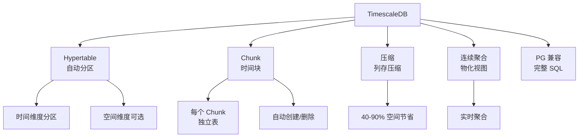

# TimescaleDB 项目概览

## 学习目标

- 了解 TimescaleDB 作为时序关系数据库的定位
- 掌握 TimescaleDB 的 Hypertable 和自动分区设计

## 项目定位

> TimescaleDB 是基于 PostgreSQL 的时序数据库，通过自动分区（Hypertable）实现高效时序数据存储和分析。

**基本信息**：
- 开发方：Timescale Inc.
- 首次发布：2017 年
- 开源协议：Apache 2.0（社区版）/TSL（企业版）
- GitHub Stars：约 18k

## 核心设计



## Hypertable 架构

```sql
-- 创建 Hypertable（自动分区表）
CREATE TABLE sensor_data (
    time        TIMESTAMPTZ NOT NULL,
    sensor_id   INTEGER,
    temperature DOUBLE PRECISION,
    humidity    DOUBLE PRECISION
);
SELECT create_hypertable('sensor_data', 'time');

-- 插入数据（与普通表一样）
INSERT INTO sensor_data VALUES (NOW(), 1, 22.5, 60.0);

-- 查看 Chunk
SELECT show_chunks('sensor_data');
```

## 要点总结

- 基于 PostgreSQL，完整 SQL 支持
- Hypertable 自动时间分区
- Chunk 独立存储，支持压缩
- 连续聚合实现实时聚合

## 思考题

1. TimescaleDB 的 Hypertable 与 PostgreSQL 的原生分区表有何不同？
2. Chunk 的大小如何配置？过大或过小有什么影响？
3. TimescaleDB 的压缩机制是如何工作的？