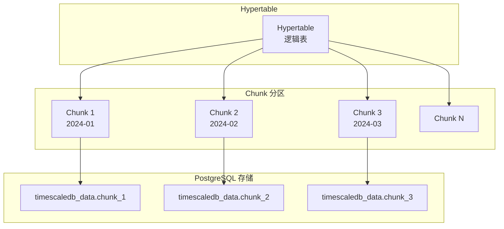

# TimescaleDB 架构设计

## 学习目标

- 理解 TimescaleDB 的 Hypertable 和 Chunk 分区架构
- 掌握 TimescaleDB 的压缩和连续聚合机制

## Hypertable 架构



## Chunk 创建规则

```sql
-- 时间间隔配置
-- 默认按月创建 Chunk
SELECT set_chunk_time_interval('sensor_data', INTERVAL '1 day');

-- 查看 Chunk 信息
SELECT
    chunk_name,
    range_start,
    range_end,
    is_compressed
FROM timescaledb_information.chunks
WHERE hypertable_name = 'sensor_data';
```

## 压缩机制

```sql
-- 启用压缩
ALTER TABLE sensor_data SET (
    timescaledb.compress,
    timescaledb.compress_segmentby = 'sensor_id'
);

-- 压缩策略
SELECT add_compression_policy('sensor_data', INTERVAL '7 days');

-- 手动压缩
CALL compress_chunk('_timescaledb_internal._hyper_1_1_chunk');

-- 查看压缩效果
SELECT
    hypertable_name,
    compression_status,
    before_compression_total_bytes,
    after_compression_total_bytes
FROM timescaledb_information.compression_stats;
```

## 连续聚合

```sql
-- 创建连续聚合
CREATE MATERIALIZED VIEW hourly_avg
WITH (timescaledb.continuous) AS
SELECT
    time_bucket('1 hour', time) AS hour,
    sensor_id,
    AVG(temperature) AS avg_temp
FROM sensor_data
GROUP BY hour, sensor_id;

-- 刷新策略
SELECT add_continuous_aggregate_policy('hourly_avg',
    start_offset => INTERVAL '3 hours',
    end_offset => INTERVAL '1 hour',
    schedule_interval => INTERVAL '30 minutes');
```

## 要点总结

- Hypertable 自动按时间分区为 Chunk
- Chunk 是独立的 PostgreSQL 表
- 压缩使用列式存储，节省 40-90% 空间
- 连续聚合自动增量刷新