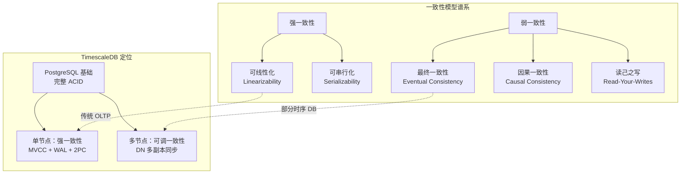
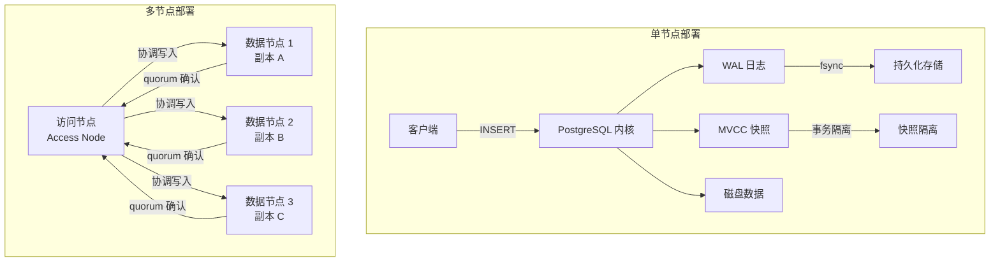
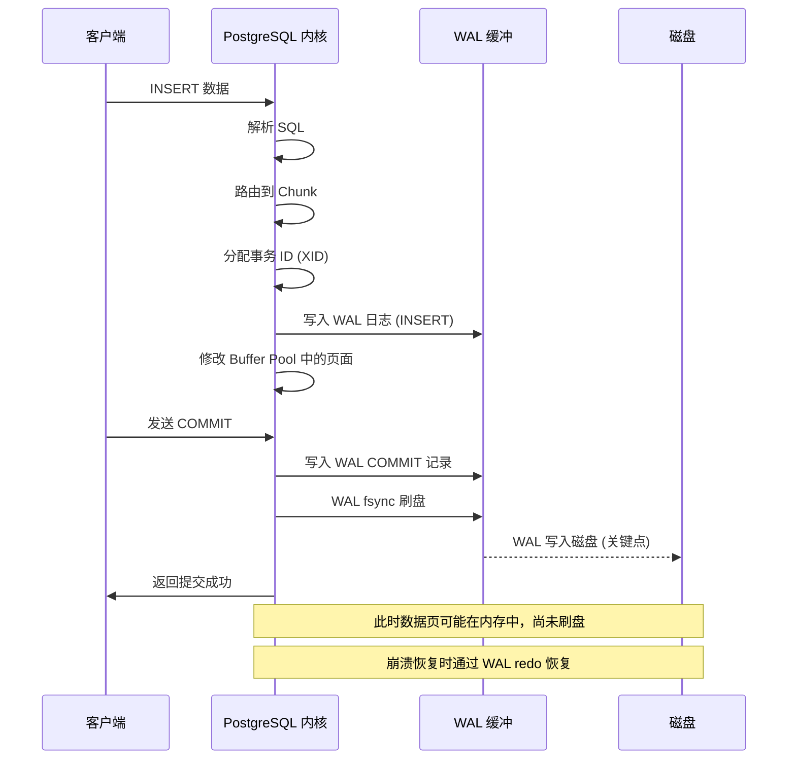
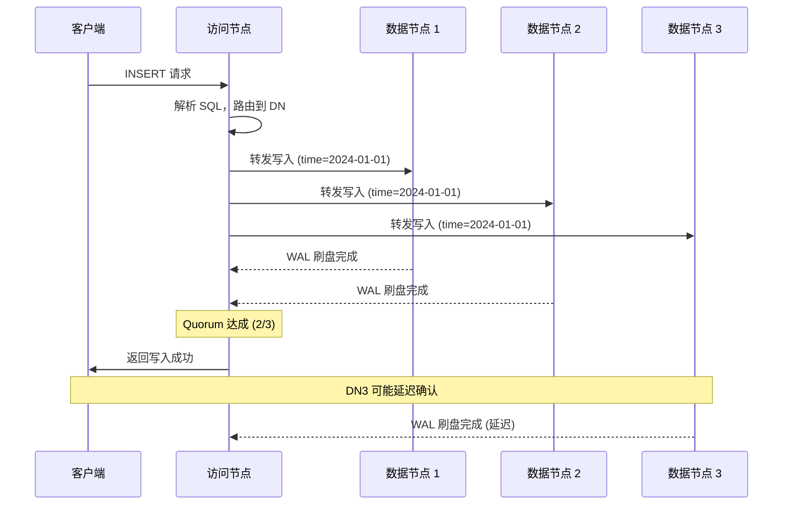
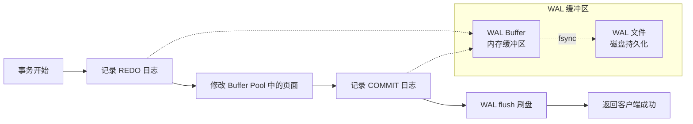
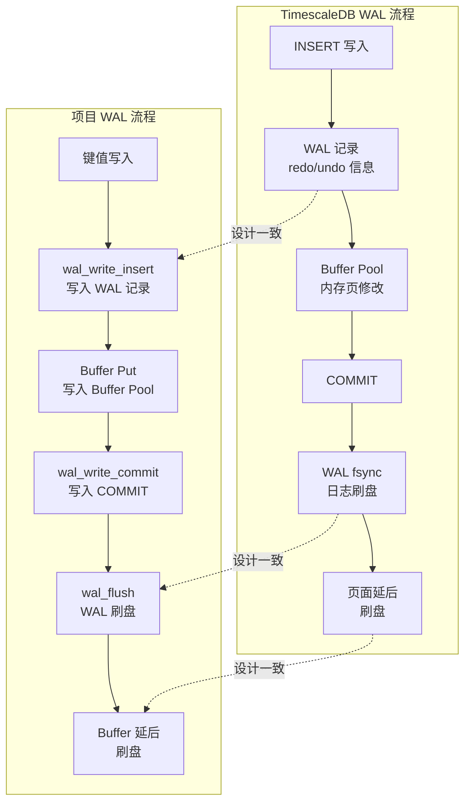
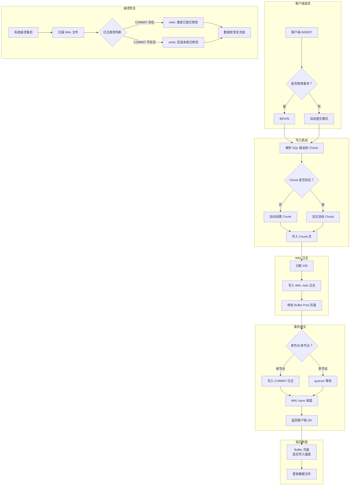

# TimescaleDB 事务与一致性模型

## 学习目标

- 理解时序数据库一致性模型的发展背景与分类
- 掌握 TimescaleDB 基于 PostgreSQL 的 ACID 事务机制
- 分析 TimescaleDB 的写入一致性策略与批量提交机制
- 了解 WAL 日志在数据完整性保证中的核心作用
- 建立 TimescaleDB 事务机制与项目 wal.c/wal_buf.c 模块的关联

## 概述

TimescaleDB 作为基于 PostgreSQL 的时序数据库，其事务与一致性模型继承了 PostgreSQL 的完整 ACID 特性，同时针对时序数据的写入模式做了针对性优化。

时序数据库的一致性模型与传统关系数据库存在显著差异。传统数据库追求强一致性（Strong Consistency），而时序数据库在高写入吞吐场景下，往往需要在一致性与性能之间做权衡。



## 核心概念

### 1. 一致性模型分类

| 模型 | 描述 | 性能开销 | 应用场景 |
|------|------|---------|---------|
| 强一致性 | 写入后立即一致可见 | 高 | 金融、监控报警 |
| 最终一致性 | 写入后最终一致，有窗口期 | 低 | 日志聚合、批量分析 |
| 因果一致性 | 有因果关系的操作有序 | 中 | 事件溯源、时序追踪 |
| 读己之写 | 写入者可见自己的写入 | 中 | 用户仪表盘、实时监控 |

### 2. TimescaleDB 的一致性选择

TimescaleDB 在不同部署模式下提供不同的一致性保证：

**单节点模式**：
- 继承 PostgreSQL 完整 ACID 特性
- MVCC（多版本并发控制）实现读不阻塞写
- WAL 日志确保持久性
- 可串行化隔离级别

**多节点模式**：
- 分布式协调提供可调一致性
- 数据节点（DN）多副本同步
- 写操作需 quorum 确认
- 访问节点（AN）负责全局一致性协调



## 写入一致性

### 1. 单节点写入流程

TimescaleDB 的写入流程充分利用 PostgreSQL 的事务机制：

```sql
-- 单条写入（自动提交）
INSERT INTO sensor_data (time, sensor_id, temperature)
VALUES (NOW(), 1, 22.5);

-- 批量写入（单个事务）
INSERT INTO sensor_data (time, sensor_id, temperature)
VALUES
    (NOW(), 1, 22.5),
    (NOW(), 2, 23.1),
    (NOW(), 3, 21.8);

-- 显式事务写入
BEGIN;
    INSERT INTO sensor_data (time, sensor_id, temperature) VALUES (NOW(), 1, 22.5);
    INSERT INTO sensor_data (time, sensor_id, humidity) VALUES (NOW(), 1, 60.0);
COMMIT;
```



### 2. 批量提交优化

时序数据写入具有高吞吐、低延迟的要求，TimescaleDB 支持多种批量提交策略：

```sql
-- 1. 批量 chunk 级写入（推荐）
INSERT INTO sensor_data (time, sensor_id, temperature)
SELECT generate_series(
    NOW() - INTERVAL '1 hour',
    NOW(),
    INTERVAL '1 second'
) AS time,
    1 AS sensor_id,
    random() * 30 + 20 AS temperature;

-- 2. COPY 协议批量导入（最高效）
COPY sensor_data (time, sensor_id, temperature)
FROM '/tmp/sensor_data.csv' CSV;

-- 3. 并行批量插入
-- 使用多个连接同时写入不同 Chunk
```

**批量提交的权衡**：

| 策略 | 吞吐量 | 一致性保证 | 适用场景 |
|------|--------|-----------|---------|
| 逐行提交 | 低 | 强 | 实时监控，少量数据 |
| 事务批量 | 中 | 强 | 中等吞吐场景 |
| COPY 批量 | 高 | 强 | 历史数据导入 |
| 异步批量 | 极高 | 弱 | 日志聚合，可容忍丢失 |

### 3. 多节点 quorum 写入

在多节点部署模式下，TimescaleDB 通过 quorum 机制保证写入一致性：



**quorum 配置**：

```sql
-- 设置数据节点的副本数
SELECT add_data_node('dn1', host => 'dn1.example.com');
SELECT add_data_node('dn2', host => 'dn2.example.com');
SELECT add_data_node('dn3', host => 'dn3.example.com');

-- 设置复制因子（每个 Chunk 的副本数）
ALTER DATABASE mydb SET timescaledb.replication_factor = 3;

-- 查看数据分布
SELECT * FROM timescaledb_information.data_nodes;
```

## 数据完整性保证

### 1. WAL 日志机制

TimescaleDB 继承 PostgreSQL 的 WAL（Write-Ahead Log）机制，确保数据持久性和崩溃恢复能力。

**WAL 写入流程**：



**WAL 记录格式**（PostgreSQL 风格）：

| 字段 | 大小 | 说明 |
|------|------|------|
| LSN (Log Sequence Number) | 8 字节 | 日志序列号，单调递增 |
| XID (Transaction ID) | 4 字节 | 所属事务 ID |
| Resource Manager | 2 字节 | 资源管理器（如 Heap、BTree、Chunk） |
| Record Type | 1 字节 | 操作类型（INSERT/UPDATE/DELETE/COMMIT） |
| Payload | 可变 | 具体操作数据 |

### 2. Checksum 校验

TimescaleDB 继承 PostgreSQL 的数据页 checksum 机制，用于检测数据损坏：

```sql
-- 启用数据页校验
ALTER SYSTEM SET data_checksums = on;

-- 重建校验和
-- 需要重启数据库
```

**校验层级**：

| 层级 | 校验范围 | 计算时机 | 验证时机 |
|------|---------|---------|---------|
| WAL 记录 | 每条日志记录 | 写入 WAL 时 | WAL 读取时 |
| 数据页 | 每个 8KB 页面 | 页面写入磁盘时 | 页面从磁盘读取时 |
| Chunk 文件 | 整个 Chunk 文件 | Chunk 创建/压缩时 | Chunk 打开时 |

### 3. 与项目 wal.c/wal_buf.c 模块的关联

项目中的 `wal.h` 和 `wal_buf.h` 实现了与 PostgreSQL/TimescaleDB 类似的 WAL 机制，两者在架构设计上高度一致：

**架构对比**：

| 特性 | TimescaleDB / PostgreSQL WAL | 项目 wal.c/wal_buf.c |
|------|-----------------------------|---------------------|
| 日志序列号 | LSN（Log Sequence Number） | LSN（`wal_record_header_t.lsn`） |
| 日志类型 | INSERT/UPDATE/DELETE/COMMIT/ABORT/CHECKPOINT | `WAL_LOG_INSERT`/`WAL_LOG_UPDATE`/`WAL_LOG_DELETE`/`WAL_LOG_COMMIT`/`WAL_LOG_ABORT`/`WAL_LOG_CHECKPOINT`/`WAL_LOG_BEGIN` |
| 记录头 | type + size + lsn + xid + prev_lsn + checksum | 24 字节记录头，完全对齐 |
| 事务日志 | 事务开始/结束记录 | `wal_write_begin` / `wal_write_commit` / `wal_write_abort` |
| 脏页协调 | Buffer Pool + WAL 关联 | `wal_buf_t` 协调器 |
| 崩溃恢复 | redo（已提交事务）/ undo（未提交事务） | `wal_redo` / `wal_undo` |
| 检查点 | 定期刷脏页，截断 WAL | `wal_buf_checkpoint` |
| 预写原则 | 先写 WAL，后写数据页 | WAL flush 后返回，Buffer 延后刷盘 |

**项目 WAL 在时序数据场景下的应用**：

```c
// 项目 wal.h 的日志记录头结构
typedef struct wal_record_header_s {
    uint8_t  type;           // 日志类型（INSERT/UPDATE/DELETE...）
    uint8_t  size[3];        // 记录大小
    uint64_t lsn;            // 日志序列号
    uint32_t txn_id;         // 事务 ID
    uint32_t prev_lsn;       // 上一条日志的 LSN
    uint32_t checksum;       // 记录校验和
} wal_record_header_t;

// 时序数据写入时，每批数据记一条 WAL 记录
// 类比 TimescaleDB 的 Chunk 级 WAL 写入

// 批量插入时序数据 -> WAL 记录
for (int i = 0; i < batch_size; i++) {
    // 写入 WAL 插入日志
    uint64_t lsn = wal_write_insert(wal, txn_id,
                                    &sensor_data[i].timestamp, sizeof(int64_t),
                                    &sensor_data[i].value, sizeof(double));
    
    // 写入 Buffer Pool
    buffer_write(buf_pool, &sensor_data[i], sizeof(sensor_data_entry_t));
}

// 提交事务 -> WAL COMMIT 刷盘
wal_write_commit(wal, txn_id);
wal_flush(wal);  // 确保 WAL 落盘
```

**一致性保证对比**：



## 事务隔离级别

TimescaleDB 继承 PostgreSQL 的全部事务隔离级别，为时序数据查询提供一致性的快照视图：

| 隔离级别 | 脏读 | 不可重复读 | 幻读 | 时序场景适用性 |
|---------|------|-----------|------|--------------|
| 读未提交 | 不允许* | 可能 | 可能 | 不推荐 |
| 读已提交 | 安全 | 可能 | 可能 | 默认级别，适合大多数时序查询 |
| 可重复读 | 安全 | 安全 | 可能 | 报表生成，需要一致性快照 |
| 可串行化 | 安全 | 安全 | 安全 | 复杂时序分析，并发控制 |

> *注：PostgreSQL 的读未提交实际上行为与读已提交一致，因为 PG 不实现脏读。

**MVCC 在时序数据中的应用**：

```sql
-- 事务 A：长时间运行的聚合查询
BEGIN ISOLATION LEVEL REPEATABLE READ;
    -- 以下查询获取一个一致性的数据快照
    SELECT time_bucket('1 hour', time) AS hour,
           AVG(temperature) AS avg_temp
    FROM sensor_data
    WHERE time > NOW() - INTERVAL '24 hours'
    GROUP BY hour
    ORDER BY hour;
    -- 即使其他事务在插入新数据，此查询结果不变
COMMIT;

-- 事务 B：同时写入新数据
INSERT INTO sensor_data VALUES (NOW(), 1, 25.3);
-- 不影响事务 A 的查询结果
```

## 写入一致性流程图



## 要点总结

- TimescaleDB 单节点模式继承 PostgreSQL 的完整 ACID 特性，提供强一致性保证
- 时序数据写入默认使用自动提交事务，推荐使用批量事务提高吞吐量
- WAL 日志是数据完整性的核心保障，遵循先写日志后写数据的 pre-write 原则
- 多节点模式下通过 quorum 机制实现可调一致性，副本因子决定一致性强度
- 项目 wal.c/wal_buf.c 模块与 TimescaleDB 的 WAL 机制在架构上高度一致，均采用 LSN + 日志类型 + 事务 ID + checksum 的记录格式
- 崩溃恢复依赖 WAL 的 redo/undo 机制，已提交事务重做，未提交事务回滚
- MVCC 为时序查询提供一致性快照，可重复读隔离级别适合长时间运行的聚合分析
- 时序数据库的一致性模型需在性能与一致性之间权衡，TimescaleDB 通过不同部署模式提供灵活选择

## 思考题

1. TimescaleDB 单节点部署默认使用读已提交隔离级别，这对于时序数据的聚合查询有何影响？如果切换到可重复读，性能会有什么变化？
2. 在多节点部署中，quorum 写入的副本因子设置为 3 时，容忍 1 个节点故障。如果设置为 5，一致性和性能会如何变化？
3. 项目 wal.h 中的 `wal_write_update` 同时记录了旧值和新值，而 TimescaleDB 的 WAL 主要记录 redo 信息。为什么项目的 WAL 需要同时记录 undo 信息？
4. 时序数据通常以追加写入为主，很少更新和删除。在这种场景下，WAL 日志是否可以简化？例如去掉 undo 日志是否可行？
5. 如果要在项目中为 ts_engine 添加 WAL 支持，需要如何设计日志记录格式以支持时序数据的高吞吐写入？