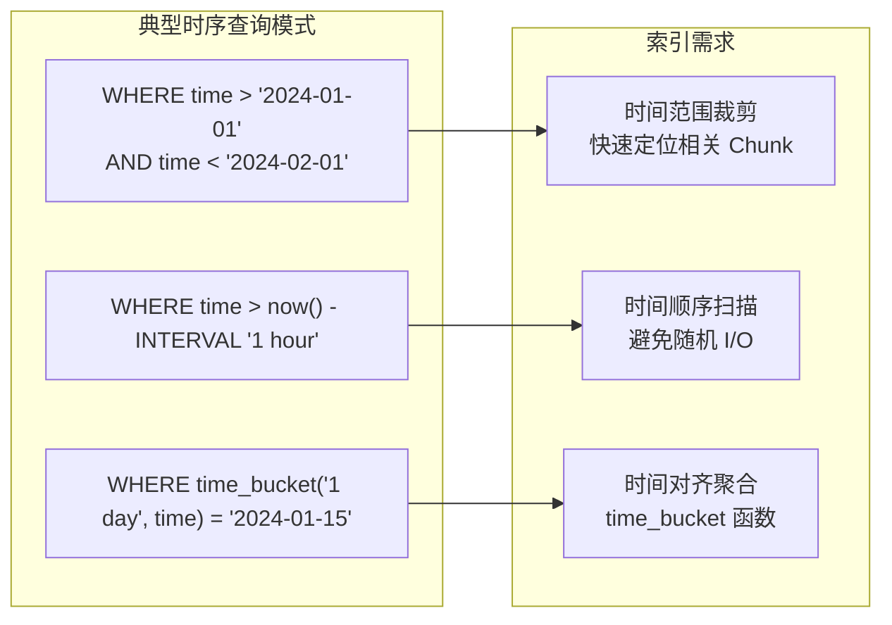
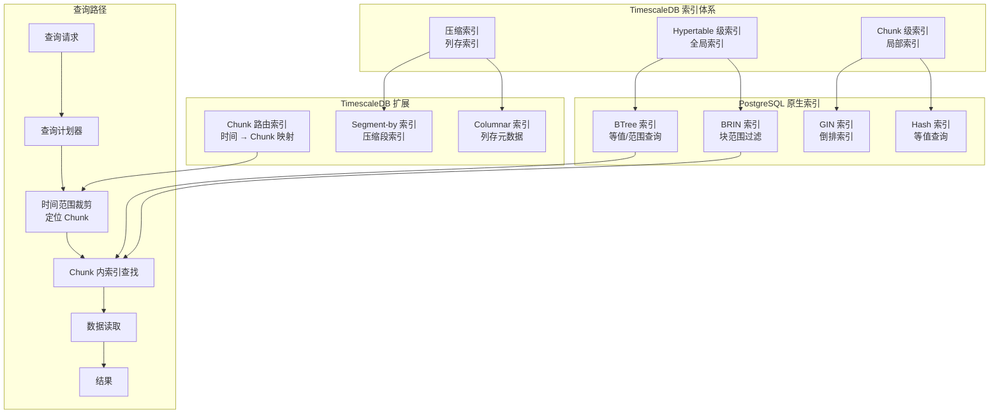
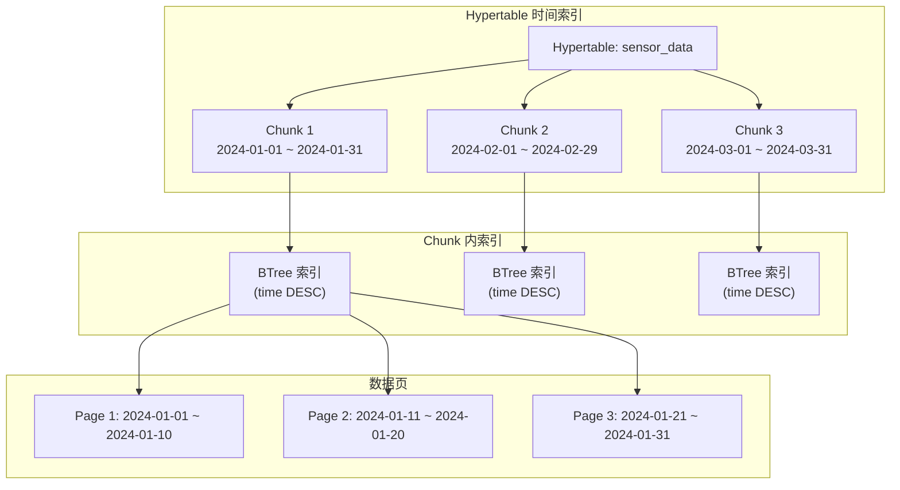
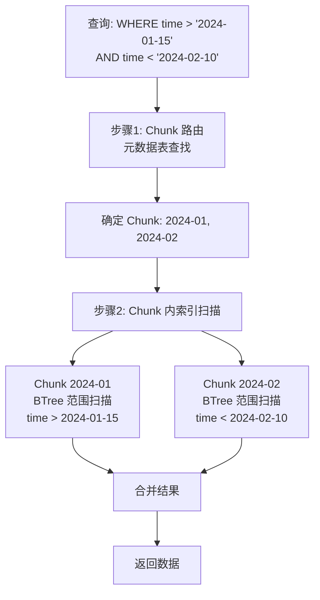
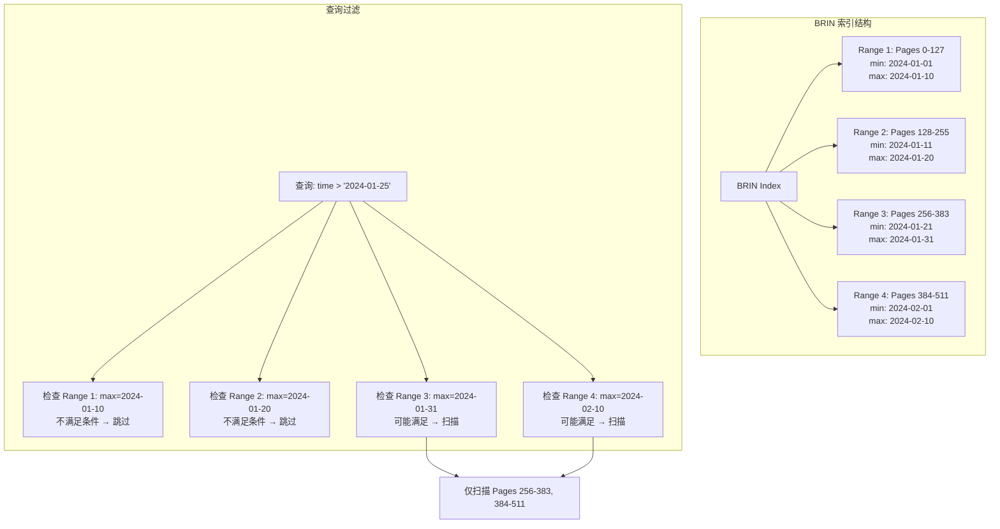
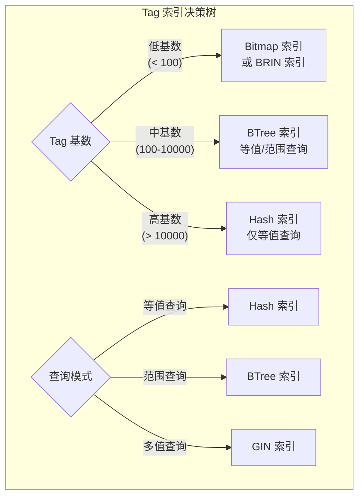
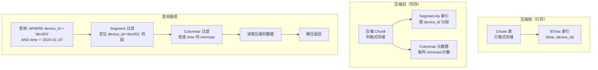
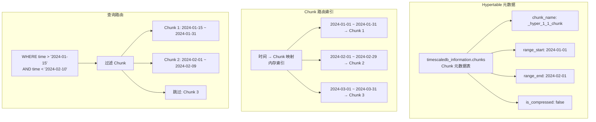
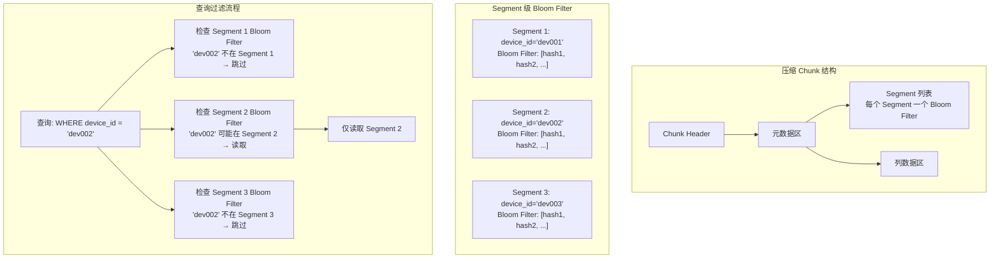
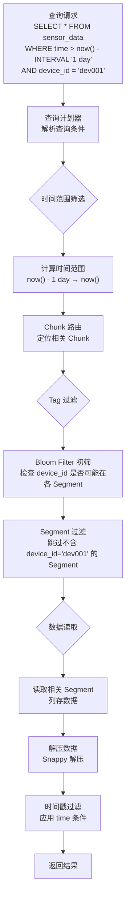

# TimescaleDB 索引策略

## 学习目标

- 理解时序数据库索引设计的核心挑战与独特需求
- 掌握 TimescaleDB 基于 PostgreSQL 的索引体系（时间索引、倒排索引、BRIN 索引）
- 了解多级时间分区索引的层次结构与查询路径
- 学习布隆过滤器在时序索引中的应用场景
- 对比项目 index/ 模块（BTree / Hash / Bitmap / BRIN）与 TimescaleDB 索引的异同

## 核心概念

- **Hypertable**：TimescaleDB 的逻辑分区表，物理上由多个 Chunk 组成，是索引作用的主要对象
- **Chunk**：Hypertable 的物理分区，按时间范围自动创建，每个 Chunk 是独立的 PostgreSQL 表
- **时间索引**：以时间列为主键或排序列构建的索引，用于加速时间范围查询
- **BRIN 索引（Block Range Index）**：块范围索引，记录每个物理块的数据范围摘要，用于快速跳过不相关数据块
- **倒排索引（GIN）**：通用倒排索引，用于加速数组、JSONB、全文搜索等复合类型的查询
- **Segment-by 压缩索引**：TimescaleDB 压缩时按指定列分段，每个段内构建独立索引
- **布隆过滤器（Bloom Filter）**：概率性数据结构，用于快速判断元素是否存在，减少不必要的磁盘 I/O

## 时序数据库索引设计的核心挑战

### 1. 时间维度优先

时序查询的核心模式是以时间范围为第一过滤条件，索引必须支持高效的时间范围裁剪。



### 2. 高基数 Tag 查询

时序数据常包含高基数 Tag（如设备 ID、用户 ID），传统 BTree 索引面临空间膨胀问题。

### 3. 写入密集与索引维护

时序数据以追加写入为主，索引必须支持高吞吐写入，避免写入放大和索引重建开销。

### 4. 查询模式多样

| 查询类型 | 示例 | 索引需求 |
|----------|------|----------|
| 时间范围查询 | `WHERE time > now() - 1h` | 时间分区裁剪 + BRIN/BTree |
| Tag 等值查询 | `WHERE device_id = 'dev001'` | BTree/Hash 索引 |
| Tag 范围查询 | `WHERE value BETWEEN 10 AND 20` | BTree 索引 |
| 时间 + Tag 组合 | `WHERE time > 1h AND device = 'd1'` | BRIN + BTree 组合 |
| 聚合查询 | `SELECT AVG(value) GROUP BY time_bucket(...)` | 时间对齐 + 预聚合 |
| 最新值查询 | `SELECT last(value, time) FROM metrics` | 时间降序索引 |

## TimescaleDB 索引体系

### 整体架构



### 1. 时间索引（Time Index）

TimescaleDB 的核心索引策略是利用时间列进行分区和索引。

**自动时间索引创建**：

```sql
-- 创建 Hypertable 时自动在时间列创建 BTree 索引
CREATE TABLE sensor_data (
    time        TIMESTAMPTZ NOT NULL,
    sensor_id   INTEGER,
    temperature DOUBLE PRECISION,
    humidity    DOUBLE PRECISION
);

SELECT create_hypertable('sensor_data', 'time');
-- TimescaleDB 自动创建: _timescaledb_internal._hyper_1_1_chunk_time_idx

-- 查看自动创建的索引
SELECT indexname, indexdef
FROM pg_indexes
WHERE tablename LIKE '%chunk%';
```

**时间索引的结构**：



**时间索引查询路径**：



### 2. BRIN 索引（块范围索引）

BRIN（Block Range Index）是 PostgreSQL 的轻量级索引，特别适合时序数据的时间范围查询。

**BRIN 索引原理**：



**BRIN 索引创建与使用**：

```sql
-- 在时间列创建 BRIN 索引
CREATE INDEX idx_sensor_time_brin
ON sensor_data USING brin(time);

-- BRIN 索引参数配置
CREATE INDEX idx_sensor_time_brin
ON sensor_data USING brin(time)
WITH (pages_per_range = 128);  -- 每 128 页一个范围摘要

-- BRIN 索引的查询计划
EXPLAIN ANALYZE
SELECT * FROM sensor_data
WHERE time > '2024-01-15' AND time < '2024-02-01';
-- Bitmap Heap Scan (using idx_sensor_time_brin)
--   Recheck Cond: (time > '2024-01-15'::timestamp)
--   -> Bitmap Index Scan on idx_sensor_time_brin
```

**BRIN 索引的优势与局限**：

| 特性 | 优势 | 局限 |
|------|------|------|
| 空间占用 | 极小（每 128 页仅需几十字节） | 精度较低，可能扫描不相关页 |
| 创建速度 | 快速（仅扫描数据摘要） | 不适合随机写入场景 |
| 查询速度 | 范围查询高效（快速跳过大量数据） | 等值查询效率不如 BTree |
| 适用场景 | 时间序列、日志、顺序写入数据 | 高更新频率、随机写入数据 |
| 维护成本 | 极低（自动维护摘要） | 大量更新后需手动 reindex |

### 3. Tag 索引（设备/维度索引）

TimescaleDB 继承 PostgreSQL 的索引能力，可以为 Tag 列创建合适的索引。

**Tag 索引类型选择**：



**Tag 索引示例**：

```sql
-- 低基数 Tag: 使用 BRIN 索引
CREATE INDEX idx_sensor_region_brin
ON sensor_data USING brin(region)
WITH (pages_per_range = 64);

-- 中高基数 Tag: 使用 BTree 索引
CREATE INDEX idx_sensor_device_btree
ON sensor_data(device_id, time DESC);

-- 高基数 Tag: 使用 Hash 索引（仅等值查询）
CREATE INDEX idx_sensor_user_hash
ON sensor_data USING hash(user_id);

-- 多值 Tag（数组类型）: 使用 GIN 索引
CREATE TABLE events (
    time TIMESTAMPTZ,
    tags TEXT[]
);
CREATE INDEX idx_events_tags_gin
ON events USING gin(tags);

-- 查询: WHERE tags @> ARRAY['error', 'critical']
```

### 4. 压缩索引（Segment-by 索引）

TimescaleDB 的压缩机制会将 Chunk 转换为列式存储，压缩后仍保留查询索引能力。

**压缩索引架构**：



**压缩索引配置**：

```sql
-- 配置压缩参数
ALTER TABLE sensor_data SET (
    timescaledb.compress,
    timescaledb.compress_segmentby = 'device_id',  -- 分段列
    timescaledb.compress_orderby = 'time DESC'     -- 段内排序列
);

-- Segment-by 列会自动创建压缩索引
-- 每个 Segment 内部按 compress_orderby 列组织

-- 查询压缩 Chunk
SELECT
    chunk_name,
    is_compressed,
    before_compression_total_bytes,
    after_compression_total_bytes
FROM timescaledb_information.chunks
WHERE hypertable_name = 'sensor_data';
```

**Segment-by 索引的特点**：

| 特性 | 说明 |
|------|------|
| 分段列选择 | 高基数 Tag（如 device_id）作为 segment-by 列 |
| 段内排序 | 时间列作为 orderby 列，优化时间范围查询 |
| 段级元数据 | 每个段维护 min/max/bloom 等元数据 |
| 查询优化 | 先过滤 Segment，再读取相关列数据 |

### 5. 多级时间分区索引

TimescaleDB 通过 Chunk 实现多级时间分区，查询时自动进行时间范围裁剪。

**Chunk 分区索引结构**：



**Chunk 时间间隔配置**：

```sql
-- 设置 Chunk 时间间隔（分区粒度）
SELECT set_chunk_time_interval('sensor_data', INTERVAL '1 day');

-- 查看当前 Chunk 配置
SELECT
    hypertable_name,
    chunk_interval
FROM timescaledb_information.hypertables;

-- 创建空间分区（可选）
SELECT add_dimension('sensor_data', 'region', 4);
-- 按 region 列值分区，每个时间 Chunk 再分为 4 个空间 Chunk
```

**分区粒度选择指南**：

| 分区粒度 | 适用场景 | 优缺点 |
|----------|---------|--------|
| 小时级（1h） | 高频写入、实时监控 | Chunk 数量多，元数据开销大 |
| 天级（1d） | IoT 数据、日志数据 | 平衡 Chunk 数量和查询效率 |
| 周级（1w） | 周期性数据、报表数据 | Chunk 数量少，但单 Chunk 过大 |
| 月级（1m） | 历史数据、冷数据归档 | Chunk 过大，压缩效率低 |

### 6. 布隆过滤器在时序索引中的应用

TimescaleDB 在压缩 Chunk 中使用布隆过滤器加速 Segment 查找。

**布隆过滤器应用位置**：



**布隆过滤器参数配置**：

```sql
-- TimescaleDB 内部自动配置 Bloom Filter 参数
-- 基于 Segment 大小和预期元素数量计算

-- 压缩参数影响 Bloom Filter 效果
ALTER TABLE sensor_data SET (
    timescaledb.compress,
    timescaledb.compress_segmentby = 'device_id'
);

-- Bloom Filter 参数（内部配置）
-- 预期元素数: Segment 内的行数
-- 假阳性率: 通常 0.1% - 1%
-- 位图大小: ~1.8 MB / 100万元素（假阳性率 0.1%）
```

**布隆过滤器 vs 精确索引**：

| 特性 | Bloom Filter | 精确索引（BTree / Hash） |
|------|-------------|--------------------------|
| 空间占用 | 位图，约 1.8 MB/100万元素 | 树/哈希表，约 10-50 MB/100万元素 |
| 查询速度 | O(k)，常数级 | O(log n) 或 O(1) 平均值 |
| 确定性 | 概率性（有假阳性） | 确定性 |
| 删除支持 | 不支持（标准 Bloom Filter） | 支持 |
| 适用场景 | 快速排除不存在的元素 | 精确查找和范围查询 |
| 时序场景 | Segment 过滤、Chunk 过滤 | 精确 Tag 查找 |

### 7. 查询路径全流程



## 与项目 index/ 模块的对比

本项目 index/ 模块（位于 `engineering/include/db/index/`）包含丰富的索引实现，下表从时序场景角度对比 TimescaleDB 的索引策略与项目中的索引类型。

### 核心索引对比

| 维度 | TimescaleDB 索引 | 项目 BTree (`db/index/btree`) | 项目 Hash (`db/index/hash`) | 项目 Bitmap (`db/index/bitmap`) | 项目 BRIN (`db/index/brin`) |
|------|------------------|-------------------------------|------------------------------|---------------------------------|-----------------------------|
| 数据结构 | BTree / BRIN / Hash / GIN | B-Tree（有序键值对） | 哈希表（CCEH/Cuckoo/PG_Hash） | 位图索引 | 块范围索引 |
| 用途 | 时间索引 / Tag 索引 / 数组索引 | 通用有序索引 | 等值查找 | 集合运算 | 块范围过滤 |
| 有序性 | 部分有序（时间分区内） | 全有序 | 无序 | 无序 | 摘要有序 |
| 时间范围查询 | 直接支持（Chunk 裁剪 + BRIN） | 支持（范围扫描） | 不支持 | 不支持 | 支持（块范围过滤） |
| 多 Tag 联合查询 | GIN 索引 / 多索引 Bitmap 扫描 | 复合索引前缀匹配 | 多键查询需多次查找 | 位图 AND/OR 运算 | 不支持 |
| 写入性能 | 高（Chunk 内批量写入） | 中等（随机插入可能分裂） | 高（O(1) 插入） | 中等（位图更新） | 极高（仅更新摘要） |
| 压缩 | 列式压缩 + Segment 索引 | 无/页级压缩 | 无 | 位图压缩（WAH/RLB） | 无 |
| 高基数支持 | 中等（BTree 树膨胀） | 差（树膨胀） | 优秀（哈希 O(1)） | 差（位图稀疏） | 优秀（空间极小） |

### 索引类型用途匹配

| 项目场景 | 推荐索引类型 | 对应 TimescaleDB 索引 |
|----------|-------------|----------------------|
| 时间戳主键索引 | **BTree**（`db/index/btree`） | Hypertable 时间列 BTree 索引 |
| 时间范围裁剪 | **BRIN**（`db/index/brin`） | Chunk BRIN 索引 |
| Tag 等值查找 | **Hash**（`db/index/hash/cceh`） | Hash 索引（仅等值） |
| Tag 范围查找 | **BTree**（`db/index/btree`） | BTree 索引 |
| 多 Tag 组合查询 | **Bitmap**（`db/index/bitmap`） | GIN 索引 / Bitmap 扫描 |
| 快速排除不存在 Chunk | **Bloom Filter**（`db/index/hash/bloom`） | Segment Bloom Filter |
| 空间 Tag 索引 | **RTree**（`db/index/rtree`） | PostGIS（扩展） |

### 与项目 BRIN 索引的深度对比

项目中的 BRIN 索引（`db/index/brin.h`）与 TimescaleDB 使用的 PostgreSQL BRIN 索引在原理上相同，但实现细节存在差异：

| 维度 | 项目 BRIN | PostgreSQL BRIN（TimescaleDB 使用） |
|------|----------|-------------------------------------|
| 接口设计 | `brin_create(page_size, pages_per_range)` | SQL DDL 创建 |
| 摘要内容 | min/max 键值 | min/max/count/nulls 等丰富摘要 |
| 压缩支持 | 无 | 支持 BRIN 压缩（minmax 类） |
| 索引类型 | 单一类型 | 多种类型（minmax/bloom/include） |
| 持久化 | `brin_insert` API | 自动持久化到表存储 |

**项目 BRIN 索引 API**：

```c
// 项目 BRIN 索引 API（来自 brin.h）
brin_index_t *brin_create(int page_size, int pages_per_range);
int brin_insert(brin_index_t *idx, int page_num, const void *key, int doc_id);
int brin_range_query(const brin_index_t *idx, const void *min_key, const void *max_key,
                     int *results, int *count);
int brin_scan(const brin_index_t *idx, int start_page, int end_page,
             int *results, int *count);
```

### 与项目 Bloom Filter 的对比

项目中的 Bloom Filter（`db/index/hash/bloom.h`）与 TimescaleDB 使用的 Bloom Filter 在本质上是同一数据结构：

| 维度 | 项目 Bloom Filter | TimescaleDB 中的 Bloom Filter |
|------|------------------|------------------------------|
| 配置参数 | `expected_items` + `false_positive_rate` | 同上，基于 Segment 大小自动计算 |
| 存储位置 | 内存使用 | 持久化到压缩 Chunk 元数据区 |
| 粒度 | 用户自定义 | Segment 级（每个 Segment 一个） |
| 主要用途 | 通用存在性判断 | Segment 过滤加速 |

**项目 Bloom Filter API**：

```c
// 项目 Bloom Filter API（来自 bloom.h）
typedef struct bloom_config {
    size_t expected_items;       /* 预期元素数量 */
    double false_positive_rate;  /* 期望假阳性率 (默认 0.01) */
} bloom_config_t;

bloom_filter_t *bloom_create(const bloom_config_t *config);
int bloom_add(bloom_filter_t *filter, const void *key, size_t keylen);
bool bloom_query(const bloom_filter_t *filter, const void *key, size_t keylen);
size_t bloom_get_memory_usage(const bloom_filter_t *filter);
```

### 对比总结

**TimescaleDB 的优势**：

- 完整的 PostgreSQL 索引生态（BTree/BRIN/GIN/Hash），无需自建索引模块
- Chunk 自动分区 + BRIN 索引天然适配时序数据的时间范围查询
- 压缩 Chunk 内置 Segment Bloom Filter，减少不必要的段扫描
- GIN 索引支持数组、JSONB 等复杂类型的查询

**项目 index/ 模块的优势**：

- BTree 索引（`btree.h`）提供完整的有序键值存储，支持范围查询和前缀匹配
- Hash 索引（`cceh.h`、`cuckoo.h`）在等值查找场景性能优于 BTree
- Bitmap 索引（`bitmap_index.h`）在低基数、确定性集合运算场景效率更高
- BRIN 索引（`brin.h`）提供轻量级块范围过滤能力，适合时序数据的时间范围查询
- Bloom Filter（`bloom.h`）可灵活应用于 Chunk 过滤、Segment 过滤等场景
- 支持更多索引类型（RTree、ART、Radix Tree、Skip List 等），覆盖更广泛的应用场景

## 要点总结

- TimescaleDB 的索引体系基于 PostgreSQL 原生索引（BTree/BRIN/GIN/Hash）+ TimescaleDB 扩展（Chunk 路由、压缩索引）
- **时间索引**是时序数据库的核心，TimescaleDB 通过 Chunk 分区 + BTree/BRIN 索引实现高效的时间范围查询
- **BRIN 索引**是时序数据的最佳选择，空间占用极小（几 KB 即可索引 TB 级数据），适合顺序写入的时间序列数据
- **Tag 索引**根据基数选择：低基数用 BRIN/Bitmap，中基数用 BTree，高基数用 Hash
- **压缩索引**在 Segment-by 列上构建，配合 Bloom Filter 实现快速段过滤
- **多级时间分区**通过 Chunk 元数据实现时间范围裁剪，查询时自动跳过不相关 Chunk
- **布隆过滤器**用于 Segment 过滤，快速排除不包含目标值的 Segment
- 项目 index/ 模块的 BTree、Hash、Bitmap、BRIN、Bloom Filter 等索引类型与 TimescaleDB 的索引体系各有侧重，可相互补充
- 时序数据库的索引设计核心挑战是**时间维度优先 + 高基数 Tag + 写入密集**，TimescaleDB 的 Chunk 分区 + BRIN/BTree 组合方案为此提供了成熟的参考实现

## 思考题

1. TimescaleDB 推荐在时间列使用 BRIN 索引而非 BTree 索引，为什么？请从空间占用、创建速度、查询效率三个角度分析。

2. 项目中的 BRIN 索引（`db/index/brin.h`）能否直接用于时序数据的时间范围查询加速？与 TimescaleDB 的 BRIN 索引相比，需要补充哪些能力？

3. 在压缩 Chunk 中，TimescaleDB 使用 Segment-by 列进行分段存储，每个 Segment 配备 Bloom Filter。如果 Segment-by 列选择不当（如选择高基数列），会有什么问题？

4. 布隆过滤器存在假阳性率，TimescaleDB 如何处理假阳性带来的误判？如果 Segment 内的行数超过 Bloom Filter 的预期容量，会发生什么？

5. 项目中的 Bitmap 索引（`db/index/bitmap/bitmap_index.h`）与 TimescaleDB 的 Bitmap 扫描机制有何异同？能否用 Bitmap 索引替代 GIN 索引处理多 Tag 组合查询？
