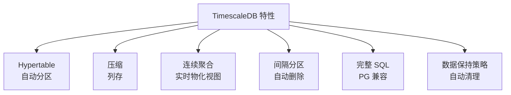

# TimescaleDB 关键特性

## 特性总览



## 压缩配置

```sql
-- 启用压缩
ALTER TABLE sensor_data SET (
    timescaledb.compress,
    timescaledb.compress_segmentby = 'sensor_id'
);

-- 压缩配置项
-- compress_segmentby: 分段列（用于压缩分组）
-- compress_orderby: 排序列（优化范围查询）
-- compress_chunk_time_interval: Chunk 压缩时间间隔

-- 压缩效果
-- 空间节省: 40-90%
-- 查询加速: 范围查询 2-10x
```

## 数据保持策略

```sql
-- 添加数据保持策略
SELECT add_retention_policy('sensor_data', INTERVAL '30 days');

-- 查看策略
SELECT * FROM timescaledb_information.jobs
WHERE proc_name = 'retention';

-- 删除策略
SELECT remove_retention_policy('sensor_data', 'policy_name');
```

## 间隔分区

```sql
-- 重新排序 Chunk
CALL timescaledb_experimental.reorder_chunk(
    'sensor_data',
    chunk => '_timescaledb_internal._hyper_1_1_chunk'
);

-- 手动创建 Chunk
SELECT timescaledb_prewarm.add('sensor_data');
```

## 要点总结

- Hypertable 自动时间分区
- 压缩节省 40-90% 空间
- 连续聚合支持实时聚合
- 完整 PostgreSQL SQL 支持