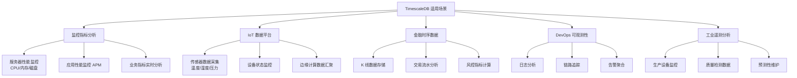
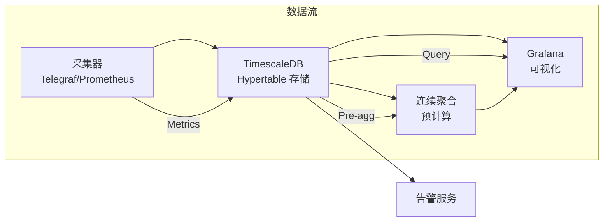
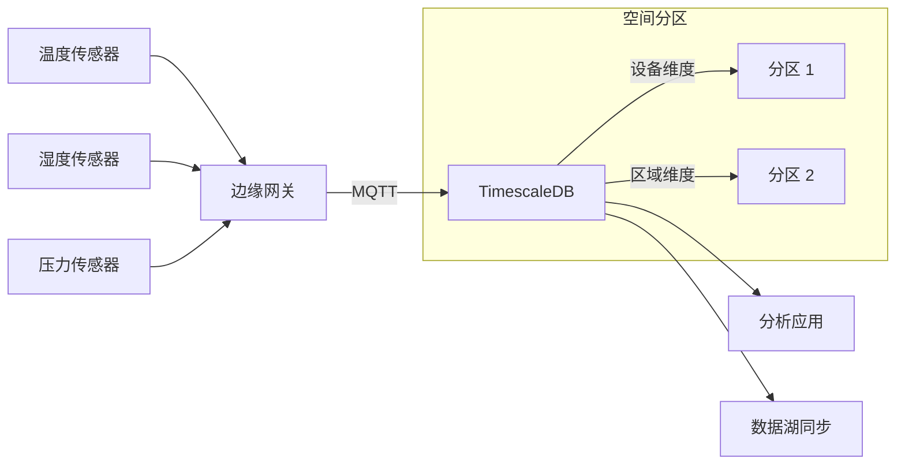
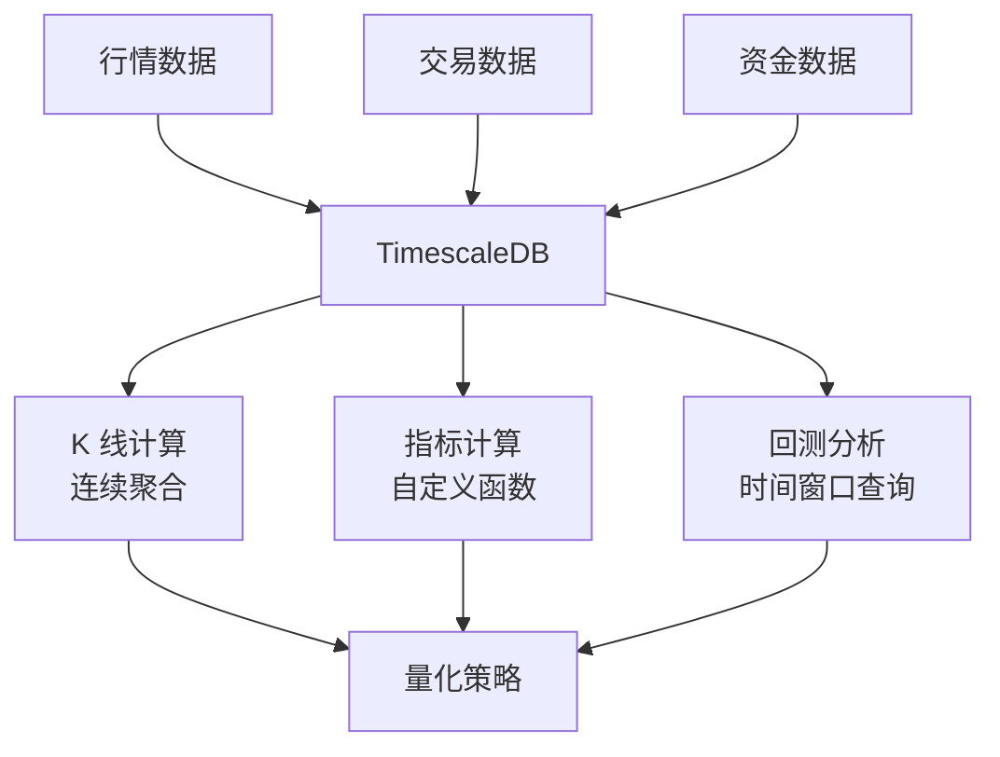
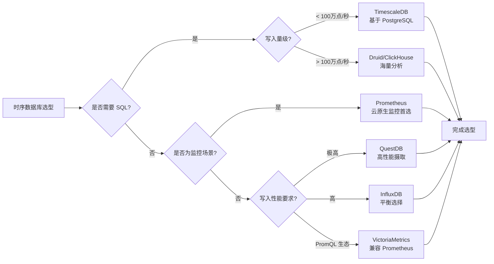
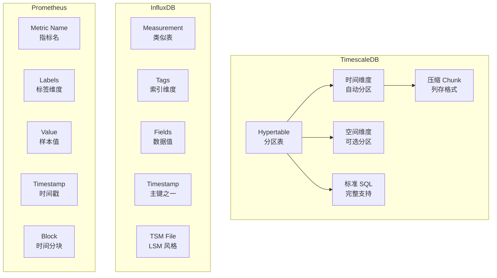
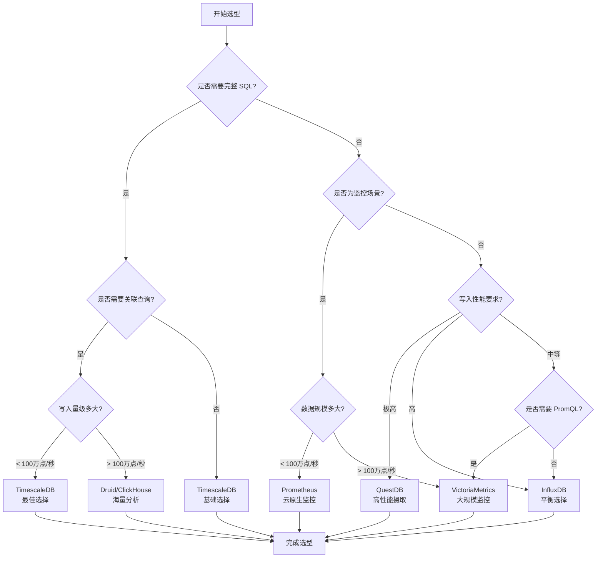

# TimescaleDB 使用场景与选型对比

## 学习目标

- 理解 TimescaleDB 在各场景中的具体应用方式
- 掌握 TimescaleDB 与其他时序数据库的选型决策
- 了解不同场景下的最佳实践

## 适用场景总览



## 场景详解

### 1. 监控指标分析



**典型架构**：Prometheus + TimescaleDB + Grafana

```sql
-- 创建监控指标 Hypertable
CREATE TABLE metrics (
    time        TIMESTAMPTZ NOT NULL,
    metric_name TEXT        NOT NULL,
    hostname    TEXT        NOT NULL,
    value       DOUBLE PRECISION,
    labels      JSONB
);

SELECT create_hypertable('metrics', 'time',
    chunk_time_interval => INTERVAL '1 day'
);

-- 创建连续聚合：每小时平均值
CREATE MATERIALIZED VIEW metrics_hourly
WITH (timescaledb.continuous) AS
SELECT
    time_bucket('1 hour', time) AS hour,
    metric_name,
    hostname,
    AVG(value) AS avg_value,
    MIN(value) AS min_value,
    MAX(value) AS max_value,
    COUNT(*) AS sample_count
FROM metrics
GROUP BY hour, metric_name, hostname;

-- 设置刷新策略
SELECT add_continuous_aggregate_policy('metrics_hourly',
    start_offset => INTERVAL '3 hours',
    end_offset   => INTERVAL '1 hour',
    schedule_interval => INTERVAL '30 minutes'
);
```

**写入特点**：
- 写入频率：每 10-60 秒一次
- 数据量：每主机每秒 10-100 个指标点
- 保留策略：原始数据 30 天，降采样数据 1 年

### 2. IoT 数据平台



**多维度分区设计**：

```sql
-- IoT 设备数据表
CREATE TABLE sensor_data (
    time        TIMESTAMPTZ NOT NULL,
    device_id   TEXT        NOT NULL,
    location    TEXT        NOT NULL,
    metric_type TEXT        NOT NULL,
    value       DOUBLE PRECISION,
    metadata    JSONB
);

-- 时间 + 空间双维度分区
SELECT create_hypertable('sensor_data', 'time',
    chunk_time_interval => INTERVAL '1 day'
);

-- 添加空间维度分区（可选）
SELECT add_dimension('sensor_data', 'location',
    number_partitions => 4
);

-- 创建压缩策略
ALTER TABLE sensor_data SET (
    timescaledb.compress,
    timescaledb.compress_segmentby = 'device_id,location',
    timescaledb.compress_orderby = 'time DESC'
);

SELECT add_compression_policy('sensor_data', INTERVAL '7 days');

-- 创建数据保留策略
SELECT add_retention_policy('sensor_data', INTERVAL '90 days');
```

**高基数应对策略**：

| 问题 | 影响 | TimescaleDB 解决方案 |
|------|------|----------------------|
| 设备数量多（百万级） | 分区管理压力 | 空间分区 + 合理 chunk_time_interval |
| 写入吞吐高 | 写入瓶颈 | 批量写入 + COPY 命令 |
| 查询复杂 | 查询延迟 | 连续聚合 + 倒排索引 |
| 存储成本高 | 磁盘压力 | 列式压缩 + 降采样 |

### 3. 金融时序数据



**K 线数据存储**：

```sql
-- Tick 级别行情数据
CREATE TABLE tick_data (
    time       TIMESTAMPTZ NOT NULL,
    symbol     TEXT        NOT NULL,
    exchange   TEXT        NOT NULL,
    price      NUMERIC(18, 4),
    volume     BIGINT,
    bid_price  NUMERIC(18, 4),
    ask_price  NUMERIC(18, 4)
);

SELECT create_hypertable('tick_data', 'time',
    chunk_time_interval => INTERVAL '1 hour'
);

-- 创建 1 分钟 K 线连续聚合
CREATE MATERIALIZED VIEW kline_1m
WITH (timescaledb.continuous) AS
SELECT
    symbol,
    exchange,
    time_bucket('1 minute', time) AS minute,
    FIRST(price, time) AS open,
    MAX(price) AS high,
    MIN(price) AS low,
    LAST(price, time) AS close,
    SUM(volume) AS volume
FROM tick_data
GROUP BY minute, symbol, exchange;

-- 创建索引加速查询
CREATE INDEX idx_tick_symbol_time ON tick_data (symbol, time DESC);
CREATE INDEX idx_kline_symbol_time ON kline_1m (symbol, minute DESC);

-- 时间窗口查询示例：计算移动平均
SELECT
    minute,
    symbol,
    close,
    AVG(close) OVER (
        PARTITION BY symbol
        ORDER BY minute
        ROWS BETWEEN 19 PRECEDING AND CURRENT ROW
    ) AS ma_20
FROM kline_1m
WHERE symbol = 'AAPL' AND minute > NOW() - INTERVAL '1 day';
```

## 时序数据库对比



### 功能对比表

| 特性 | TimescaleDB | InfluxDB | Prometheus | QuestDB | VictoriaMetrics |
|------|-------------|----------|------------|---------|-----------------|
| **存储引擎** | PostgreSQL 分区 | TSM | TSDB | Java 无锁队列 | Mergerowset |
| **查询语言** | SQL | InfluxQL/Flux | PromQL | SQL | PromQL/MetricsQL |
| **写入吞吐** | 高 | 高 | 中 | 极高 | 极高 |
| **高基数支持** | 好 | 差 | 差 | 好 | 好 |
| **SQL 支持** | 完整 | 部分 | 无 | 完整 | 无 |
| **分布式** | 企业版 | 企业版 | 需联邦 | 单机 | 原生集群 |
| **压缩比** | 40-90% | 3-5x | ~10x | ~10x | ~10x |
| **学习曲线** | 低（SQL） | 中 | 中 | 低 | 低 |
| **适用场景** | 复杂分析 | 监控/IoT | 监控告警 | 高吞吐摄取 | 大规模监控 |

### 存储模型对比



## 选型决策流程



### 典型场景选型建议

| 场景 | 推荐选择 | 理由 |
|------|----------|------|
| 运维监控 + 业务分析 | TimescaleDB | SQL 支持业务关联查询，连续聚合加速预计算 |
| 纯监控告警 | Prometheus/VictoriaMetrics | 云原生生态，PromQL 标准查询语言 |
| IoT 高吞吐写入 | QuestDB | 极高性能摄取，SQL 支持 |
| 金融 K 线分析 | TimescaleDB | 时间窗口查询、移动平均等 SQL 原生支持 |
| 日志 + 时序混合 | TimescaleDB | 关联查询日志表和指标表 |
| 已有 PG 技术栈 | TimescaleDB | 无缝集成，运维成本低 |

## 最佳实践

### 1. Hypertable 设计

```sql
-- 推荐：合理设置 chunk_time_interval
-- 默认按月分区，高频写入场景可改为按天
SELECT create_hypertable('metrics', 'time',
    chunk_time_interval => INTERVAL '1 day'  -- 适应写入频率
);

-- 空间分区：设备 ID 或区域维度
SELECT add_dimension('sensor_data', 'device_id',
    number_partitions => 4  -- 并行查询加速
);

-- 避免：chunk 过小（< 1GB）导致管理开销
-- 避免：chunk 过大（> 100GB）导致压缩效率下降
```

### 2. 压缩策略

```sql
-- 推荐：根据查询模式选择压缩维度
ALTER TABLE sensor_data SET (
    timescaledb.compress,
    timescaledb.compress_segmentby = 'device_id',  -- 按设备分段
    timescaledb.compress_orderby = 'time DESC'      -- 按时间排序
);

-- 压缩时机：数据不再修改后
SELECT add_compression_policy('sensor_data', INTERVAL '7 days');

-- 监控压缩效果
SELECT
    hypertable_name,
    before_compression_total_bytes,
    after_compression_total_bytes,
    ROUND(100.0 * (before_compression_total_bytes - after_compression_total_bytes) 
          / before_compression_total_bytes, 2) AS compression_ratio_pct
FROM timescaledb_information.compression_stats;
```

### 3. 连续聚合优化

```sql
-- 推荐：合理设置刷新窗口
SELECT add_continuous_aggregate_policy('metrics_hourly',
    start_offset => INTERVAL '3 hours',  -- 保留 3 小时原始数据窗口
    end_offset   => INTERVAL '1 hour',   -- 离当前 1 小时结束
    schedule_interval => INTERVAL '30 minutes'
);

-- 查询优化：优先查询连续聚合视图
SELECT * FROM metrics_hourly
WHERE hour > NOW() - INTERVAL '24 hours';

-- 避免：直接查询原始 Hypertable（未命中预聚合）
```

### 4. 保留策略

```sql
-- 多级保留：原始数据短期，降采样数据长期
SELECT add_retention_policy('metrics', INTERVAL '30 days');
SELECT add_retention_policy('metrics_hourly', INTERVAL '365 days');

-- 避免：单级保留导致存储成本过高
```

## 要点总结

- TimescaleDB 最适合需要 SQL 复杂分析的时序场景，与业务数据关联查询优势明显
- Hypertable + Chunk 分区是核心架构，chunk_time_interval 应根据写入频率调整
- 压缩策略需结合查询模式设计 compress_segmentby 和 compress_orderby
- 连续聚合自动预计算，是查询加速的关键机制
- 选型核心：SQL 需求 → TimescaleDB；监控场景 → Prometheus/VM；高吞吐 → QuestDB

## 思考题

1. 某物联网项目有 100 万设备，每设备每分钟上报 10 个指标，TimescaleDB 应如何设计 Hypertable 和分区策略？
2. TimescaleDB 的压缩与 InfluxDB 的 TSM 压缩在原理上有何本质区别？
3. 连续聚合与原始数据查询在什么场景下各有优劣？如何设计混合查询策略？