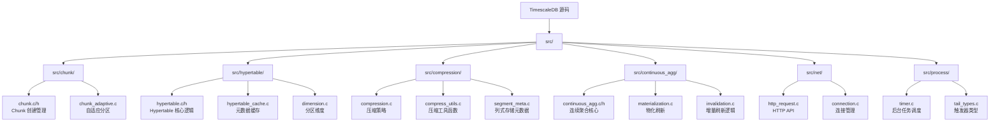
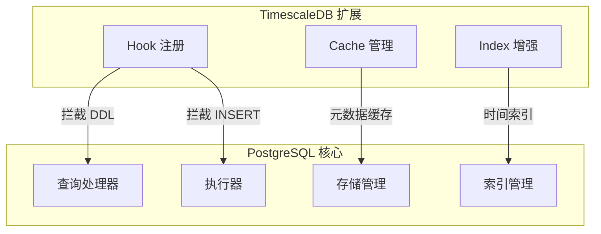
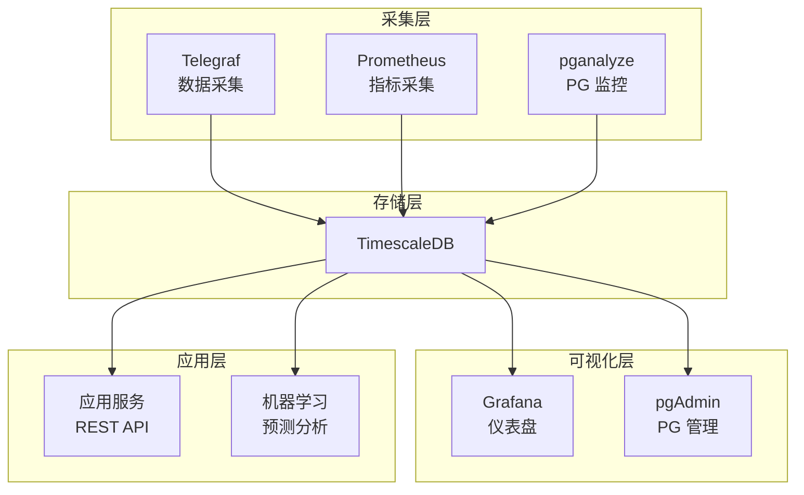
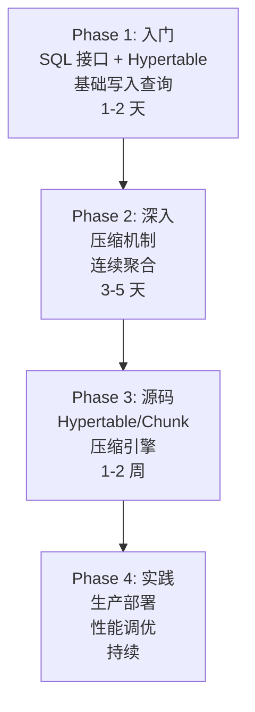

# TimescaleDB 学习资源

## 学习目标

- 获取 TimescaleDB 的优质学习资源
- 建立系统化的源码阅读路径
- 掌握深入理解时序数据库的方法

## 官方资源

### 文档与社区

| 资源 | 链接 | 说明 |
|------|------|------|
| 官方文档 | [https://docs.timescale.com/](https://docs.timescale.com/) | 完整的架构、API、运维文档 |
| GitHub | [https://github.com/timescale/timescaledb](https://github.com/timescale/timescaledb) | 源码，18k+ Stars |
| 官方博客 | [https://www.timescale.com/blog/](https://www.timescale.com/blog/) | 技术博客、最佳实践 |
| 社区论坛 | [https://www.timescale.com/community](https://www.timescale.com/community) | 问答与讨论 |
| Slack | [timescaledb.slack.com](https://timescaledb.slack.com/) | 实时交流 |

### 学习平台

- **TimescaleDB Tutorials**：[https://docs.timescale.com/tutorials/](https://docs.timescale.com/tutorials/) — 官方分步教程
- **PostgreSQL 文档**：[https://www.postgresql.org/docs/current/](https://www.postgresql.org/docs/current/) — TimescaleDB 基础
- **Grafana 集成**：[https://grafana.com/docs/grafana/latest/datasources/timescale/](https://grafana.com/docs/grafana/latest/datasources/timescale/) — 可视化配置

## 源码研读路径

### 源码阅读建议顺序

1. **入口**：`sql/hypertable.sql` → 理解 SQL 接口定义
2. **数据结构**：`src/hypertable/hypertable.c` → 理解 Hypertable 结构
3. **分区机制**：`src/chunk/chunk.c` → 理解 Chunk 创建和路由
4. **压缩引擎**：`src/compression/compress_utils.c` → 理解列式压缩
5. **连续聚合**：`src/continuous_agg/continuous_agg.c` → 理解物化视图增量刷新
6. **后台调度**：`src/process/timer.c` → 理解策略执行机制

### 核心代码文件速查

| 文件 | 功能 | 关键行数 |
|------|------|---------|
| `src/hypertable/hypertable.c` | Hypertable 创建、元数据管理 | ~800 |
| `src/chunk/chunk.c` | Chunk 创建、路由、DDL 映射 | ~1200 |
| `src/chunk/chunk_adaptive.c` | 自适应 chunk 大小调整 | ~600 |
| `src/compression/compress_utils.c` | 压缩块构建、解压 | ~1000 |
| `src/compression/segment_meta.c` | 列存元数据管理 | ~500 |
| `src/continuous_agg/continuous_agg.c` | 连续聚合定义、刷新 | ~1500 |
| `src/continuous_agg/materialization.c` | 物化执行、增量刷新 | ~800 |
| `src/process/timer.c` | 后台任务调度 | ~400 |
| `src/net/http_request.c` | HTTP API 处理 | ~600 |
| `src/compat/compat*.c` | PostgreSQL 版本兼容 | 分散 |

### PostgreSQL 集成点

**Hook 机制**：

- `ProcessUtility_hook`：拦截 CREATE TABLE 等 DDL，自动转换为 Hypertable
- `ExecutorStart_hook`：拦截 INSERT/UPDATE/DELETE，路由到正确的 Chunk
- `planner_hook`：优化查询计划，下推时间范围过滤

## 推荐书籍与论文

### 书籍

| 书名 | 作者 | 说明 |
|------|------|------|
| 《PostgreSQL 指南：内幕探索》 | Hironobu Suzuki | PG 内核机制，理解 TimescaleDB 基础 |
| 《Database Internals》 | Alex Petrov | 存储引擎设计，分区、压缩原理 |
| 《Designing Data-Intensive Applications》 | Martin Kleppmann | 分布式数据系统基础 |
| 《Time Series Databases: New Ways to Store and Access Data》 | Ted Dunning | 时序数据库入门 |

### 关键论文

| 论文 | 作者 | 与 TimescaleDB 的关系 |
|------|------|----------------------|
| [Column-Stores vs. Row-Stores](https://dl.acm.org/doi/10.1145/1376616.1376712) | Abadi et al., 2008 | 列式压缩的理论基础 |
| [The Design and Implementation of Modern Column-Oriented Database Systems](https://stratos.seas.harvard.edu/files/stratos/files/columnstores-tutorial.pdf) | Abadi et al. | 列存数据库设计，TimescaleDB 压缩参考 |
| [Monarch: Google's Planet-Scale In-Memory Time Series Database](https://www.vldb.org/pvldb/vol13/p3181-adams.pdf) | Adams et al., 2020 | Google 时序数据库，分布式方案参考 |
| [Gorilla: A Fast, Scalable, In-Memory Time Series Database](https://www.vldb.org/pvldb/vol8/p1816-teller.pdf) | Facebook, 2015 | Facebook 时序数据库，压缩算法参考 |

### TimescaleDB 论文与技术报告

- **TimescaleDB 官方论文**：暂无正式学术论文，主要文档在 [官方博客](https://www.timescale.com/blog/)
- **架构设计博客**：[TimescaleDB Architecture](https://www.timescale.com/blog/timescaledb-architecture-overview/)
- **压缩技术博客**：[Columnar Compression](https://www.timescale.com/blog/timescaledb-compression/)

## 社区资源

### 开源工具生态

### 社区项目

- **TimescaleDB Helm Charts**：[https://github.com/timescale/helm-charts](https://github.com/timescale/helm-charts) — Kubernetes 部署
- **TimescaleDB Tuning**：[https://github.com/timescale/timescaledb-tune](https://github.com/timescale/timescaledb-tune) — 自动调参工具
- **TimescaleDB Promscale**：[https://github.com/timescale/promscale](https://github.com/timescale/promscale) — Prometheus 长期存储
- **TimescaleDB CLI**：[https://github.com/timescale/timescaledb-tune](https://github.com/timescale/timescaledb-tune) — 命令行管理工具

### 客户端驱动

| 语言 | 驱动 | 说明 |
|------|------|------|
| Python | `psycopg2` | PostgreSQL 官方 Python 驱动 |
| Go | `pgx` | 高性能 Go 驱动 |
| Java | `JDBC` | PostgreSQL JDBC 驱动 |
| Node.js | `pg` | Node.js PostgreSQL 客户端 |
| C | `libpq` | PostgreSQL C 库 |

## 学习路径

### Phase 1 入门 Checklist

- [ ] 阅读官方文档 "Getting Started"
- [ ] 理解 Hypertable 和 Chunk 的概念
- [ ] 使用 Docker 本地部署 TimescaleDB
- [ ] 创建第一个 Hypertable 并插入数据
- [ ] 掌握 time_bucket 函数的用法

### Phase 2 深入 Checklist

- [ ] 理解列式压缩的原理和配置
- [ ] 掌握连续聚合的创建和刷新策略
- [ ] 理解数据保留策略的配置
- [ ] 实验：对比压缩前后的存储空间
- [ ] 分析不同 chunk_time_interval 对性能的影响

### Phase 3 源码 Checklist

- [ ] 阅读 `hypertable.c`，理解元数据管理
- [ ] 阅读 `chunk.c`，理解分区路由逻辑
- [ ] 阅读 `compress_utils.c`，理解列式压缩实现
- [ ] 阅读 `continuous_agg.c`，理解增量刷新机制
- [ ] 阅读 `timer.c`，理解后台任务调度

## 要点总结

- 官方文档是首要学习资源，GitHub 源码是深入理解的关键
- 源码阅读应遵循 Hypertable → Chunk → 压缩 → 连续聚合 的顺序
- PostgreSQL 内核知识是理解 TimescaleDB 的前提
- 列式压缩论文是理解 TimescaleDB 压缩机制的理论基础
- TimescaleDB 与 Prometheus/Grafana 生态集成是生产实践重点

## 思考题

1. TimescaleDB 作为 PostgreSQL 扩展，相比独立时序数据库有哪些优势和劣势？
2. Hypertable 的分区路由在源码中是如何实现的？与 PostgreSQL 原生分区有何区别？
3. TimescaleDB 的列式压缩与 ClickHouse 的列存引擎在实现上有哪些异同？