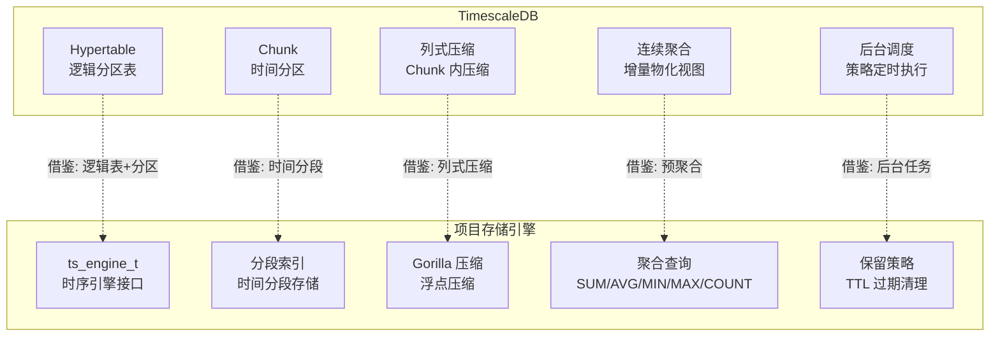
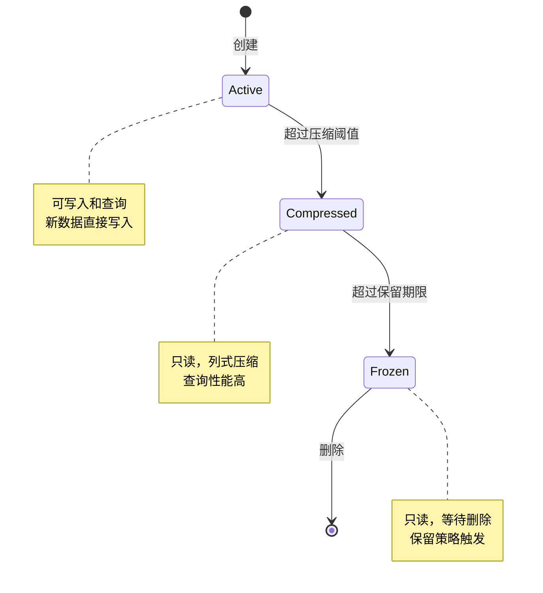
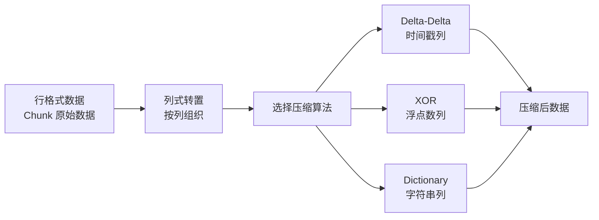
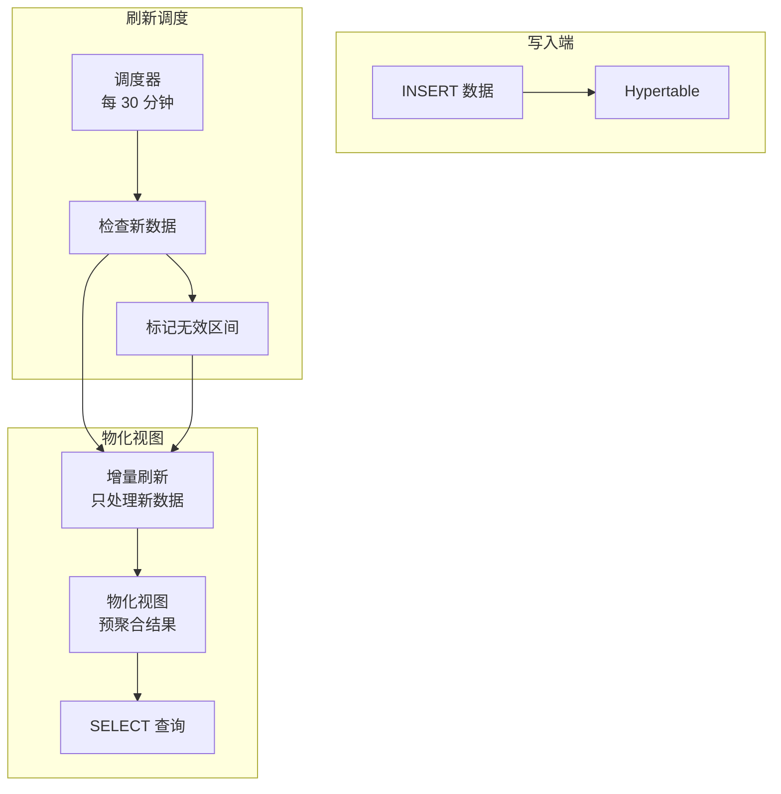
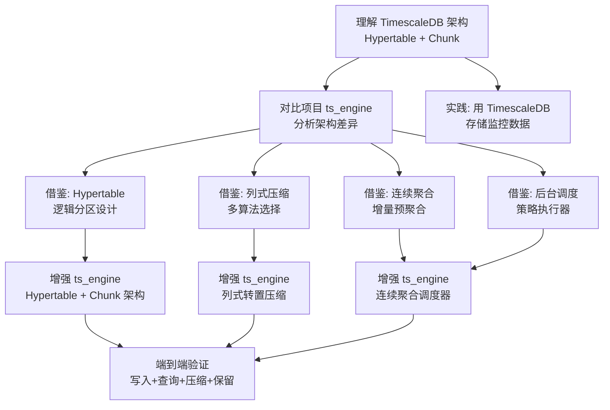

# TimescaleDB 与项目关联

## 学习目标

- 分析 TimescaleDB 设计对项目存储引擎的启发性
- 找出项目中可借鉴的时序存储技术
- 建立 TimescaleDB 与项目各模块的关联

## 架构对比



### 架构层级对比

| 维度 | TimescaleDB | 项目 |
|------|-------------|------|
| **存储引擎** | PostgreSQL 扩展，Hypertable 分区 | `ts_engine_t` + `storage_ops_t` 接口 |
| **分区机制** | Hypertable → Chunk（独立 PG 表） | 分段索引（时间范围分段） |
| **压缩** | 列式压缩（行→列转置 + 压缩算法） | Gorilla 压缩（浮点 XOR 压缩） |
| **预聚合** | 连续聚合（增量物化视图） | 聚合查询（实时计算） |
| **查询语言** | 完整 SQL | 扫描 API + 聚合函数 |
| **索引** | PG 原生索引（BTree/GIN/Brin） | BTree / Hash 索引 |
| **数据保留** | 保留策略（自动删除 Chunk） | TTL 过期清理 |
| **后台任务** | 调度器（timer.c） | 暂无独立调度器 |

## 可借鉴的设计

### 1. Hypertable 逻辑分区架构

TimescaleDB 的核心设计是 Hypertable，它是一个逻辑表，物理上由多个 Chunk（独立的 PostgreSQL 表）组成。Chunk 按时间自动创建，对用户完全透明。

**TimescaleDB 的做法**：

```sql
-- 创建 Hypertable，数据自动路由到对应 Chunk
CREATE TABLE metrics (time TIMESTAMPTZ, value DOUBLE PRECISION);
SELECT create_hypertable('metrics', 'time', chunk_time_interval => INTERVAL '1 day');

-- 插入数据（自动路由到正确 Chunk）
INSERT INTO metrics VALUES (NOW(), 42.5);

-- 查询（自动跨 Chunk 扫描）
SELECT * FROM metrics WHERE time > NOW() - INTERVAL '1 hour';
```

**项目可借鉴**：

```c
// 当前项目：ts_engine 使用分段索引，数据按时间范围连续存储
// 单段文件存储，缺乏多级分区

// 借鉴 TimescaleDB：Hypertable + Chunk 架构
// 思路：引入逻辑表 + 物理分区

typedef struct ts_hypertable_s {
    char    name[256];              // 表名
    int64_t chunk_interval_ms;      // 每个 Chunk 的时间跨度
    int32_t num_dimensions;         // 维度数量（时间+空间）
    
    // Chunk 列表
    ts_chunk_t **chunks;            // 物理 Chunk 数组
    int32_t     num_chunks;
    int32_t     chunk_capacity;
    
    // 元数据
    int64_t first_chunk_start;      // 首个 Chunk 起始时间
    int64_t last_chunk_end;         // 末个 Chunk 结束时间
} ts_hypertable_t;

typedef struct ts_chunk_s {
    int64_t  chunk_id;              // Chunk ID
    int64_t  range_start;           // 时间范围起始（含）
    int64_t  range_end;             // 时间范围结束（不含）
    
    char     file_path[512];        // 数据文件路径
    uint64_t num_points;            // 数据点数量
    uint64_t data_size;             // 数据大小
    
    // 压缩信息
    bool     is_compressed;
    uint64_t compressed_size;
    
    // 状态
    ts_chunk_status_t status;       // Active/Compressed/Frozen/Deleted
} ts_chunk_t;

// 插入路由：根据时间戳定位 Chunk，不存在则自动创建
int ts_hypertable_insert(ts_hypertable_t *ht, int64_t timestamp, double value) {
    // 1. 计算时间所属的 Chunk 偏移
    int64_t chunk_start = ts_align_timestamp(timestamp, ht->chunk_interval_ms);
    int32_t chunk_idx = (chunk_start - ht->first_chunk_start) / ht->chunk_interval_ms;
    
    // 2. 如果 Chunk 不存在，自动创建
    if (chunk_idx >= ht->num_chunks) {
        ts_chunk_create(ht, chunk_start);
    }
    
    // 3. 路由到对应 Chunk 写入
    return ts_chunk_insert(ht->chunks[chunk_idx], timestamp, value);
}
```

**Chunk 状态机**：



### 2. 列式压缩机制

TimescaleDB 的核心压缩机制是将 Chunk 内的行数据转置为列式存储，然后对每列选择合适的压缩算法。

**TimescaleDB 的压缩流程**：



**TimescaleDB 的压缩算法选择**：

| 列类型 | 压缩算法 | 压缩比 | 特点 |
|--------|---------|--------|------|
| TIMESTAMP | Delta-Delta | ~10x | 时间戳增量编码 |
| FLOAT | XOR | ~5-8x | 浮点 XOR 压缩（Gorilla 风格） |
| INTEGER | Delta-Delta | ~10x | 整数增量编码 |
| TEXT | 字典压缩 | 视重复率 | 重复值压缩 |
| 布尔 | 位图压缩 | 32x | 位图编码 |

**项目可借鉴**：

```c
// 当前项目：ts_engine 使用 Gorilla 压缩
// 借鉴 TimescaleDB：列式转置 + 多算法选择

// 1. 列式转置块结构
typedef struct ts_column_block_s {
    ts_column_type_t type;           // 列类型（TIMESTAMP/FLOAT/INTEGER/TEXT）
    uint32_t num_rows;               // 行数
    uint32_t compressed_size;        // 压缩后大小
    uint32_t uncompressed_size;      // 解压后大小
    
    // 压缩参数
    ts_compression_algo_t algo;      // 使用的压缩算法
    void *compressed_data;           // 压缩后的数据
} ts_column_block_t;

// 2. 压缩策略选择
ts_compression_algo_t ts_select_compression(ts_column_type_t type) {
    switch (type) {
        case COLUMN_TIMESTAMP:
            return COMPRESS_DELTA_DELTA;  // 时间戳：增量编码
        case COLUMN_FLOAT:
            return COMPRESS_XOR;          // 浮点数：XOR 压缩
        case COLUMN_INTEGER:
            return COMPRESS_DELTA_DELTA;  // 整数：增量编码
        case COLUMN_TEXT:
            return COMPRESS_DICTIONARY;   // 字符串：字典压缩
        default:
            return COMPRESS_NONE;
    }
}

// 3. 压缩执行流程
int ts_compression_run(ts_chunk_t *chunk, ts_compression_config_t *config) {
    // 1. 读取 Chunk 的原始行数据
    ts_row_data_t *rows = ts_chunk_read_rows(chunk);
    
    // 2. 按列组织数据
    ts_column_block_t *blocks = ts_transpose_rows_to_columns(rows);
    
    // 3. 对每列选择合适的压缩算法
    for (int i = 0; i < blocks->num_columns; i++) {
        ts_compression_algo_t algo = ts_select_compression(blocks[i].type);
        blocks[i].algo = algo;
        blocks[i].compressed_data = ts_compress_column(&blocks[i], algo);
    }
    
    // 4. 写入压缩文件
    return ts_chunk_write_compressed(chunk, blocks);
}
```

### 3. 连续聚合增量刷新

TimescaleDB 的连续聚合（Continuous Aggregates）是自动维护的物化视图，通过增量刷新机制，只处理新写入的数据，避免全量重算。

**连续聚合流程**：



**SQL 示例**：

```sql
-- 创建连续聚合
CREATE MATERIALIZED VIEW hourly_avg
WITH (timescaledb.continuous) AS
SELECT
    time_bucket('1 hour', time) AS bucket,
    sensor_id,
    AVG(value) AS avg_value
FROM sensor_data
GROUP BY bucket, sensor_id;

-- 增量刷新策略
SELECT add_continuous_aggregate_policy('hourly_avg',
    start_offset => INTERVAL '3 hours',
    end_offset   => INTERVAL '1 hour',
    schedule_interval => INTERVAL '30 minutes'
);

-- 查询自动使用预聚合数据
SELECT bucket, sensor_id, avg_value
FROM hourly_avg
WHERE sensor_id = 1 AND bucket > NOW() - INTERVAL '24 hours';
```

**项目可借鉴**：

```c
// 当前项目：聚合查询实时扫描数据，无预聚合层
// 借鉴 TimescaleDB：预聚合表 + 增量刷新

// 连续聚合配置
typedef struct ts_continuous_agg_s {
    char name[64];                    // 聚合名称
    char source_metric[64];           // 源指标
    char target_metric[64];           // 目标指标（预聚合表）
    
    ts_granularity_t granularity;     // 聚合粒度
    ts_aggregate_func_t func;         // 聚合函数
    
    // 刷新策略
    int64_t schedule_interval_ms;     // 调度间隔
    int64_t start_offset_ms;          // 刷新起始偏移
    int64_t end_offset_ms;            // 刷新结束偏移
    
    // 状态
    int64_t last_refresh_time;        // 上次刷新时间
    int64_t last_processed_time;      // 最后处理的时间戳
    bool active;                      // 是否启用
} ts_continuous_agg_t;

// 增量刷新函数
int ts_continuous_agg_refresh(ts_continuous_agg_t *agg) {
    int64_t now = ts_current_time_ms();
    int64_t start_time = agg->last_processed_time;
    int64_t end_time = now - agg->end_offset_ms;
    
    // 只处理新数据区间
    if (end_time <= start_time) {
        return 0;  // 无新数据
    }
    
    // 查询源数据（增量区间）
    ts_query_results_t results;
    ts_engine_query(agg->source_metric, 
                    start_time, end_time,
                    agg->granularity, agg->func,
                    &results);
    
    // 写入预聚合表
    for (int i = 0; i < results.count; i++) {
        ts_engine_insert(agg->target_metric, &results.results[i], sizeof(results.results[i]));
    }
    
    // 更新最后处理时间
    agg->last_processed_time = end_time;
    agg->last_refresh_time = now;
    
    ts_engine_free_results(&results);
    return 0;
}
```

### 4. 后台任务调度器

TimescaleDB 通过后台调度器执行策略，包括压缩、保留、连续聚合刷新等。

**目前项目时序引擎缺乏统一的后台任务调度机制**，所有操作都是同步执行的。

**项目可借鉴**：

```c
// 借鉴 TimescaleDB 的后台任务调度器
typedef struct ts_scheduler_s {
    // 任务列表
    ts_scheduled_task_t **tasks;
    int32_t num_tasks;
    int32_t task_capacity;
    
    // 调度器状态
    bool running;
    int64_t tick_interval_ms;  // 心跳间隔
    
    // 线程池
    int32_t num_workers;
    void   *worker_threads;
} ts_scheduler_t;

typedef struct ts_scheduled_task_s {
    char name[64];
    ts_task_type_t type;  // COMPRESSION / RETENTION / CONTINUOUS_AGG
    
    // 调度参数
    int64_t schedule_interval_ms;  // 执行间隔
    int64_t last_execution_time;   // 最后执行时间
    
    // 任务函数
    int (*execute)(void *arg);
    void *arg;
} ts_scheduled_task_t;

// 注册任务
int ts_scheduler_register(ts_scheduler_t *sched, ts_scheduled_task_t *task) {
    // 添加到任务队列
    // 调度器按心跳周期检查任务是否到期执行
}

// 调度器主循环
void ts_scheduler_run(ts_scheduler_t *sched) {
    while (sched->running) {
        int64_t now = ts_current_time_ms();
        
        for (int i = 0; i < sched->num_tasks; i++) {
            ts_scheduled_task_t *task = sched->tasks[i];
            int64_t elapsed = now - task->last_execution_time;
            
            if (elapsed >= task->schedule_interval_ms) {
                // 提交到线程池执行
                ts_thread_pool_submit(sched->worker_threads, 
                                      task->execute, task->arg);
            }
        }
        
        // 等待下一个心跳
        ts_sleep_ms(sched->tick_interval_ms);
    }
}
```

## 与项目各模块的关联

### 1. 与 `index/` 模块的关联

| 项目索引 | TimescaleDB 对应 | 可借鉴点 |
|---------|-----------------|----------|
| BTree（`btree.h`） | PostgreSQL BTree 索引 | 时间戳作为主键的 BTree 索引，time DESC 查询优化 |
| BRIN（`brin.h`） | PostgreSQL BRIN 索引 | 时间序列表的 BRIN 索引，空间效率高 |
| Radix Tree（`radix_tree.h`） | 无直接对应 | 可借鉴实现 Tag 倒排索引 |
| Bitmap（`bitmap_index.h`） | PostgreSQL Bitmap Scan | 时间范围过滤的位图索引 |

**BRIN 索引**：BRIN（Block Range Index）对时序数据特别有效，因为它按物理存储位置记录数据块的范围，由于时序数据通常是按时间顺序写入的，BRIN 索引可以高效地过滤掉不相关的时间段。

```sql
-- TimescaleDB 中推荐使用 BRIN 索引
CREATE INDEX idx_metrics_time_brin ON metrics USING brin(time);
```

项目中已有 `brin.h` 索引实现，可以借鉴此思路进行时间范围过滤优化。

### 2. 与 `storage/` 模块的关联

| 项目存储 | TimescaleDB 对应 | 可借鉴点 |
|---------|-----------------|----------|
| Buffer Pool（`buf.h`） | PostgreSQL Shared Buffers | 多 Chunk 并发访问的缓存管理 |
| WAL（`wal.h`） | PostgreSQL WAL | 每个 Chunk 独立 WAL 记录 |
| 页面管理（`page.h`） | PostgreSQL 页面 | Chunk 内页面管理 |
| 分段索引 | 无直接对应 | 项目独有的时间分段存储 |

### 3. 与 `algo/` 模块的关联

| 项目算法 | 适用场景 | 说明 |
|---------|---------|------|
| `distance/` | 时序相似度计算 | DTW（动态时间规整）用于时序模式匹配 |
| `sort/` | 时间排序 | 时间戳排序加速 Chunk 内数据组织 |
| `Kmeans/` | 时序聚类 | 对时序数据进行模式聚类 |
| `quantization/` | 数据压缩 | 项目的 PQ 量化可参考 TimescaleDB 的列式压缩 |

### 4. 与 `ts_engine` 的对比

**项目现有时序引擎**（`ts_engine.h`）：
- 支持 5 种聚合函数（SUM/AVG/MIN/MAX/COUNT）
- 4 种时间粒度（秒/分/时/天）
- 时间戳对齐工具（`ts_align_timestamp`）
- 基于 `storage_ops_t` 接口
- 分段索引 + Gorilla 压缩

**可增强的方向**：

```c
// 1. 增加 Hypertable 级别的逻辑管理
// 当前：ts_engine 直接操作单个指标
// 借鉴：Hypertable 管理多个 Chunk
typedef struct ts_hypertable_manager_s {
    ts_hypertable_t **hypertables;   // 管理的 Hypertable 列表
    int32_t num_hypertables;
    ts_scheduler_t *scheduler;       // 后台调度器
} ts_hypertable_manager_t;

// 2. 增加 Chunk 状态管理
// 当前：ts_engine 无状态机
// 借鉴：Active → Compressed → Frozen 状态转换
typedef enum ts_chunk_status_e {
    CHUNK_ACTIVE,       // 可写入和查询
    CHUNK_COMPRESSED,   // 只读，已压缩
    CHUNK_FROZEN,       // 等待删除
    CHUNK_DELETED       // 已删除
} ts_chunk_status_t;

// 3. 增加列式压缩支持
// 当前：Gorilla 压缩（浮点 XOR 压缩）
// 增强：Delta-Delta + Dictionary + 列式转置
int ts_engine_enable_columnar_compression(void *rel, ts_compression_config_t *config);
```

## 学习与实践路径



### 推荐实践步骤

1. **部署 TimescaleDB**：使用 Docker 部署，熟悉 Hypertable 和 Chunk 的概念
2. **导入时序数据**：使用 `COPY` 命令批量导入，观察 Chunk 自动创建过程
3. **分析压缩效果**：对比压缩前后的存储空间，理解列式压缩能力
4. **配置连续聚合**：创建物化视图，观察增量刷新机制
5. **对比实验**：对同一数据集，用 TimescaleDB 和项目 ts_engine 分别查询，对比性能和功能
6. **代码迁移**：选择 1-2 个 TimescaleDB 设计（如 Hypertable 分区、连续聚合），在项目中实现

## 预期收获

- 理解逻辑分区 Hypertable 的设计思想，改进项目时序引擎的分区机制
- 掌握列式压缩的多算法选择策略，提升项目压缩效率
- 学会连续聚合的增量刷新机制，减少项目查询延迟
- 理解后台任务调度器的设计，为项目添加自动化能力
- 借鉴 BRIN 索引优化，提升项目时间范围查询性能

## 要点总结

- TimescaleDB 的 Hypertable 逻辑分区架构对项目 ts_engine 的分段索引有直接改进参考价值
- 列式压缩（行→列转置 + 多算法选择）比项目的单一 Gorilla 压缩更全面
- 连续聚合增量刷新是项目当前缺失的能力，可大幅提升高频查询性能
- 后台任务调度器（压缩、保留、聚合）是项目时序引擎需要补充的基础设施
- 项目的 BRIN 索引、Radix Tree 等模块与 TimescaleDB 的索引体系有对应关系
- 重点借鉴：Hypertable 分区、列式压缩、连续聚合、后台调度

## 思考题

1. 项目现有的 `ts_engine` 分段索引与 TimescaleDB 的 Chunk 分区有何本质区别？各自的优缺点是什么？
2. 如果要在项目中实现类似 TimescaleDB 的列式压缩，需要修改哪些模块？工程量如何评估？
3. 连续聚合的增量刷新需要解决哪些一致性挑战？如何保证预聚合数据与原始数据一致性？
4. 项目的 `brin.h` 索引能否直接用于时序数据的时间范围查询加速？需要做哪些适配？