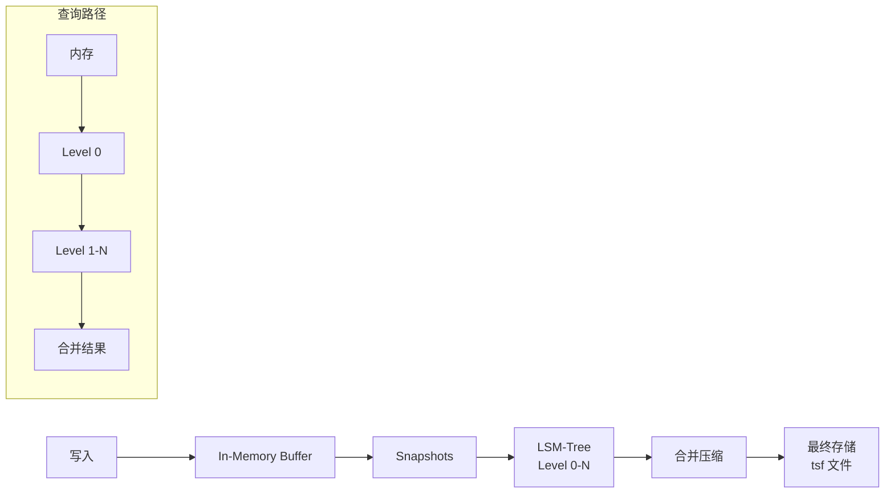

# VictoriaMetrics 项目概览

## 学习目标

- 了解 VictoriaMetrics 作为高性能时序数据库的定位
- 掌握 VictoriaMetrics 的 LSM-Tree 存储和 MetricsQL 查询

## 项目定位

> VictoriaMetrics 是一个高性能、低成本的时序数据库，兼容 Prometheus 和 InfluxDB 协议，专为监控场景设计。

**基本信息**：
- 开发方：VictoriaMetrics Ltd.
- 首次发布：2019 年
- 开源协议：Apache 2.0
- GitHub Stars：约 20k

## 核心设计

```mermaid
graph TB
    A[VictoriaMetrics] --> B[LSM-Tree 存储<br/>类 BigTable]
    A --> C[Prometheus 兼容<br/>远程存储]
    A --> D[MetricsQL<br/>PromQL 超集]
    A --> E[高压缩率<br/>10x 数据减少]
    A --> F[资源高效<br/>单节点百万指标]

    B --> B1[写入优化]
    B --> B2[自动压缩]
    C --> C1[remote_write API]
    C --> C2[PromQL 原生]
    D --> D1[更多函数]
    D --> D2[范围查询]
    E --> E1[时序压缩]
    E --> E2[每日压缩
```

## 存储架构



## 要点总结

- LSM-Tree 存储，高写入吞吐
- Prometheus 100% 兼容
- MetricsQL 是 PromQL 超集
- 高压缩率，降低存储成本

## 思考题

1. VictoriaMetrics 的 LSM-Tree 与 InfluxDB 的 TSM 有何不同？
2. VictoriaMetrics 的高压缩率是如何实现的？
3. remote_write API 的工作原理是什么？