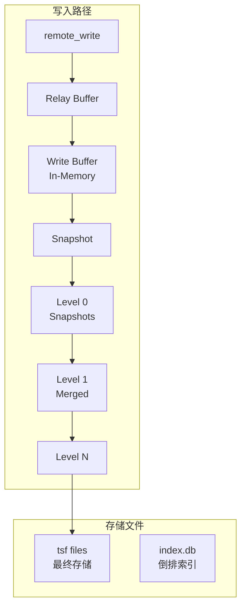
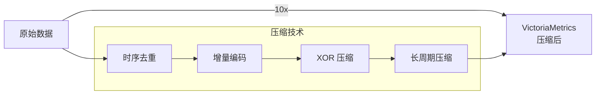
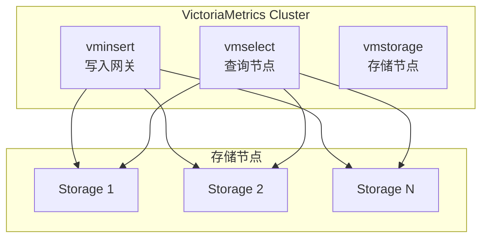

# VictoriaMetrics 架构设计

## 学习目标

- 理解 VictoriaMetrics 的 LSM-Tree 存储
- 掌握 VictoriaMetrics 的高压缩机制

## 存储架构



## 高压缩机制



## 数据结构

```go
// VictoriaMetrics 存储格式
// 1. ts f files: 时序数据文件
//    - 包含时间戳和值
//    - XOR 压缩

// 2. index.db: 倒排索引
//    - series → metric name
//    - label → series
//    - 用于快速查询过滤

// 写入流程
// 1. 写入 Write Buffer（内存）
// 2. 定期刷盘为 Snapshot
// 3. 后台压缩合并
```

## 集群架构



## 要点总结

- LSM-Tree 存储，高写入吞吐
- XOR 压缩实现 10x 数据减少
- 倒排索引加速标签查询
- 集群支持数据分片和复制