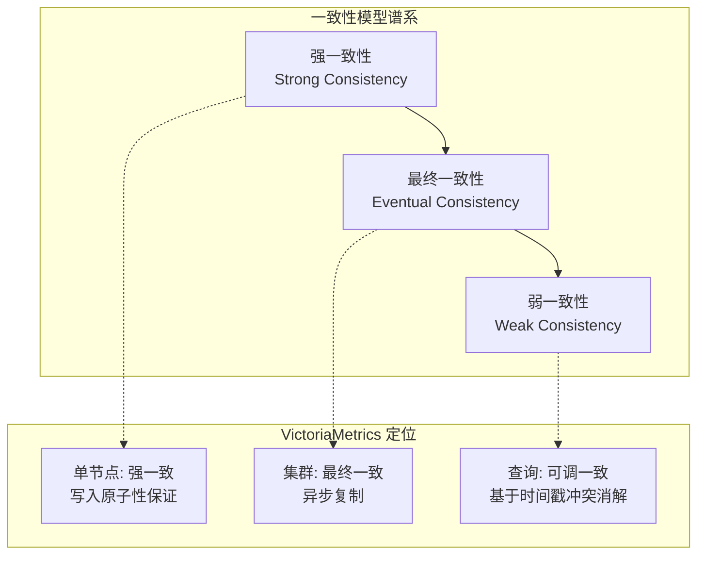
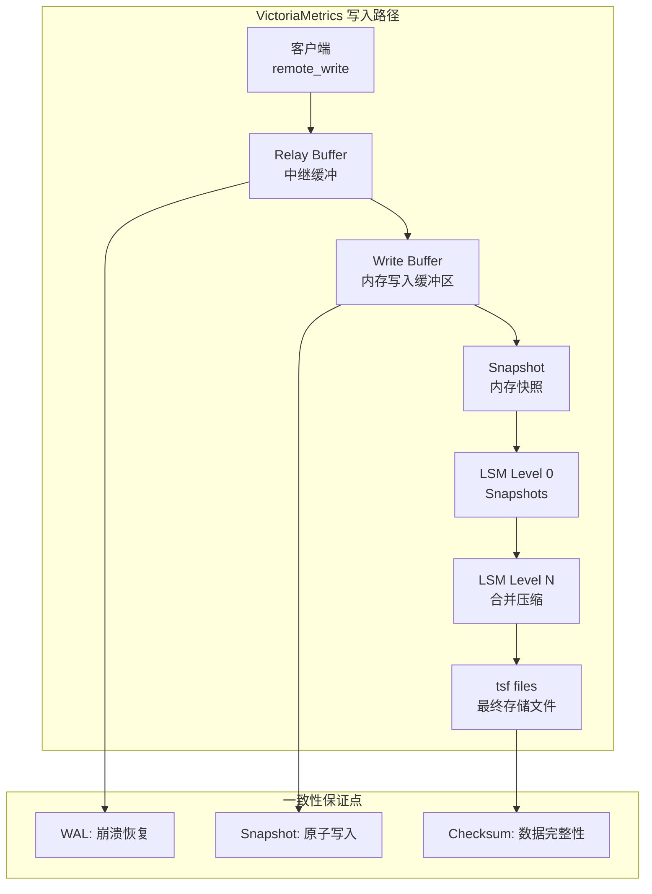
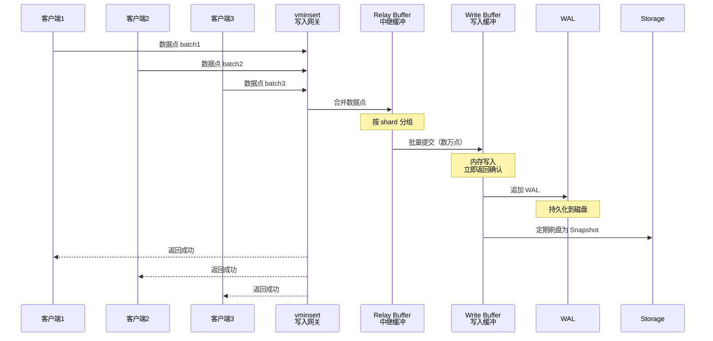
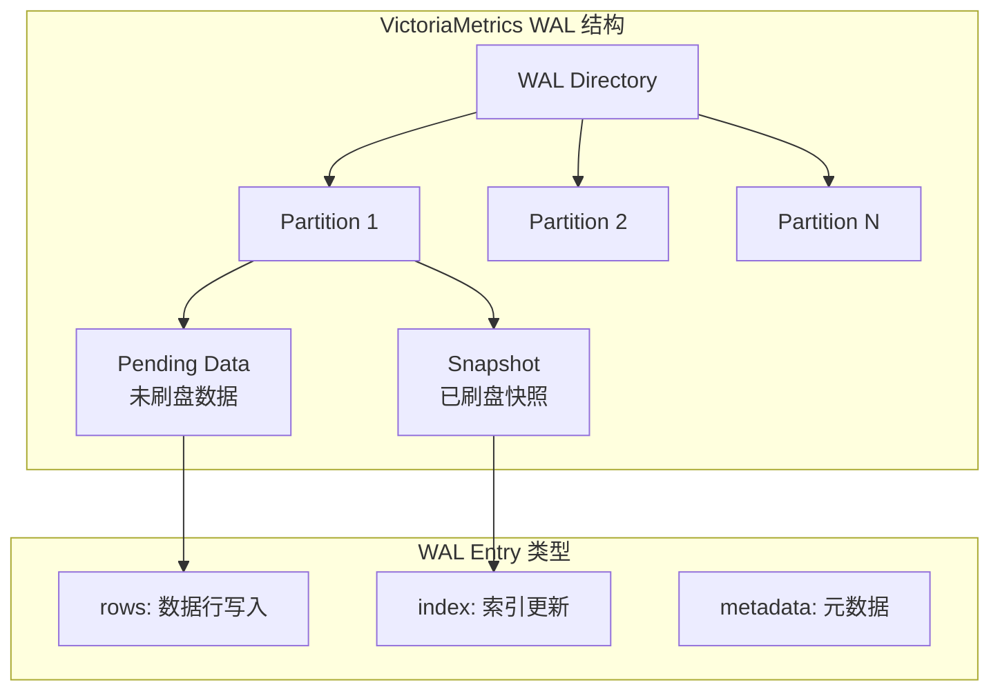
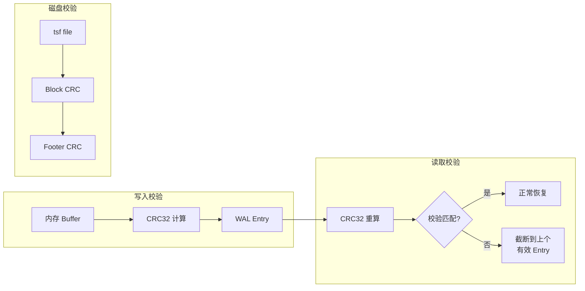
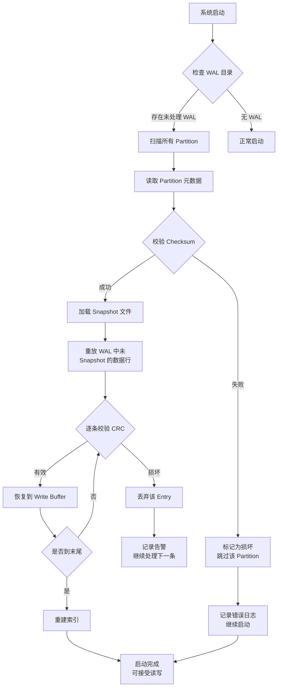

# VictoriaMetrics 事务与一致性模型

## 学习目标

- 理解 VictoriaMetrics 的一致性模型设计（弱一致性优先）
- 掌握 VictoriaMetrics 的写入路径与批量提交机制
- 了解 VictoriaMetrics 的数据完整性保证（WAL、checksum）
- 关联项目 `wal.c`/`wal_buf.c` 模块的设计异同

## 时序数据库的一致性模型

时序数据库与关系数据库在一致性需求上有本质差异：监控指标天然容忍小概率数据丢失，但对写入吞吐和可用性要求极高。

### 一致性模型分类



### 三种一致性模型对比

| 特性 | 弱一致性 | 最终一致性 | 强一致性 |
|------|----------|------------|----------|
| **读取可见性** | 写入后可能不可见 | 延迟可见 | 立即可见 |
| **写入延迟** | 最低 | 中等 | 较高 |
| **写入可用性** | 最高（容忍部分节点故障） | 高 | 较低（需多数节点确认） |
| **数据完整性** | 最低（可能丢失） | 中等 | 最高 |
| **适用场景** | 监控告警、日志采集 | 离线分析、趋势报表 | 金融交易、配置中心 |
| **VictoriaMetrics** | 不推荐 | 集群模式默认行为 | 单节点保证 |

### VictoriaMetrics 的一致性权衡

**时序场景的核心矛盾**：
1. **写入密集**：监控场景百万级时间序列同时写入，每秒数亿数据点
2. **时间有序**：数据天然按时间戳排序，冲突检测简单
3. **容错优先**：监控系统容忍少量数据丢失换取写入吞吐
4. **可用性 > 一致性**：宁可接受过期数据，不可拒绝写入

**VictoriaMetrics 的设计选择**：

```
写入优先级：吞吐 > 可用性 > 一致性

理由：
- 监控场景 1% 数据丢失不影响趋势判断
- 时间序列天然有序，多副本间无写写冲突
- 批量提交 + 无锁写入最大化写入吞吐
- 采用异步复制，写入返回即可认为成功
```

## 写入一致性

### 写入路径与一致性保证



### Quorum 写入机制

VictoriaMetrics 集群模式（vminsert → vmstorage）的写入一致性模型：

```
写入流程：
1. vminsert 收到 remote_write 请求
2. 根据 metric -> shard 映射，计算目标 vmstorage 节点
3. 向目标 vmstorage 发送写入请求
4. vmstorage 写入 WAL 并确认
5. vminsert 返回客户端成功

一致性级别：
- 默认：写入即确认（类似于 InfluxDB 的 "any" 级别）
- 无内置 quorum 机制（依赖底层存储）
- 副本间异步复制，最终一致
```

**VictoriaMetrics 的写入设计决策**：

```go
// VictoriaMetrics 集群写入伪代码
func WriteData(ctx context.Context, data []byte) error {
    // 1. 解析写入请求
    // 2. 计算目标 shard（一致性哈希）
    // 3. 发送到目标 vmstorage（单节点写入）
    // 4. 不等待其他副本确认
    // 5. 异步复制到其他副本

    // 特点：
    // - 写入延迟最低（无需跨节点协调）
    // - 单节点故障时数据可能丢失
    // - 通过副本因子配置冗余
}
```

### 批量提交优化

VictoriaMetrics 采用多级批量聚合策略最大化写入吞吐：



**批量提交参数（VictoriaMetrics 关键配置）**：

```yaml
# vmstorage 配置
# - maxInsertRequestSize: 单次写入请求最大字节数（默认 32MB）
# - inactivityDuration: 刷盘前等待时间（默认 1s）
# - retentionPeriod: 数据保留周期

# 写入性能优化参数
# - -memory.allowedPercent: 内存使用上限
# - -storage.cacheSize: 存储缓存大小
# - -maxConcurrentInserts: 并发写入限制
```

### 写入原子性保证

VictoriaMetrics 的写入原子性保证：

```
原子性范围：
1. 单次 remote_write 请求内的所有数据点
   - 要么全部写入成功
   - 要么全部失败返回错误
2. 单个 shard 内的写入顺序保证
   - 按接收顺序处理，保证时间戳递增

非原子性场景：
- 跨 shard 不保证原子性
- 跨副本不保证事务性
- 大请求部分失败时，已写入部分不可回滚
```

## 数据完整性保证

### WAL 预写日志

VictoriaMetrics 的 WAL 设计比传统数据库更轻量，专注于时序数据的高吞吐写入：



**WAL 文件格式**：

```
VictoriaMetrics WAL Entry 结构：
┌─────────────────────────────────────────┐
│ Header (8 bytes)                         │
│  - type: 数据类型           [1 byte]    │
│  - reserved                 [3 bytes]    │
│  - length: 数据长度         [4 bytes]    │
├─────────────────────────────────────────┤
│ Data (变长)                              │
│  - 时序数据行                            │
│  - 包含 metric, labels, timestamp, value │
├─────────────────────────────────────────┤
│ CRC32 (4 bytes)                          │
│  - 数据完整性校验                        │
└─────────────────────────────────────────┘
```

### Checksum 校验机制

VictoriaMetrics 在多个层级使用校验和保证数据完整性：



**校验流程**：

```
写入校验：
1. 数据行写入内存 Buffer
2. 计算 Buffer 内容的 CRC32
3. CRC32 追加到 WAL Entry 尾部
4. 写入 WAL 文件（fsync 持久化）

恢复校验：
1. 读取 WAL Entry 头，获取数据长度
2. 读取完整 Entry 数据
3. 重算 CRC32 与存储值比对
4. 匹配则应用，不匹配则丢弃并截断
```

### Snapshot 原子性

VictoriaMetrics 的 Snapshot 机制保证内存数据到磁盘的原子转换：

```
Snapshot 流程：
1. 冻结当前 Write Buffer（禁止新写入）
2. 创建新的 Write Buffer 接收后续写入
3. 将冻结的 Buffer 序列化为 Snapshot 文件
4. 写入 Snapshot 元数据（校验和）
5. 原子重命名：temp -> final
6. 删除对应 WAL 段

原子性保证：
- Snapshot 文件要么完整存在，要么完全不存在
- 通过 rename 操作保证文件可见性原子性
- 若崩溃：重启后 WAL 重放恢复未 Snapshot 的数据
```

### 崩溃恢复流程



## 与项目 wal.c/wal_buf.c 的关联

### 架构对比

| 维度 | VictoriaMetrics WAL | 项目 wal.c |
|------|---------------------|------------|
| **存储模型** | 时序数据行（rows） | 通用 Key-Value 记录 |
| **文件组织** | Partition 目录 + Snapshot | 单文件循环追加 |
| **校验机制** | CRC32 | CRC32（`checksum` 字段） |
| **日志类型** | rows/index/metadata | UPDATE/INSERT/DELETE/COMMIT 等 7 种 |
| **恢复机制** | Snapshot + WAL 重放 | `wal_redo()` + `wal_undo()` |
| **原子性** | Snapshot 原子 rename | 事务级原子（txn_id） |
| **协调层** | 内置于 vmstorage | 独立 `wal_buf.c` 模块 |

### 核心设计相似点

**1. 预写日志协议（Write-Ahead Logging）**

```c
// 项目 wal.h — WAL 先于数据刷盘的原则
// 与 VictoriaMetrics 一致：数据写入内存前必须先记录 WAL

/**
 * @brief 事务提交前刷日志
 * @note 确保事务的所有日志都已刷到磁盘
 */
int wal_buf_commit(wal_buf_t *wb, uint32_t txn_id);
```

**2. LSN 日志序列号**

```c
// 项目 wal.h 的 LSN 设计
// VictoriaMetrics 使用类似的日志序号追踪写入顺序

typedef struct wal_record_header_s {
    uint64_t lsn;            /**< 日志序列号 */
    uint32_t txn_id;         /**< 事务ID */
    uint32_t prev_lsn;       /**< 上一条日志的 LSN（链表结构） */
    uint32_t checksum;       /**< 记录校验和（CRC32） */
} wal_record_header_t;

// VictoriaMetrics 同样使用递增序号保证日志顺序性
```

**3. 校验和机制**

```c
// 项目 wal.h — 每条记录带 CRC32 校验
// VictoriaMetrics 在每个 WAL Entry 尾部追加 CRC32

// 校验流程与 VictoriaMetrics 一致：
// 1. 写入时：计算数据 CRC32，存入记录头
// 2. 恢复时：重算 CRC32 与存储值比对
// 3. 不匹配：丢弃该记录
```

**4. Buffer 协调**

```c
// 项目 wal_buf.h — WAL 与 Buffer Pool 的协调
// VictoriaMetrics 的 Write Buffer 和 WAL 同样需要协调

struct wal_buf_s {
    wal_t      *wal;               /**< WAL 句柄 */
    void       *buffer_pool;       /**< Buffer Pool 指针 */

    /* 脏页追踪 */
    uint32_t    dirty_count;       /**< 脏页数量 */
    uint32_t   *dirty_pages;       /**< 脏页列表 */

    /* LSN 追踪 */
    uint64_t    last_flush_lsn;    /**< 上次刷盘的 LSN */
    uint64_t    oldest_dirty_lsn;  /**< 最旧的脏 LSN */
};

// VictoriaMetrics 的 Write Buffer 类似：
// - 维护未刷盘的数据行（对应 dirty_pages）
// - 追踪最后一次刷盘位置（对应 last_flush_lsn）
```

### 项目可借鉴的设计

**1. Snapshot 原子写入**

```c
// VictoriaMetrics：通过原子 rename 实现 Snapshot 原子性
// 项目当前：直接写入数据文件，存在部分写入风险

// 可借鉴：使用临时文件 + 原子重命名
#define TEMP_FILE_SUFFIX ".tmp"

/**
 * @brief 原子写入 Snapshot
 * @note 先写临时文件，再原子重命名
 */
int storage_atomic_write(const char *path, const void *data, size_t len) {
    char tmp_path[512];
    snprintf(tmp_path, sizeof(tmp_path), "%s%s", path, TEMP_FILE_SUFFIX);

    // 1. 写入临时文件
    FILE *fp = fopen(tmp_path, "wb");
    fwrite(data, 1, len, fp);
    fclose(fp);

    // 2. 原子重命名（rename 在 POSIX 下是原子的）
    if (rename(tmp_path, path) != 0) {
        unlink(tmp_path);
        return -1;
    }
    return 0;
}
```

**2. Partition 隔离**

```c
// VictoriaMetrics：按时间分区存储，分区内 WAL 独立
// 项目当前：单 WAL 文件，所有数据共享

// 可借鉴：按时间范围分区 WAL

typedef struct wal_partition_s {
    char      *path;           /**< 分区路径 */
    wal_t     *wal;            /**< 分区独立 WAL */
    uint64_t   min_timestamp;  /**< 分区起始时间戳 */
    uint64_t   max_timestamp;  /**< 分区结束时间戳 */
    bool       sealed;         /**< 是否已关闭（不再接收新数据） */
} wal_partition_t;

/**
 * @brief 根据时间戳选择分区
 */
wal_partition_t *wal_select_partition(wal_t *wal, uint64_t timestamp);
```

**3. 延迟刷盘优化**

```c
// VictoriaMetrics：延迟刷盘，聚合批量写入
// 项目当前：每条日志独立刷盘

// 可借鉴：延迟刷盘 + 批量 flush

#define FLUSH_INTERVAL_MS 100  /**< 刷盘间隔（毫秒） */

typedef struct wal_flush_policy_s {
    uint64_t max_batch_size;     /**< 批量大小上限 */
    uint64_t max_delay_ms;       /**< 最大延迟时间 */
    bool     sync_on_commit;     /**< 提交时是否同步刷盘 */
} wal_flush_policy_t;
```

### 设计差异与改进空间

| 方面 | 项目现状 | VictoriaMetrics 做法 | 改进建议 |
|------|----------|---------------------|----------|
| **文件组织** | 单文件循环追加 | Partition 目录 + Snapshot | 增加时间分区支持 |
| **写入粒度** | 单条写入 | 批量聚合 | 增加批量写入接口 |
| **刷盘策略** | 立即刷盘 | 延迟刷盘（批量 flush） | 可配置刷盘策略 |
| **原子写入** | 直接写入数据文件 | 临时文件 + 原子 rename | 引入原子写入模式 |
| **恢复粒度** | 全量 redo/undo | Snapshot + 增量重放 | 增加 Snapshot 机制 |

## 要点总结

1. **时序一致性权衡**：VictoriaMetrics 选择吞吐优先，单节点强一致，集群最终一致
2. **写入路径**：Relay Buffer → Write Buffer → Snapshot → LSM 合并，多级缓冲最大化吞吐
3. **数据完整性**：WAL + CRC32 校验 + Snapshot 原子写入 + 崩溃恢复
4. **无锁写入**：时序数据天然有序，无需复杂的锁机制，写入路径无锁化
5. **项目关联**：`wal.c` 的 LSN/Checksum 设计与 VictoriaMetrics 一致；`wal_buf.c` 的脏页追踪与 VictoriaMetrics 的 Write Buffer 协调逻辑相似
6. **改进方向**：Snapshot 原子写入、时间分区隔离、延迟刷盘策略可借鉴到项目中

## 思考题

1. VictoriaMetrics 为什么不实现 quorum 写入机制？异步复制在什么场景下会导致数据丢失？
2. 时序数据库的 "写入即确认" 策略与关系数据库的 "两阶段提交" 在设计哲学上有什么根本差异？
3. 项目的 `wal_buf.c` 中的 `oldest_dirty_lsn` 追踪与 VictoriaMetrics 的 Snapshot 机制在目的上有何异同？
4. 如果要在项目中实现 VictoriaMetrics 风格的 Snapshot 原子写入，需要修改哪些模块？引入临时文件 + 原子重命名可能带来什么问题？
5. 对比项目的 WAL 恢复流程（`wal_redo`/`wal_undo`）与 VictoriaMetrics 的 Snapshot + WAL 重放，哪种设计更适合时序数据场景？为什么？