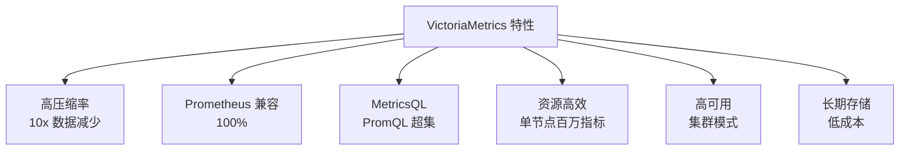

# VictoriaMetrics 关键特性

## 特性总览



## MetricsQL 扩展

```promql
-- PromQL 基础
http_requests_total{job="api"}[5m]

-- MetricsQL 扩展函数
-- rollup 聚合
rollup_rate(http_requests_total[5m])

-- 预测
predict_linear(node_filesystem_free[1h], 3600)

-- 异常检测
anomaly_rate(cpu_usage[5m], mode='stddev', k=3)

-- 移动平均
avg_over_time(cpu_usage[5m])

-- 子查询
histogram_quantile(0.99,
    sum(rate(http_request_duration_seconds_bucket[5m])) by (le)
)
```

## 资源效率

| 指标 | VictoriaMetrics | Prometheus |
|------|-----------------|------------|
| 内存 | 50GB RAM / 1M 指标 | 150GB RAM / 1M 指标 |
| 磁盘 | 压缩 10x | 无压缩 |
| 查询速度 | < 1s | < 5s |
| 长期存储 | 原生支持 | 需要 Thanos |

## 要点总结

- XOR 压缩实现 10x 数据减少
- Prometheus 100% 兼容
- MetricsQL 是 PromQL 超集
- 单节点支持百万级指标