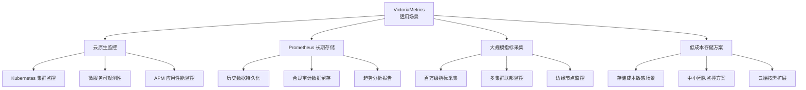
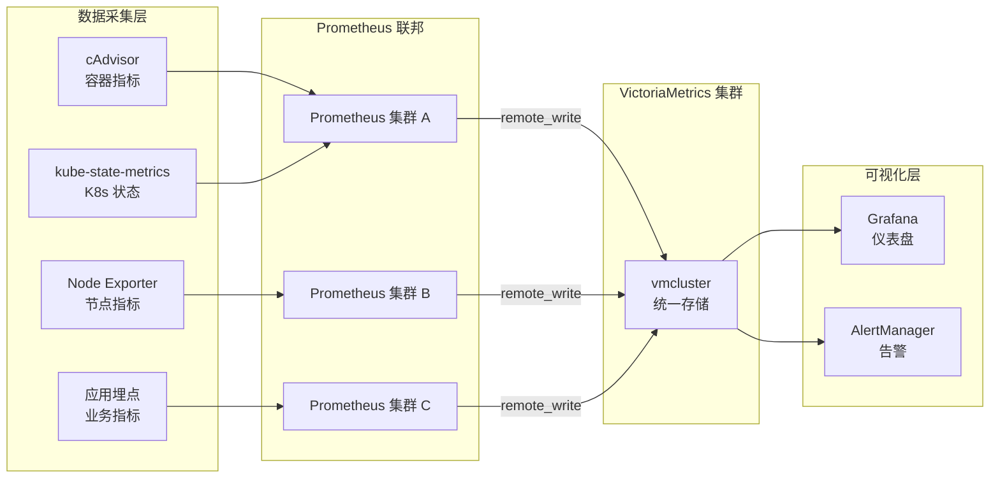
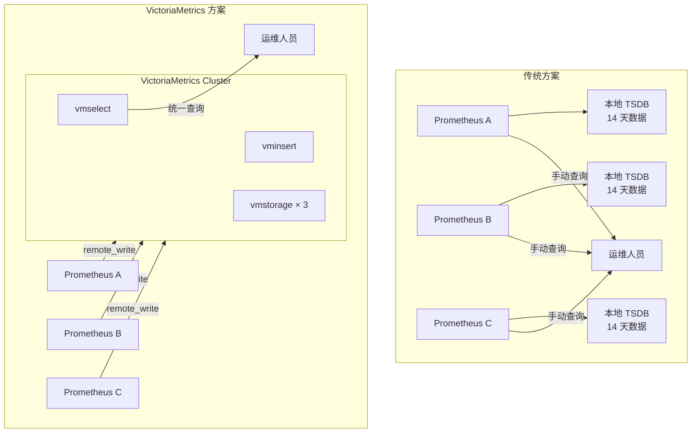
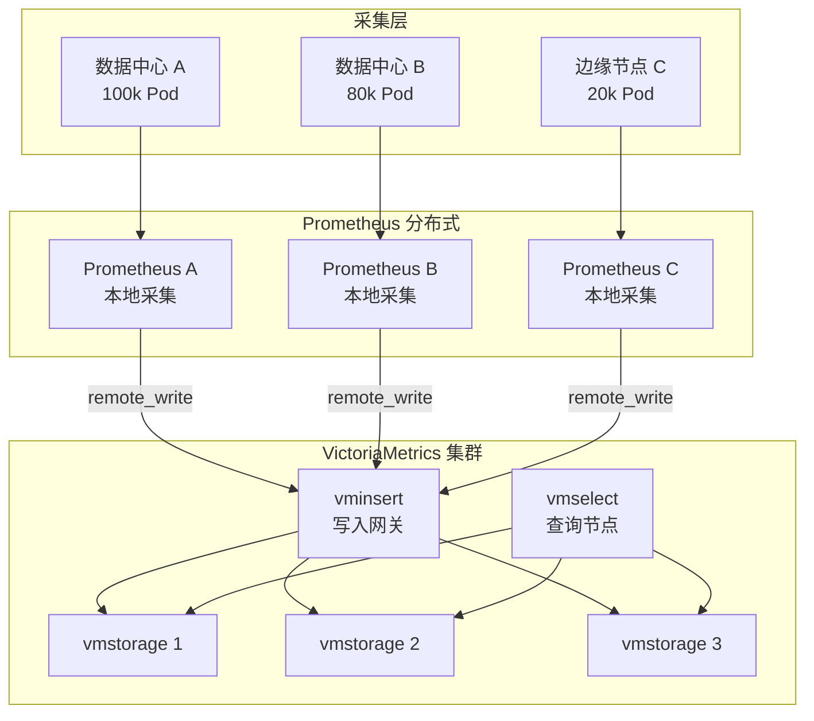
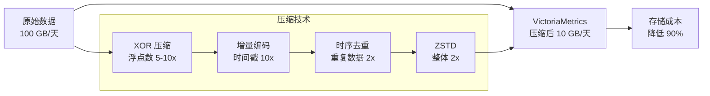
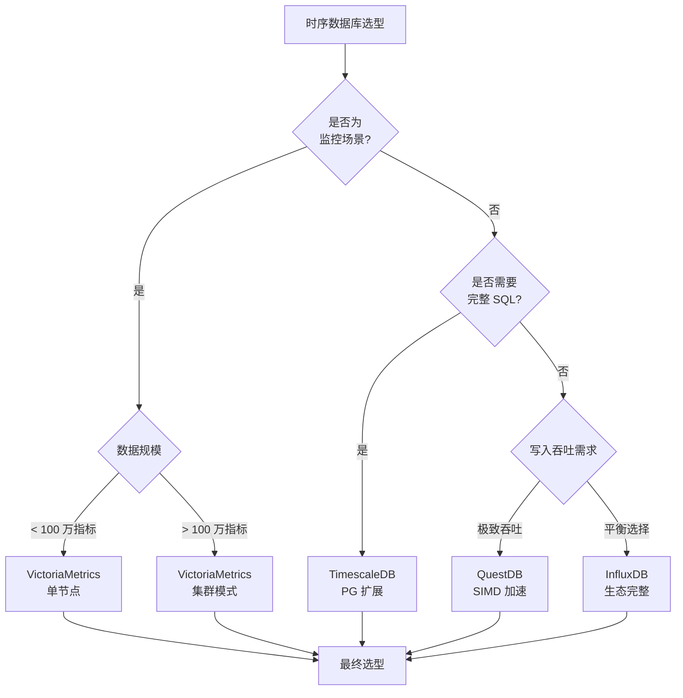
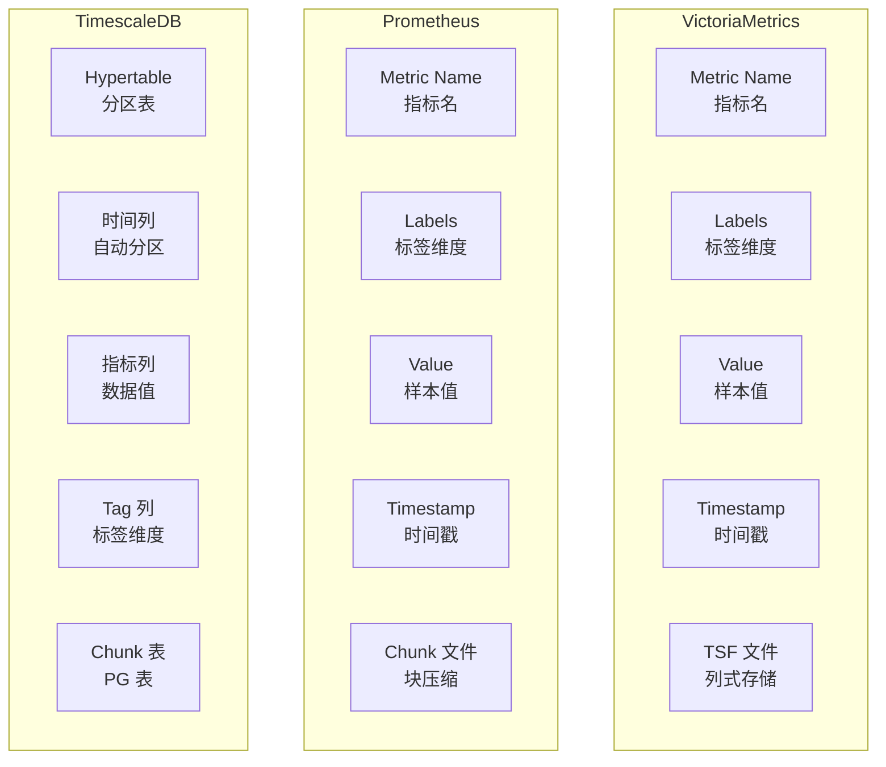
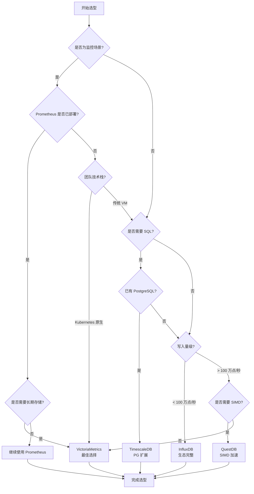

# VictoriaMetrics 使用场景与选型对比

## 学习目标

- 理解 VictoriaMetrics 的最佳适用场景
- 掌握 VictoriaMetrics 与其他时序数据库的选型决策
- 了解监控场景下的架构设计模式

## 适用场景总览



## 场景详解

### 1. 云原生监控场景



**典型配置**：

```yaml
# prometheus.yml 添加远程写入
remote_write:
  - url: http://victoriametrics:8428/api/v1/write
    queue_config:
      max_samples_per_send: 10000
      capacity: 20000
      max_shards: 30

# Prometheus 无需本地存储
storage:
  tsdb:
    path: /tmp/prometheus  # 仅临时存储
    retention: 2h          # 短保留期
```

**写入特点**：
- 写入频率：每 15 秒（scrape_interval）一次抓取
- 数据量：每 Pod 约 100-500 指标，每集群 10k-100k Pod
- 保留策略：原始数据 15 天，降采样数据 1 年

### 2. Prometheus 长期存储场景

**痛点**：Prometheus 本地存储有显著局限

| 限制 | Prometheus | VictoriaMetrics |
|------|------------|-----------------|
| 本地存储 | 约 14 天（默认） | 无限制 |
| 横向扩展 | 需联邦架构 | 原生集群支持 |
| 高可用 | 单节点（无 HA） | 多副本复制 |
| 存储成本 | 无压缩（TSDB） | 10x 压缩 |
| 查询性能 | 长时间范围慢 | 索引优化 |

**架构演进**：



**成本对比**（100 万指标，保留 1 年）：

| 方案 | 存储空间 | 云服务费用 | 运维成本 |
|------|---------|-----------|---------|
| Prometheus + Thanos | 10 TB | $500/月 | 高（多组件） |
| VictoriaMetrics 单节点 | 1 TB | $100/月 | 低（单二进制） |
| VictoriaMetrics 集群 | 1.2 TB | $150/月 | 中（多节点） |

### 3. 大规模指标采集场景



**吞吐量对比**：

| 指标规模 | Prometheus | VictoriaMetrics | 提升 |
|---------|------------|-----------------|------|
| 10 万指标 | 1 节点 | 1 节点 | 相当 |
| 100 万指标 | 需联邦（10+ 节点） | 1 节点 | 10x |
| 1000 万指标 | 需集群（50+ 节点） | 集群（3-5 节点） | 10x |
| 内存占用（100 万指标） | 150 GB | 50 GB | 3x |

### 4. 成本敏感场景

**存储成本优化**：



**实际案例**：

| 场景 | Prometheus 本地存储 | VictoriaMetrics | 节省 |
|------|---------------------|-----------------|------|
| 100 指标 × 1 年 | 500 GB | 50 GB | 90% |
| 1 万指标 × 1 年 | 50 TB | 5 TB | 90% |
| 100 万指标 × 1 年 | 5 PB | 500 TB | 90% |

## 时序数据库对比



### 功能对比表

| 特性 | VictoriaMetrics | Prometheus | InfluxDB | TimescaleDB | QuestDB |
|------|-----------------|------------|----------|-------------|---------|
| **存储引擎** | LSM-Tree | TSDB | TSM/IOx | Hypertable | 列式存储 |
| **查询语言** | MetricsQL/SQL | PromQL | InfluxQL/Flux | SQL | SQL-like |
| **Prometheus 兼容** | 100% | 原生 | 部分兼容 | 需适配 | 需适配 |
| **写入吞吐** | 极高 | 中 | 高 | 高 | 极高 |
| **压缩率** | 10x | 无压缩 | 10x | 5-10x | 5x |
| **高基数支持** | 好 | 差 | 差 | 好 | 好 |
| **分布式** | 原生集群 | 需联邦 | 企业版 | 需扩展 | 单节点 |
| **资源效率** | 极高 | 中 | 中 | 中 | 高 |
| **学习曲线** | 低 | 低 | 中 | 低（SQL） | 中 |
| **云原生** | 是 | 是 | 是 | 是 | 否 |

### 存储模型对比



### MetricsQL vs PromQL

```promql
// ========== PromQL 基础查询 ==========
// 5 分钟平均 CPU 使用率
rate(cpu_usage_total[5m])

// 按 instance 分组聚合
sum(rate(cpu_usage_total[5m])) by (instance)

// ========== MetricsQL 扩展 ==========
// rollup 函数：自动预聚合
rollup_rate(cpu_usage_total[5m])

// keep_metric_names：保留原始指标名
sum(keep_metric_names(rate(cpu_usage_total[5m]))) by (instance)

// 预测函数：线性预测未来值
predict_linear(cpu_usage_total[1h], 3600)

// 异常检测：基于标准差
anomaly_rate(cpu_usage_total[5m], mode='stddev', k=3)

// 范围向量操作：平滑处理
avg_over_time(cpu_usage_total[5m])

// 子查询：计算 1 小时内的最大 5 分钟均值
max_over_time(avg_over_time(cpu_usage_total[5m])[1h:5m])
```

## 选型决策流程



### 选型 Checklist

**VictoriaMetrics 适用场景**：
- [ ] 已有 Prometheus，需要长期存储
- [ ] 监控指标数量超过 10 万
- [ ] 存储成本敏感
- [ ] 需要 Kubernetes 原生部署
- [ ] 需要低资源消耗的解决方案
- [ ] 需要 Prometheus 100% 兼容

**不适用场景**：
- [ ] 需要复杂 SQL 关联查询（选 TimescaleDB）
- [ ] 需要非监控类时序数据（IoT、金融）（选 InfluxDB/QuestDB）
- [ ] 需要嵌入式部署（选 SQLite/QuestDB）
- [ ] 数据规模极小（< 1 万指标）（选 Prometheus 本地存储）

## 最佳实践

### 1. 架构设计

```yaml
# VictoriaMetrics 单节点部署（适合 < 100 万指标）
apiVersion: apps/v1
kind: Deployment
metadata:
  name: victoriametrics
spec:
  template:
    spec:
      containers:
      - name: victoriametrics
        image: victoriametrics/victoriametrics:latest
        args:
          - --storageDataPath=/storage
          - --retentionPeriod=365d
          - --memory.allowedPercent=80
        resources:
          requests:
            memory: 32Gi
            cpu: 8
          limits:
            memory: 64Gi
            cpu: 16
```

```yaml
# VictoriaMetrics 集群部署（适合 > 100 万指标）
apiVersion: apps/v1
kind: StatefulSet
metadata:
  name: vmstorage
spec:
  replicas: 3
  template:
    spec:
      containers:
      - name: vmstorage
        image: victoriametrics/vmstorage:latest
        args:
          - --storageDataPath=/storage
          - --retentionPeriod=365d
        ports:
          - containerPort: 8482
---
apiVersion: apps/v1
kind: Deployment
metadata:
  name: vminsert
spec:
  replicas: 2
  template:
    spec:
      containers:
      - name: vminsert
        image: victoriametrics/vminsert:latest
        args:
          - --storageNode=vmstorage-0:8482,vmstorage-1:8482,vmstorage-2:8482
---
apiVersion: apps/v1
kind: Deployment
metadata:
  name: vmselect
spec:
  replicas: 2
  template:
    spec:
      containers:
      - name: vmselect
        image: victoriametrics/vmselect:latest
        args:
          - --storageNode=vmstorage-0:8482,vmstorage-1:8482,vmstorage-2:8482
```

### 2. 数据保留策略

```yaml
# VictoriaMetrics 保留配置
# vmagent 或 vminsert 启动参数

# 原始数据保留 15 天
--retentionPeriod=15d

# 使用 vmalert 进行降采样
# vmalert 规则配置
groups:
  - name: downsampling
    rules:
      - record: cpu_usage:5m:avg
        expr: avg_over_time(cpu_usage[5m])
      - record: cpu_usage:1h:avg
        expr: avg_over_time(cpu_usage:1h])
```

### 3. 查询优化

```promql
// 差：全时间范围查询
http_requests_total

// 好：限定时间范围
http_requests_total[1h]

// 差：高基数标签
http_requests_total{user_id="U12345"}

// 好：低基数标签
http_requests_total{job="api-server",instance="10.0.0.1:8080"}

// 使用 MetricsQL 的 keep_metric_names 优化
sum(keep_metric_names(rate(http_requests_total[5m]))) by (job)

// 使用 rollup 函数预聚合
rollup_rate(http_requests_total[5m])
```

## 要点总结

- VictoriaMetrics 最适合云原生监控和 Prometheus 长期存储场景
- 10x 压缩率显著降低存储成本，适合成本敏感场景
- MetricsQL 是 PromQL 超集，提供更强大的查询能力
- 单节点可支持百万级指标，集群可扩展至千万级
- 选型核心：监控场景 → VictoriaMetrics；SQL 需求 → TimescaleDB；极致吞吐 → QuestDB

## 思考题

1. 某公司有 50 万 Pod，每 Pod 200 指标，数据保留 1 年，应该选择 VictoriaMetrics 单节点还是集群？
2. VictoriaMetrics 的 MetricsQL 与 PromQL 有哪些关键差异？迁移时需要注意什么？
3. 如何设计 Prometheus + VictoriaMetrics 的联邦架构，避免单点故障？