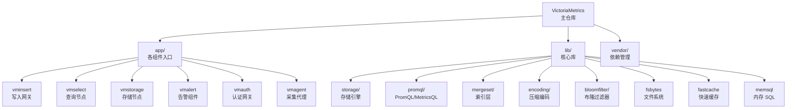
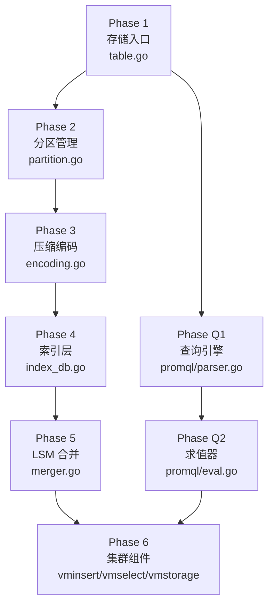
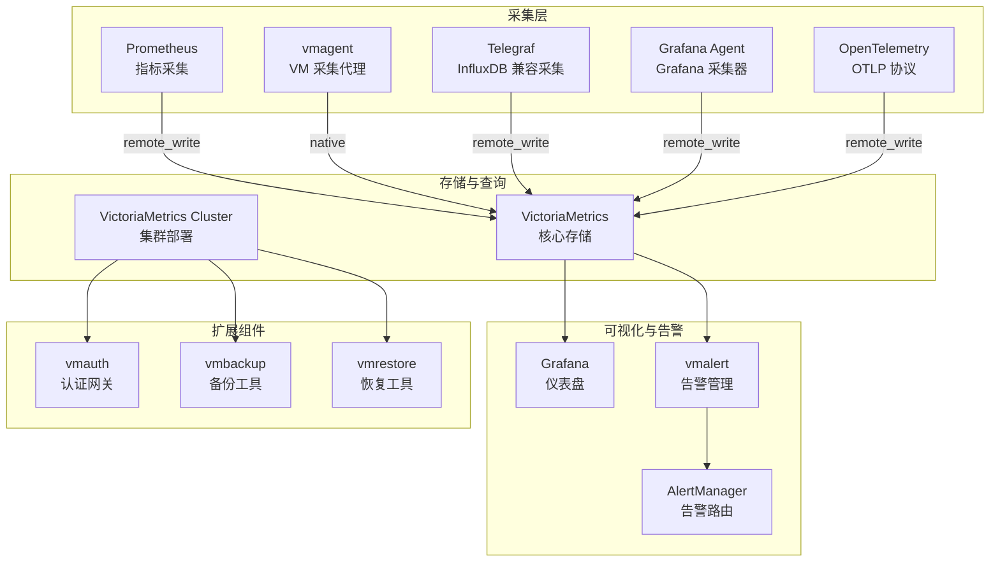
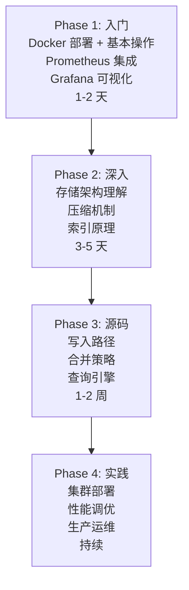

# VictoriaMetrics 学习资源

## 学习目标

- 获取 VictoriaMetrics 的优质学习资源
- 建立系统化的源码阅读路径
- 掌握深入理解 VictoriaMetrics 高性能设计的方法

## 官方资源

### 文档与社区

| 资源 | 链接 | 说明 |
|------|------|------|
| 官方文档 | [https://docs.victoriametrics.com/](https://docs.victoriametrics.com/) | 完整架构、API、运维文档 |
| GitHub | [https://github.com/VictoriaMetrics/VictoriaMetrics](https://github.com/VictoriaMetrics/VictoriaMetrics) | 源码，Go 实现，20k+ Stars |
| 官方博客 | [https://victoriametrics.com/blog/](https://victoriametrics.com/blog/) | 技术博客、性能对比、案例研究 |
| 社区论坛 | [https://github.com/VictoriaMetrics/VictoriaMetrics/discussions](https://github.com/VictoriaMetrics/VictoriaMetrics/discussions) | GitHub Discussions 问答 |
| Slack | [https://slack.victoriametrics.com/](https://slack.victoriametrics.com/) | 实时交流 |
| 中文文档 | [https://docs.victoriametrics.com/](https://docs.victoriametrics.com/) | 官方文档有部分中文翻译 |

### 学习平台

- **Quick Start**：[https://docs.victoriametrics.com/Quick-Start.html](https://docs.victoriametrics.com/Quick-Start.html) — Docker 一键启动
- **Playground**：[https://play.victoriametrics.com/](https://play.victoriametrics.com/) — 在线体验，预置数据集
- **Grafana 仪表盘**：[https://grafana.com/grafana/dashboards/](https://grafana.com/grafana/dashboards/) — 搜索 VictoriaMetrics 关键词
- **性能对比报告**：[https://victoriametrics.com/benchmark/](https://victoriametrics.com/benchmark/) — 官方性能测试

## 源码研读路径

### 项目结构

VictoriaMetrics 使用 Go 语言开发，核心存储和查询引擎在单个二进制中实现。源码分为多个仓库，主仓库 `VictoriaMetrics/VictoriaMetrics` 包含核心组件。



### 核心源码文件速查

| 文件 | 功能 | 关键行数 |
|------|------|---------|
| `lib/storage/table.go` | 时序表管理，分区和合并 | ~3000 |
| `lib/storage/partition.go` | 时间分区，数据组织 | ~2500 |
| `lib/storage/raw_block.go` | 原始数据块，压缩接口 | ~1500 |
| `lib/storage/tsid.go` | 时序 ID 分配，唯一标识 | ~500 |
| `lib/storage/index_db.go` | 倒排索引实现 | ~4000 |
| `lib/storage/merger.go` | 后台合并策略 | ~2000 |
| `lib/mergeset/table.go` | LSM-Tree 索引表 | ~2000 |
| `lib/mergeset/merge.go` | 索引合并 | ~1500 |
| `lib/encoding/encoding.go` | XOR 压缩算法 | ~1000 |
| `lib/encoding/compress.go` | ZSTD 压缩 | ~500 |
| `lib/promql/parser.go` | PromQL 解析器 | ~3000 |
| `lib/promql/eval.go` | PromQL 求值器 | ~5000 |
| `lib/bloomfilter/bloomfilter.go` | 布隆过滤器 | ~1000 |
| `lib/fastcache/fastcache.go` | 快速缓存 | ~2000 |
| `lib/storage/metric_name.go` | 指标名编码 | ~1500 |

### 源码阅读建议顺序



1. **存储入口**：`lib/storage/table.go` — 理解时序表的生命周期（创建、写入、合并、过期）
2. **分区管理**：`lib/storage/partition.go` — 理解时间分区策略和并发控制
3. **压缩编码**：`lib/encoding/encoding.go` — 理解 XOR 压缩算法和增量编码
4. **索引层**：`lib/storage/index_db.go` — 理解倒排索引和布隆过滤器
5. **LSM 合并**：`lib/storage/merger.go` — 理解后台合并和压缩策略
6. **查询引擎**：`lib/promql/parser.go` → `eval.go` — 理解 PromQL 解析和求值

### 存储引擎核心代码解析

#### 写入路径

```go
// lib/storage/table.go 写入流程（简化）
func (t *Table) AddRows(rows []rawRow) error {
    // 1. 将行按时间分区
    partitions := t.splitByTimePartition(rows)
    
    // 2. 对每个分区并行写入
    for _, partition := range partitions {
        // 3. 写入内存缓冲区
        partition.addRows(rows)
        
        // 4. 缓冲区满则刷盘
        if partition.mustFlush() {
            partition.flushToPart()
        }
    }
    return nil
}

// 分区刷盘
func (pt *partition) flushToPart() {
    // 1. 创建 part（不可变数据段）
    part := newPart()
    
    // 2. 对数据进行压缩编码
    part.compressRows()
    
    // 3. 构建索引
    part.buildIndex()
    
    // 4. 持久化到磁盘
    part.writeToDisk()
}
```

#### 压缩编码

```go
// lib/encoding/encoding.go XOR 压缩（简化）
// 采用 Gorilla 风格的时间戳+浮点压缩

// 时间戳压缩：Delta-Delta 编码
func (b *block) compressTimestamps(timestamps []int64) {
    var delta, delta2 int64
    for i, ts := range timestamps {
        if i == 0 {
            b.write(ts, 64)           // 第一个时间戳全量写入
        } else if i == 1 {
            delta = ts - timestamps[0]
            b.write(delta, 64)        // 第二个写入 delta
        } else {
            delta2 = (ts - timestamps[i-1]) - delta
            // 使用可变长度编码
            b.writeVarint(delta2)
            delta = ts - timestamps[i-1]
        }
    }
}

// 浮点压缩：XOR 压缩
func (b *block) compressValues(values []float64) {
    var prev, xor uint64
    for i, v := range values {
        if i == 0 {
            b.write(math.Float64bits(v), 64)  // 第一个值全量写入
            prev = math.Float64bits(v)
        } else {
            xor = math.Float64bits(v) ^ prev
            if xor == 0 {
                b.write(0, 1)                 // 相同值，写一个控制位 0
            } else {
                b.write(1, 1)                 // 不同值，写控制位 1
                // 计算前导零和尾随零
                leading := bits.LeadingZeros64(xor)
                trailing := bits.TrailingZeros64(xor)
                b.writeXorBits(xor, leading, trailing)
            }
            prev = math.Float64bits(v)
        }
    }
}
```

#### 倒排索引

```go
// lib/storage/index_db.go 倒排索引（简化）
// VictoriaMetrics 使用倒排索引加速标签查询

// 索引数据结构
type IndexDB struct {
    // LSM-Tree 索引表
    mergesetTable *mergeset.Table
    
    // 布隆过滤器
    bloomFilter *bloomfilter.BloomFilter
    
    // 缓存
    cache *fastcache.Cache
}

// 标签过滤查询
func (db *IndexDB) SearchMetricIDs(
    filterLabel string,     // 过滤标签名
    filterValue string,     // 过滤标签值
) ([]uint64, error) {
    // 1. 构造搜索 key
    key := encodeSearchKey(filterLabel, filterValue)
    
    // 2. 先查缓存
    if ids := db.cache.Get(key); ids != nil {
        return ids, nil
    }
    
    // 3. 查布隆过滤器（快速排除）
    if !db.bloomFilter.MayContain(key) {
        return nil, nil
    }
    
    // 4. 查 LSM-Tree 索引
    ids := db.mergesetTable.Search(key)
    
    // 5. 缓存结果
    db.cache.Set(key, ids)
    
    return ids, nil
}

// 复合查询（多标签 AND 过滤）
func (db *IndexDB) SearchMetricIDsMulti(
    filters []LabelFilter,
) ([]uint64, error) {
    // 1. 对每个标签过滤，分别查询
    var resultSets [][]uint64
    for _, f := range filters {
        ids, _ := db.SearchMetricIDs(f.Name, f.Value)
        resultSets = append(resultSets, ids)
    }
    
    // 2. 取交集（AND 语义）
    return intersectSets(resultSets)
}
```

### 集群组件源码分析

```go
// app/vmstorage/main.go 存储节点
// vmstorage 是数据持久化节点

// 启动参数
type StorageConfig struct {
    StorageDataPath string  // 数据存储路径
    RetentionPeriod string  // 数据保留期（默认 365d）
    
    // 内存控制
    MemoryAllowedPercent int  // 允许使用的内存百分比
    CacheSize int             // 缓存大小
}

// 核心能力
// 1. 接收 vminsert 写入的数据
// 2. 存储时序数据到本地磁盘
// 3. 响应 vmselect 的查询请求
// 4. 后台合并和压缩

// app/vminsert/main.go 写入网关
// vminsert 负责写入负载均衡和数据分片

// 数据分片策略
func (s *StorageGroup) getStorageForMetric(metricID uint64) *vmstorage {
    // 使用一致性哈希进行分片
    hash := hashMetricID(metricID)
    idx := hash % len(s.storages)
    return s.storages[idx]
}

// 写入流程
func (s *InsertService) InsertRows(rows []rawRow) {
    // 1. 对行进行分组（按目标存储节点）
    groups := groupRowsByStorage(rows)
    
    // 2. 并行发送到各个 vmstorage
    for storage, rows := range groups {
        go storage.AddRows(rows)
    }
}

// app/vmselect/main.go 查询节点
// vmselect 负责查询路由和结果合并

// 查询流程
func (s *SelectService) Select(query string) (*QueryResult, error) {
    // 1. 解析 PromQL
    expr := promql.Parse(query)
    
    // 2. 并行向所有 vmstorage 发起查询
    results := s.queryAllStorages(expr)
    
    // 3. 合并结果（取并集后聚合）
    merged := mergeResults(results)
    
    // 4. 返回最终结果
    return merged, nil
}
```

## 推荐书籍与论文

### 书籍

| 书名 | 作者 | 说明 |
|------|------|------|
| 《Database Internals》 | Alex Petrov | 存储引擎设计，LSM-Tree 原理，B-Tree 变体 |
| 《Designing Data-Intensive Applications》 | Martin Kleppmann | 分布式数据系统基础，时序数据库架构 |
| 《Prometheus: Up & Running》 | Brian Brazil | Prometheus 实践，VictoriaMetrics 的前置知识 |
| 《Computer Architecture: A Quantitative Approach》 | Hennessy & Patterson | 计算机体系结构，理解内存和 I/O 性能 |
| 《Programming Go》 | Alan Donovan & Brian Kernighan | Go 语言基础，理解 VictoriaMetrics 代码 |
| 《高性能 Go 编程》 | 曹春晖 | Go 性能调优，内存管理，GC 优化 |

### 关键论文

| 论文 | 作者 | 与 VictoriaMetrics 的关系 |
|------|------|--------------------------|
| [Gorilla: A Fast, Scalable, In-Memory Time Series Database](https://www.vldb.org/pvldb/vol8/p1816-teller.pdf) | Facebook, 2015 | VictoriaMetrics 的 XOR 浮点压缩和 Delta-Delta 时间戳压缩参考 Gorilla |
| [The Log-Structured Merge-Tree (LSM-Tree)](https://dl.acm.org/doi/10.1145/253262.253266) | O'Neil et al., 1996 | LSM-Tree 理论基础，VictoriaMetrics 的存储核心 |
| [Bigtable: A Distributed Storage System for Structured Data](https://dl.acm.org/doi/10.1145/1365815.1365816) | Google, 2006 | LSM-Tree 工程化实践，VictoriaMetrics 的 Sorted String Table 概念参考 |
| [Bloom Filters in Probabilistic Verification](https://dl.acm.org/doi/10.1007/978-3-540-30494-4_2) | Bloom, 1970 | 布隆过滤器原理，VictoriaMetrics 索引加速 |
| [An End-to-End Time Series Model for Monitoring Systems](https://www.vldb.org/pvldb/vol15/p3757-zhuang.pdf) | 清华大学, 2022 | 现代时序监控系统的端到端设计 |
| [Time Series Database: A Survey](https://arxiv.org/abs/2105.01237) | 多作者 | 时序数据库全面综述，对比 20+ 时序数据库 |
| [Monarch: Google's Planet-Scale In-Memory Time Series Database](https://www.vldb.org/pvldb/vol13/p3181-adams.pdf) | Adams et al., 2020 | Google 大规模时序数据库，理解分布式时序系统设计 |

### VictoriaMetrics 相关技术博客

- **VictoriaMetrics 架构系列**：[https://victoriametrics.com/blog/](https://victoriametrics.com/blog/)
  - "How VictoriaMetrics achieves 10x compression ratio"
  - "VictoriaMetrics vs Thanos: A Comprehensive Comparison"
  - "Understanding the VictoriaMetrics storage architecture"
- **性能对比**：[https://victoriametrics.com/benchmark/](https://victoriametrics.com/benchmark/)
  - "VictoriaMetrics vs Prometheus: Resource efficiency"
  - "VictoriaMetrics vs InfluxDB: Write and query performance"
- **工程实践**：[https://docs.victoriametrics.com/CaseStudies.html](https://docs.victoriametrics.com/CaseStudies.html)
  - 大规模部署案例研究

## 社区资源

### 开源工具生态



### 社区项目

| 项目 | 链接 | 说明 |
|------|------|------|
| victoriametrics-datasource | [https://grafana.com/grafana/plugins/vertamedia-clickhouse-datasource/](https://grafana.com/grafana/plugins/vertamedia-clickhouse-datasource/) | Grafana 数据源插件 |
| vmagent | [https://docs.victoriametrics.com/vmagent.html](https://docs.victoriametrics.com/vmagent.html) | VictoriaMetrics 采集代理，Prometheus 替代品 |
| vmalert | [https://docs.victoriametrics.com/vmalert.html](https://docs.victoriametrics.com/vmalert.html) | 告警规则管理器 |
| vmbackup | [https://docs.victoriametrics.com/vmbackup.html](https://docs.victoriametrics.com/vmbackup.html) | 数据备份工具 |
| vmrestore | [https://docs.victoriametrics.com/vmrestore.html](https://docs.victoriametrics.com/vmrestore.html) | 数据恢复工具 |
| helm-charts | [https://github.com/VictoriaMetrics/helm-charts](https://github.com/VictoriaMetrics/helm-charts) | Kubernetes Helm Chart |
| operator | [https://github.com/VictoriaMetrics/operator](https://github.com/VictoriaMetrics/operator) | Kubernetes Operator |
| ansible-playbooks | [https://github.com/VictoriaMetrics/ansible-playbooks](https://github.com/VictoriaMetrics/ansible-playbooks) | Ansible 部署 |
| victorialogs | [https://github.com/VictoriaMetrics/VictoriaLogs](https://github.com/VictoriaMetrics/VictoriaLogs) | 日志解决方案（同类产品） |

### 客户端驱动

| 语言 | 驱动 | 说明 |
|------|------|------|
| Go | `github.com/VictoriaMetrics/metrics` | 官方 Go 客户端库 |
| Python | `victoria-metrics-client` | 社区 Python 客户端 |
| Java | `victoria-metrics-client-java` | 社区 Java 客户端 |
| Node.js | `victoria-metrics-client-node` | 社区 Node.js 客户端 |
| C/C++ | 使用 Prometheus remote_write HTTP API | HTTP API 直接调用 |
| Rust | `victoria-metrics-client-rs` | 社区 Rust 客户端 |

## 学习路径



### Phase 1 入门 Checklist

- [ ] 使用 Docker 启动 VictoriaMetrics：`docker run -p 8428:8428 victoriametrics/victoriametrics`
- [ ] 访问 `/metrics` 页面查看内置指标
- [ ] 使用 `/api/v1/query` 和 `/api/v1/query_range` 查询
- [ ] 配置 Prometheus remote_write 写入 VictoriaMetrics
- [ ] 配置 Grafana 数据源连接 VictoriaMetrics
- [ ] 导入 Grafana 仪表盘模板

### Phase 2 深入 Checklist

- [ ] 理解 XOR 压缩算法的工作原理
- [ ] 理解 Delta-Delta 时间戳压缩
- [ ] 理解倒排索引在标签查询中的作用
- [ ] 理解布隆过滤器的原理和参数选择
- [ ] 理解时间分区策略（hourly/daily partitions）
- [ ] 理解 LSM-Tree 合并过程

### Phase 3 源码 Checklist

- [ ] 阅读 `lib/storage/table.go`，理解 Table 生命周期
- [ ] 阅读 `lib/storage/partition.go`，理解分区管理
- [ ] 阅读 `lib/encoding/encoding.go`，理解压缩实现
- [ ] 阅读 `lib/storage/index_db.go`，理解索引结构
- [ ] 阅读 `lib/storage/merger.go`，理解合并策略
- [ ] 阅读 `lib/promql/parser.go`，理解 PromQL 解析
- [ ] 阅读 `app/vmstorage/main.go`，理解存储节点

### Phase 4 实践 Checklist

- [ ] 使用 vmagent 替代 Prometheus 进行指标采集
- [ ] 部署 VictoriaMetrics 集群（vminsert + vmselect + vmstorage）
- [ ] 配置 vmalert 进行告警
- [ ] 配置 vmbackup 进行数据备份
- [ ] 性能调优：调整缓存大小、合并间隔
- [ ] 监控 VictoriaMetrics 自身指标
- [ ] 对比项目中 ts_engine 与 VictoriaMetrics 的性能

## 要点总结

- 官方文档和 GitHub 源码是首要学习资源，Quick Start 降低了入门门槛
- 源码阅读应遵循存储层（table.go）→ 压缩层（encoding.go）→ 索引层（index_db.go）→ 查询层（promql/）的顺序
- XOR 压缩和 LSM-Tree 是 VictoriaMetrics 的核心技术，需要深入理解
- 布隆过滤器在索引加速中起关键作用，值得重点研究
- 集群组件（vminsert/vmselect/vmstorage）展示了 Go 语言在分布式系统中的应用

## 思考题

1. VictoriaMetrics 的 XOR 浮点压缩与 Gorilla 论文中的算法有何异同？
2. 布隆过滤器的假阳性率如何影响 VictoriaMetrics 的查询性能？如何调优？
3. 对比项目中 ts_engine 的 Gorilla 压缩实现，与 VictoriaMetrics 的编码实现有何差异？
4. VictoriaMetrics 的合并策略是如何平衡写入性能和查询性能的？