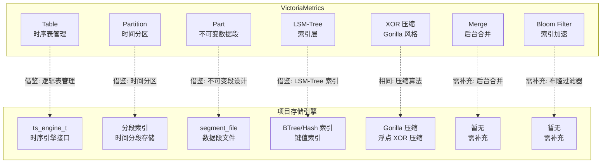
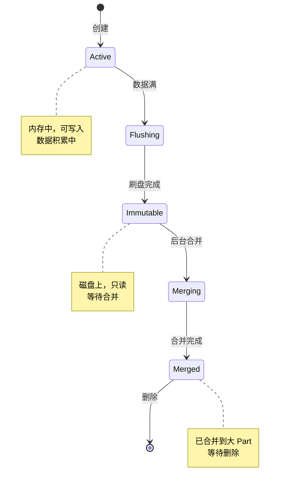
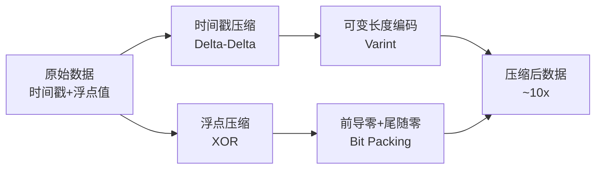
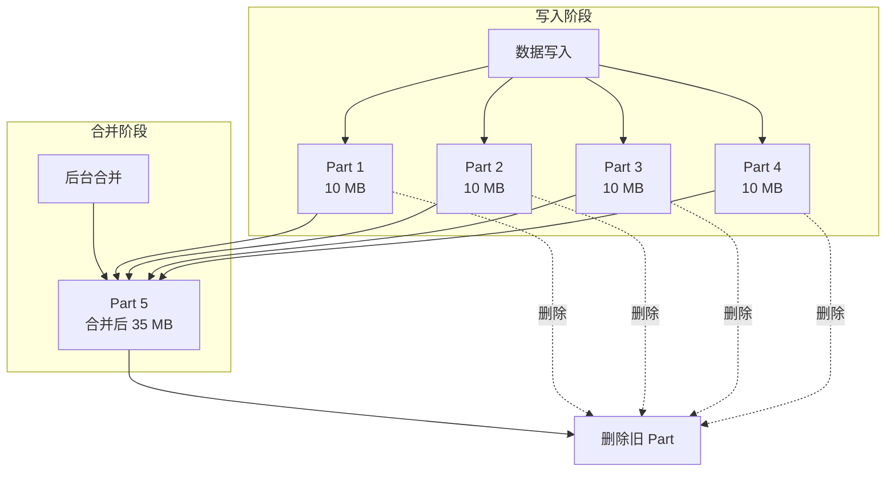
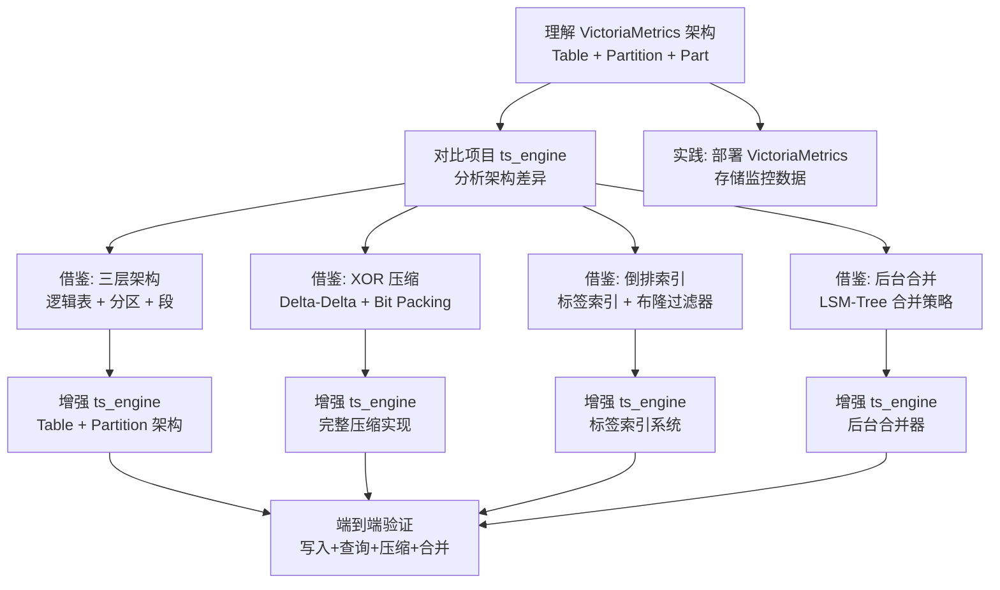

# VictoriaMetrics 与项目关联

## 学习目标

- 分析 VictoriaMetrics 设计对项目存储引擎的启发性
- 找出项目中可借鉴的时序存储技术
- 建立 VictoriaMetrics 与项目各模块的关联

## 架构对比



### 架构层级对比

| 维度 | VictoriaMetrics | 项目 |
|------|-----------------|------|
| **存储引擎** | 独立时序数据库，LSM-Tree 存储 | `ts_engine_t` + `storage_ops_t` 接口 |
| **分区机制** | Partition（时间分区 + 不可变 Part） | 分段索引（时间范围分段） |
| **压缩** | XOR + Delta-Delta + ZSTD | Gorilla 压缩（浮点 XOR 压缩） |
| **索引** | 倒排索引 + 布隆过滤器 + LSM-Tree | BTree / Hash 索引 |
| **查询语言** | MetricsQL（PromQL 超集） | 扫描 API + 聚合函数 |
| **合并策略** | 后台异步合并（Level 0 → Level N） | 暂无合并机制 |
| **内存管理** | fastcache + mmap | Buffer Pool（buf.h） |
| **分布式** | 集群模式（vminsert/vmselect/vmstorage） | 单节点（暂无分布式） |

## 可借鉴的设计

### 1. Table + Partition + Part 三层架构

VictoriaMetrics 采用 **Table（逻辑表）→ Partition（时间分区）→ Part（不可变数据段）** 的三层架构，实现了高效的时间分区管理和查询优化。

**VictoriaMetrics 的做法**：

```go
// Table 管理多个 Partition（按时间范围）
type Table struct {
    partitions map[int64]*partition  // key = 跳跃时间戳（如每小时）
    createTime int64
    
    // 后台合并器
    merger *merger
}

// Partition 管理多个 Part（不可变数据段）
type partition struct {
    parts []*part  // 按 Part 创建时间排序
    
    // 内存缓冲区（当前活跃的写入缓冲）
    rawBlock rawBlock
    
    // 合并状态
    mergeInProgress bool
}

// Part 是不可变的压缩数据段
type part struct {
    timestampRange [2]int64  // [min, max]
    rowsCount      int64
    
    // 压缩后的数据文件
    indexPath string
    dataPath  string
    
    // 元数据
    createdTime int64
}
```

**项目可借鉴**：

```c
// 当前项目：ts_engine 使用分段索引，数据按时间范围连续存储
// 单段文件存储，缺乏多级分区和不可变段设计

// 借鉴 VictoriaMetrics：Table + Partition + Part 架构
// 思路：引入逻辑表 + 时间分区 + 不可变段

typedef struct ts_table_s {
    char    name[256];              // 表名
    int64_t partition_duration_ms;  // 分区时长（如 1 小时）
    
    // 分区列表（按时间排序）
    ts_partition_t **partitions;
    int32_t num_partitions;
    int32_t partition_capacity;
    
    // 当前活跃分区
    ts_partition_t *active_partition;
    
    // 元数据
    int64_t first_partition_start;
    int64_t last_partition_end;
    uint64_t total_rows;
} ts_table_t;

typedef struct ts_partition_s {
    int64_t partition_id;           // 分区 ID（时间戳对齐）
    int64_t range_start;            // 时间范围起始（含）
    int64_t range_end;              // 时间范围结束（不含）
    
    // 不可变段列表
    ts_part_t **parts;
    int32_t num_parts;
    
    // 当前活跃段（可写入）
    ts_part_t *active_part;
    
    // 状态
    ts_partition_status_t status;   // ACTIVE/READONLY/MERGING
} ts_partition_t;

typedef struct ts_part_s {
    int64_t part_id;
    int64_t created_time;
    
    // 数据文件
    char    data_file[512];
    char    index_file[512];
    
    // 统计信息
    int64_t min_timestamp;
    int64_t max_timestamp;
    uint64_t rows_count;
    
    // 压缩信息
    bool    is_compressed;
    uint64_t uncompressed_size;
    uint64_t compressed_size;
} ts_part_t;

// 写入路由：根据时间戳定位 Partition 和 Part
int ts_table_insert(ts_table_t *table, int64_t timestamp, double value) {
    // 1. 计算 Partition ID
    int64_t partition_id = ts_align_timestamp(timestamp, table->partition_duration_ms);
    
    // 2. 查找或创建 Partition
    ts_partition_t *partition = ts_table_find_or_create_partition(table, partition_id);
    
    // 3. 写入 Partition 的活跃 Part
    return ts_partition_insert(partition, timestamp, value);
}

// Partition 写入：写入活跃 Part，满则创建新 Part
int ts_partition_insert(ts_partition_t *partition, int64_t timestamp, double value) {
    // 1. 检查活跃 Part 是否已满
    if (partition->active_part == NULL || 
        ts_part_is_full(partition->active_part)) {
        
        // 2. 将旧 Part 标记为不可变
        if (partition->active_part != NULL) {
            ts_part_flush_to_disk(partition->active_part);
        }
        
        // 3. 创建新 Part
        partition->active_part = ts_part_create();
        partition->num_parts++;
    }
    
    // 4. 写入活跃 Part
    return ts_part_insert(partition->active_part, timestamp, value);
}
```

**Part 状态机**：



### 2. XOR 压缩与 Delta-Delta 编码

VictoriaMetrics 采用 **Gorilla 风格的 XOR 浮点压缩** 和 **Delta-Delta 时间戳压缩**，实现了约 10 倍的压缩率。

**VictoriaMetrics 的压缩流程**：



**VictoriaMetrics 的压缩算法**：

```go
// lib/encoding/encoding.go（简化）

// 时间戳压缩：Delta-Delta 编码
// 原理：相邻时间戳的差值通常相同（采集间隔固定）
// 例如：时间戳序列 [1000, 1010, 1020, 1030]
//       delta: [10, 10, 10]
//       delta2: [0, 0]  // 大量 0，压缩率高

func compressTimestamps(timestamps []int64) []byte {
    var buf bytes.Buffer
    var delta, delta2 int64
    
    for i, ts := range timestamps {
        if i == 0 {
            // 第一个时间戳：全量写入
            writeUint64(&buf, ts)
        } else if i == 1 {
            // 第二个时间戳：写入 delta
            delta = ts - timestamps[0]
            writeUint64(&buf, delta)
        } else {
            // 后续时间戳：写入 delta2
            delta2 = (ts - timestamps[i-1]) - delta
            writeVarint(&buf, delta2)  // 可变长度编码
            delta = ts - timestamps[i-1]
        }
    }
    return buf.Bytes()
}

// 浮点压缩：XOR 压缩
// 原理：相邻浮点值的 XOR 结果通常有很多前导零和尾随零
// 例如：浮点序列 [1.0, 1.1, 1.2]
//       XOR 结果：[0x3fb999999999999a ^ 0x3ff199999999999a]
//       前导零多，可只存储非零部分

func compressValues(values []float64) []byte {
    var buf bytes.Buffer
    var prev uint64
    
    for i, v := range values {
        current := math.Float64bits(v)
        
        if i == 0 {
            // 第一个值：全量写入
            writeUint64(&buf, current)
            prev = current
        } else {
            xor := current ^ prev
            
            if xor == 0 {
                // 相同值：只写 1 位控制位
                writeBit(&buf, 0)
            } else {
                // 不同值：写控制位 + 压缩后的 XOR
                writeBit(&buf, 1)
                
                // 计算前导零和尾随零
                leading := bits.LeadingZeros64(xor)
                trailing := bits.TrailingZeros64(xor)
                
                // 写入：前导零(5bit) + 尾随零(6bit) + 有效位
                writeBits(&buf, leading, 5)
                writeBits(&buf, 64-leading-trailing, 6)
                writeBits(&buf, xor>>trailing, 64-leading-trailing)
            }
            prev = current
        }
    }
    return buf.Bytes()
}
```

**项目可借鉴**：

```c
// 当前项目：ts_engine 使用 Gorilla 压缩
// 借鉴 VictoriaMetrics：完整实现 Delta-Delta + XOR + Bit Packing

// encoding.h/c — 压缩编码模块

typedef struct ts_encoder_s {
    // 时间戳编码器
    int64_t prev_timestamp;
    int64_t prev_delta;
    
    // 浮点编码器
    uint64_t prev_value;
    
    // 位缓冲区
    uint8_t *buffer;
    int32_t buffer_capacity;
    int32_t buffer_pos;
    uint8_t bit_buffer;
    int32_t bit_pos;
} ts_encoder_t;

// 初始化编码器
int ts_encoder_init(ts_encoder_t *enc, int32_t capacity) {
    enc->buffer = malloc(capacity);
    enc->buffer_capacity = capacity;
    enc->buffer_pos = 0;
    enc->bit_pos = 0;
    enc->bit_buffer = 0;
    enc->prev_timestamp = 0;
    enc->prev_delta = 0;
    enc->prev_value = 0;
    return 0;
}

// 写入单个数据点
int ts_encoder_write(ts_encoder_t *enc, int64_t timestamp, double value) {
    // 1. 压缩时间戳
    ts_encoder_write_timestamp(enc, timestamp);
    
    // 2. 压缩浮点值
    ts_encoder_write_value(enc, value);
    
    return 0;
}

// 压缩时间戳
static int ts_encoder_write_timestamp(ts_encoder_t *enc, int64_t timestamp) {
    if (enc->prev_timestamp == 0) {
        // 第一个时间戳：全量写入
        ts_encoder_write_bits(enc, timestamp, 64);
        enc->prev_timestamp = timestamp;
        return 0;
    }
    
    int64_t delta = timestamp - enc->prev_timestamp;
    
    if (enc->prev_delta == 0) {
        // 第二个时间戳：写入 delta
        ts_encoder_write_bits(enc, delta, 64);
        enc->prev_delta = delta;
    } else {
        // 后续时间戳：写入 delta2
        int64_t delta2 = delta - enc->prev_delta;
        ts_encoder_write_varint(enc, delta2);
        enc->prev_delta = delta;
    }
    
    enc->prev_timestamp = timestamp;
    return 0;
}

// 压缩浮点值
static int ts_encoder_write_value(ts_encoder_t *enc, double value) {
    uint64_t current = *((uint64_t*)&value);
    
    if (enc->prev_value == 0) {
        // 第一个值：全量写入
        ts_encoder_write_bits(enc, current, 64);
        enc->prev_value = current;
        return 0;
    }
    
    uint64_t xor = current ^ enc->prev_value;
    
    if (xor == 0) {
        // 相同值：写 1 位控制位
        ts_encoder_write_bits(enc, 0, 1);
    } else {
        // 不同值：写控制位 + 压缩 XOR
        ts_encoder_write_bits(enc, 1, 1);
        
        // 计算前导零和尾随零
        int leading = __builtin_clzll(xor);
        int trailing = __builtin_ctzll(xor);
        int significant = 64 - leading - trailing;
        
        // 写入：前导零(5bit) + 有效位数(6bit) + 有效位
        ts_encoder_write_bits(enc, leading, 5);
        ts_encoder_write_bits(enc, significant, 6);
        ts_encoder_write_bits(enc, xor >> trailing, significant);
    }
    
    enc->prev_value = current;
    return 0;
}

// 位写入辅助函数
static int ts_encoder_write_bits(ts_encoder_t *enc, uint64_t value, int num_bits) {
    for (int i = num_bits - 1; i >= 0; i--) {
        uint8_t bit = (value >> i) & 1;
        enc->bit_buffer = (enc->bit_buffer << 1) | bit;
        enc->bit_pos++;
        
        if (enc->bit_pos == 8) {
            enc->buffer[enc->buffer_pos++] = enc->bit_buffer;
            enc->bit_buffer = 0;
            enc->bit_pos = 0;
        }
    }
    return 0;
}
```

### 3. 倒排索引与布隆过滤器

VictoriaMetrics 使用 **倒排索引** 加速标签查询，配合 **布隆过滤器** 快速排除不存在的标签组合。

**VictoriaMetrics 的索引设计**：

```mermaid
graph TB
    A[查询请求<br/>{job="api-server",instance="10.0.0.1"}] --> B[布隆过滤器<br/>快速排除]
    B -->|可能存在| C[倒排索引<br/>查找 TSID 集合]
    C --> D[标签 "job=api-server"<br/>TSID: {1,5,7,9}]
    C --> E[标签 "instance=10.0.0.1"<br/>TSID: {1,2,7}]
    D --> F[交集<br/>TSID: {1,7}]
    E --> F
    F --> G[读取时序数据]
```

**VictoriaMetrics 的索引数据结构**：

```go
// lib/storage/index_db.go（简化）

type IndexDB struct {
    // LSM-Tree 索引表
    mergesetTable *mergeset.Table
    
    // 布隆过滤器
    bloomFilter *bloomfilter.BloomFilter
    
    // 缓存
    cache *fastcache.Cache
}

// 索引项格式
// key: "label_name=label_value"
// value: TSID 列表（压缩）

// 添加索引项
func (db *IndexDB) addToIndex(tsid uint64, labels map[string]string) {
    for name, value := range labels {
        key := name + "=" + value
        
        // 更新布隆过滤器
        db.bloomFilter.Add([]byte(key))
        
        // 更新 LSM-Tree 索引
        db.mergesetTable.Add(key, tsid)
    }
}

// 查询索引项
func (db *IndexDB) searchByLabels(filters []LabelFilter) []uint64 {
    var resultSets [][]uint64
    
    for _, f := range filters {
        key := f.Name + "=" + f.Value
        
        // 1. 先查布隆过滤器
        if !db.bloomFilter.MayContain([]byte(key)) {
            return nil  // 快速排除
        }
        
        // 2. 再查缓存
        if ids := db.cache.Get([]byte(key)); ids != nil {
            resultSets = append(resultSets, ids)
            continue
        }
        
        // 3. 查 LSM-Tree 索引
        ids := db.mergesetTable.Get([]byte(key))
        db.cache.Set([]byte(key), ids)
        resultSets = append(resultSets, ids)
    }
    
    // 4. 取交集
    return intersectSets(resultSets)
}
```

**项目可借鉴**：

```c
// 当前项目：ts_engine 缺乏标签索引和布隆过滤器
// 借鉴 VictoriaMetrics：倒排索引 + 布隆过滤器

// ts_index.h — 时序索引模块

typedef struct ts_index_s {
    // 倒排索引：label → TSID 集合
    // 使用 Radix Tree 或 Hash 表实现
    radix_tree_t *label_to_tsids;
    
    // 布隆过滤器
    ts_bloom_filter_t *bloom_filter;
    
    // TSID 到时序元数据的映射
    hash_table_t *tsid_to_meta;
    
    // 缓存
    lru_cache_t *cache;
} ts_index_t;

// 布隆过滤器
typedef struct ts_bloom_filter_s {
    uint8_t *bits;
    uint64_t size;
    int num_hash_functions;
} ts_bloom_filter_t;

// 初始化布隆过滤器
int ts_bloom_filter_init(ts_bloom_filter_t *bf, uint64_t expected_items, double false_positive_rate) {
    // 计算最优位数组大小和哈希函数数量
    // 公式：m = -n*ln(p) / (ln(2)^2), k = m*ln(2)/n
    double ln2 = log(2);
    uint64_t m = (uint64_t)(-(double)expected_items * log(false_positive_rate) / (ln2 * ln2));
    int k = (int)(m * ln2 / expected_items);
    
    bf->bits = calloc(m / 8 + 1, 1);
    bf->size = m;
    bf->num_hash_functions = k;
    
    return 0;
}

// 添加元素
int ts_bloom_filter_add(ts_bloom_filter_t *bf, const char *key, int key_len) {
    uint64_t hash1 = murmur_hash(key, key_len, 0);
    uint64_t hash2 = murmur_hash(key, key_len, hash1);
    
    for (int i = 0; i < bf->num_hash_functions; i++) {
        uint64_t hash = (hash1 + i * hash2) % bf->size;
        bf->bits[hash / 8] |= (1 << (hash % 8));
    }
    
    return 0;
}

// 查询元素
bool ts_bloom_filter_may_contain(ts_bloom_filter_t *bf, const char *key, int key_len) {
    uint64_t hash1 = murmur_hash(key, key_len, 0);
    uint64_t hash2 = murmur_hash(key, key_len, hash1);
    
    for (int i = 0; i < bf->num_hash_functions; i++) {
        uint64_t hash = (hash1 + i * hash2) % bf->size;
        if (!(bf->bits[hash / 8] & (1 << (hash % 8)))) {
            return false;
        }
    }
    
    return true;
}

// 添加时序索引
int ts_index_add(ts_index_t *index, uint64_t tsid, const char **labels, int num_labels) {
    for (int i = 0; i < num_labels; i++) {
        // 构造索引 key: "label_name=label_value"
        char key[256];
        snprintf(key, sizeof(key), "%s", labels[i]);
        
        // 更新布隆过滤器
        ts_bloom_filter_add(index->bloom_filter, key, strlen(key));
        
        // 更新倒排索引
        tsid_set_t *set = radix_tree_find(index->label_to_tsids, key);
        if (set == NULL) {
            set = tsid_set_create();
            radix_tree_insert(index->label_to_tsids, key, set);
        }
        tsid_set_add(set, tsid);
    }
    
    return 0;
}

// 查询时序
uint64_t *ts_index_search(ts_index_t *index, const char **label_filters, int num_filters, int *result_count) {
    tsid_set_t *result = NULL;
    
    for (int i = 0; i < num_filters; i++) {
        const char *key = label_filters[i];
        
        // 1. 布隆过滤器快速排除
        if (!ts_bloom_filter_may_contain(index->bloom_filter, key, strlen(key))) {
            *result_count = 0;
            return NULL;
        }
        
        // 2. 查倒排索引
        tsid_set_t *set = radix_tree_find(index->label_to_tsids, key);
        if (set == NULL) {
            *result_count = 0;
            return NULL;
        }
        
        // 3. 取交集
        if (result == NULL) {
            result = tsid_set_copy(set);
        } else {
            tsid_set_intersect(result, set);
            if (tsid_set_size(result) == 0) {
                *result_count = 0;
                return NULL;
            }
        }
    }
    
    return tsid_set_to_array(result, result_count);
}
```

### 4. LSM-Tree 合并策略

VictoriaMetrics 使用 **LSM-Tree 后台合并** 策略，将小 Part 合并为大 Part，提升查询性能。

**VictoriaMetrics 的合并策略**：



**VictoriaMetrics 的合并配置**：

```go
// 合并策略参数
type MergeConfig struct {
    // 触发合并的条件
    MinPartsToMerge int     // 最小 Part 数量（默认 10）
    MaxPartsToMerge int     // 最大 Part 数量（默认 100）
    
    // 合并后的 Part 大小限制
    MaxPartSize int64       // 最大 Part 大小（默认 1 GB）
    
    // 合并调度
    MergeInterval time.Duration  // 合并检查间隔（默认 1 分钟）
    
    // 并发控制
    MaxConcurrency int       // 最大并发合并数
}
```

**项目可借鉴**：

```c
// 当前项目：ts_engine 无后台合并机制
// 借鉴 VictoriaMetrics：LSM-Tree 合并策略

// ts_merger.h — 后台合并模块

typedef struct ts_merger_s {
    // 合并队列
    ts_merge_task_t **tasks;
    int32_t num_tasks;
    int32_t task_capacity;
    
    // 合并线程
    pthread_t merge_thread;
    bool running;
    
    // 配置
    int32_t min_parts_to_merge;   // 触发合并的最小 Part 数
    int32_t max_parts_to_merge;   // 单次合并的最大 Part 数
    int64_t max_part_size;        // 合并后的最大 Part 大小
    int64_t merge_interval_ms;    // 合并检查间隔
    
    // 统计
    uint64_t total_merges;
    uint64_t total_bytes_merged;
} ts_merger_t;

typedef struct ts_merge_task_s {
    ts_partition_t *partition;
    ts_part_t **parts_to_merge;
    int32_t num_parts;
    
    ts_part_t *merged_part;
    
    enum {
        MERGE_TASK_PENDING,
        MERGE_TASK_RUNNING,
        MERGE_TASK_COMPLETED,
        MERGE_TASK_FAILED
    } status;
} ts_merge_task_t;

// 合并器主循环
void *ts_merger_run(void *arg) {
    ts_merger_t *merger = (ts_merger_t *)arg;
    
    while (merger->running) {
        // 1. 扫描所有 Partition，检查是否需要合并
        ts_merger_scan_partitions(merger);
        
        // 2. 执行合并任务
        while (merger->num_tasks > 0) {
            ts_merge_task_t *task = merger->tasks[0];
            
            if (task->status == MERGE_TASK_PENDING) {
                task->status = MERGE_TASK_RUNNING;
                ts_merger_execute_task(merger, task);
                task->status = MERGE_TASK_COMPLETED;
                merger->total_merges++;
            }
            
            // 移除已完成的任务
            ts_merger_remove_task(merger, 0);
        }
        
        // 3. 等待下一个合并周期
        usleep(merger->merge_interval_ms * 1000);
    }
    
    return NULL;
}

// 执行合并任务
int ts_merger_execute_task(ts_merger_t *merger, ts_merge_task_t *task) {
    // 1. 打开所有待合并的 Part
    ts_part_reader_t **readers = malloc(sizeof(ts_part_reader_t*) * task->num_parts);
    for (int i = 0; i < task->num_parts; i++) {
        readers[i] = ts_part_reader_open(task->parts_to_merge[i]);
    }
    
    // 2. 创建合并后的 Part
    task->merged_part = ts_part_create();
    ts_part_writer_t *writer = ts_part_writer_open(task->merged_part);
    
    // 3. 多路归并
    // 使用最小堆实现多路归并
    ts_merge_heap_t heap;
    ts_merge_heap_init(&heap, readers, task->num_parts);
    
    while (!ts_merge_heap_empty(&heap)) {
        ts_data_point_t point;
        ts_merge_heap_pop(&heap, &point);
        
        // 写入合并后的 Part
        ts_part_writer_write(writer, point.timestamp, point.value);
        
        // 从堆中补充数据
        ts_merge_heap_push_next(&heap);
    }
    
    // 4. 关闭写入器和读取器
    ts_part_writer_close(writer);
    for (int i = 0; i < task->num_parts; i++) {
        ts_part_reader_close(readers[i]);
    }
    
    // 5. 删除旧 Part
    for (int i = 0; i < task->num_parts; i++) {
        ts_part_delete(task->parts_to_merge[i]);
    }
    
    // 6. 更新统计
    merger->total_bytes_merged += task->merged_part->data_size;
    
    free(readers);
    return 0;
}
```

## 与项目各模块的关联

### 1. 与 `index/` 模块的关联

| 项目索引 | VictoriaMetrics 对应 | 可借鉴点 |
|---------|---------------------|----------|
| BTree（`btree.h`） | 无直接对应 | 可用于 TSID → 元数据映射 |
| Hash Index（`hash_index.h`） | 倒排索引 | 标签 → TSID 集合的映射 |
| Radix Tree（`radix_tree.h`） | MergeSet | 倒排索引的 LSM-Tree 实现 |
| Bitmap（`bitmap_index.h`） | 布隆过滤器 | 快速排除不存在的标签 |

**布隆过滤器实现**：

项目已有 `bitmap` 相关实现，可以扩展为布隆过滤器：

```c
// engineering/include/db/bloom_filter.h

#ifndef DB_BLOOM_FILTER_H
#define DB_BLOOM_FILTER_H

#include <stdint.h>
#include <stdbool.h>

typedef struct bloom_filter_s {
    uint8_t *bits;
    uint64_t size;
    int num_hash_functions;
} bloom_filter_t;

int bloom_filter_init(bloom_filter_t *bf, uint64_t expected_items, double false_positive_rate);
void bloom_filter_destroy(bloom_filter_t *bf);
void bloom_filter_add(bloom_filter_t *bf, const void *key, int key_len);
bool bloom_filter_may_contain(bloom_filter_t *bf, const void *key, int key_len);

#endif /* DB_BLOOM_FILTER_H */
```

### 2. 与 `storage/` 模块的关联

| 项目存储 | VictoriaMetrics 对应 | 可借鉴点 |
|---------|---------------------|----------|
| Buffer Pool（`buf.h`） | fastcache | 缓存热点数据，提升查询性能 |
| WAL（`wal.h`） | 无直接对应 | VictoriaMetrics 不使用 WAL，但项目可保留 |
| 页面管理（`page.h`） | Part 文件 | 不可变数据段管理 |
| 分段索引 | Partition + Part | 时间分区 + 不可变段 |

### 3. 与 `algo/` 模块的关联

| 项目算法 | 适用场景 | 说明 |
|---------|---------|------|
| `distance/` | 时序相似度 | DTW 算法用于时序模式匹配 |
| `sort/` | 多路归并 | 合并排序用于 Part 合并 |
| `Kmeans/` | 时序聚类 | 对时序数据进行模式聚类 |
| `quantization/` | 数据压缩 | XOR 压缩可借鉴量化思想 |

### 4. 与 `ts_engine` 的对比

**项目现有时序引擎**（`ts_engine.h`）：
- 支持 5 种聚合函数（SUM/AVG/MIN/MAX/COUNT）
- 4 种时间粒度（秒/分/时/天）
- 时间戳对齐工具（`ts_align_timestamp`）
- 基于 `storage_ops_t` 接口
- 分段索引 + Gorilla 压缩

**可增强的方向**：

```c
// 1. 增加 Table + Partition + Part 三层架构
// 当前：ts_engine 直接操作单个指标
// 借鉴：Table 管理多个 Partition
typedef struct ts_table_manager_s {
    ts_table_t **tables;
    int32_t num_tables;
    ts_merger_t *merger;
    ts_index_t *index;
} ts_table_manager_t;

// 2. 增加倒排索引和布隆过滤器
// 当前：ts_engine 无标签索引
// 借鉴：倒排索引 + 布隆过滤器
int ts_engine_add_index(ts_engine_t *engine, const char *label_name, const char *label_value);
uint64_t *ts_engine_search_by_labels(ts_engine_t *engine, const char **labels, int num_labels, int *count);

// 3. 增加后台合并机制
// 当前：ts_engine 无合并机制
// 借鉴：LSM-Tree 合并
int ts_engine_start_merger(ts_engine_t *engine, ts_merge_config_t *config);
int ts_engine_stop_merger(ts_engine_t *engine);

// 4. 增加完整的 Delta-Delta + XOR 压缩
// 当前：Gorilla 压缩（部分实现）
// 增强：完整压缩栈
int ts_engine_set_compression(ts_engine_t *engine, ts_compression_type_t type);
```

## 学习与实践路径



### 推荐实践步骤

1. **部署 VictoriaMetrics**：使用 Docker 部署单节点版本，熟悉 API
2. **导入 Prometheus 数据**：配置 remote_write，观察数据存储结构
3. **分析存储文件**：查看 `data/` 目录下的 Part 文件结构
4. **阅读压缩源码**：`lib/encoding/encoding.go` 理解 XOR 压缩实现
5. **阅读索引源码**：`lib/storage/index_db.go` 理解倒排索引实现
6. **阅读合并源码**：`lib/storage/merger.go` 理解 LSM-Tree 合并
7. **对比实验**：用同一数据集，对比 VictoriaMetrics 与项目 ts_engine 的性能
8. **代码迁移**：选择 1-2 个设计（如 XOR 压缩、布隆过滤器），在项目中实现

## 预期收获

- 理解 Table + Partition + Part 三层架构的设计思想，改进项目时序引擎的分区机制
- 掌握 XOR 压缩和 Delta-Delta 编码的实现细节，提升项目压缩效率
- 学会倒排索引和布隆过滤器的设计，加速项目标签查询
- 理解 LSM-Tree 后台合并策略，为项目添加数据管理能力
- 借鉴 fastcache 的缓存设计，提升项目查询性能

## 要点总结

- VictoriaMetrics 的 **Table + Partition + Part** 三层架构对项目 ts_engine 的分段索引有直接改进参考价值
- **XOR 压缩 + Delta-Delta 编码** 比项目的 Gorilla 压缩实现更完整，可提升压缩率
- **倒排索引 + 布隆过滤器** 是项目当前缺失的能力，可大幅提升标签查询性能
- **LSM-Tree 后台合并** 是项目时序引擎需要补充的基础设施，可优化查询性能
- 项目的 Radix Tree、Buffer Pool 等模块与 VictoriaMetrics 的索引和缓存有对应关系
- 重点借鉴：三层架构、XOR 压缩、倒排索引、布隆过滤器、后台合并

## 思考题

1. 项目现有的 `ts_engine` 分段索引与 VictoriaMetrics 的 Partition + Part 架构有何本质区别？各自的优缺点是什么？
2. 如果要在项目中实现完整的 XOR 压缩 + Delta-Delta 编码，需要修改哪些模块？工程量如何评估？
3. 布隆过滤器的假阳性率如何影响时序查询的正确性？如何平衡假阳性率和性能？
4. LSM-Tree 的合并策略在什么情况下会导致写放大？如何优化合并策略以减少写放大？