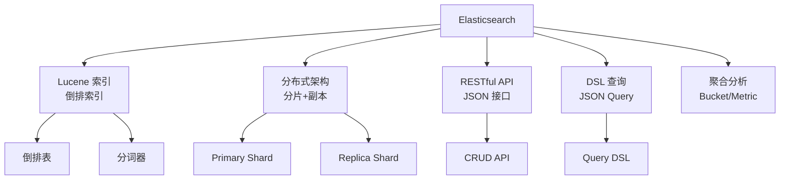

# Elasticsearch 项目概览

## 学习目标

- 了解 Elasticsearch 作为分布式搜索引擎的定位
- 掌握 Elasticsearch 的倒排索引和 Lucene 架构

## 项目定位

> Elasticsearch 是一个基于 Lucene 的分布式搜索和分析引擎，用于全文搜索、结构化搜索和分析。

**基本信息**：
- 开发方：Elastic N.V.
- 首次发布：2010 年
- 开源协议：Elastic License / SSPL
- GitHub Stars：约 68k

## 核心设计



## 索引结构

```json
// 创建索引
PUT /my_index
{
  "settings": {
    "number_of_shards": 3,
    "number_of_replicas": 1
  },
  "mappings": {
    "properties": {
      "title": { "type": "text", "analyzer": "standard" },
      "content": { "type": "text" },
      "date": { "type": "date" },
      "tags": { "type": "keyword" }
    }
  }
}
```

## 要点总结

- 基于 Lucene 倒排索引
- 分布式分片和副本
- RESTful JSON API
- 强大的聚合分析能力

## 思考题

1. Elasticsearch 的分片策略与关系数据库的分区分片有何不同？
2. 倒排索引相比正排索引在搜索场景下有何优势？
3. ES 的副本机制如何保证高可用？