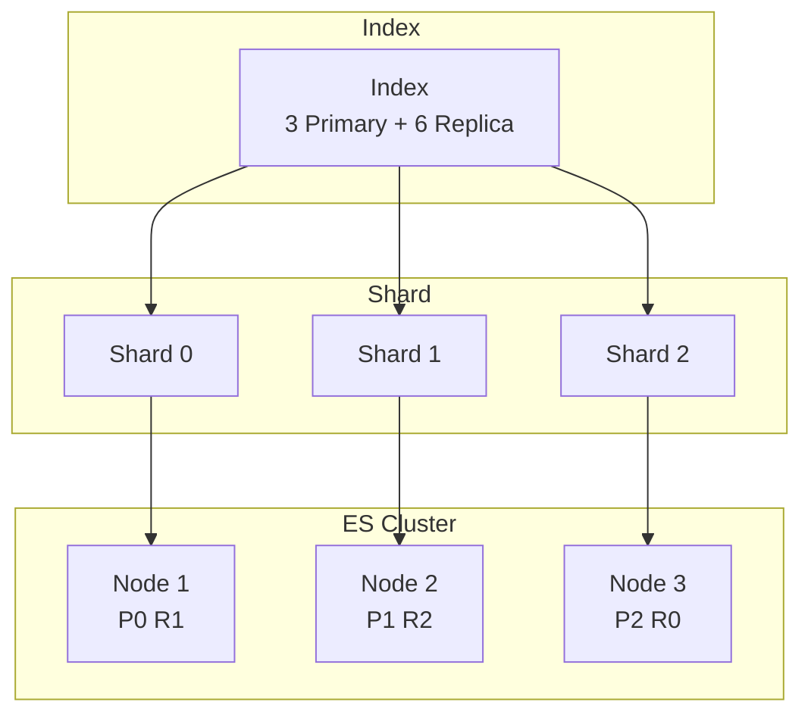
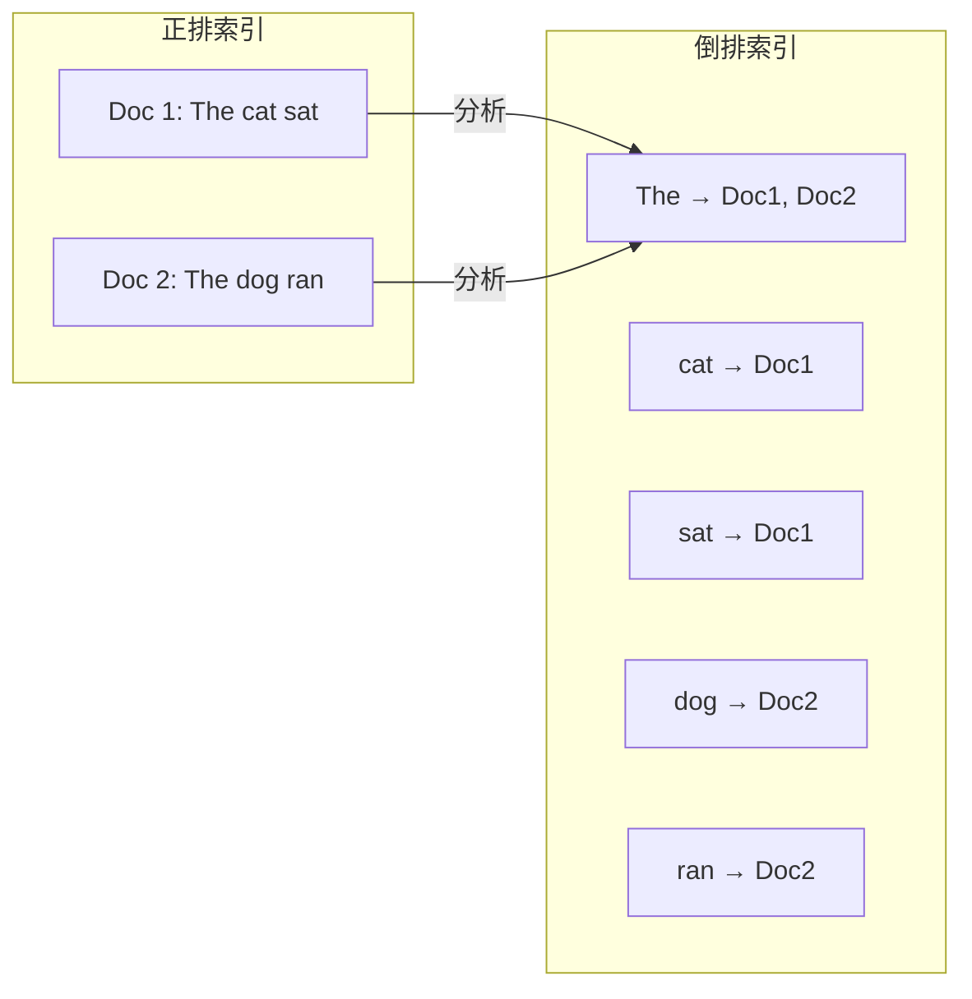
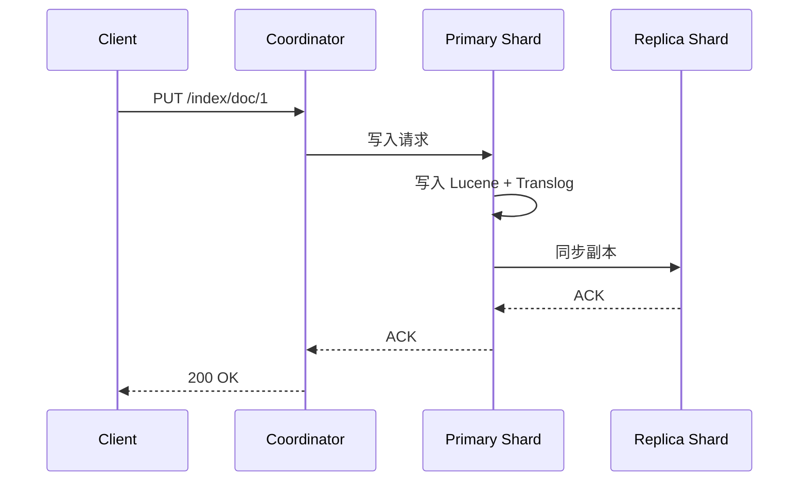

# Elasticsearch 架构设计

## 学习目标

- 理解 Elasticsearch 的分布式架构
- 掌握 Lucene 倒排索引原理

## 分布式架构

```mermaid
graph TB
    subgraph "ES Cluster"
        N1[Node 1<br/>P0 R1]
        N2[Node 2<br/>P1 R2]
        N3[Node 3<br/>P2 R0]
    end

    subgraph "Index"
        I[Index<br/>3 Primary + 6 Replica]
    end

    subgraph "Shard"
        S1[Shard 0]
        S2[Shard 1]
        S3[Shard 2]
    end

    I --> S1
    I --> S2
    I --> S3
    S1 --> N1
    S2 --> N2
    S3 --> N3
```

## Lucene 倒排索引

```mermaid
graph LR
    subgraph "正排索引"
        D1[Doc 1: The cat sat]
        D2[Doc 2: The dog ran]
    end

    subgraph "倒排索引"
        T1[The → Doc1, Doc2]
        T2[cat → Doc1]
        T3[sat → Doc1]
        T4[dog → Doc2]
        T5[ran → Doc2]
    end

    D1 -->|分析| T1
    D2 -->|分析| T1
```

## 写入流程

```mermaid
sequenceDiagram
    participant C as Client
    participant CO as Coordinator
    participant P as Primary Shard
    participant R as Replica Shard

    C->>CO: PUT /index/doc/1
    CO->>P: 写入请求
    P->>P: 写入 Lucene + Translog
    P->>R: 同步副本
    R-->>P: ACK
    P-->>CO: ACK
    CO-->>C: 200 OK
```

## 要点总结

- 分片是独立的 Lucene 索引
- 副本提供高可用和读扩展
- Translog 保证持久性
- Coordinator 节点协调请求