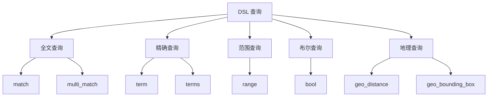
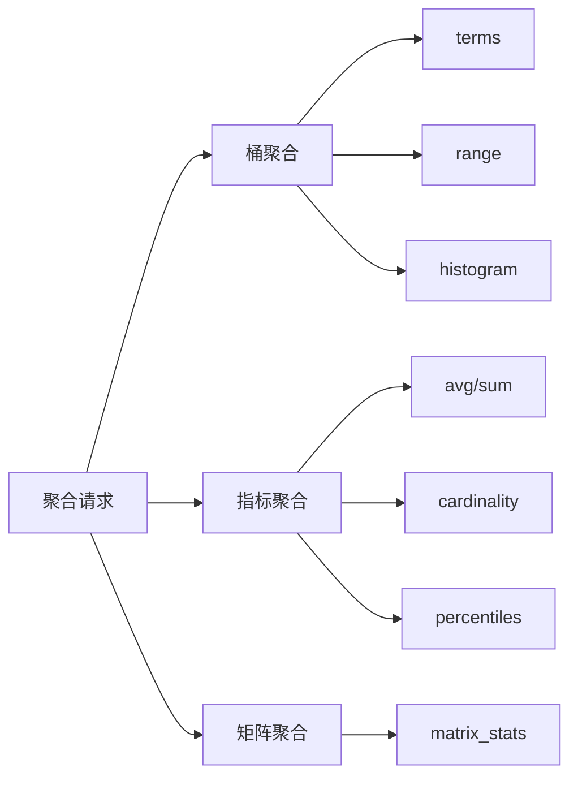
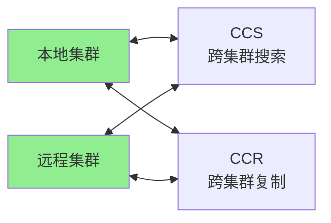
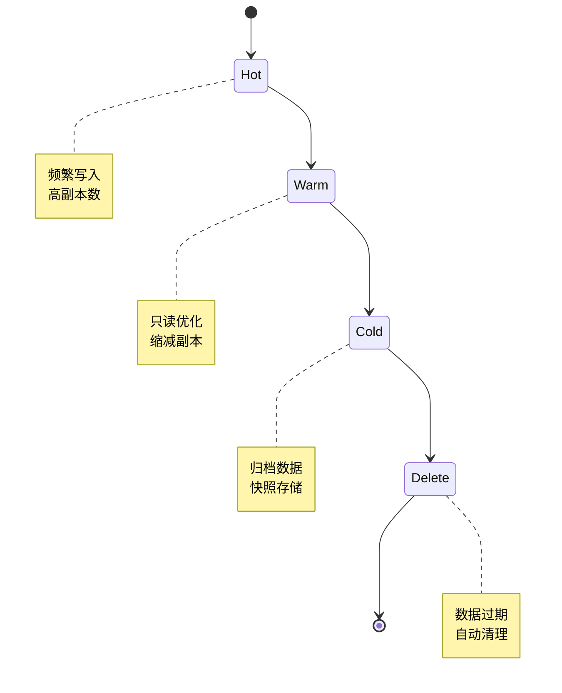

# Elasticsearch 功能特性

## 学习目标
- 掌握 Elasticsearch 的全文检索能力（分词器/同义词/相关性评分）
- 理解 DSL 查询语法（match/term/range/bool/geo）
- 了解聚合分析功能（桶/指标/矩阵聚合）

## 正文

### 全文检索能力

Elasticsearch 提供了强大的全文检索能力，包括：


**分词器体系**：
- `standard`：默认分词器，按词边界分割
- `ik`：中文分词器（需要插件）
- `ngram`：字符级 n-gram 分词
- `自定义分词器`：组合 Char Filter、Tokenizer、Token Filter

**同义词处理**：
```json
{
  "settings": {
    "analysis": {
      "filter": {
        "synonym_filter": {
          "type": "synonym",
          "synonyms": ["dog,狗", "cat,猫"]
        }
      }
    }
  }
}
```

### DSL 查询语法



**主要查询类型**：

```json
// 全文搜索
{ "match": { "title": "elasticsearch 教程" } }

// 精确匹配
{ "term": { "status": "published" } }

// 范围查询
{ "range": { "price": { "gte": 100, "lte": 500 } } }

// 布尔组合
{
  "bool": {
    "must": [{ "match": { "title": "search" } }],
    "should": [{ "term": { "featured": true } }],
    "must_not": [{ "term": { "status": "draft" } }]
  }
}

// 地理查询
{
  "geo_distance": {
    "location": { "lat": 40.73, "lon": -74.1 },
    "distance": "10km"
  }
}
```

### 聚合分析



**聚合示例**：
```json
{
  "size": 0,
  "aggs": {
    "categories": {
      "terms": { "field": "category.keyword", "size": 10 },
      "aggs": {
        "avg_price": { "avg": { "field": "price" } },
        "price_ranges": {
          "range": {
            "field": "price",
            "ranges": [
              { "to": 100 },
              { "from": 100, "to": 500 },
              { "from": 500 }
            ]
          }
        }
      }
    }
  }
}
```

### 跨集群搜索与数据同步



**跨集群搜索（CCS）**：
```json
GET /remote_cluster:index/_search
{
  "query": { "match_all": {} }
}
```

### 索引生命周期管理（ILM）



**ILM 策略配置**：
```json
{
  "policy": {
    "phases": {
      "hot": {
        "actions": {
          "rollover": { "max_age": "7d", "max_size": "50gb" },
          "set_priority": 100
        }
      },
      "warm": {
        "min_age": "30d",
        "actions": {
          "shrink": { "number_of_shards": 1 },
          "forcemerge": { "max_num_segments": 1 },
          "set_priority": 50
        }
      },
      "cold": {
        "min_age": "90d",
        "actions": {
          "freeze": {},
          "set_priority": 0
        }
      },
      "delete": {
        "min_age": "365d",
        "actions": { "delete": {} }
      }
    }
  }
}
```

## 要点总结

1. **全文检索核心**：分词器决定搜索粒度，同义词扩展搜索覆盖，BM25 算法计算相关性
2. **DSL 查询体系**：从简单 match/term 到复杂 bool 组合，再到地理空间查询，形成完整查询能力
3. **聚合分析价值**：不只是搜索，还能对搜索结果进行统计分析，支持桶聚合嵌套指标聚合
4. **跨集群能力**：CCS 实现跨集群统一搜索，CCR 实现数据实时同步，保障高可用
5. **ILM 自动化**：自动管理索引全生命周期，从热数据到冷数据再到删除，优化存储成本

## 思考题

1. 如何设计一个支持中英文混合搜索的分词器策略？
2. 当搜索结果相关性不高时，应该从哪些方面排查和优化？
3. 在日志分析场景中，如何设计聚合来发现异常模式？
