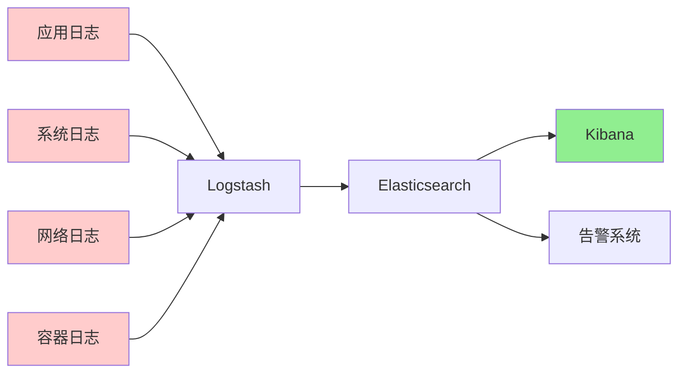
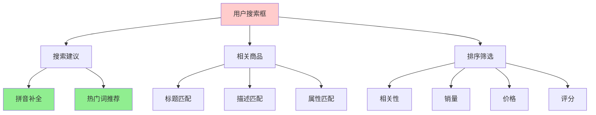
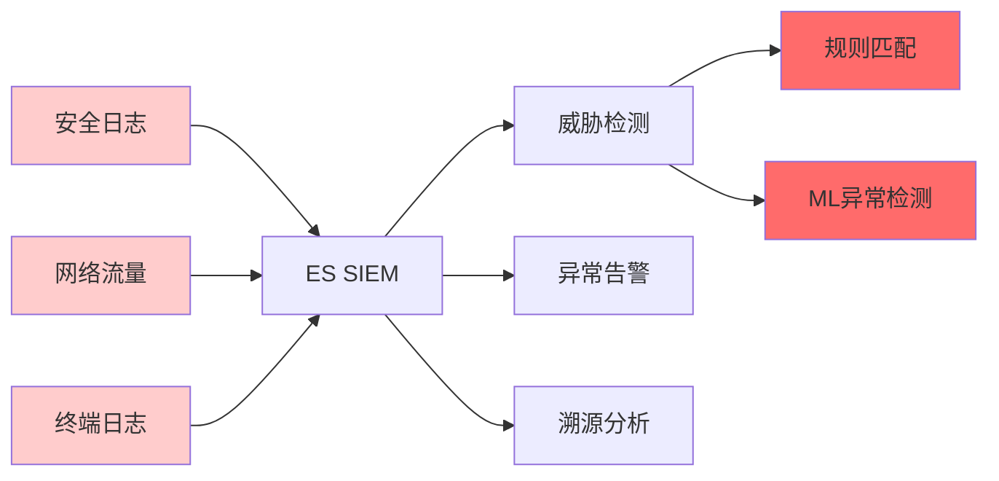

# Elasticsearch 应用场景

## 学习目标
- 理解 ELK Stack 在日志分析中的应用
- 掌握全文搜索在电商/内容平台的应用模式
- 了解 SIEM 安全分析场景的实现思路

## 正文

### 日志分析：ELK Stack

ELK Stack（Elasticsearch + Logstash + Kibana）是最流行的开源日志分析解决方案：



**架构分层**：

| 层级 | 组件 | 职责 |
|------|------|------|
| 采集层 | Filebeat/Fluentd | 轻量级日志采集 |
| 传输层 | Logstash | 日志解析、过滤、转换 |
| 存储层 | Elasticsearch | 日志存储、索引、搜索 |
| 展示层 | Kibana | 可视化、仪表盘、图表 |

**日志字段设计**：
```json
{
  "@timestamp": "2024-01-15T10:30:00Z",
  "level": "ERROR",
  "service": "order-service",
  "trace_id": "abc123",
  "message": "Database connection timeout",
  "host": "10.0.1.100",
  "environment": "production",
  "metadata": {
    "duration_ms": 30000,
    "query": "SELECT * FROM orders"
  }
}
```

### 全文搜索：电商与内容平台



**电商搜索特性**：

| 功能 | 实现方式 | 示例 |
|------|----------|------|
| 拼音搜索 | ngram 分词 + 同义词 | "dianfanbao" → "电饭煲" |
| 品牌纠错 | 拼写容错 + 品牌词典 | "APPLE" 识别为 "Apple" |
| 属性筛选 | term 查询 + 聚合facet | 筛选 "品牌:华为" |
| 价格排序 | 数值范围查询 | "100-500元" |
| 销量排序 | 字段排序 | 按 sales_count 降序 |

**内容平台搜索**：
```json
{
  "query": {
    "bool": {
      "must": [
        { "multi_match": {
          "query": "人工智能",
          "fields": ["title^3", "content", "tags^2"]
        }}
      ],
      "filter": [
        { "term": { "status": "published" } },
        { "range": { "publish_date": { "gte": "2024-01-01" } } }
      ]
    }
  },
  "highlight": {
    "fields": {
      "title": {},
      "content": { "fragment_size": 150 }
    }
  }
}
```

### 安全分析：SIEM 系统



**安全分析查询示例**：

```json
// 检测暴力破解
{
  "query": {
    "bool": {
      "must": [
        { "term": { "event_type": "login_failed" } }
      ],
      "filter": {
        "script": {
          "script": "doc['count'].value > 5"
        }
      },
      "aggs": {
        "by_ip": {
          "terms": { "field": "source_ip" },
          "aggs": {
            "failed_count": { "value_count": { "field": "_id" } }
          }
        }
      }
    }
  }
}

// 横向移动检测
{
  "query": {
    "bool": {
      "must": [
        { "term": { "event_type": "network_connection" } },
        { "script": {
          "script": "doc['dest_port'].value in [22, 3389, 445]"
        }}
      ]
    }
  }
}
```

### 性能对比实验设计

| 场景 | 数据规模 | 关注指标 |
|------|----------|----------|
| 导入性能 | 1000万条/小时 | 吞吐量、延迟 |
| 搜索延迟 | 1000万文档 | P50/P95/P99 |
| 聚合性能 | 1亿文档 | 聚合时间、内存占用 |
| 集群扩展 | 3→6节点 | 吞吐量提升比 |

## 要点总结

1. **ELK Stack 优势**：开源生态完整，从采集到展示全链路覆盖，社区活跃
2. **电商搜索关键**：拼音/纠错支持、属性facet、多字段权重排序、高亮展示
3. **SIEM 场景**：基于规则和 ML 的威胁检测，时间线回溯分析，大规模日志存储
4. **性能基准**：导入速度、查询延迟、聚合性能是核心评估指标

## 思考题

1. 在日志分析场景中，如何设计索引策略来平衡写入性能和查询效率？
2. 如何防止搜索被恶意刷查询请求攻击？
3. SIEM 场景下，如何设计规则来平衡检出率和误报率？
