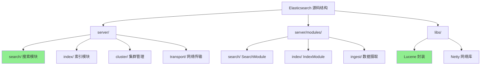
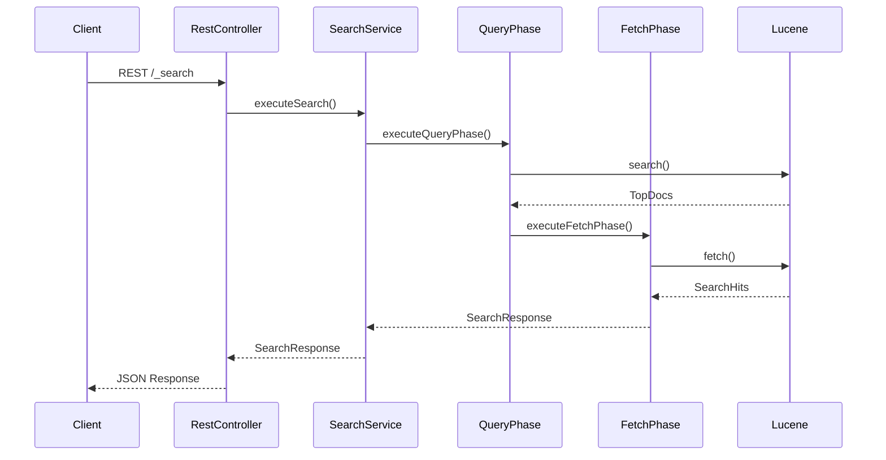
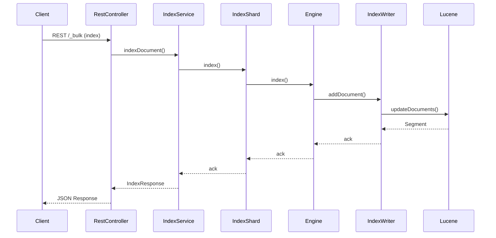
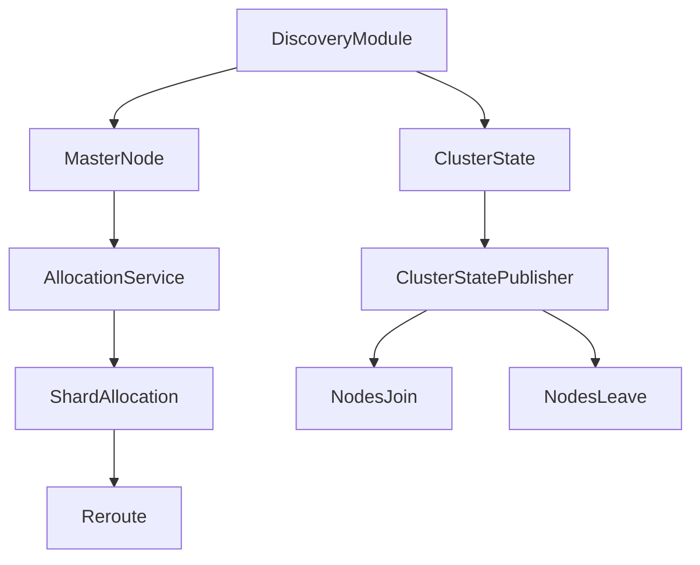

# Elasticsearch 源码阅读指南

## 学习目标
- 了解 Elasticsearch 源码的整体结构
- 掌握核心模块的阅读路径
- 理解搜索引擎的关键实现机制

## 正文

### 源码架构概览



### 源码目录结构

```
server/
├── main/
│   ├── java/org/elasticsearch/
│   │   ├── Elasticsearch.java          # 启动入口
│   │   ├── search/
│   │   │   ├── SearchService.java      # 搜索服务核心
│   │   │   ├── SearchPhaseController.java
│   │   │   ├── query/
│   │   │   │   ├── QueryPhase.java     # 查询阶段控制器
│   │   │   │   └── ScrollQueryPhase.java
│   │   │   ├── rescore/
│   │   │   │   ├── RescorerBuilder.java
│   │   │   │   └── RescorePhase.java
│   │   │   └── fetch/
│   │   │       ├── FetchPhase.java     # 取回阶段
│   │   │       └── FetchContext.java
│   │   ├── index/
│   │   │   ├── IndexService.java       # 索引服务
│   │   │   ├── shard/
│   │   │   │   ├── IndexShard.java     # 分片操作
│   │   │   │   └── ShardIndexLock.java
│   │   │   └── engine/
│   │   │       ├── Engine.java         # 引擎接口
│   │   │       ├── IndexWriter.java    # 写索引
│   │   │       └── SearcherManager.java
│   │   ├── cluster/
│   │   │   ├── ClusterService.java     # 集群状态管理
│   │   │   ├── allocation/
│   │   │   │   ├── ShardsAllocator.java
│   │   │   │   └── RerouteService.java
│   │   │   └── discovery/
│   │   │       └── DiscoveryModule.java
│   │   └── rest/
│   │       ├── RestController.java     # HTTP 路由
│   │       └── handler/
│   │           └── SearchAction.java
│   └── resources/
│       └── elasticsearch.yml           # 默认配置

server/modules/
├── search/
│   └── modules/search/
│       └── SearchModule.java           # 搜索模块注册
├── index/
│   └── modules/index/
│       └── IndexModule.java            # 索引模块注册
└── ingest/
    └── processors/                     # 数据摄取处理器

libs/
├── lucene/
│   └── core/                           # Lucene 核心封装
└── transport-netty4/
    └── TransportNetty4.java            # Netty 网络传输
```

### 关键源码阅读路径

#### 1. 搜索流程路径



**核心文件**：

| 文件 | 职责 | 关键方法 |
|------|------|----------|
| `SearchService.java` | 搜索服务入口，协调查询和取回 | `executeSearch()`, `executeQueryPhase()` |
| `QueryPhase.java` | 执行查询阶段，构建 Query 并搜索 | `execute()` |
| `FetchPhase.java` | 执行取回阶段，提取字段和高亮 | `execute()` |
| `RescorePhase.java` | 重评分阶段，二次排序 | `rescore()` |

#### 2. 索引写入路径



**核心文件**：

| 文件 | 职责 | 关键方法 |
|------|------|----------|
| `IndexService.java` | 索引服务，管理索引级别的操作 | `createIndex()`, `indexDocument()` |
| `IndexShard.java` | 分片操作，处理单分片的读写 | `index()`, `get()` |
| `Engine.java` | 引擎接口，封装 Lucene IndexWriter | `index()`, `get()`, `refresh()` |
| `IndexWriter.java` | 实际写入 Lucene | `addDocument()`, `updateDocuments()` |

#### 3. 集群管理路径



**核心文件**：

| 文件 | 职责 | 关键方法 |
|------|------|----------|
| `DiscoveryModule.java` | 发现机制抽象 | `createDiscovery()` |
| `ClusterService.java` | 集群状态管理 | `submitStateUpdateTask()` |
| `AllocationService.java` | 分片分配策略 | `reroute()` |
| `ZenDiscovery.java` | ZenDiscovery 实现 | `join()`, `sendFollowers()` |

### 阅读建议

**入门路径**：
1. 从 `SearchService.java` 入手，理解搜索请求的完整流程
2. 阅读 `QueryPhase.java`，理解 Query 如何转换为 Lucene 查询
3. 阅读 `FetchPhase.java`，理解搜索结果如何组装
4. 阅读 `IndexShard.java`，理解文档如何写入和读取

**进阶路径**：
1. 阅读 `Engine.java` 和 `IndexWriter.java`，理解写入流程
2. 阅读 `ClusterService.java`，理解集群状态机
3. 阅读 `AllocationService.java`，理解分片分配算法

**工具推荐**：
- IntelliJ IDEA + Elasticsearch 插件
- Sourcegraph 在线阅读
- `git clone https://github.com/elastic/elasticsearch`

## 要点总结

1. **源码组织**：server/ 为主代码目录，modules/ 为可插拔模块，libs/ 为底层库
2. **搜索核心**：SearchService → QueryPhase → FetchPhase 三阶段流程
3. **索引核心**：IndexService → IndexShard → Engine → IndexWriter 写入链路
4. **集群核心**：DiscoveryModule → ClusterService → AllocationService 管理链路
5. **阅读策略**：从入口类开始，顺着调用链路逐层深入

## 思考题

1. Elasticsearch 如何在查询阶段协调多个分片的搜索结果？
2. 搜索结果的分数（score）是如何计算的？Lucene 的 BM25 实现在哪里？
3. 当一个节点加入集群时，分片是如何重新分配的？
