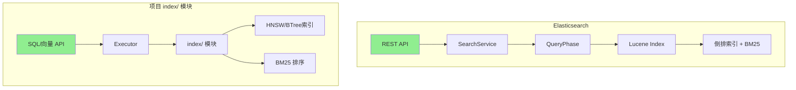
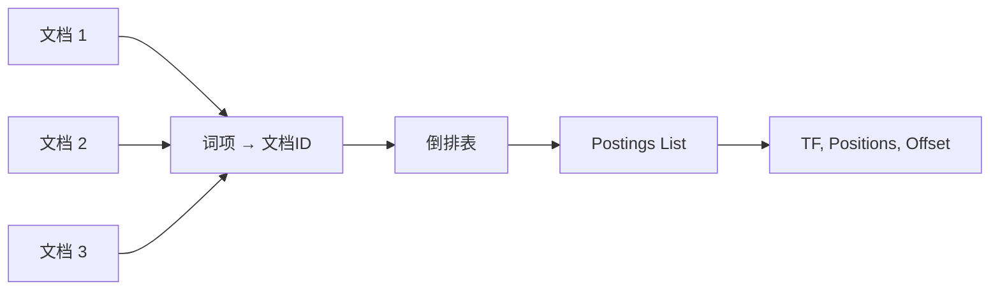
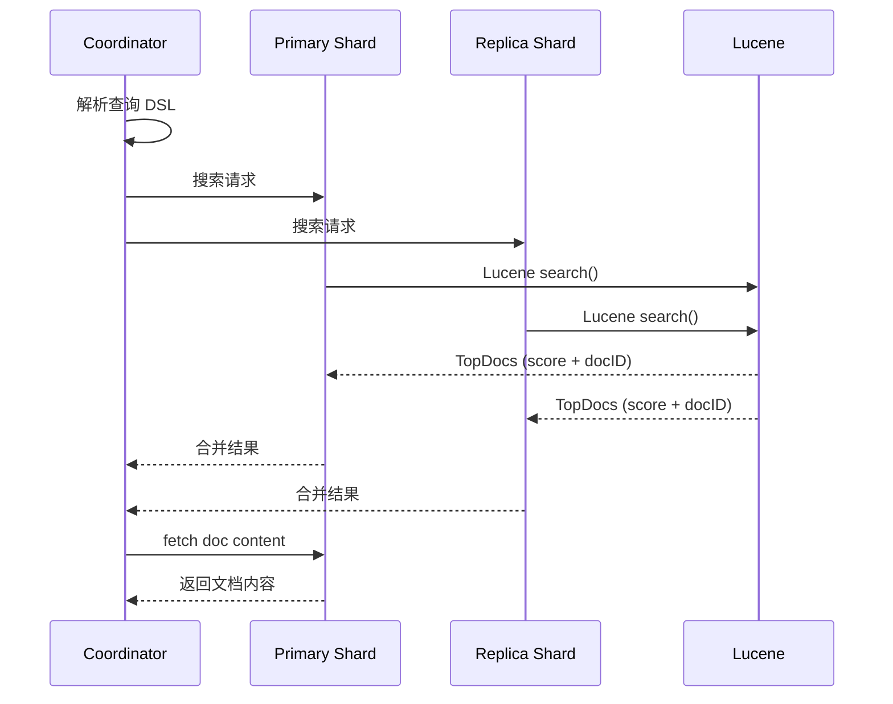
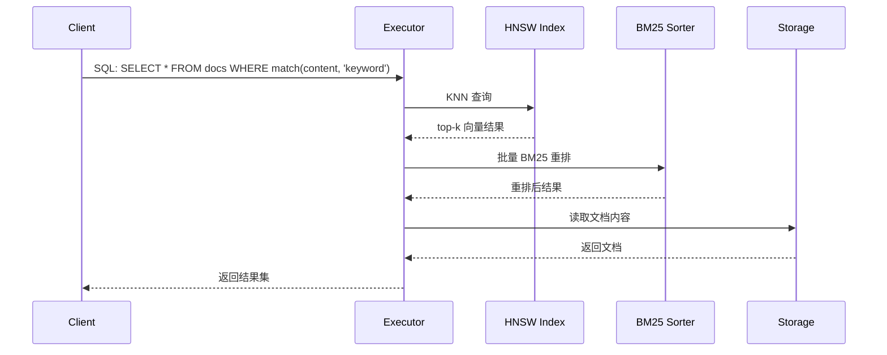
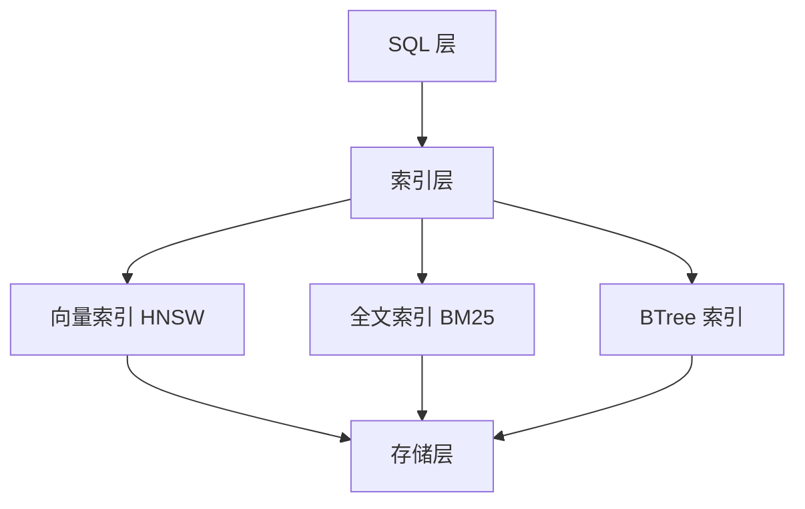

# Elasticsearch 与项目关联

## 学习目标
- 理解 Elasticsearch 的索引架构与项目 index/ 模块的关系
- 对比 Lucene 倒排索引与项目 HNSW/BM25 实现
- 借鉴 ES 的设计思想优化项目架构

## 正文

### 架构对比



### 索引架构对比

| 维度 | Elasticsearch | 项目 index/ 模块 |
|------|---------------|------------------|
| 索引类型 | Lucene 倒排索引 | HNSW 向量 + BTree 键值 |
| 搜索算法 | BM25 | HNSW KNN + BM25 混合 |
| 分片策略 | 哈希分片 | 哈希分片 |
| 副本机制 | 主从副本 | 简单副本 |
| 写入路径 | Translog + Refresh | WAL + 内存索引 |
| 查询路径 | Query + Fetch | 单阶段查询 |

### Lucene 倒排索引 vs 项目实现

**Lucene 倒排索引结构**：



**项目 BM25 实现**：

```c
// 参考 engineering/include/db/bm25.h 或类似实现
typedef struct {
    double k1;           // 词频饱和参数
    double b;            // 文档长度归一化参数
    double avgdl;        // 平均文档长度
    double *idf;         // 逆文档频率
} bm25_params_t;

// BM25 评分公式
double bm25_score(bm25_params_t *params, 
                  double tf,      // 词频
                  double dl,      // 文档长度  
                  double idf) {   // 逆文档频率
    // BM25 = idf * (tf * (k1 + 1)) / (tf + k1 * (1 - b + b * dl / avgdl))
    return idf * (tf * (params->k1 + 1)) / 
           (tf + params->k1 * (1 - params->b + params->b * dl / params->avgdl));
}
```

### 搜索流程对比

**Elasticsearch 搜索流程**：



**项目搜索流程**：



### 设计思想借鉴

#### 1. 分层索引架构

ES 的设计：Lucene 索引（段合并）→ 分片路由 → 集群协调

项目的分层设计：



**借鉴点**：
- 统一的索引接口抽象
- 向量搜索与全文搜索的融合
- 索引与存储的解耦

#### 2. 近实时搜索

ES 通过 Refresh Interval 实现近实时：

```yaml
# ES 配置
index:
  refresh_interval: 1s  # 默认 1 秒刷新
```

**项目实现思路**：
```c
// 项目中可以添加近实时搜索支持
typedef struct {
    uint64_t refresh_interval_ms;
    bool force_refresh;
    uint64_t last_refresh_time;
} nrt_searcher_t;
```

#### 3. 聚合分析能力

ES 的聚合是其强大之处：

```json
{
  "aggs": {
    "by_category": {
      "terms": { "field": "category" },
      "aggs": {
        "avg_price": { "avg": { "field": "price" } }
      }
    }
  }
}
```

**项目扩展方向**：
- 支持 GROUP BY + 聚合函数
- 实现 HAVING 过滤
- 支持多维聚合

### 关键技术对比

| 技术点 | Elasticsearch | 项目实现 | 差距 |
|--------|---------------|----------|------|
| 倒排索引 | Lucene 实现 | 需实现 | 较大 |
| BM25 算法 | 完整实现 | 基础实现 | 中等 |
| HNSW 向量 | 插件支持 | 已有实现 | 较小 |
| 分片路由 | 完整 | 基础 | 较大 |
| 副本同步 | P2P 复制 | 简单复制 | 较大 |
| 聚合能力 | 完整 | 缺失 | 很大 |

## 要点总结

1. **架构相似**：都采用分层架构（API → 执行 → 索引 → 存储）
2. **索引互补**：ES 侧重全文，项目侧重向量搜索，可互补
3. **差距分析**：ES 的倒排索引、分片、聚合能力远超项目
4. **借鉴价值**：分层设计、近实时、聚合框架值得学习
5. **演进方向**：项目可逐步引入 ES 的设计思想

## 思考题

1. 如何在项目中实现类似 ES 的段合并机制来优化写入性能？
2. 项目的 BM25 实现与 Lucene 的 BM25 实现有哪些差异？如何改进？
3. 如何设计一个统一的查询接口，同时支持向量搜索、BM25 搜索和 BTree 索引？
4. 在分布式场景下，如何借鉴 ES 的协调节点设计来优化项目的查询路由？
