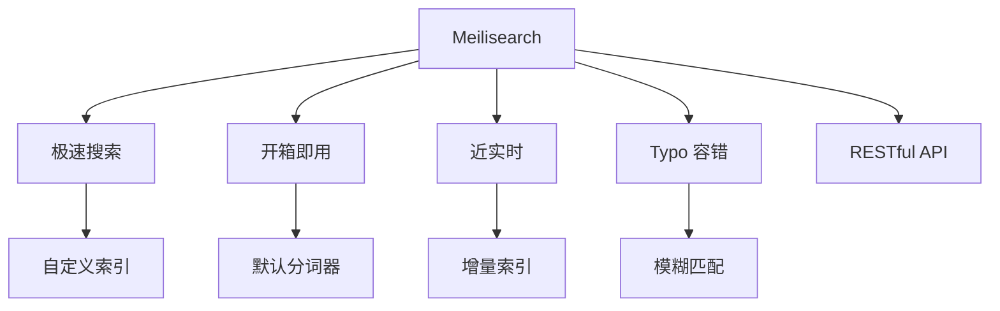

# Meilisearch 项目概览

## 学习目标

- 了解 Meilisearch 作为轻量级快速搜索引擎的定位
- 掌握 Meilisearch 的开箱即用设计

## 项目定位

> Meilisearch 是一个开源的近实时搜索引擎，以极快的速度和开箱即用的体验为特点。

**基本信息**：
- 开发方：Meilisearch
- 首次发布：2018 年
- 开源协议：MIT
- GitHub Stars：约 28k

## 核心设计



## 核心特性

```bash
# 安装
curl -L https://install.meilisearch.com | sh

# 启动
./meilisearch --master-key=my_master_key

# HTTP API
# 添加文档
curl -X POST 'http://localhost:7700/indexes/products/documents' \
  -H 'Authorization: Bearer my_master_key' \
  -H 'Content-Type: application/json' \
  --data-binary '[
    {"id": 1, "title": "iPhone", "price": 999},
    {"id": 2, "title": "MacBook", "price": 1999}
  ]'

# 搜索
curl 'http://localhost:7700/indexes/products/search' \
  -H 'Authorization: Bearer my_master_key' \
  --data-urlencode 'q=i phne'
```

## 要点总结

- 毫秒级搜索响应
- 开箱即用，无需配置
- Typo 容错智能纠错
- Rust 实现高性能
