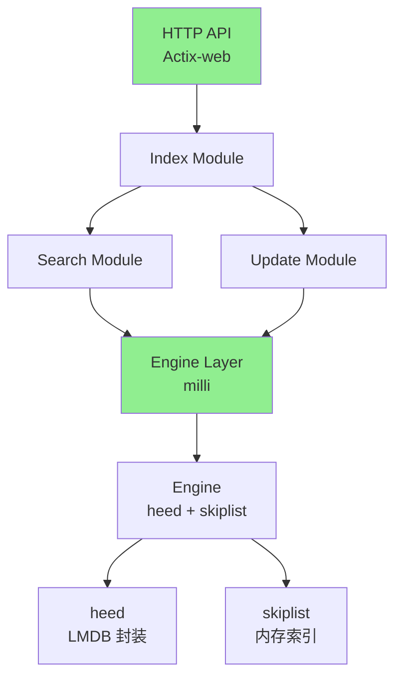
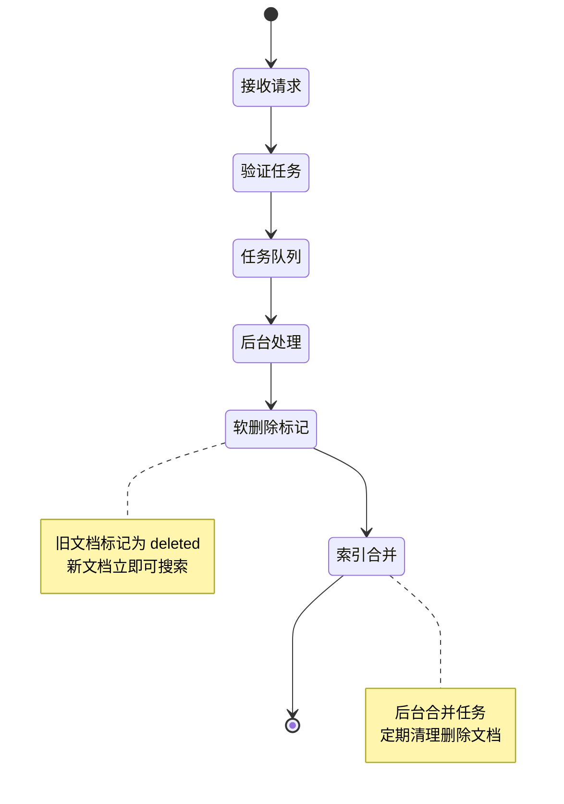
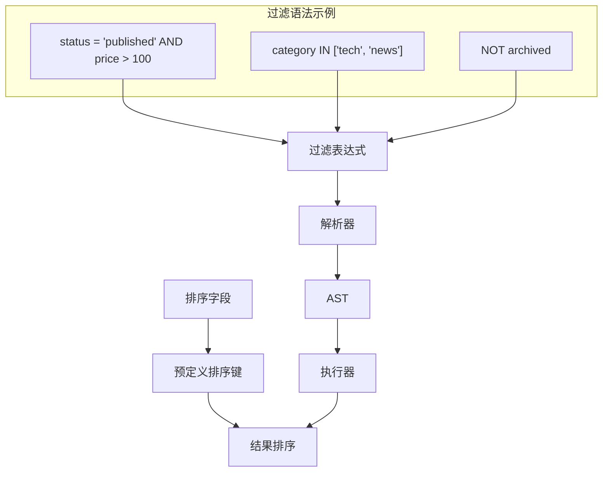

# Meilisearch 架构解析

## 学习目标
- 理解 Meilisearch 的 Rust 架构和核心组件
- 掌握倒排索引和 N-Gram 分词的实现原理
- 了解更新流程和过滤排序机制

## 正文

### Rust 架构概览

Meilisearch 采用纯 Rust 实现，追求高性能和低内存占用：



**核心组件**：

| 组件 | 技术栈 | 职责 |
|------|--------|------|
| HTTP API | Actix-web | RESTful 接口，接收搜索和索引请求 |
| Index Module | Rust | 索引管理，多租户支持 |
| Search Module | Rust | 搜索执行，结果排序 |
| Update Module | Rust | 更新队列，异步任务处理 |
| milli | Rust | 底层搜索引擎核心 |
| heed | Rust | LMDB 键值存储绑定 |
| skiplist | Rust | 内存中的跳表索引 |

### 倒排索引与 N-Gram 分词

```mermaid
graph LR
    A[原始文本] --> B[分词器]
    B --> C[N-Gram 分割]
    C --> D[倒排索引]
    
    subgraph "分词示例"
    A2["hello world"]
    B2["hello", "world"]
    C2["he", "el", "ll", "lo", "lo", "ow", "wo", "or", "rl", "ld"]
    end
    
    A2 --> B2 --> C2
```

**N-Gram 分词策略**：

| 模式 | 分词粒度 | 适用场景 | 示例 |
|------|----------|----------|------|
| 1-gram | 单词 | 英文单词边界 | "hello" → ["hello"] |
| 2-gram | 字符对 | 前缀搜索 | "hel" → ["he", "el", "ll"] |
| 3-gram | 字符三联 | 中文搜索 | "搜索" → ["搜", "索"] |

### 更新流程



**关键机制**：
- **软删除**：文档不立即删除，标记 `deleted` 状态
- **异步处理**：更新任务入队，后台线程处理
- **秒级搜索**：新增文档立即可搜索
- **定期合并**：后台任务清理已删除文档

### 过滤与排序机制



**过滤语法**：

```json
// 过滤条件
filter: "category = 'tech' AND price >= 100 AND author IS NOT NULL"

// 排序
sort: ["price:asc", "created_at:desc"]

// 组合使用
{
  "filter": "genre = 'action' AND (release_year > 2010 OR rating >= 8)",
  "sort": ["rating:desc", "title:asc"],
  "limit": 20,
  "offset": 0
}
```

## 要点总结

1. **Rust 优势**：纯 Rust 实现，无外部依赖，内存安全，性能优异
2. **milli 引擎**：轻量级搜索引擎，支持倒排索引和 N-Gram
3. **软删除策略**：文档标记删除而非立即删除，保证数据一致性
4. **异步更新**：任务队列 + 后台处理，实现近实时索引
5. **过滤排序**：强大的过滤表达式和预定义排序，支持分面搜索

## 思考题

1. Meilisearch 如何保证在更新过程中不影响搜索性能？
2. N-Gram 分词和词级分词各有什么优缺点？
3. 软删除机制会带来哪些存储问题？如何解决？
