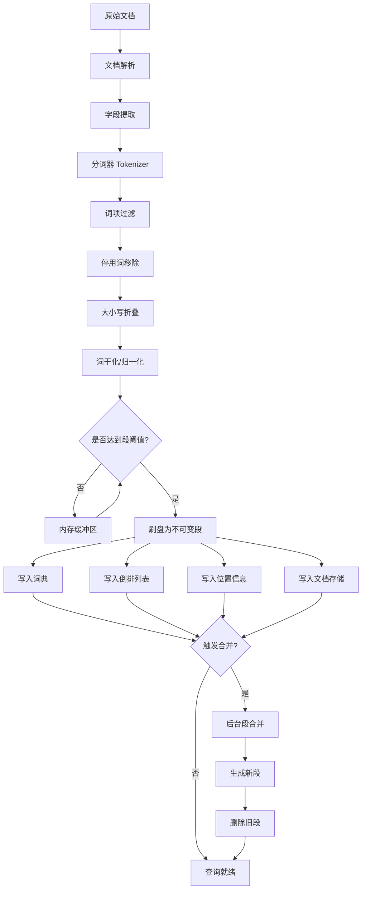

# 索引引擎

## 学习目标

- 理解 Meilisearch 倒排索引的构建与存储机制
- 掌握分词器设计原理及多语言支持方式
- 熟悉段（Segment）管理与合并策略
- 能够对比分析 Meilisearch 索引引擎与本项目 index/ 模块的异同

## 核心概念

### 1. 倒排索引（Inverted Index）

倒排索引是全文搜索引擎的核心数据结构。与正向索引（文档 → 词项）相反，倒排索引记录的是 **词项 → 文档列表** 的映射关系。

```
正向索引: 文档1 → {词A, 词B, 词C}
倒排索引: 词A → {文档1, 文档3, 文档5}
        词B → {文档1, 文档4}
```

Meilisearch 的倒排索引结构包含：

- **词典（Dictionary）**：所有被索引的词项及其元数据
- **倒排列表（Posting List）**：每个词项对应的文档 ID 列表，附带位置信息
- **位置信息（Position）**：词项在文档中出现的具体位置，用于短语查询

#### 索引条目结构

```
词项 "database"
├── 文档频率 (DF): 42
├── 倒排列表
│   ├── 文档1: 权重=0.85, 位置=[3, 17, 45]
│   ├── 文档3: 权重=0.62, 位置=[7, 22]
│   └── 文档5: 权重=0.91, 位置=[12]
└── 元数据: 词性/字段来源
```

### 2. 分词器（Tokenizer）

Meilisearch 使用基于 Unicode 文本分割算法（UAX #29）的分词器，同时支持多种语言的自定义分词规则。

#### 分词流程

```
输入文本 → 字符归一化 → 分词边界识别 → 词项过滤 → 输出词项列表
```

**分词器特性：**

| 特性 | 说明 |
|------|------|
| 多语言支持 | 中文、日文、韩文等 CJK 语言自动检测 |
| 自定义分隔符 | 支持配置分词边界字符 |
| 停用词过滤 | 可配置停用词表，构建索引时跳过 |
| 大小写折叠 | 默认将所有词项转为小写 |
| 同义词扩展 | 索引时同步写入同义词词项 |

#### 中文分词策略

Meilisearch 对中文采用基于词典的机械分词（最大匹配法），配合字符级 N-gram 回退策略：

```
输入: "数据库管理系统"
     → 词典匹配: ["数据库", "管理", "系统"]
     → 字符级回退: ["数", "据", "库", "管", "理", "系", "统"]
     → 索引词项: ["数据库", "管理", "系统", "数", "据", "库", "管", "理", "系", "统"]
```

### 3. 段（Segment）管理

与 LSM-Tree 类似，Meilisearch 采用 **分段存储** 策略管理索引数据。

#### 段的结构

每个段是一个独立的倒排索引，包含：

- 词典文件（Dictionary File）
- 倒排列表文件（Posting List File）
- 位置数据文件（Position Data File）
- 文档存储文件（Document Store）

#### 段生命周期

```
写入缓冲区 (内存)
    │
    ▼
内存段 (Memory Segment)  ← 新文档写入
    │
    │ (达到阈值)
    ▼
不可变段 (Immutable Segment)  → 刷入磁盘
    │
    │ (后台合并)
    ▼
合并段 (Merged Segment)  → 删除旧段
```

#### 段合并策略

Meilisearch 采用**分层合并**（Tiered Merge）策略，平衡写入吞吐与查询性能：

| 层级 | 段数量上限 | 段大小 | 合并触发条件 |
|------|-----------|--------|-------------|
| L0   | 4         | ≤ 1MB  | 达到 4 个 |
| L1   | 4         | ~ 4MB  | L0 合并后 |
| L2   | 4         | ~ 16MB | L1 合并后 |
| L3   | 4         | ~ 64MB | L2 合并后 |
| Ln   | 4         | 4^n MB | 持续向上合并 |

合并过程在后台线程执行，不影响前台查询。合并时会将多个小段合并为一个更大的段，同时清理已删除的文档。

### 4. 索引构建流程



### 5. 索引存储格式

Meilisearch 使用 RocksDB 作为底层存储引擎，将索引数据以键值对形式持久化：

```
键编码: [字段ID] + [词项] + [文档ID] + [位置]
值编码: 权重/频率等元数据
```

这种设计充分利用了 RocksDB 的 LSM-Tree 特性，与 Meilisearch 的段管理天然契合。

## 与项目 index/ 模块的对比

| 维度 | Meilisearch | 本项目 index/ |
|------|-------------|----------------|
| 核心数据结构 | 倒排索引（词项→文档列表） | BM25/HNSW/DiskANN/IVF 等多种索引 |
| 存储引擎 | RocksDB（LSM-Tree） | 自定义磁盘存储 + Buffer Pool |
| 分词器 | 内置多语言分词器 | 词典分词（algo/dict/） |
| 段管理 | 分层合并（Tiered Merge） | 无段概念，采用页面管理 |
| 更新策略 | 不可变段 + 合并 | 原地更新（Buffer Pool 脏页刷盘） |
| 并发控制 | 读写分离（内存段 + 磁盘段） | 锁机制（db/lock/） |
| 评分算法 | BM25（默认） | 自有 BM25 实现 |

### 可借鉴的设计

1. **段合并机制**：本项目 index/ 模块目前缺少类似的分层合并策略，写入放大问题有待优化
2. **分词器管道**：Meilisearch 的分词器管道设计（归一化 → 分词 → 过滤）清晰可复用
3. **读写分离**：内存段接受写入，磁盘段服务查询，减少锁竞争

## 要点总结

1. 倒排索引是全文搜索的核心，将词项映射到文档列表，支持快速关键词检索
2. Meilisearch 的分词器基于 Unicode 文本分割算法，支持 CJK 语言
3. 段管理采用分层合并策略，平衡写入性能与查询效率
4. 底层使用 RocksDB 持久化索引数据，键值编码设计紧凑
5. 不可变段设计简化了并发控制，但带来了写入放大的代价

## 思考题

1. 倒排索引中位置信息为什么对短语查询至关重要？如果不存储位置信息，如何近似实现短语查询？
2. Meilisearch 使用 RocksDB 作为底层存储，如果改为 B-Tree 存储引擎，索引构建和查询性能会有什么变化？
3. 分层合并策略中，段大小按 4 的指数增长，这个倍数是如何影响写入放大和查询性能的？
4. 本项目的 BM25 实现（index/bm25/）与 Meilisearch 的 BM25 评分有何异同？能否复用 Meilisearch 的段合并策略来优化本项目的索引更新？
5. 对于中文分词，Meilisearch 的词典最大匹配法存在哪些局限性？本项目 algo/dict/ 的分词实现能否作为替代方案？