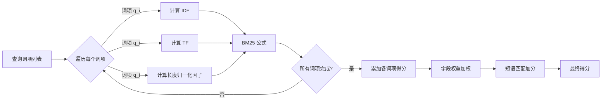
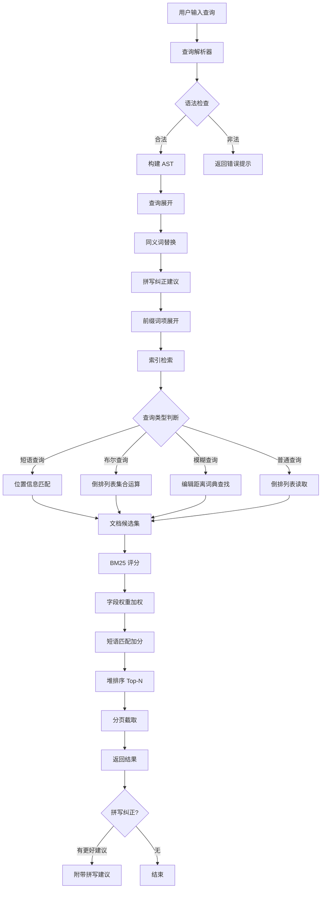

# 查询引擎

## 学习目标

- 理解 Meilisearch 查询解析与执行的整体流程
- 掌握 BM25 评分算法的原理与实现细节
- 区分布尔查询、短语查询、模糊查询的处理方式
- 熟悉结果排序与分页机制
- 建立与本项目 algo/ 模块中 BM25 实现的关联

## 核心概念

### 1. 查询解析与执行流程

Meilisearch 的查询引擎遵循 **解析 → 展开 → 检索 → 评分 → 排序 → 输出** 的流水线设计。

#### 查询执行流水线

```
用户查询串
    │
    ▼
┌──────────────┐
│  查询解析器   │  将查询串解析为 AST（抽象语法树）
│  Parser      │  识别字段限定、布尔运算符、引号短语等
└──────┬───────┘
       │
       ▼
┌──────────────┐
│  查询展开器   │  同义词扩展、拼写纠正建议
│  Expander    │  Prefix query 展开（前缀搜索）
└──────┬───────┘
       │
       ▼
┌──────────────┐
│  索引检索器   │  从倒排索引中读取匹配的文档列表
│  Retriever   │  合并多个词项的倒排列表
└──────┬───────┘
       │
       ▼
┌──────────────┐
│  评分引擎     │  BM25 计算相关性得分
│  Scorer      │  短语匹配加分、字段权重
└──────┬───────┘
       │
       ▼
┌──────────────┐
│  排序器       │  按得分降序 + 自定义排序规则
│  Sorter      │  Top-N 堆排序
└──────┬───────┘
       │
       ▼
┌──────────────┐
│  分页器       │  Offset/Limit 截取结果
│  Paginator   │  返回最终结果集
└──────┬───────┘
       │
       ▼
    查询结果
```

#### 查询 AST 示例

```
查询: "database performance" -mysql author:meilisearch

AST:
    AndQuery
    ├── PhraseQuery("database performance")
    ├── NotQuery("mysql")
    └── FieldQuery(field="author", value="meilisearch")
```

### 2. BM25 评分算法

BM25（Best Matching 25）是 Meilisearch 的默认相关性评分算法，基于概率检索框架。

#### BM25 公式

```
score(D, Q) = Σ (IDF(q_i) * TF(q_i, D) * (k1 + 1)) / (TF(q_i, D) + k1 * (1 - b + b * |D| / avgdl))

其中:
  IDF(q_i) = ln(1 + (N - n(q_i) + 0.5) / (n(q_i) + 0.5))
  TF(q_i, D) = 词项 q_i 在文档 D 中的频率
  |D| = 文档 D 的长度（词项数）
  avgdl = 所有文档的平均长度
  k1 = 饱和控制参数（默认 1.2）
  b = 长度归一化参数（默认 0.75）
  N = 文档总数
  n(q_i) = 包含词项 q_i 的文档数
```

#### 参数调优

| 参数 | 默认值 | 作用 | 调大 | 调小 |
|------|--------|------|------|------|
| k1   | 1.2    | 控制词频饱和度 | 高频词贡献更大 | 抑制高频词 |
| b    | 0.75   | 文档长度归一化 | 惩罚长文档 | 忽略文档长度 |

#### 评分过程



### 3. 查询类型

#### 3.1 布尔查询

布尔查询通过 AND、OR、NOT 逻辑运算符组合多个查询条件。

```
# 隐式 AND（默认）
"database search"  → 匹配同时包含 database 和 search 的文档

# 显式 OR
"database OR search"  → 匹配包含 database 或 search 的文档

# NOT 排除
"-mysql"  → 排除包含 mysql 的文档
```

**实现方式**：倒排列表的交集、并集、差集运算。

#### 3.2 短语查询

短语查询要求词项按指定顺序连续出现。

```
"\"database management\""  → 匹配 "database management" 连续出现
```

**实现方式**：利用倒排索引中的位置信息，检查词项在文档中的位置差是否等于 1。

```
词项 "database" 的位置: [3, 17, 45]
词项 "management" 的位置: [4, 18, 52]

位置差为 1 的匹配: 3→4, 17→18
→ 文档中存在 2 处 "database management" 短语
```

#### 3.3 模糊查询

模糊查询允许词项之间的编辑距离（Levenshtein 距离）在一定范围内。

```
查询: "databse"  → 可匹配 "database"（编辑距离 1）
```

**实现方式**：

1. 在词典中查找与查询词项编辑距离 ≤ 阈值的所有词项
2. 取这些词项的倒排列表并集
3. 评分时按编辑距离给予折扣

**编辑距离阈值**：

| 查询词长度 | 最大编辑距离 |
|-----------|-------------|
| 1-4 字符   | 0（精确匹配）|
| 5-8 字符   | 1           |
| 9+ 字符    | 2           |

### 4. 结果排序与分页

#### 排序规则

Meilisearch 支持多级排序，优先级由高到低：

1. **相关性得分**（默认 BM25 降序）
2. **自定义属性排序**（如价格升序、时间降序）
3. **文档 ID 排序**（稳定排序兜底）

#### 排序策略

```
排序规则 = [
    { "字段": "_score", "方向": "desc" },
    { "字段": "price",  "方向": "asc"  },
    { "字段": "_id",    "方向": "asc"  }
]
```

#### Top-N 堆排序

对于大规模结果集，Meilisearch 使用**堆排序**（最小堆）获取 Top-N 结果，避免全量排序：

```
1. 建立大小为 N 的最小堆
2. 遍历所有候选文档：
   - 如堆未满，直接插入
   - 如堆已满且当前得分 > 堆顶，替换堆顶并下沉
3. 最终堆中即为 Top-N 结果
```

#### 分页

```
GET /indexes/movies/search?q=shrek&limit=20&offset=40

返回: 第 41-60 条结果
```

| 参数 | 默认值 | 最大值 | 说明 |
|------|--------|--------|------|
| limit | 20 | 1000 | 每页结果数 |
| offset | 0 | 无限制 | 跳过的结果数 |

### 5. 查询执行完整流程



## 与项目 algo/ 模块的关联

### BM25 实现对比

本项目 `algo/` 模块中包含 BM25 的实现，位于 `index/bm25/` 目录下。

| 维度 | Meilisearch BM25 | 本项目 BM25 |
|------|------------------|-------------|
| 公式 | 标准 BM25 | 标准 BM25 |
| 参数 | k1=1.2, b=0.75（可配置） | 需自定义 |
| 实现语言 | Rust | C |
| 倒排索引 | RocksDB 存储 | 内存结构 |
| 短语加分 | 支持 | 待实现 |
| 字段权重 | 支持多字段加权 | 单字段模式 |

### 可迁移的设计

1. **评分流水线**：查询 → 检索 → 评分 → 排序的分阶段设计，适合本项目重构查询模块
2. **堆排序**：Top-N 堆排序策略可直接复用到本项目的 `algo/` 排序实现中
3. **编辑距离计算**：模糊查询中的 Levenshtein 距离计算可与本项目 `algo/string/` 中的字符串算法结合

## 要点总结

1. 查询引擎采用流水线架构：解析 → 展开 → 检索 → 评分 → 排序 → 分页
2. BM25 是默认相关性评分算法，k1 控制词频饱和度，b 控制文档长度归一化
3. 短语查询依赖倒排索引中的位置信息，实现词项顺序匹配
4. 模糊查询通过编辑距离在词典中展开近似词项
5. 结果排序采用多级排序规则，Top-N 堆排序避免全量排序开销
6. 分页使用 offset 和 limit 参数，limit 上限 1000

## 思考题

1. BM25 公式中参数 k1 和 b 分别控制什么？在短文本搜索和长文档搜索中，应该分别如何调整这两个参数？
2. 短语查询依赖位置信息，但如果索引不存储位置信息，如何设计一种近似方案来支持短语查询？
3. 模糊查询的编辑距离阈值随查询词长度变化，这种设计是否合理？对于中文查询（每个字符独立成词），阈值策略是否需要调整？
4. 堆排序获取 Top-N 结果的时间复杂度是 O(N log K)，与全量排序 O(N log N) 相比在什么场景下优势最大？
5. 本项目的 BM25 实现（index/bm25/）如果集成 Meilisearch 的字段权重和短语加分机制，需要修改哪些核心代码？