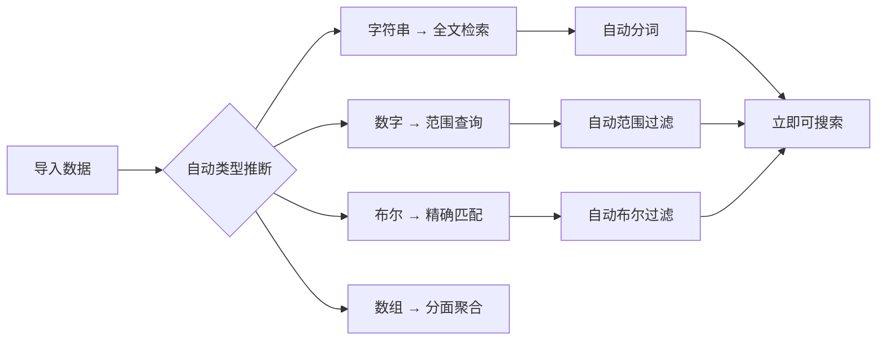
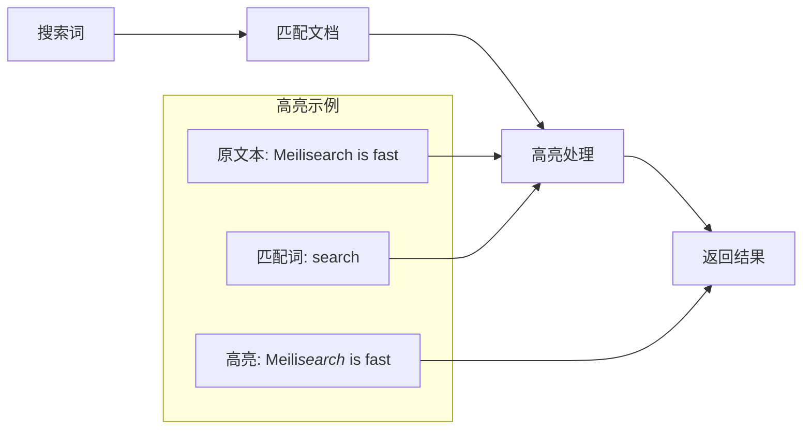
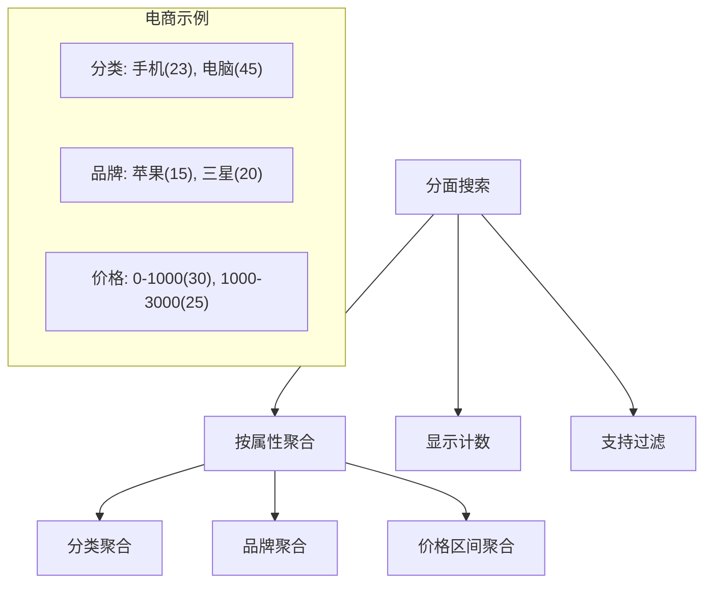

# Meilisearch 功能特性

## 学习目标
- 理解 Meilisearch 的零配置特性
- 掌握拼写容错和高亮显示机制
- 了解同义词和分面搜索功能

## 正文

### 零配置特性

Meilisearch 的核心理念是「开箱即用」，无需复杂配置：



**自动推断示例**：

```json
// 输入文档
{
  "id": 1,
  "title": "Meilisearch 教程",
  "price": 99.9,
  "in_stock": true,
  "tags": ["search", "rust"]
}

// 自动生成索引设置
{
  "searchableAttributes": ["title", "tags"],
  "filterableAttributes": ["price", "in_stock", "tags"],
  "sortableAttributes": ["price"],
  "displayedAttributes": ["id", "title", "price", "in_stock"]
}
```

### 拼写容错

Meilisearch 内置强大的拼写容错能力：

```mermaid
graph LR
    A[用户输入] --> B[Levenshtein 距离]
    B --> C[编辑距离 ≤ 2]
    C --> D[候选词生成]
    D --> E[搜索结果]
    
    subgraph "容错示例"
    F1["Meilsearch" → "Meilisearch"]
    F2["tutoral" → "tutorial"]
    F3["seach" → "search"]
    end
```

**配置参数**：

| 参数 | 默认值 | 说明 |
|------|--------|------|
| `typoTolerance.enabled` | true | 是否启用拼写容错 |
| `typoTolerance.minWordSizeForTypos` | 5 | 触发容错的最小词长 |
| `typoTolerance.oneTypo` | 5 | 单字符错误的最小词长 |
| `typoTolerance.twoTypos` | 9 | 双字符错误的最小词长 |

```json
// 自定义拼写容错
{
  "typoTolerance": {
    "enabled": true,
    "minWordSizeForTypos": {
      "oneTypo": 4,
      "twoTypos": 8
    },
    "disableOnAttributes": ["id", "sku"]
  }
}
```

### 高亮显示



**高亮配置**：

```json
// 搜索请求
{
  "q": "search",
  "attributesToHighlight": ["title", "description"],
  "highlightPreTag": "<mark>",
  "highlightPostTag": "</mark>"
}

// 响应示例
{
  "hits": [{
    "id": 1,
    "title": "Meilisearch Guide",
    "_formatted": {
      "title": "Meili<mark>search</mark> Guide",
      "description": "Fast <mark>search</mark> library"
    }
  }]
}
```

### 同义词支持

```mermaid
graph TD
    A[搜索 "app"] --> B{同义词查找}
    B --> C["app", "application", "app"]
    C --> D[扩展搜索词]
    D --> E[搜索结果]
    
    subgraph "同义词配置"
    F["app ↔ application"]
    G["phone ↔ mobile ↔ cellphone"]
    H["search ↔ find ↔ lookup"]
    end
```

**同义词配置**：

```json
// 设置同义词
{
  "synonyms": {
    "app": ["application", "app"],
    "phone": ["mobile", "cellphone"],
    "search": ["find", "lookup"]
  }
}

// 对称同义词：两边可互换
// 非对称同义词：仅展开到右边
{
  "synonyms": {
    "sneakers": ["shoes"],
    // "sneakers" 搜索时展开为 "sneakers shoes"
    // 但 "shoes" 搜索时只搜索 "shoes"
  }
}
```

### 分面搜索



**分面搜索实现**：

```json
// 搜索请求
{
  "q": "phone",
  "facets": ["category", "brand", "price_range"],
  "facetDistribution": {
    "category": {},
    "brand": { "limit": 10 }
  }
}

// 响应
{
  "facetDistribution": {
    "category": {
      "phone": 23,
      "tablet": 12
    },
    "brand": {
      "apple": 15,
      "samsung": 20,
      "huawei": 8
    }
  }
}
```

## 要点总结

1. **零配置**：自动类型推断、分词、排序，减少配置负担
2. **拼写容错**：基于编辑距离的容错，支持中英文混合场景
3. **高亮显示**：精准标记匹配位置，提升用户体验
4. **同义词**：扩展搜索覆盖，连接相关概念
5. **分面搜索**：多维度聚合统计，支持过滤导航

## 思考题

1. 拼写容错在中文场景下如何实现？需要什么特殊处理？
2. 同义词配置过多会影响搜索性能吗？如何平衡？
3. 分面搜索的聚合计算是实时还是预计算的？
