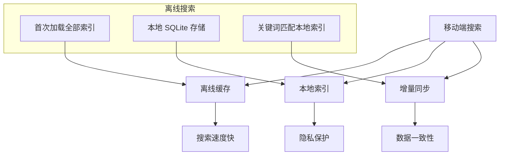
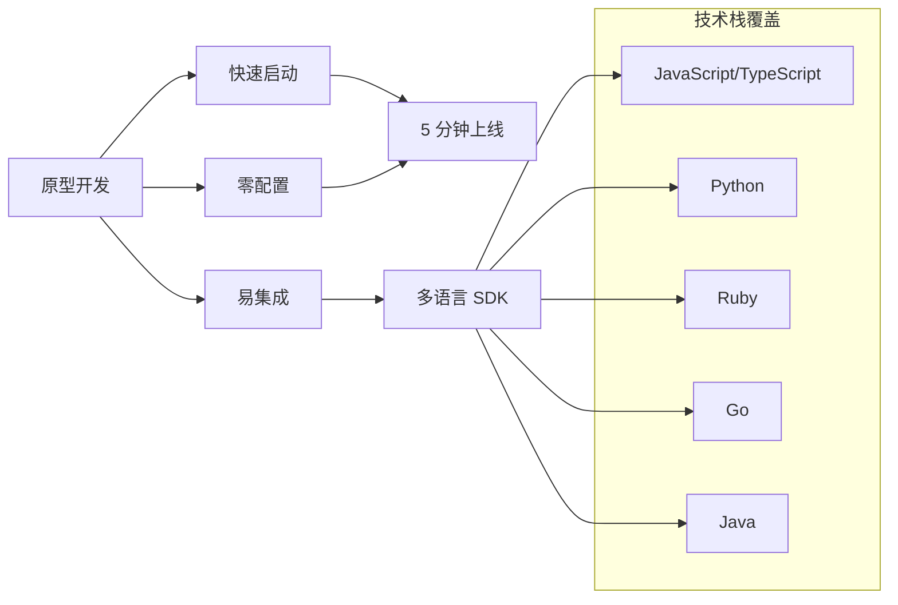

# Meilisearch 应用场景

## 学习目标
- 理解即时搜索在电商和文档场景的应用
- 掌握移动端搜索的优化策略
- 了解原型开发的快速集成方式

## 正文

### 即时搜索场景

Meilisearch 最擅长的场景是即时搜索：

```mermaid
graph LR
    A[用户输入] --> B[实时搜索]
    B --> C[< 50ms 结果]
    C --> D[下拉建议]
    D --> E[即时预览]
    
    subgraph "电商搜索示例"
    F1[输入 "iph"]
    F2["iphone 15", "ipad pro", "airpods"]
    F3[显示商品卡片]
    end
    
    A --> F1
    F2 --> D
    F3 --> E
```

**电商搜索特点**：

| 需求 | Meilisearch 方案 | 优势 |
|------|------------------|------|
| 毫秒级响应 | 内存索引 + 倒排 | < 50ms |
| 拼音搜索 | N-Gram 分词 | 支持前缀 |
| 纠错提示 | 拼写容错 | 自动纠正 |
| 分类筛选 | 分面搜索 | 多维过滤 |
| 相关排序 | 匹配度评分 | 相关性优先 |

**集成示例**：

```javascript
// 电商搜索前端
import { MeiliSearch } from 'meilisearch';

const client = new MeiliSearch({ host: 'http://localhost:7700' });

async function searchProducts(query) {
  const index = client.index('products');
  
  const results = await index.search(query, {
    limit: 10,
    attributesToHighlight: ['name', 'description'],
    facets: ['category', 'brand', 'price_range'],
    filter: 'in_stock = true'
  });
  
  return {
    products: results.hits,
    facets: results.facetDistribution,
    totalHits: results.estimatedTotalHits
  };
}
```

### 移动端搜索



**移动端优化策略**：

| 优化点 | 方案 | 效果 |
|--------|------|------|
| 首次加载 | 分片加载 + 进度显示 | 用户体验 |
| 离线搜索 | 本地索引缓存 | 无网可用 |
| 增量更新 | 只同步变化数据 | 节省流量 |
| 内存占用 | 流式加载 | < 50MB |
| 索引大小 | 压缩 + 懒加载 | 节省存储 |

**Flutter 集成示例**：

```dart
import 'package:meilisearch/meilisearch.dart';

class ProductSearch {
  late MeiliSearchClient _client;
  late Index _index;
  
  Future<void> init() async {
    _client = MeiliSearchClient('http://localhost:7700');
    _index = _client.index('products');
  }
  
  Future<List<Product>> search(String query) async {
    final result = await _index.search(query, SearchQuery(
      limit: 20,
      attributesToHighlight: ['name', 'description'],
    ));
    
    return result.hits.map((hit) => Product.fromJson(hit)).toList();
  }
}
```

### 原型开发



**快速启动示例**：

```bash
# 1. Docker 启动（30 秒）
docker run -d -p 7700:7700 getmeili/meilisearch:latest

# 2. Python 集成
pip install meilisearch

# 3. 索引数据
import meilisearch

client = meilisearch.Client('http://localhost:7700')

# 创建索引
client.create_index('books', {'primaryKey': 'id'})

# 添加文档
client.index('books').add_documents([
    {'id': 1, 'title': 'Python 编程', 'author': '张三'},
    {'id': 2, 'title': 'Rust 实战', 'author': '李四'},
])

# 搜索
results = client.index('books').search('python')
print(results['hits'])  # [{'id': 1, 'title': 'Python 编程', ...}]
```

**适用场景对比**：

| 场景 | 是否适用 | 原因 |
|------|----------|------|
| 原型/MVP | ✅ 极佳 | 零配置，快速上线 |
| 小型项目 | ✅ 适合 | 资源占用低，维护简单 |
| 中型电商 | ✅ 可用 | 需要扩展配置 |
| 大型平台 | ⚠️ 考虑 | ES 更成熟 |
| 实时分析 | ❌ 不适合 | 聚合能力弱 |

## 要点总结

1. **即时搜索**：< 50ms 响应，适合用户输入即搜场景
2. **电商优势**：拼写容错、拼音支持、分面筛选，完整电商搜索能力
3. **移动友好**：轻量级 SDK，离线缓存，本地索引支持
4. **快速开发**：零配置，多语言 SDK，适合原型和 MVP
5. **规模局限**：适合中小规模，大型场景建议 ES

## 思考题

1. 在移动端离线场景下，如何处理索引的增量更新？
2. 电商搜索中的「搜索词补全」功能如何实现？
3. 原型开发选择 Meilisearch 后，如何平滑迁移到 Elasticsearch？
