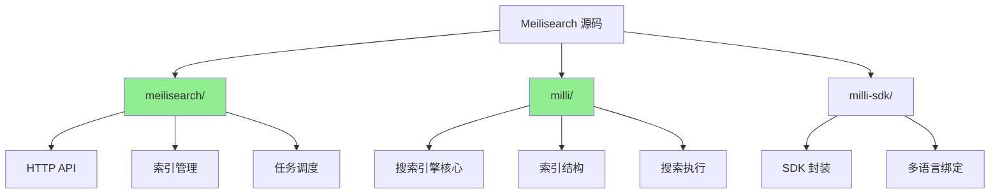
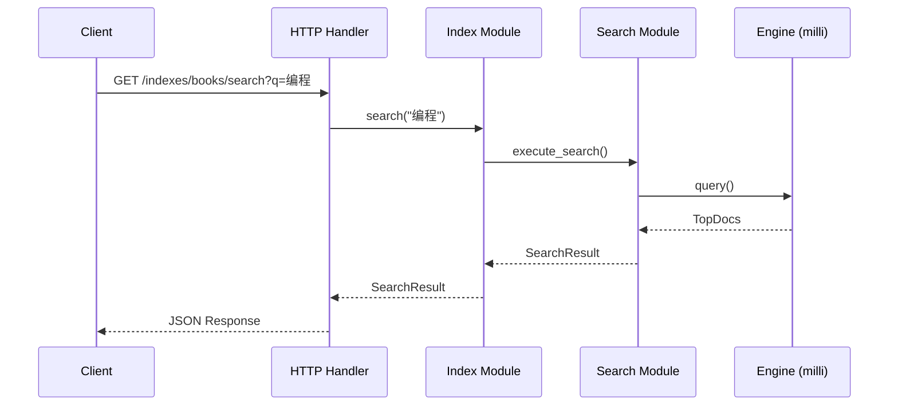
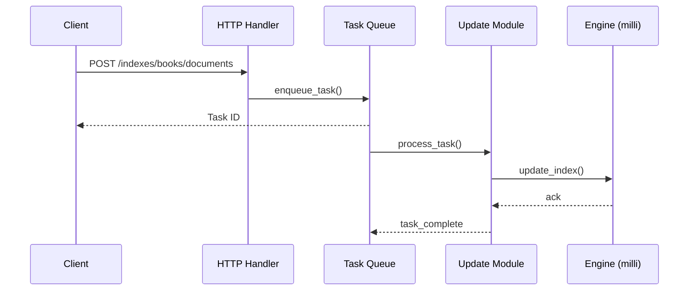
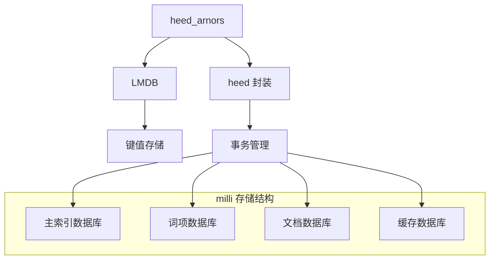

# Meilisearch 源码阅读指南

## 学习目标
- 了解 Meilisearch 的源码结构
- 掌握 milli 搜索引擎核心的阅读路径
- 理解底层存储和索引实现

## 正文

### 源码架构概览



### 源码目录结构

```
meilisearch/
├── src/
│   ├── main.rs                          # 程序入口
│   ├── lib.rs                           # 库入口
│   ├── analytics.rs                     # 统计分析
│   ├── extractors/                      # 请求解析
│   │   ├── mod.rs
│   │   └── query.rs                     # 查询参数解析
│   ├── http/
│   │   ├── mod.rs
│   │   ├── handlers/                    # HTTP 处理器
│   │   │   ├── mod.rs
│   │   │   ├── index.rs                 # 索引操作
│   │   │   ├── search.rs                # 搜索操作
│   │   │   └── task.rs                  # 任务操作
│   │   └── mod.rs
│   └── routes/                          # 路由定义
│       ├── mod.rs
│       ├── index.rs
│       ├── search.rs
│       └── task.rs
│
├── milli/                               # 搜索引擎核心
├── src/
│   ├── lib.rs                           # 库入口
│   ├── index.rs                         # 索引核心
│   ├── search.rs                        # 搜索执行
│   ├── update/                          # 更新模块
│   │   ├── mod.rs
│   │   ├── index_update.rs              # 索引更新
│   │   └── document_addition.rs         # 文档添加
│   ├── heed_arnors/                     # LMDB 封装
│   │   └── mod.rs
│   └── tokenizers/                      # 分词器
│       └── mod.rs
│
├── milli-sdk/                           # SDK
├── src/
│   ├── lib.rs
│   ├── client.rs                        # 客户端
│   ├── index.rs                         # 索引操作
│   ├── search_query.rs                  # 搜索查询
│   └── search_result.rs                 # 搜索结果
│
└── assets/                              # 静态资源
    └── locales/                         # 国际化
```

### 关键源码阅读路径

#### 1. 搜索流程路径



**核心文件**：

| 文件 | 职责 | 关键方法 |
|------|------|----------|
| `search.rs` (http) | 搜索 HTTP 接口 | `search_handler()` |
| `search.rs` (milli) | 搜索执行器 | `execute_search()`, `search()` |
| `index.rs` (milli) | 索引管理 | `search()`, `retrieve()` |
| `tokenizers/` | 分词器实现 | `tokenize()` |

#### 2. 索引更新路径



**核心文件**：

| 文件 | 职责 | 关键方法 |
|------|------|----------|
| `task.rs` | 任务队列管理 | `enqueue()`, `process()` |
| `document_addition.rs` | 文档添加处理 | `add_documents()` |
| `index_update.rs` | 索引更新逻辑 | `update_index()` |

#### 3. 存储层实现



**核心文件**：

| 文件 | 职责 |
|------|------|
| `heed_arnors/mod.rs` | LMDB 封装，提供数据库操作接口 |
| `index.rs` | 索引元数据、文档存储 |
| `search.rs` | 倒排索引、搜索执行 |

### 阅读建议

**入门路径**：
1. 从 `meilisearch/src/http/handlers/search.rs` 入手，理解搜索请求的处理流程
2. 阅读 `milli/src/search.rs`，理解搜索执行的核心逻辑
3. 阅读 `milli/src/index.rs`，理解索引结构和存储
4. 阅读 `milli/src/tokenizers/`，理解分词器实现

**进阶路径**：
1. 阅读 `milli/src/update/`，理解文档更新流程
2. 阅读 `heed_arnors/`，理解底层存储机制
3. 阅读 `meilisearch/src/routes/`，理解 API 路由设计

**工具推荐**：
- Rust 编译器 rustc + cargo
- IntelliJ Rust 插件
- VS Code + rust-analyzer

## 要点总结

1. **三层架构**：meilisearch（API）、milli（引擎）、milli-sdk（SDK）
2. **milli 核心**：索引管理、搜索执行、更新处理是三大核心模块
3. **存储依赖**：heed_arnors 封装 LMDB，提供高性能键值存储
4. **分词器**：支持多种分词器，可扩展自定义分词器
5. **阅读策略**：从 HTTP 入口开始，顺着调用链路深入引擎核心

## 思考题

1. Meilisearch 的搜索流程与 Elasticsearch 有哪些主要区别？
2. milli 的倒排索引结构与 Lucene 相比有什么不同？
3. 为什么 Meilisearch 选择 Rust 实现？有什么优势？
