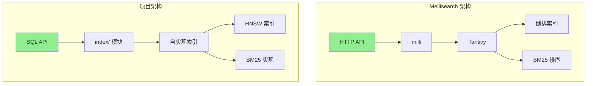
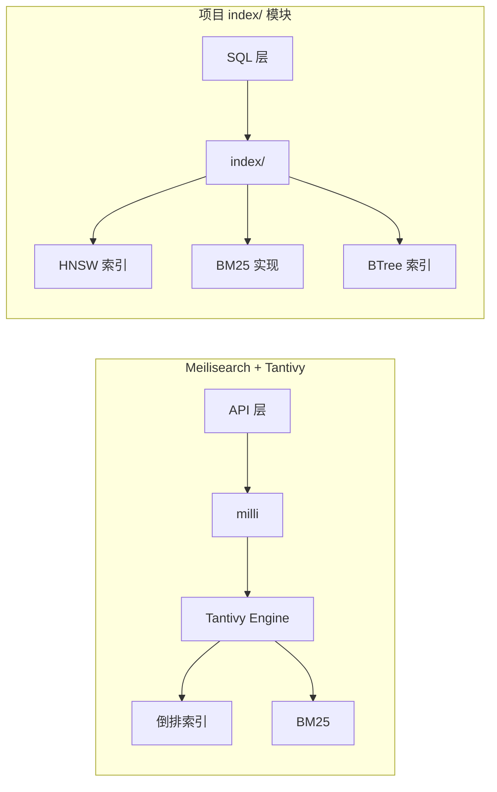
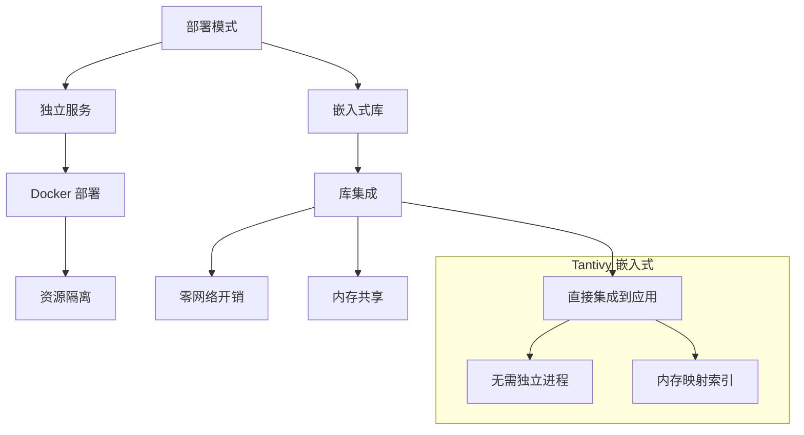
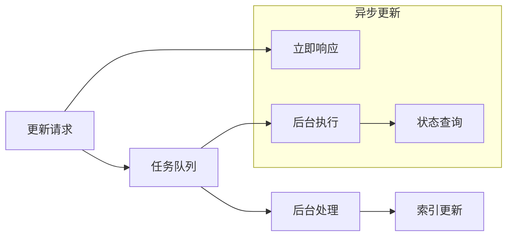
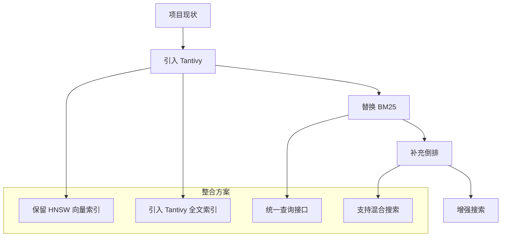

# Meilisearch 与项目关联

## 学习目标
- 理解 Meilisearch 的 Tantivy 底层引擎
- 掌握 Meilisearch 与项目搜索模块的关联
- 借鉴 Meilisearch 的设计优化项目架构

## 正文

### Tantivy 底层引擎

Meilisearch 的底层搜索引擎是 Tantivy（Rust 实现的 Lucene 风格搜索引擎）：



**Tantivy vs Lucene**：

| 维度 | Tantivy | Lucene | 说明 |
|------|---------|--------|------|
| 语言 | Rust | Java | 内存安全、性能 |
| 内存占用 | 低 (~10MB) | 高 (~100MB+) | Rust 优势 |
| 索引速度 | 快 | 快 | 相当 |
| 功能完整性 | 中等 | 完整 | Lucene 更丰富 |
| 生态 | 小 | 大 | Lucene 领先 |

### 架构对比



### 搜索能力对比

| 能力 | Meilisearch | 项目 | 说明 |
|------|-------------|------|------|
| 全文搜索 | Tantivy 倒排 | 自实现 | 功能相当 |
| BM25 排序 | 内置 | 已实现 | 算法相同 |
| 向量搜索 | 无 | HNSW | 项目优势 |
| 过滤搜索 | 支持 | 部分支持 | 可借鉴 |
| 分面搜索 | 支持 | 缺失 | 可借鉴 |
| 高亮显示 | 支持 | 需实现 | 可借鉴 |
| 拼写容错 | 支持 | 需实现 | 可借鉴 |

### 设计思想借鉴

#### 1. 轻量级嵌入式

Meilisearch 的优势是轻量级部署：



**项目可借鉴**：
- tantivy 可作为嵌入式搜索引擎集成到项目中
- 适合边缘计算、IoT 等低资源场景

#### 2. 任务队列设计

Meilisearch 使用任务队列处理更新：



**项目可借鉴**：
- 引入任务队列处理批量更新
- 支持更新状态查询
- 异步执行不影响搜索性能

#### 3. 分面搜索实现

Meilisearch 的 facet 聚合：

```json
{
  "facetDistribution": {
    "category": {
      "phone": 23,
      "tablet": 12,
      "laptop": 8
    }
  }
}
```

**项目可借鉴**：
```c
// 项目中的 facet 实现思路
typedef struct {
    char *field_name;
    int64_t count;
    char *value;
} facet_bucket_t;

typedef struct {
    facet_bucket_t *buckets;
    size_t num_buckets;
} facet_result_t;

// 聚合查询
facet_result_t *aggregate_facet(index_t *idx, const char *field);
```

### 技术整合路径



**整合步骤**：
1. 引入 tantivy 依赖
2. 实现 tantivy 索引模块
3. 封装统一的搜索接口
4. 支持向量搜索 + 全文搜索的混合查询

## 要点总结

1. **Tantivy 价值**：Rust 实现的嵌入式搜索引擎，性能优异，内存占用低
2. **互补优势**：项目有向量搜索，Meilisearch 有全文搜索，可互补
3. **集成价值**：tantivy 可直接集成到项目中，替代自实现 BM25
4. **设计借鉴**：任务队列、分面搜索、高亮显示等设计值得学习
5. **演进路径**：保留 HNSW，引入 Tantivy，实现混合搜索

## 思考题

1. 如何设计一个统一的搜索接口，同时支持 tantivy 全文搜索和 HNSW 向量搜索？
2. 在项目中集成 tantivy 时，如何处理与现有存储的兼容问题？
3. Meilisearch 的任务队列设计是否可以迁移到项目的更新处理中？
