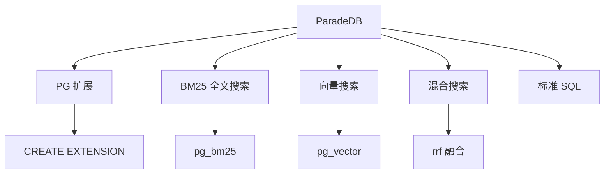

# ParadeDB 项目概览

## 学习目标

- 了解 ParadeDB 作为 PostgreSQL 原生搜索扩展的定位
- 掌握 ParadeDB 的 BM25 全文搜索和向量搜索

## 项目定位

> ParadeDB 是一个 PostgreSQL 扩展，提供 PostgreSQL 原生的全文搜索和向量搜索能力。

**基本信息**：
- 开发方：ParadeDB Inc.
- 首次发布：2023 年
- 开源协议：AGPL v3
- GitHub Stars：约 5k

## 核心设计



## 使用示例

```sql
-- 启用扩展
CREATE EXTENSION paradedb;

-- 创建全文索引
CREATE INDEX idx_search ON products USING pg_bm25(columns => ARRAY['title', 'description']);

-- 全文搜索
SELECT * FROM products
WHERE products.rank_bm25(search_query => 'laptop gaming') <= 5;

-- 创建向量索引
CREATE INDEX idx_vec ON products USING hnsw (embedding vector_cosine_ops);

-- 混合搜索
SELECT *, paradedb.rrf_merge(
    rank_bm25(search_query => 'laptop') OVER (),
    rank_hnsw(embedding => embedding) OVER ()
) AS score
FROM products;
```

## 要点总结

- PostgreSQL 原生扩展
- BM25 全文搜索
- HNSW 向量搜索
- 标准 SQL 接口
