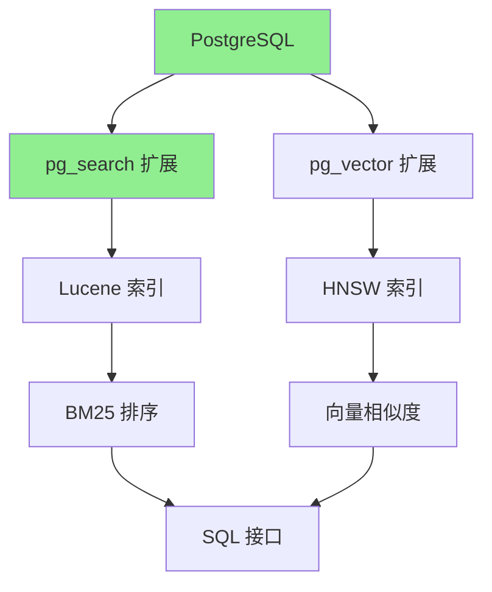
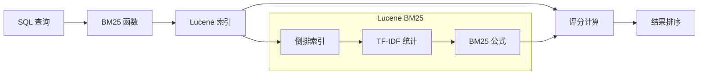
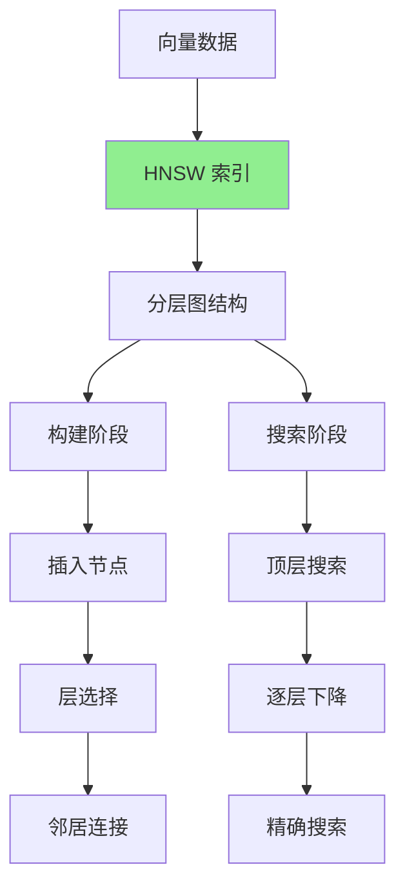
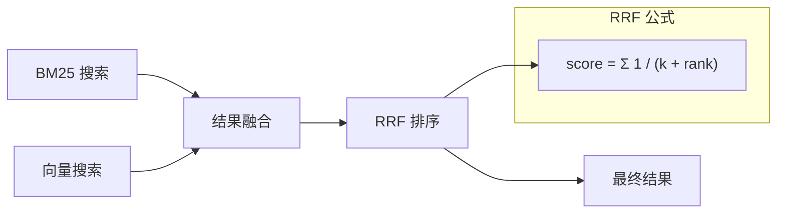

# ParadeDB 架构解析

## 学习目标
- 理解 ParadeDB 的 PostgreSQL 扩展架构
- 掌握 BM25 实现原理（基于 Lucene）
- 了解 HNSW 向量索引集成和混合搜索机制

## 正文

### PostgreSQL 扩展架构

ParadeDB 是 PostgreSQL 的扩展，提供类似 Elasticsearch 的搜索能力：



**扩展架构**：

| 扩展名 | 功能 | 底层引擎 |
|--------|------|----------|
| `pg_search` | 全文搜索 | Lucene (via pg_lucene) |
| `pg_vector` | 向量搜索 | HNSW (via pgvector) |

### BM25 实现

ParadeDB 的 BM25 基于 Lucene 实现：



**BM25 SQL 接口**：

```sql
-- 创建 BM25 索引
CREATE INDEX idx_articles_search ON articles 
USING bm25 (articles) 
WITH (text_search_fields = '{title, content, author}');

-- BM25 搜索查询
SELECT id, title, 
       bm25(articles) AS score
FROM articles
WHERE bm25(articles, query => 'postgresql tutorial') 
      USING must
ORDER BY score DESC;

-- 带过滤的搜索
SELECT * FROM articles
WHERE bm25(articles, query => 'database', 
                 filter => 'category = ''tech'' AND year >= 2023')
USING must
LIMIT 10;
```

### HNSW 向量索引

ParadeDB 集成了 HNSW 向量索引：



**HNSW SQL 接口**：

```sql
-- 创建 HNSW 索引
CREATE INDEX idx_embeddings ON documents
USING hnsw (embedding vector_cosine_ops)
WITH (m = 16, ef_construction = 128);

-- 向量相似度搜索
SELECT id, 
       1 - (embedding <=> '[0.1, 0.2, ...]') AS similarity
FROM documents
ORDER BY embedding <=> '[0.1, 0.2, ...]'
LIMIT 10;

-- 带预过滤的搜索
SELECT * FROM documents
WHERE category = 'tech'
ORDER BY embedding <=> '[0.1, 0.2, ...]'
LIMIT 5;
```

### 混合搜索（RRF 融合）



**混合搜索 SQL**：

```sql
-- BM25 + 向量混合搜索
SELECT * FROM documents
WHERE 
    bm25(articles, query => 'postgresql') USING must
    OR
    embedding <=> '[0.1, 0.2, ...]' < 0.5
ORDER BY 
    -- RRF 融合
    ts_rank(articles, query => 'postgresql') + 
    (1 - (embedding <=> '[0.1, 0.2, ...]')) DESC
LIMIT 20;

-- 使用 hybrid() 函数（推荐）
SELECT * FROM documents
WHERE id IN (
    SELECT id FROM hybrid(
        bm25_query => (articles, 'postgresql'),
        vector_query => (embedding, '[0.1, 0.2, ...]', 10),
        method => 'rrf'
    )
);
```

## 要点总结

1. **PG 扩展**：ParadeDB 是 PostgreSQL 扩展，无需独立服务，融入 PG 生态
2. **BM25 实现**：基于 Lucene，SQL 接口简洁，性能优异
3. **HNSW 集成**：集成 pgvector 的 HNSW 向量索引，支持向量相似度搜索
4. **混合搜索**：支持 BM25 + 向量的混合搜索，通过 RRF 融合排序
5. **统一 SQL**：全文搜索和向量搜索使用统一 SQL 接口

## 思考题

1. ParadeDB 的 Lucene 索引与 Elasticsearch 的 Lucene 索引有什么异同？
2. RRF（Reciprocal Rank Fusion）融合算法相比简单分数相加有什么优势？
3. 在 PostgreSQL 中实现全文搜索相比独立搜索引擎有哪些优势和挑战？
