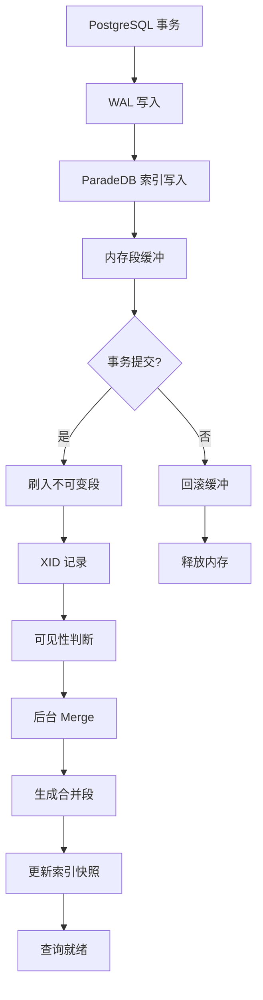
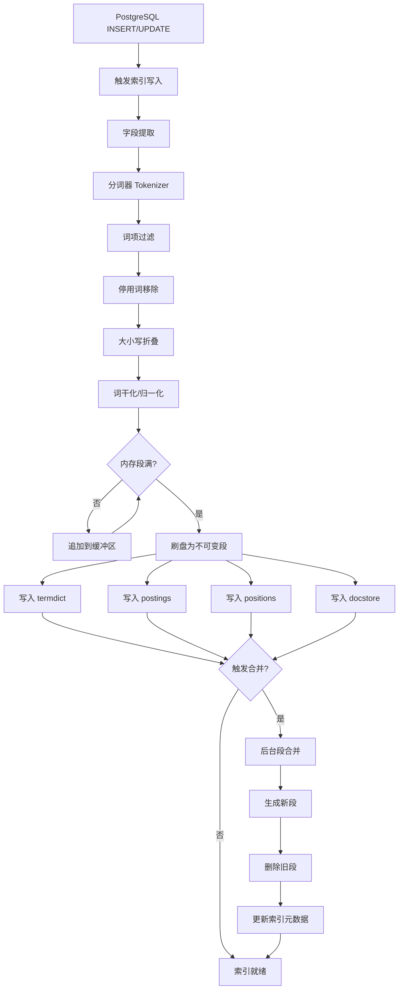

# 索引引擎

## 学习目标

- 理解 ParadeDB 基于 Tantivy/Lucene 的倒排索引构建与存储机制
- 掌握分词器（Tokenizer）设计与 PostgreSQL 原生集成的实现方式
- 熟悉段（Segment）管理与合并策略
- 能够对比分析 ParadeDB 索引引擎与本项目 `db/index/` 模块的异同

## 核心概念

### 1. 倒排索引（Inverted Index）

ParadeDB 的倒排索引基于 **Tantivy**（Rust 版 Lucene）构建，作为 PostgreSQL 扩展运行在数据库进程内。

```
正向索引: 文档1 → {词A, 词B, 词C}
倒排索引: 词A → {文档1, 文档3, 文档5}
         词B → {文档1, 文档4}
```

#### ParadeDB 倒排索引结构

```
词项 "postgresql"
├── 文档频率 (DF): 128
├── 倒排列表
│   ├── 文档1: TF=3, 位置=[5, 17, 42], 字段=title
│   ├── 文档7: TF=1, 位置=[12], 字段=content
│   └── 文档23: TF=5, 位置=[3, 8, 15, 67, 89], 字段=title
├── 词项元数据: 词性/字段权重
└── BM25 统计: avgdl, N, n(q_i)
```

#### 与 PostgreSQL 原生 GIN 索引的对比

| 维度 | ParadeDB 倒排索引 | PostgreSQL GIN 索引 |
|------|------------------|---------------------|
| 评分算法 | BM25（带 TF/IDF/位置） | 无评分，仅布尔匹配 |
| 位置信息 | 支持（短语查询） | 不支持 |
| 多字段权重 | 支持 `text_search_fields` 权重配置 | 单字段索引 |
| 存储引擎 | Tantivy Segment（独立文件） | Buffer Pool + 堆表页面 |
| 分词器 | Tantivy Tokenizer（可自定义） | PG 内置分词器（有限） |

### 2. 分词器（Tokenizer）

ParadeDB 的分词器由 Tantivy 提供，通过 SQL 语法配置。

#### 分词流程

```
原始文本 → 字符归一化 → 分词边界识别 → 词项过滤 → 输出词项列表
           │               │              │
           ↓               ↓              ↓
         Unicode       UAX #29        停用词/
         大小写折叠    边界检测        同义词扩展
```

#### 分词器配置

```sql
-- 创建带分词配置的索引
CREATE INDEX idx_search ON articles
USING bm25 (articles)
WITH (
    text_search_fields = '{"title": 2.0, "content": 1.0}',
    tokenizer = 'en_stem'  -- 英文词干化
);

-- 支持的分词器类型
-- default: 标准 Unicode 分词
-- en_stem: 英文词干化（running → run）
-- ngram: N-gram 分词（适合 CJK 语言）
-- whitespace: 空格分词
```

#### 中文分词策略

ParadeDB 对中文默认采用 **字符级分词** 或 **N-gram 分词**：

```
输入: "数据库管理系统"
      → 2-gram: ["数据", "据库", "库管", "管理", "理系", "系统"]
      → 字符级: ["数", "据", "库", "管", "理", "系", "统"]
```

> **注意**：ParadeDB 暂无内置中文词典分词，需要用户预先分词或使用 N-gram 模式。

### 3. 段（Segment）管理

ParadeDB 继承 Tantivy 的分段存储策略，与 PostgreSQL 的 MVCC 机制协同工作。

#### 段的结构

每个段是一个独立的倒排索引单元：

```
Segment 文件结构
├── meta.json          # 段元数据（文档数、字段定义）
├── termdict.bin       # 词项字典（FST 编码）
├── postings.bin       # 倒排列表（压缩存储）
├── positions.bin      # 位置信息（可选）
├── docstore.bin       # 文档存储（原文）
└── deletions.bin      # 删除标记位图
```

#### 段生命周期

```
写入缓冲区 (内存)
    │
    ▼
内存段 (Memory Segment)  ← PostgreSQL INSERT/UPDATE 触发
    │
    │ (达到阈值或事务提交)
    ▼
不可变段 (Immutable Segment)  → 刷入磁盘
    │
    │ (后台 Merge 线程)
    ▼
合并段 (Merged Segment)  → 删除旧段 + 更新索引元数据
```

#### 与 PostgreSQL MVCC 的协同



**MVCC 可见性规则**：
- 每个 Segment 记录创建事务的 XID
- 查询时通过 PG 的快照机制判断段可见性
- 已删除文档通过 `deletions.bin` 位图标记

#### 段合并策略

Tantivy 采用**分层合并**（Tiered Merge）策略：

| 层级 | 段数量上限 | 段大小范围 | 合并触发条件 |
|------|-----------|-----------|-------------|
| L0   | 4         | ≤ 1MB     | 达到 4 个 |
| L1   | 4         | 1-4MB     | L0 合并后 |
| L2   | 4         | 4-16MB    | L1 合并后 |
| Ln   | 4         | 4^n MB    | 持续向上合并 |

### 4. 索引构建流程



### 5. 索引存储格式

ParadeDB 的索引文件存储在 PostgreSQL 的数据目录下：

```
$PGDATA/base/<db_oid>/<rel_oid>/
├── bm25_index_meta.bin     # 索引元数据
├── segment_001/             # 段目录
│   ├── meta.json
│   ├── termdict.bin
│   ├── postings.bin
│   └── positions.bin
├── segment_002/
│   └── ...
└── segment_merged_001/      # 合并后的段
    └── ...
```

**键编码设计**：

```
倒排列表键: [字段ID] + [词项哈希] + [文档ID]
位置信息键: [字段ID] + [词项哈希] + [文档ID] + [位置偏移]
```

## 与项目 db/index/ 模块的对比

| 维度 | ParadeDB | 本项目 db/index/ |
|------|----------|------------------|
| 核心数据结构 | 倒排索引（Tantivy Segment） | BM25 + HNSW + DiskANN + IVF 多索引 |
| 存储引擎 | Tantivy 文件格式（独立文件） | PostgreSQL Buffer Pool + 堆表页面 |
| 分词器 | Tantivy Tokenizer（可配置） | dict.h 词典分词（algo-prod/dict/） |
| 段管理 | 分层合并（Tiered Merge） | 无段概念，采用 Buffer Pool 页面管理 |
| 更新策略 | 不可变段 + 合并 | Buffer Pool 脏页刷盘 + WAL |
| 并发控制 | PG MVCC + Segment XID | 锁机制（db/lock/）+ MVCC（MVCC 事务） |
| 评分算法 | BM25（Lucene 实现） | BM25（自有实现，bm25.h） |
| 位置信息 | 支持（短语查询） | 暂不支持 |
| PostgreSQL 集成 | 原生扩展（CREATE EXTENSION） | 独立存储引擎，无 PG 依赖 |

### 可借鉴的设计

1. **段合并机制**：本项目 `db/index/vector_index/streaming/` 可借鉴 Tantivy 的分层合并策略，优化写入放大问题

2. **MVCC 可见性集成**：ParadeDB 将 Segment 与 PG XID 绑定的设计，可借鉴到本项目的 `db/index/index_mvcc.c`

3. **分词器管道**：Tantivy 的归一化 → 分词 → 过滤管道设计，可与本项目 `algo-prod/dict/` 集成

4. **位置信息存储**：ParadeDB 的位置信息设计可用于增强本项目 BM25 的短语查询能力

### 本项目 BM25 实现对比

```c
// 本项目 BM25 接口（engineering/include/db/index/vector_index/BM25/bm25.h）
typedef struct bm25_params {
    float k1;           // 词频饱和参数
    float b;            // 长度归一化参数
    int32_t candidate_queue_size;
    bm25_search_algorithm_t search_algorithm;  // TAAT/DAAT
} bm25_params_t;

// ParadeDB BM25 参数（等价配置）
// k1 = 1.2 (默认), b = 0.75 (默认)
// 搜索策略: TAAT (Term-At-A-Time) / DAAT (Document-At-A-Time)
```

**差异点**：
- 本项目 BM25 支持外部词典分词（`dict_t *tokenizer`）
- ParadeDB BM25 支持位置信息（短语查询），本项目暂不支持
- 本项目 BM25 支持 TAAT/DAAT 两种搜索策略切换，ParadeDB 基于 Tantivy 的 WAL 模式

## 要点总结

1. ParadeDB 基于 Tantivy 构建倒排索引，作为 PostgreSQL 扩展运行，充分利用 PG 的事务和 MVCC 机制

2. 分词器由 Tantivy 提供，支持多语言配置，中文默认采用 N-gram 模式

3. 段管理采用分层合并策略，与 PostgreSQL 的 MVCC 协同工作，每个段记录创建事务的 XID

4. 索引文件存储在 PostgreSQL 数据目录下，采用独立的 Segment 文件格式

5. 与本项目 `db/index/` 模块相比，ParadeDB 的优势在于 PostgreSQL 原生集成和位置信息支持

## 思考题

1. ParadeDB 的 Segment 与 PostgreSQL 的 MVCC 机制如何协同工作？在事务回滚时，已写入的段如何处理？

2. 本项目的 BM25 实现（`engineering/src/db/index/vector_index/BM25/`）如果要支持位置信息，需要修改哪些核心结构？

3. Tantivy 的分层合并策略中，段大小按 4 的指数增长，这个倍数如何影响写入放大和查询性能？

4. 对于中文搜索，ParadeDB 的 N-gram 分词与本项目 `algo-prod/dict/` 的词典分词各有什么优缺点？

5. 如果要将 ParadeDB 的段管理机制引入本项目 `db/index/vector_index/streaming/`，需要考虑哪些与现有 Buffer Pool 的集成问题？