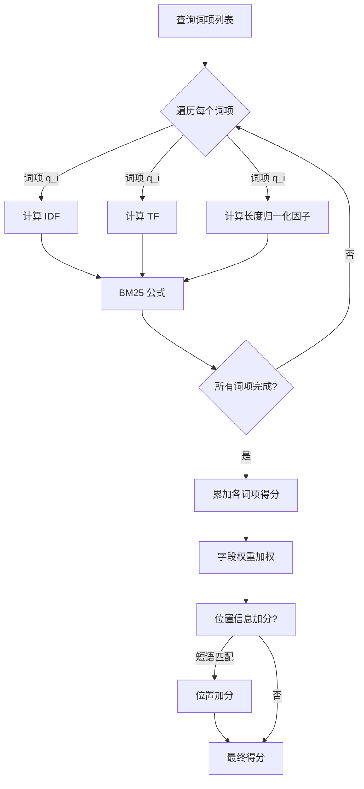
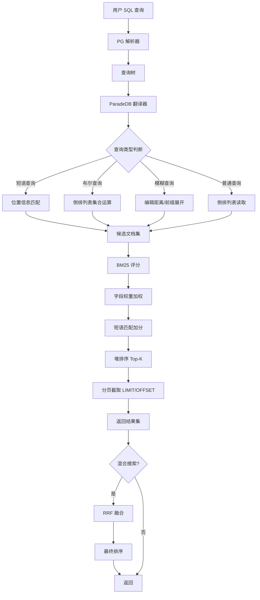

# 查询引擎

## 学习目标

- 理解 ParadeDB 查询解析与执行的完整流程
- 掌握 BM25 评分算法的原理与实现细节（基于 Tantivy/Lucene）
- 区分布尔查询、短语查询、模糊查询的处理方式
- 熟悉结果排序与分页机制
- 建立与本项目 `db/index/vector_index/BM25/` 模块的关联

## 核心概念

### 1. 查询解析与执行流程

ParadeDB 的查询引擎运行在 PostgreSQL 进程内，查询请求通过 SQL 语法进入。

#### 查询执行流水线

```
用户 SQL 查询 (SELECT ... WHERE bm25(...))
    │
    ▼
┌──────────────────┐
│  PostgreSQL 查询解析 │  SQL 解析为查询树（Query Tree）
│  Parser          │  识别 bm25() 函数调用参数
└──────┬───────────┘
       │
       ▼
┌──────────────────┐
│  ParadeDB 查询转换  │  将 SQL 函数调用转换为 Tantivy 查询
│  Query Translator │  解析 query / filter / sort 参数
└──────┬───────────┘
       │
       ▼
┌──────────────────┐
│  Tantivy 查询执行  │  Tantivy 查询引擎执行
│  Query Executor  │  - 倒排列表检索
│                  │  - BM25 评分
│                  │  - 结果排序
└──────┬───────────┘
       │
       ▼
┌──────────────────┐
│  PostgreSQL 结果处理 │  将 Tantivy 结果返回给 PG 执行器
│  Result Handler  │  支持 LIMIT/OFFSET 分页
└──────┬───────────┘
       │
       ▼
    查询结果
```

#### 查询 AST 示例

```sql
-- SQL 查询
SELECT * FROM articles
WHERE bm25(articles, query => 'postgresql tutorial', 
           filter => 'category = ''tech''')
USING must
ORDER BY score DESC
LIMIT 10;

-- 转换为 Tantivy 查询 AST:
--   BooleanQuery
--   ├── TermQuery("postgresql")   [MUST]
--   ├── TermQuery("tutorial")     [MUST]
--   └── TermQuery("tech")          [MUST, field=category]
```

### 2. BM25 评分算法

ParadeDB 的 BM25 实现继承自 Tantivy，与 Lucene BM25 算法一致。

#### BM25 公式

```
score(D, Q) = Σ IDF(q_i) * (TF(q_i, D) * (k1 + 1)) / (TF(q_i, D) + k1 * (1 - b + b * |D| / avgdl))

其中:
  IDF(q_i) = ln(1 + (N - n(q_i) + 0.5) / (n(q_i) + 0.5))
  TF(q_i, D) = 词项 q_i 在文档 D 中的频率
  |D| = 文档 D 的长度（词项数）
  avgdl = 所有文档的平均长度
  k1 = 饱和控制参数（默认 1.2）
  b = 长度归一化参数（默认 0.75）
  N = 文档总数
  n(q_i) = 包含词项 q_i 的文档数
```

#### 参数调优

| 参数 | 默认值 | 作用 | 场景调整 |
|------|--------|------|----------|
| k1   | 1.2    | 控制词频饱和度 | 短文本(标题)可调大，长文本(全文)保持默认 |
| b    | 0.75   | 文档长度归一化 | 短文档主导时调小，长文档主导时调大 |

#### 多字段权重

ParadeDB 支持为不同字段配置权重，在 BM25 评分时加权：

```sql
CREATE INDEX idx_search ON articles
USING bm25 (articles)
WITH (
    text_search_fields = '{"title": 2.0, "content": 1.0, "author": 1.5}'
);

-- 评分时: score = w_title * BM25(title) + w_content * BM25(content) + w_author * BM25(author)
```

#### 评分过程



### 3. 查询类型

#### 3.1 布尔查询

ParadeDB 通过 `USING must / should / must_not` 关键字实现布尔查询。

```sql
-- MUST（AND）：所有词项必须匹配
SELECT * FROM articles
WHERE bm25(articles, query => 'postgresql tutorial')
USING must;

-- SHOULD（OR）：至少一个词项匹配
SELECT * FROM articles
WHERE bm25(articles, query => 'postgresql tutorial')
USING should;

-- MUST_NOT（NOT）：排除包含词项的文档
SELECT * FROM articles
WHERE bm25(articles, query => 'postgresql')
USING must
  AND NOT bm25(articles, query => 'mysql')
  USING must;
```

**布尔逻辑对比**：

| ParadeDB SQL | 布尔逻辑 | 倒排列表操作 | 效果 |
|--------------|----------|-------------|------|
| `USING must` | AND | 列表交集 | 所有词项必须出现 |
| `USING should` | OR | 列表并集 | 至少一个词项出现 |
| `NOT ... USING must` | NOT | 列表差集 | 排除词项 |

#### 3.2 短语查询

短语查询要求词项按指定顺序连续出现。

```sql
-- 短语查询（隐式，当查询字符串包含多个词项）
SELECT * FROM articles
WHERE bm25(articles, query => '"database management"')
USING must;
```

**位置信息匹配**：

```
词项 "database" 的位置: [3, 17, 45]
词项 "management" 的位置: [4, 18, 52]

位置差为 1 的匹配: 3→4, 17→18
→ 文档中存在 2 处 "database management" 短语
```

**实现方式**：Tantivy 在倒排列表中存储词项在文档中的位置列表，短语查询时检查相邻词项的位置差是否为 1（连续）或允许的间隔值。

#### 3.3 模糊查询

ParadeDB 支持前缀查询和通配符匹配。

```sql
-- 前缀查询
SELECT * FROM articles
WHERE bm25(articles, query => 'postgr*')
USING must;
```

**实现方式**：

1. 在词项字典中查找匹配前缀 `postgr` 的所有词项
2. 收集这些词项的倒排列表并集
3. 进行 BM25 评分

**编辑距离模糊查询**：ParadeDB 基于 Tantivy 的 FuzzyTermQuery，支持 Levenshtein 距离查询：

```sql
-- 模糊查询（编辑距离 1）
SELECT * FROM articles
WHERE bm25(articles, query => 'databse~1')
USING must;
```

| 查询词长度 | 最大编辑距离 |
|-----------|-------------|
| 1-4 字符   | 0（精确匹配）|
| 5-8 字符   | 1           |
| 9+ 字符    | 2           |

### 4. 结果排序与分页

#### 排序规则

ParadeDB 支持多级排序，通过 SQL 的 ORDER BY 子句实现：

```sql
-- 按 BM25 得分排序（默认降序）
SELECT id, title, bm25(articles) AS score
FROM articles
WHERE bm25(articles, query => 'postgresql')
USING must
ORDER BY score DESC;

-- 多级排序（先按得分，再按时间）
SELECT * FROM articles
WHERE bm25(articles, query => 'postgresql')
USING must
ORDER BY bm25(articles) DESC, created_at DESC;
```

#### 混合搜索排序

```sql
-- BM25 + 属性排序
SELECT * FROM articles
WHERE bm25(articles, query => 'postgresql')
USING must
  AND category = 'tech'
ORDER BY bm25(articles) DESC, price ASC;
```

#### Top-N 堆排序

ParadeDB 内部使用堆排序获取 Top-N 结果：

```
1. 建立大小为 K 的最小堆
2. 遍历所有候选文档：
   - 如堆未满，直接插入
   - 如堆已满且当前得分 > 堆顶，替换堆顶并下沉
3. 最终堆中即为 Top-K 结果
```

#### 混合搜索（RRF 融合）

```sql
-- BM25 + 向量混合搜索，使用 RRF 融合
SELECT * FROM hybrid_search(
    bm25_query => (articles, 'postgresql'),
    vector_query => (embedding, '[0.1, 0.2, ...]', 10),
    method => 'rrf',
    rrf_k => 60
);

-- RRF 公式: score = Σ 1 / (k + rank(by_bm25)) + 1 / (k + rank(by_vector))
-- 默认 k = 60
```

### 5. 查询执行完整流程



## 与项目 algo/ 模块的关联

### BM25 实现对比

本项目 `engineering/src/db/index/vector_index/BM25/` 模块包含完整的 BM25 实现。

| 维度 | ParadeDB BM25 | 本项目 BM25 |
|------|---------------|-------------|
| 公式 | 标准 BM25（Tantivy 实现） | 标准 BM25（bm25.h） |
| 参数 | k1=1.2, b=0.75（可配置） | k1, b 可配置（bm25_params_t） |
| 实现语言 | Rust（Tantivy） | C |
| 搜索策略 | WAL（Weighted AND 逻辑） | TAAT / DAAT 可切换 |
| 位置信息 | 支持（短语查询） | 暂不支持 |
| 字段权重 | 支持多字段加权 | 单字段模式 |
| 存储方式 | Segment 文件 | 内存结构（可持久化） |
| 统计信息 | 段内统计 | 全局统计（avgdl, N） |

### 本项目 BM25 搜索策略

```c
// 本项目 BM25 支持两种搜索策略
typedef enum bm25_search_algorithm {
    BM25_SEARCH_ALGORITHM_AUTO = 0,  // 自动选择
    BM25_SEARCH_ALGORITHM_TAAT = 1,  // Term-At-A-Time
    BM25_SEARCH_ALGORITHM_DAAT = 2,  // Document-At-A-Time
} bm25_search_algorithm_t;

// 搜索统计信息
typedef struct bm25_search_stats {
    bm25_search_algorithm_t algorithm;
    int32_t block_skip_count;        // Block 跳过次数
    int32_t skipped_postings_count;  // 跳过的倒排条目数
    int32_t scored_doc_count;        // 实际评分的文档数
    int32_t candidate_count;         // 进入 Top-K 堆的候选数
    int32_t heap_compare_count;      // 堆比较次数
    int64_t time_cost_us;            // 搜索耗时（微秒）
} bm25_search_stats_t;
```

### 可迁移的设计

1. **位置信息支持**：ParadeDB 的位置信息存储和短语查询逻辑，可参考移植到本项目 BM25 的倒排结构

2. **多字段权重**：ParadeDB 的 `text_search_fields` 权重配置，可设计为本项目 BM25 的字段权重参数

3. **RRF 融合算法**：混合搜索的 RRF 融合算法可复用到本项目的 `hybrid_search.c`

4. **WAL 搜索策略**：Tantivy 的 WAL（Weighted AND）搜索模式，可参考优化本项目的搜索策略选择逻辑

## 要点总结

1. ParadeDB 查询引擎运行在 PostgreSQL 进程内，SQL 查询通过 PQ 解析器 → ParadeDB 翻译器 → Tantivy 执行器的流水线处理

2. BM25 评分算法基于 Tantivy/Lucene 实现，支持多字段权重配置，k1=1.2, b=0.75 为默认参数

3. 布尔查询通过 `USING must/should/must_not` 语法实现，对应倒排列表的交集、并集、差集运算

4. 短语查询依赖位置信息检查词项连续出现，模糊查询支持前缀匹配和编辑距离模糊匹配

5. 排序采用堆排序 Top-K 策略，分页通过 SQL 的 LIMIT/OFFSET 实现，混合搜索支持 RRF 融合

6. 本项目 BM25 实现支持 TAAT/DAAT 搜索策略切换，与 ParadeDB 相比缺少位置信息和多字段权重

## 思考题

1. BM25 公式中参数 k1 和 b 分别控制什么？在短文本搜索（标题）和长文档搜索（全文）中，应该如何调整这两个参数？

2. ParadeDB 的 `USING must`（AND 逻辑）与 `USING should`（OR 逻辑）在倒排列表合并时的时间复杂度分别是什么？当词项数量很大时，如何优化？

3. 短语查询依赖位置信息，本项目的 BM25 实现（`bm25.h`）目前不支持位置信息，需要如何扩展倒排索引结构才能支持短语查询？

4. RRF 融合算法中参数 k 的取值对混合搜索排序结果有什么影响？k=60 和 k=10 分别适用于什么场景？

5. 本项目的 `bm25_search_stats_t` 记录了 `block_skip_count` 和 `skipped_postings_count`，这些统计信息对于优化搜索性能有什么指导意义？