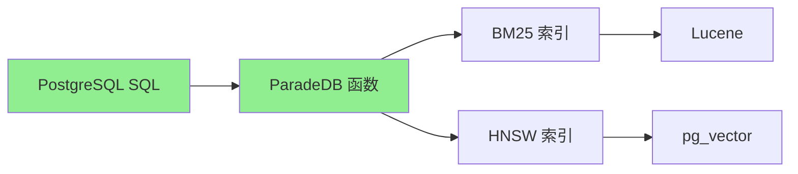
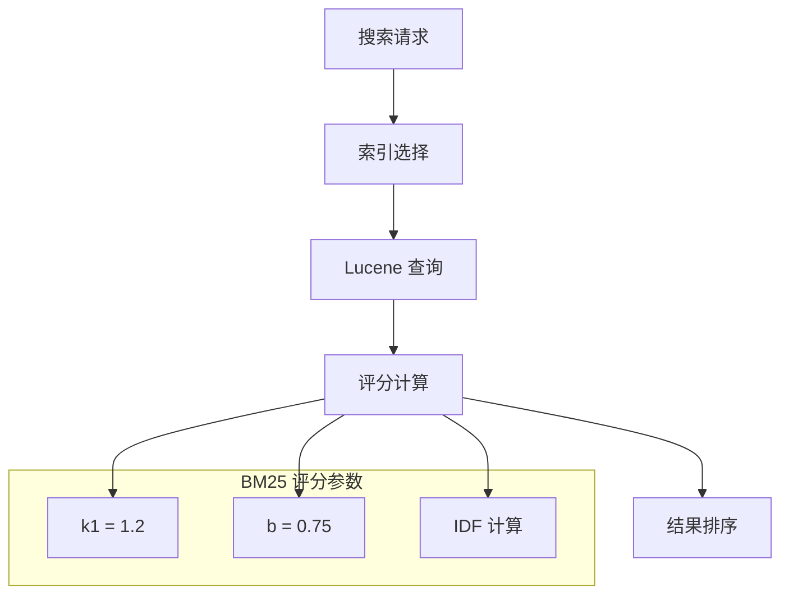

# ParadeDB 功能特性

## 学习目标
- 理解 ParadeDB 的 SQL 接口设计
- 掌握 BM25 全文搜索功能
- 了解 HNSW 向量搜索和混合搜索能力

## 正文

### SQL 接口设计

ParadeDB 的核心理念是将搜索引擎能力带入 PostgreSQL：



**核心函数**：

| 函数 | 功能 | 返回类型 |
|------|------|----------|
| `bm25()` | BM25 评分计算 | float |
| `ts_rank()` | 文本相关性排名 | float |
| `hybrid()` | 混合搜索 | setof id |
| `<=>` | 向量距离计算 | float |

### BM25 全文搜索



**完整搜索示例**：

```sql
-- 1. 创建表
CREATE TABLE articles (
    id SERIAL PRIMARY KEY,
    title TEXT NOT NULL,
    content TEXT NOT NULL,
    author TEXT,
    category TEXT,
    created_at TIMESTAMP DEFAULT NOW()
);

-- 2. 创建 BM25 索引
CREATE INDEX idx_articles_bm25 ON articles 
USING bm25 (articles) WITH (
    text_search_fields = '{title, content, author}',
    tokenizer = 'default',
    stemming = true,
    stop_words = 'english'
);

-- 3. 执行搜索
SELECT 
    id,
    title,
    author,
    bm25(articles) AS score,
    headline(content, query => bm25(articles, query => 'paradedb postgres')) AS snippet
FROM articles
WHERE bm25(articles, query => 'paradedb postgres') 
      USING must
      AND category = 'tech'
ORDER BY score DESC
LIMIT 10;

-- 4. 高亮显示
SELECT 
    id,
    title,
    ts_headline(title, query => bm25(articles, query => 'database')) AS highlighted_title,
    ts_headline(content, query => bm25(articles, query => 'database')) AS highlighted_content
FROM articles
WHERE bm25(articles, query => 'database') USING must;
```

### HNSW 向量搜索

```sql
-- 1. 创建带向量列的表
CREATE TABLE documents (
    id SERIAL PRIMARY KEY,
    content TEXT NOT NULL,
    embedding VECTOR(1536)  -- OpenAI text-embedding-3-small
);

-- 2. 创建 HNSW 索引
CREATE INDEX idx_documents_hnsw ON documents
USING hnsw (embedding vector_cosine_ops)
WITH (m = 16, ef_construction = 128);

-- 3. 插入向量数据
INSERT INTO documents (content, embedding)
VALUES 
    ('PostgreSQL is powerful', '[0.1, 0.2, ...]'),
    ('Elasticsearch for search', '[0.3, 0.4, ...]');

-- 4. 向量相似度搜索
SELECT 
    id,
    content,
    1 - (embedding <=> '[0.1, 0.2, ...]') AS similarity
FROM documents
ORDER BY embedding <=> '[0.1, 0.2, ...]'
LIMIT 5;

-- 5. 带预过滤的向量搜索
SELECT * FROM documents
WHERE id IN (
    SELECT id FROM documents
    WHERE category = 'tech'
    ORDER BY embedding <=> '[0.1, 0.2, ...]'
    LIMIT 5
);
```

### 混合搜索

```sql
-- 方法一：手动融合
SELECT 
    id,
    title,
    bm25(articles) AS bm25_score,
    1 - (embedding <=> '[0.1, 0.2, ...]') AS vector_score,
    -- RRF 融合
    1.0 / (60 + rank() OVER (ORDER BY bm25(articles) DESC)) +
    1.0 / (60 + rank() OVER (ORDER BY 1 - (embedding <=> '[0.1, 0.2, ...]') DESC)) AS rrf_score
FROM articles
WHERE bm25(articles, query => 'database') USING should
   OR embedding <=> '[0.1, 0.2, ...]' < 0.3
ORDER BY rrf_score DESC;

-- 方法二：使用 hybrid() 函数
SELECT 
    a.id,
    a.title,
    a.content,
    a.bm25_score,
    a.vector_score
FROM (
    SELECT 
        id,
        bm25_score,
        vector_score,
        ts_rank(a, query => bm25(a, query => 'database')) AS bm25_rank,
        rank() OVER (ORDER BY vector_score DESC) AS vector_rank
    FROM hybrid(
        bm25_query => (a, 'database'),
        vector_query => (embedding, '[0.1, 0.2, ...]', 10),
        match_count => 20,
        method => 'rrf'
    ) AS h(id int, bm25_score float, vector_score float)
) results
JOIN articles a ON results.id = a.id
ORDER BY 
    1.0 / (60 + bm25_rank) + 1.0 / (60 + vector_rank) DESC;
```

### 高级特性

```sql
-- 1. 模糊搜索（拼写容错）
SELECT * FROM articles
WHERE bm25(articles, query => 'paradedb', fuzziness => 'AUTO') USING must;

-- 2. 短语搜索
SELECT * FROM articles
WHERE bm25(articles, query => '"full text search"', phrase => true) USING must;

-- 3. 范围过滤
SELECT * FROM articles
WHERE bm25(articles, query => 'postgresql', 
                 range => '[2023-01-01, 2024-12-31]') USING must;

-- 4. 聚合分析
SELECT 
    category,
    COUNT(*) AS count,
    AVG(bm25(articles)) AS avg_score
FROM articles
WHERE bm25(articles, query => 'database') USING must
GROUP BY category
ORDER BY count DESC;
```

## 要点总结

1. **SQL 优先**：所有搜索能力通过 SQL 接口暴露，无需学习新语言
2. **BM25 完整**：支持过滤、分页、高亮、模糊搜索等完整功能
3. **向量集成**：pgvector HNSW 索引，原生向量相似度计算
4. **混合搜索**：RRF 融合算法，BM25 + 向量的最佳组合
5. **PG 生态**：事务支持、备份恢复、复制等特性直接继承

## 思考题

1. ParadeDB 的 BM25 实现相比 Elasticsearch 有哪些功能差异？
2. 在混合搜索中，如何确定 BM25 和向量搜索的权重比例？
3. PostgreSQL 的 MVCC 与 Lucene 的索引更新如何协调？
