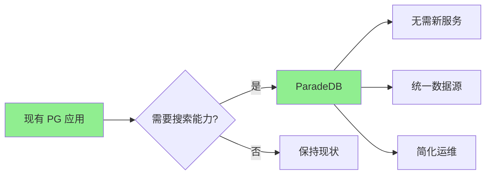
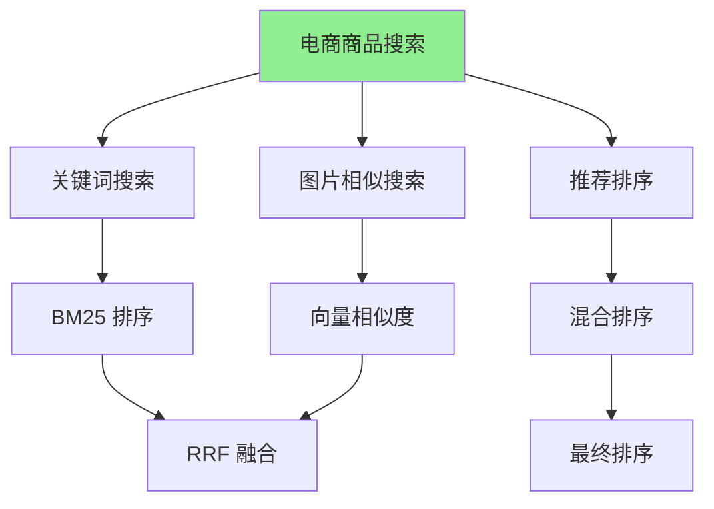

# ParadeDB 应用场景

## 学习目标
- 理解 PostgreSQL 扩展的典型应用场景
- 掌握混合搜索在电商和内容平台的应用
- 了解从 Elasticsearch 迁移的实践

## 正文

### PostgreSQL 扩展场景

ParadeDB 适合需要将搜索能力融入现有 PostgreSQL 应用的场景：



**适用场景对比**：

| 场景 | ParadeDB 优势 | Elasticsearch 优势 |
|------|---------------|-------------------|
| PG 已有的应用 | 无缝集成 | 需要额外服务 |
| 小型应用 | 资源占用低 | 扩展性强 |
| 需要事务 | 完整支持 | 有限支持 |
| 大规模日志 | 一般 | 专为日志设计 |
| 混合搜索 | SQL 统一 | 需要组合 |

### 混合检索场景



**电商搜索示例**：

```sql
-- 场景：用户搜索 "红色连衣裙"，同时返回文本匹配和视觉相似的结果

-- 1. 表结构设计
CREATE TABLE products (
    id SERIAL PRIMARY KEY,
    name TEXT NOT NULL,
    description TEXT,
    category TEXT,
    price NUMERIC,
    color TEXT,
    image_embedding VECTOR(512)  -- 商品图片向量
);

-- 2. 创建索引
CREATE INDEX idx_products_bm25 ON products 
USING bm25 (products) WITH (text_search_fields = '{name, description}');

CREATE INDEX idx_products_hnsw ON products
USING hnsw (image_embedding vector_cosine_ops);

-- 3. 混合搜索查询
SELECT 
    p.id,
    p.name,
    p.category,
    p.price,
    bm25(products, query => 'red dress') AS bm25_score,
    1 - (image_embedding <=> '[0.1, 0.2, ...]') AS image_score
FROM products p
WHERE 
    bm25(products, query => 'red dress') USING should
    OR 
    (image_embedding <=> '[0.1, 0.2, ...]' < 0.2 AND color = 'red')
ORDER BY 
    -- RRF 融合
    1.0 / (60 + RANK() OVER (ORDER BY bm25(products, query => 'red dress') DESC)) +
    1.0 / (60 + RANK() OVER (ORDER BY 1 - (image_embedding <=> '[0.1, 0.2, ...]') DESC)) DESC
LIMIT 20;
```

### 内容平台搜索

```sql
-- 场景：博客/文章平台的全文搜索 + 标签推荐

CREATE TABLE posts (
    id SERIAL PRIMARY KEY,
    title TEXT NOT NULL,
    content TEXT NOT NULL,
    author_id INT,
    tags TEXT[],
    category TEXT,
    embedding VECTOR(768),  -- 文章内容向量
    created_at TIMESTAMP DEFAULT NOW()
);

-- 创建搜索索引
CREATE INDEX idx_posts_bm25 ON posts 
USING bm25 (posts) WITH (text_search_fields = '{title, content, tags}');

CREATE INDEX idx_posts_hnsw ON posts
USING hnsw (embedding vector_cosine_ops);

-- 全文搜索 + 相关推荐
SELECT 
    p.id,
    p.title,
    p.tags,
    bm25(posts, query => 'rust programming') AS text_score,
    1 - (embedding <=> user_interest_embedding) AS relevance_score
FROM posts p
WHERE 
    bm25(posts, query => 'rust programming') USING must
ORDER BY 
    1.0 / (60 + RANK() OVER (ORDER BY text_score DESC)) +
    1.0 / (60 + RANK() OVER (ORDER BY relevance_score DESC)) DESC;
```

### 日志分析场景

```sql
-- 场景：应用日志的全文检索

CREATE TABLE app_logs (
    id BIGSERIAL PRIMARY KEY,
    timestamp TIMESTAMP DEFAULT NOW(),
    level TEXT,           -- INFO, WARN, ERROR
    service TEXT,
    message TEXT,
    metadata JSONB
);

-- 创建 BM25 索引
CREATE INDEX idx_logs_bm25 ON app_logs 
USING bm25 (app_logs) WITH (
    text_search_fields = '{message, service}',
    tokenizer = 'standard'
);

-- 错误日志搜索
SELECT 
    id,
    timestamp,
    service,
    message,
    bm25(app_logs) AS score
FROM app_logs
WHERE 
    bm25(app_logs, query => 'connection timeout') USING must
    AND level = 'ERROR'
    AND timestamp > NOW() - INTERVAL '24 hours'
ORDER BY timestamp DESC;

-- 异常模式发现
SELECT 
    -- 提取异常关键词
    regexp_matches(message, 'error: (.+)', 'i') AS error_type,
    COUNT(*) AS count,
    COUNT(DISTINCT service) AS affected_services
FROM app_logs
WHERE bm25(app_logs, query => 'exception OR error OR fail') USING must
  AND timestamp > NOW() - INTERVAL '7 days'
GROUP BY 1
ORDER BY count DESC;
```

## 要点总结

1. **PG 原生**：无需独立服务，融入现有 PostgreSQL 应用
2. **电商搜索**：BM25 + 向量混合，文本 + 图像多模态搜索
3. **内容平台**：全文搜索 + 相关推荐，提升内容发现
4. **日志分析**：全文检索 + 结构化过滤，发现异常模式
5. **迁移友好**：从 Elasticsearch 迁移成本低，API 相似

## 思考题

1. 在什么场景下应该选择 ParadeDB 而不是 Elasticsearch？
2. 混合搜索中如何平衡文本相关性和语义相似性？
3. 如何设计索引策略来同时支持全文搜索和向量搜索？
