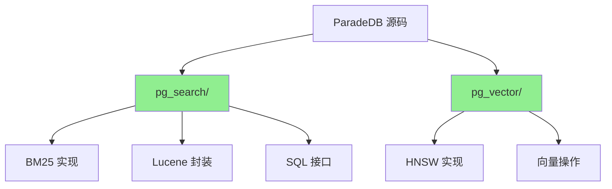
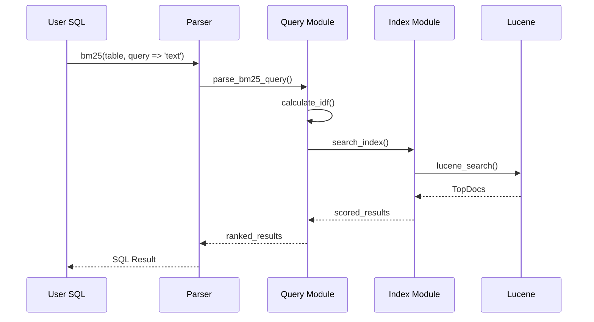
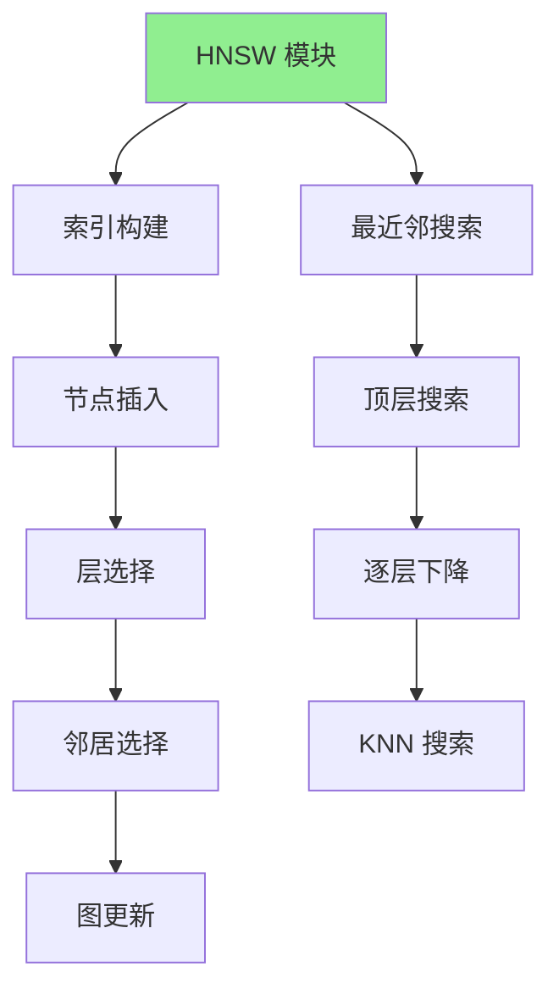

# ParadeDB 源码阅读指南

## 学习目标
- 了解 ParadeDB 的源码结构
- 掌握关键模块的阅读路径
- 理解 BM25 和 HNSW 的集成方式

## 正文

### 源码架构概览



### 源码目录结构

```
paradedb/
├── Cargo.toml                           # 工作空间配置
│
├── pg_search/                           # BM25 全文搜索扩展
│   ├── Cargo.toml
│   ├── src/
│   │   ├── lib.rs                       # 扩展入口
│   │   ├── postgres/
│   │   │   ├── mod.rs
│   │   │   ├── schema.rs                # 表/索引定义
│   │   │   ├── scan.rs                  # 扫描实现
│   │   │   └── index.rs                 # 索引操作
│   │   ├── query/
│   │   │   ├── mod.rs
│   │   │   ├── bm25.rs                  # BM25 评分
│   │   │   ├── lucene_query.rs          # Lucene 查询
│   │   │   └── ast.rs                   # 查询 AST
│   │   ├── index/
│   │   │   ├── mod.rs
│   │   │   ├── writer.rs                # 索引写入
│   │   │   └── reader.rs                # 索引读取
│   │   └── tokenizer/
│   │       ├── mod.rs
│   │       └── default.rs               # 默认分词器
│   └── migrations/
│       └── *.sql                        # 扩展安装脚本
│
├── pg_vector/                           # 向量搜索扩展
│   ├── Cargo.toml
│   └── src/
│       ├── lib.rs                       # 扩展入口
│       ├── vector.rs                    # 向量类型
│       ├── hnsw.rs                      # HNSW 实现
│       └── ops.rs                       # 向量操作符
│
└── benchmarks/                          # 性能基准测试
    └── src/
        ├── bm25_benchmark.rs
        └── hnsw_benchmark.rs
```

### 关键源码阅读路径

#### 1. BM25 实现路径



**核心文件**：

| 文件 | 职责 | 关键方法 |
|------|------|----------|
| `query/bm25.rs` | BM25 评分计算 | `bm25_score()`, `calculate_idf()` |
| `query/lucene_query.rs` | Lucene 查询构建 | `build_query()` |
| `index/reader.rs` | 索引读取 | `search()`, `scan()` |
| `index/writer.rs` | 索引写入 | `add_document()`, `commit()` |

#### 2. HNSW 实现路径



**核心文件**：

| 文件 | 职责 |
|------|------|
| `hnsw.rs` | HNSW 算法实现 |
| `vector.rs` | 向量类型定义和操作 |
| `ops.rs` | 向量距离计算（`<=>` 操作符） |

### 阅读建议

**入门路径**：
1. 从 `pg_search/src/lib.rs` 入手，理解扩展入口
2. 阅读 `query/bm25.rs`，理解 BM25 评分算法
3. 阅读 `index/reader.rs`，理解搜索执行流程
4. 阅读 `pg_vector/src/hnsw.rs`，理解 HNSW 算法实现

**进阶路径**：
1. 阅读 `query/lucene_query.rs`，理解 Lucene 查询封装
2. 阅读 `index/writer.rs`，理解索引写入流程
3. 阅读 `pg_vector/src/ops.rs`，理解向量操作符实现

**工具推荐**：
- Rust 工具链：rustc, cargo, rust-analyzer
- 数据库调试：pgAdmin, DBeaver
- 性能分析：perf, flamegraph

## 要点总结

1. **双扩展架构**：pg_search（BM25）+ pg_vector（HNSW）
2. **Rust 实现**：高性能，内存安全
3. **Lucene 集成**：BM25 基于 Lucene 实现
4. **SQL 接口**：通过 PostgreSQL 扩展机制暴露功能
5. **阅读策略**：从扩展入口开始，理解 SQL 到索引的转换

## 思考题

1. ParadeDB 如何在 PostgreSQL 扩展框架中实现新的索引方法？
2. Lucene 的 Java 实现是如何被 Rust 调用的？
3. HNSW 的参数（m, ef_construction）如何影响索引构建和搜索性能？
