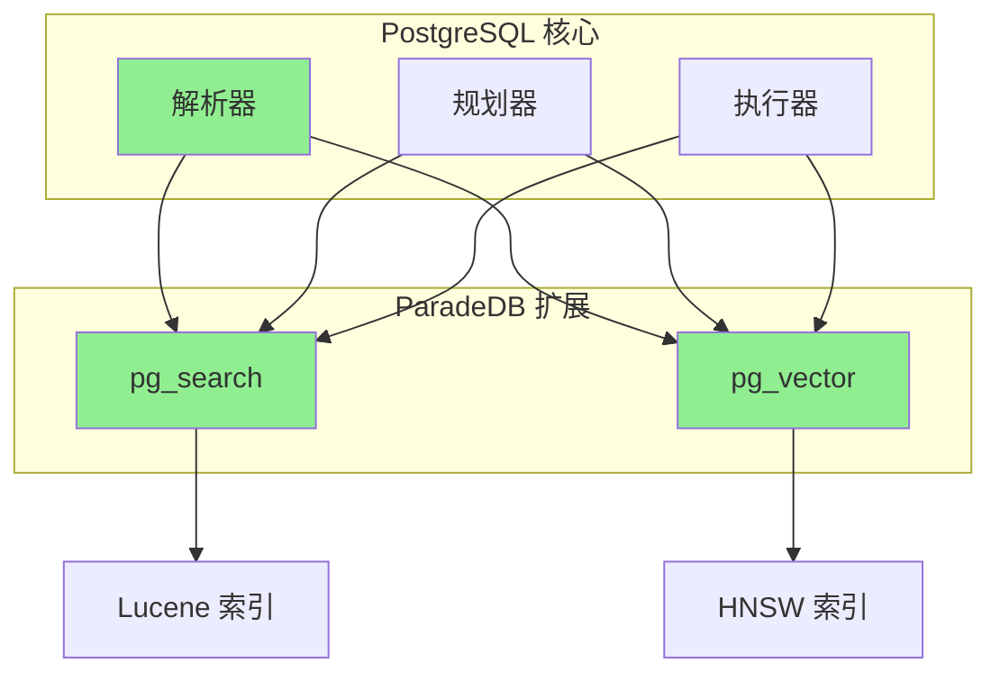
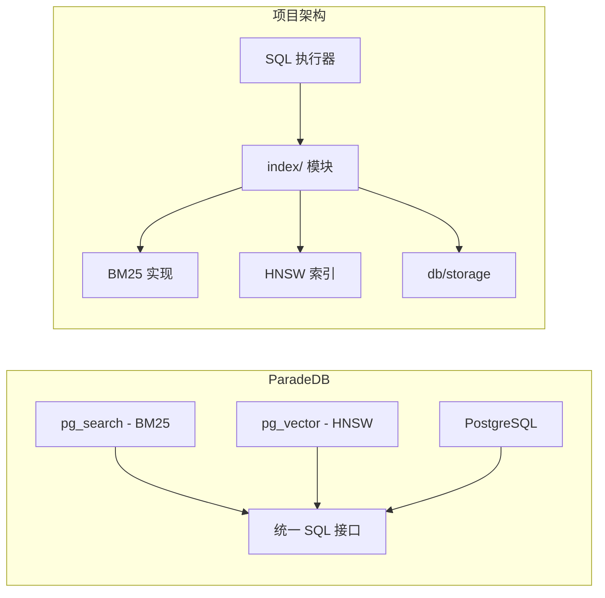
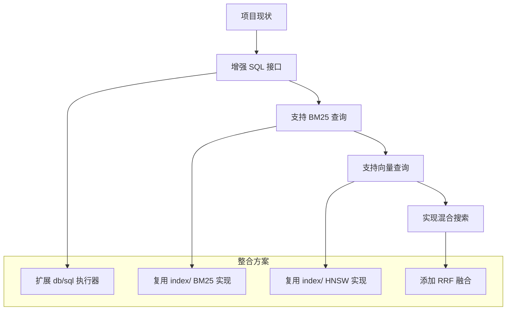

# ParadeDB 与项目关联

## 学习目标
- 理解 ParadeDB 的 PG Extension 架构
- 掌握与项目存储引擎的关联
- 借鉴 ParadeDB 设计优化项目架构

## 正文

### PostgreSQL Extension 架构

ParadeDB 基于 PostgreSQL 扩展机制实现：



**PostgreSQL 扩展机制**：

| 机制 | 说明 | ParadeDB 使用 |
|------|------|---------------|
| 索引访问方法 | 定义新的索引类型 | BM25, HNSW |
| 操作符 | 定义新的操作符 | `<=>` 向量距离 |
| 函数 | 定义新的 SQL 函数 | `bm25()`, `ts_rank()` |
| 类型 | 定义新的数据类型 | `vector` |

### 与项目存储引擎的关联



**功能对比**：

| 能力 | ParadeDB | 项目实现 | 说明 |
|------|----------|----------|------|
| BM25 搜索 | Lucene | 自实现 | 项目已有基础实现 |
| HNSW 向量 | pg_vector | 自实现 | 项目已有 HNSW |
| SQL 接口 | PG Extension | db/sql 层 | 项目需要扩展 |
| 混合搜索 | RRF 融合 | 需实现 | 项目可借鉴 |
| 索引管理 | PG 内置 | 需实现 | 项目可借鉴 PG |

### 设计思想借鉴

#### 1. 索引访问方法

PostgreSQL 的索引访问方法框架：

```mermaid
graph TD
    A[索引访问方法接口] --> B[IndexAmRoutine]
    
    B --> B1[ambuild]       # 索引构建
    B --> B2[ambuildempty]  # 空索引
    B --> B3[aminsert]      # 插入
    B --> B4[ambulkdelete]  # 批量删除
    B --> B5[amrescan]      # 重新扫描
    B --> B6[ambeginscan]   # 开始扫描
    B --> B7[amendscan]     # 结束扫描
    B --> B8[amgetnext]     # 获取下一条
```

**项目可借鉴**：
```c
// 项目中定义统一的索引访问接口
typedef struct IndexAmRoutine {
    IndexBuildFunc     ambuild;
    IndexInsertFunc    aminsert;
    IndexScanFunc      amscan;
    IndexDeleteFunc    amdelete;
    IndexBulkDeleteFunc ambulkdelete;
    IndexRescanFunc    amrescan;
} IndexAmRoutine;

// 支持多种索引类型
typedef enum IndexType {
    INDEX_BTREE,
    INDEX_HASH,
    INDEX_BM25,
    INDEX_HNSW,
    INDEX_DISKANN
} IndexType;
```

#### 2. 统一的 SQL 接口

ParadeDB 将搜索能力融入 SQL：

```sql
-- 搜索即 SQL
SELECT * FROM products
WHERE bm25(products, query => 'laptop') USING must
  AND category = 'electronics'
ORDER BY bm25(products) DESC;
```

**项目可借鉴**：
```c
// 项目中扩展 SQL 执行器支持搜索
typedef struct {
    Expr *query_expr;
    SearchType type;  // BM25, VECTOR, HYBRID
    double boost;
    FilterExpr *filter;
} SearchExpr;

// 语法扩展
// WHERE bm25(content, query => 'keyword') USING must
// WHERE embedding <=> '[0.1, 0.2, ...]' < 0.5
```

#### 3. 混合搜索融合

```sql
-- ParadeDB RRF 融合
SELECT * FROM hybrid(
    bm25_query => (table, 'keyword'),
    vector_query => (embedding, '[0.1, 0.2, ...]', 10),
    method => 'rrf'
);
```

**项目可借鉴**：
```c
// RRF 融合实现
double rrf_score(double score, int rank, double k) {
    return score / (k + rank);
}

double hybrid_score(double bm25_score, double vector_score, 
                    int bm25_rank, int vector_rank) {
    double k = 60.0;  // RRF 常数
    return rrf_score(bm25_score, bm25_rank, k) + 
           rrf_score(vector_score, vector_rank, k);
}
```

### 技术整合路径



**整合步骤**：
1. 扩展 SQL 解析器，支持 `bm25()` 函数语法
2. 复用 `index/` 模块的 BM25 实现
3. 复用 `index/` 模块的 HNSW 实现
4. 实现 RRF 融合算法
5. 添加搜索结果的 SQL 输出支持

## 要点总结

1. **PG Extension 模式**：ParadeDB 利用 PG 扩展机制，无需独立服务
2. **统一接口**：所有搜索能力通过 SQL 接口暴露，用户体验一致
3. **功能互补**：项目有 BM25 + HNSW，ParadeDB 有完整 SQL 包装
4. **借鉴价值**：索引访问方法框架、统一 SQL 接口、RRF 融合值得学习
5. **演进路径**：扩展项目 SQL 层支持搜索函数，复用现有索引实现

## 思考题

1. 如何设计项目的 SQL 接口来支持全文搜索和向量搜索？
2. RRF 融合与简单分数相加相比，有什么优势？
3. 如何在项目中实现类似 PostgreSQL 的索引访问方法抽象？
