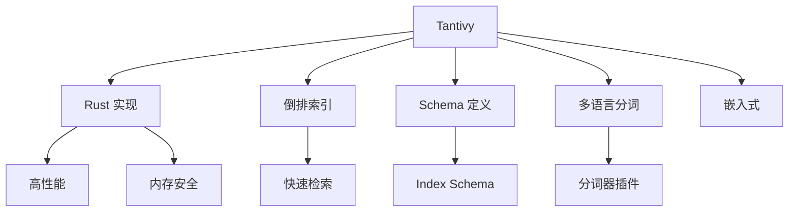

# Tantivy 项目概览

## 学习目标

- 了解 Tantivy 作为 Rust 实现的高性能全文搜索引擎库的定位
- 掌握 Tantivy 的倒排索引和 BM25 算法

## 项目定位

> Tantivy 是 Rust 实现的高性能全文搜索引擎库，是 Meilisearch 的底层搜索引擎。

**基本信息**：
- 开发方：Meilisearch 团队
- 首次发布：2017 年
- 开源协议：MIT
- GitHub Stars：约 8k

## 核心设计



## 核心概念

```rust
use tantivy::{
    schema::{Schema, TEXT, STORED, INDEXED},
    Index, IndexWriter, Document, Term,
};

// 定义 Schema
let mut schema_builder = Schema::builder();
schema_builder.add_text_field("title", TEXT | STORED);
schema_builder.add_text_field("content", TEXT);
let schema = schema_builder.build();

// 创建索引
let index = Index::create_in_ram(schema);
let mut index_writer: IndexWriter = index.writer(50_000_000)?;

let mut doc = Document::new();
doc.add_text("title", "Rust Programming");
doc.add_text("content", "Learn Rust programming language");
index_writer.add_document(doc)?;
index_writer.commit()?;
```

## 要点总结

- Rust 实现，高性能
- 嵌入式库，可集成
- BM25 排序算法
- Meilisearch 的底层引擎
