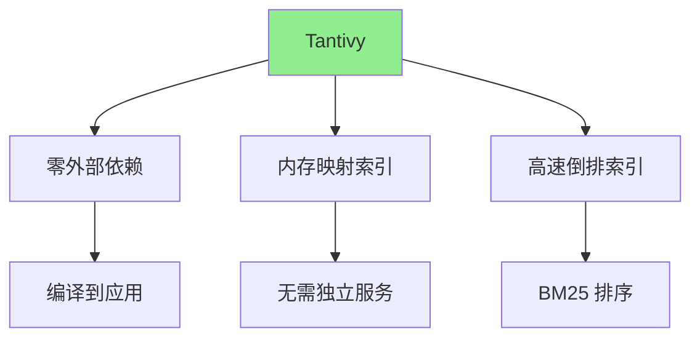
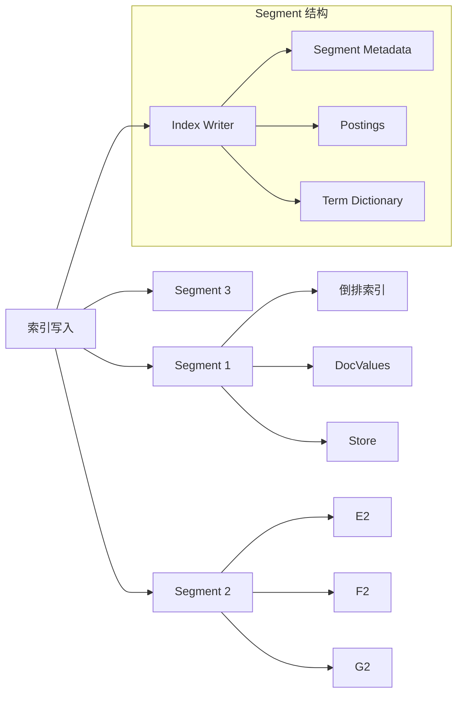
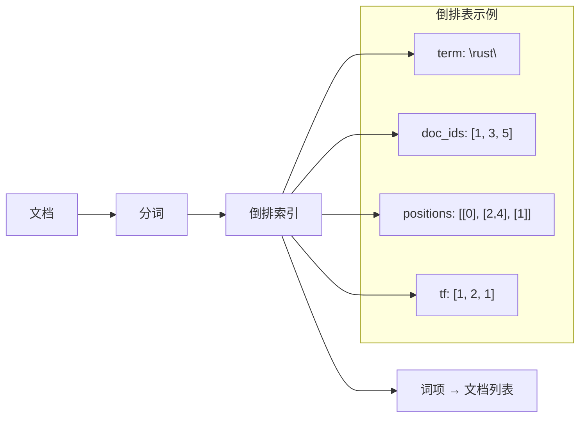
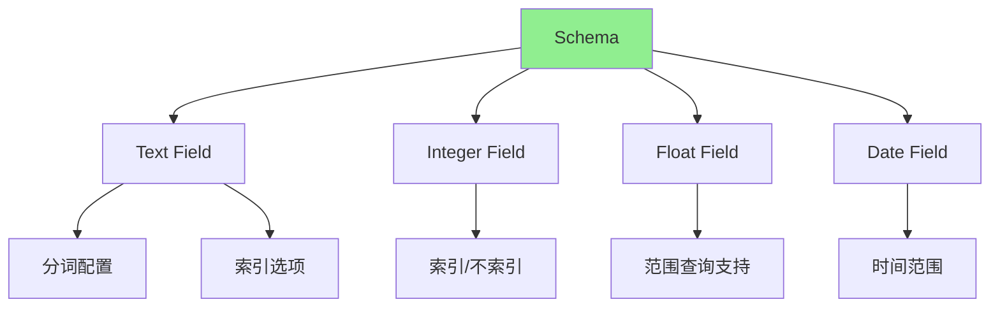

# Tantivy 架构解析

## 学习目标
- 理解 Tantivy 作为 Rust 嵌入式搜索引擎的设计理念
- 掌握 Segment 索引结构和倒排索引原理
- 了解 Schema 定义和 BM25 排序机制

## 正文

### Rust 嵌入式搜索引擎

Tantivy 是一个用 Rust 编写的全文搜索引擎库，设计目标是高性能和低内存占用：



**核心特点**：

| 特点 | 说明 | 优势 |
|------|------|------|
| 嵌入式 | 编译到应用中 | 无网络开销 |
| 零依赖 | 纯 Rust 实现 | 内存安全 |
| 内存映射 | mmap 索引文件 | 低内存占用 |
| 高速 | SIMD 优化 | 毫秒级搜索 |

### Segment 索引结构

Tantivy 使用 Segment 分段索引结构：



**Segment 组件**：

| 组件 | 说明 | 用途 |
|------|------|------|
| Postings | 倒排列表 | 存储词项出现的文档和位置 |
| Term Dictionary | 词项字典 | 词项到 Postings 的映射 |
| DocValues | 列式存储 | 快速访问字段值 |
| Store | 文档存储 | 存储原始文档内容 |
| Segment Meta | 段元数据 | 记录段的基本信息 |

### 倒排索引与 BM25



**BM25 评分公式**：
```
BM25(d, q) = Σ IDF(qi) * (tf * (k1 + 1)) / (tf + k1 * (1 - b + b * |d| / avgdl))

其中：
- tf: 词项在文档中的频率
- |d|: 文档长度
- avgdl: 平均文档长度
- k1: 词频饱和参数 (默认 1.2)
- b: 长度归一化参数 (默认 0.75)
- IDF: 逆文档频率
```

### Schema 定义



**Schema 定义示例**：

```rust
use tantivy::schema::*;

let mut schema_builder = Schema::builder();

// 文本字段（可搜索）
schema_builder.add_text_field("title", TEXT | STORED);
schema_builder.add_text_field("content", TEXT);

// 数值字段（可排序、可过滤）
schema_builder.add_i64_field("id", INDEXED | STORED);
schema_builder.add_i64_field("price", INDEXED | STORED);
schema_builder.add_f64_field("score", STORED);

// 日期字段
schema_builder.add_date_field("created_at", INDEXED | STORED);

// 构建 Schema
let schema = schema_builder.build();
```

## 要点总结

1. **嵌入式设计**：Tantivy 无需独立服务，编译到应用中，低资源占用
2. **Segment 结构**：分段索引支持增量更新，后台合并优化性能
3. **BM25 算法**：经典的相关性评分算法，考虑词频和文档长度
4. **Schema 灵活**：支持文本、数值、日期等多种字段类型
5. **零依赖**：纯 Rust 实现，内存安全，无外部依赖

## 思考题

1. Tantivy 的 Segment 结构与 Elasticsearch 的段结构有什么异同？
2. 内存映射（mmap）在搜索引擎中有什么优势和挑战？
3. BM25 的 k1 和 b 参数如何影响搜索结果？
