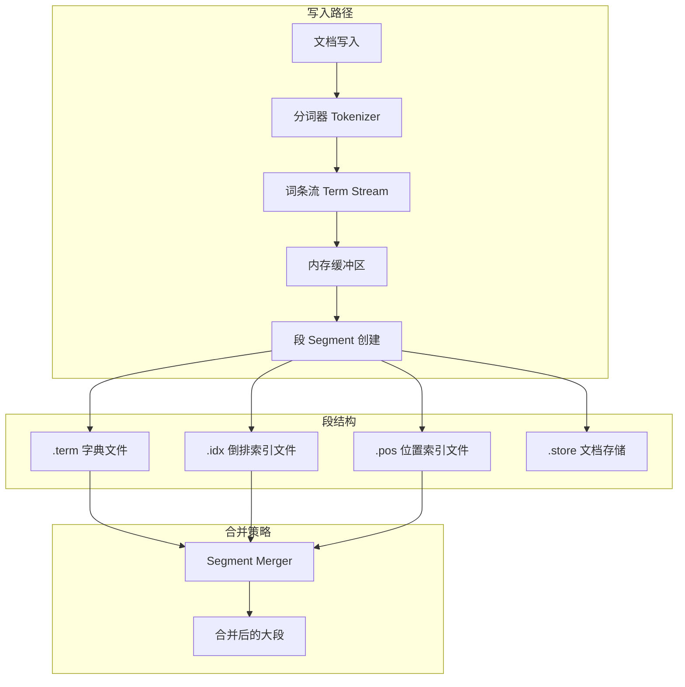
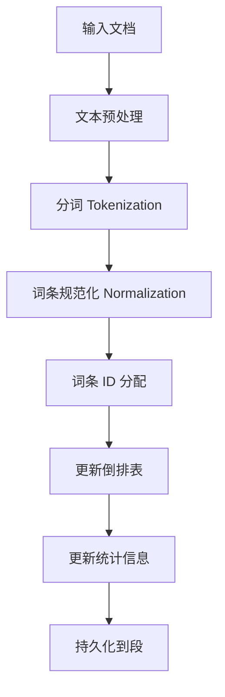
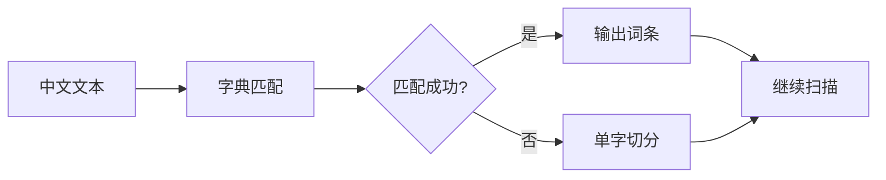
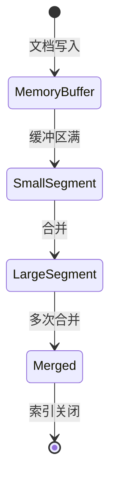
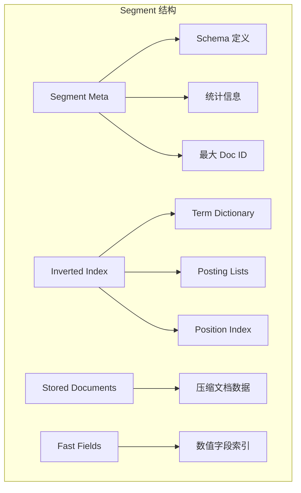
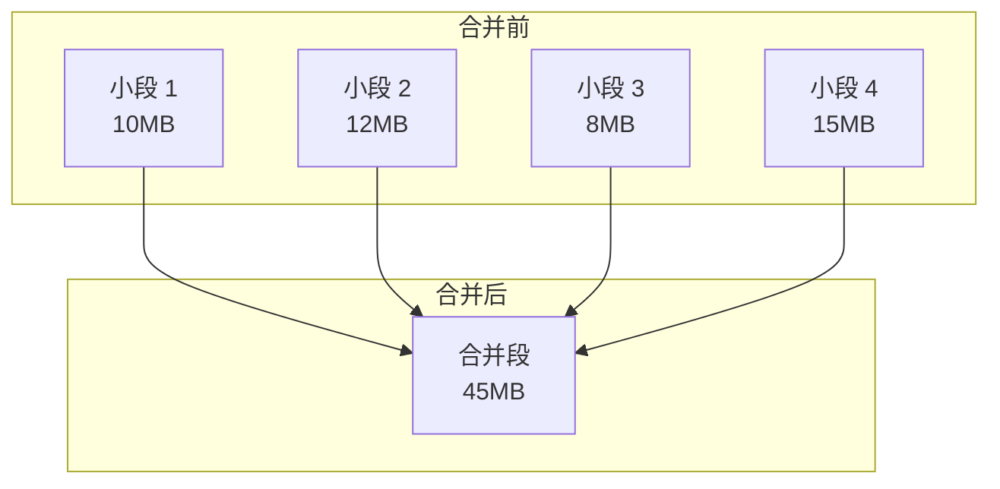
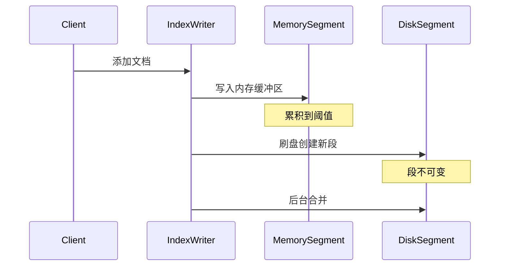
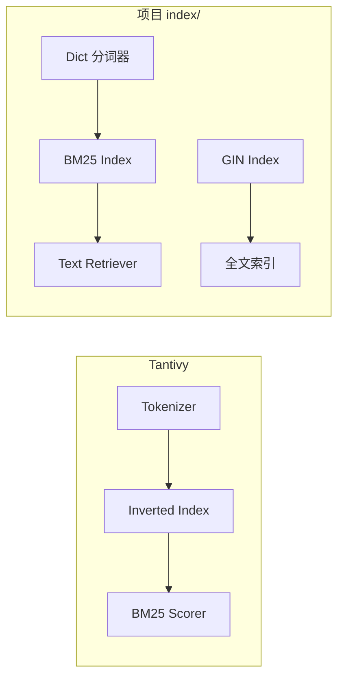

# Tantivy 索引引擎

## 学习目标

- 理解倒排索引的构建与存储机制
- 掌握 Tantivy 分词器（Tokenizer）的设计原理
- 了解段（Segment）管理与合并策略
- 对比项目 `index/` 模块的异同

## 核心概念

### 倒排索引概述

**倒排索引（Inverted Index）** 是全文搜索引擎的核心数据结构，它从"词条 → 文档"的映射关系中快速定位包含特定词条的文档集合。

```
正向索引：文档 ID → 文档内容 → 词条列表
倒排索引：词条 → 文档 ID 列表（Posting List）
```

**基本组成**：

| 组件 | 说明 |
|------|------|
| Term Dictionary | 词条字典，按词序排列的所有词条 |
| Posting List | 倒排表，包含该词条的所有文档 ID 和位置信息 |
| Term ID | 词条的唯一数值标识，节省存储空间 |
| Doc ID | 文档的唯一数值标识 |

### Tantivy 架构概览

Tantivy 是受 Apache Lucene 启发的 Rust 全文搜索引擎库，采用 LSM-Tree 风格的段管理策略。



## 倒排索引构建

### 构建流程



### 关键步骤详解

**1. 文本预处理**

- 字符编码统一（UTF-8）
- HTML 标签移除、特殊字符处理
- 大小写转换（可选）

**2. 词条 ID 分配**

Tantivy 使用 FST（Finite State Transducer）存储词条字典，实现高效的词条查找和压缩：

```
词条 "apple" → Term ID: 1
词条 "banana" → Term ID: 2
词条 "cherry" → Term ID: 3
```

**3. 倒排表更新**

每个词条的倒排表记录：

- Doc ID（文档标识）
- Term Frequency（词条在文档中出现次数）
- Position List（词条在文档中的位置列表）
- Payload（可选的附加数据）

### 存储格式

Tantivy 的段文件结构：

```
segment-xxx/
├── .term          # 词条字典（FST 格式）
├── .idx           # 倒排索引（Doc ID 列表）
├── .pos           # 位置索引（词位置信息）
├── .fast          # 快速字段（数值字段）
├── .fieldnorm     # 字段归一化值
├── .store         # 原始文档存储
└── .meta          # 段元数据
```

## 分词器设计

### 分词器接口

```rust
/// Tantivy 分词器核心接口（示意）
pub trait Tokenizer {
    fn tokenize(&self, text: &str) -> Vec<Token>;
}

pub struct Token {
    pub text: String,      // 词条文本
    pub offset_from: usize, // 起始偏移
    pub offset_to: usize,   // 结束偏移
    pub position: usize,    // 位置序号
}
```

### 内置分词器类型

| 分词器 | 适用场景 | 特点 |
|--------|----------|------|
| Simple | 英文简单分词 | 按空格和标点切分 |
| Whitespace | 空格分词 | 仅按空白字符切分 |
| Ngram | 中文/模糊搜索 | 滑动窗口切分 |
| CJK | 中文分词 | 双字切分 |
| EdgeNgram | 前缀搜索 | 边缘 N-gram |
| Custom | 自定义 | 支持正则表达式 |

### 中文分词实现



**最大正向匹配（MM）算法**：

1. 从当前位置取最长可能的词条
2. 在词典中查找匹配
3. 若匹配成功，输出词条，指针后移
4. 若无匹配，按单字处理

### 词条过滤器

分词后可应用多种过滤器：


| 过滤器 | 功能 |
|--------|------|
| Lowercase | 转小写 |
| StopWordFilter | 移除停用词 |
| Stemmer | 词干提取（英文） |
| LengthFilter | 过滤过长/过短词 |

## 段管理与合并

### 段的生命周期



### 段结构

每个段是独立的、不可变的索引单元：



### 合并策略

Tantivy 采用类似 LSM-Tree 的合并策略：

**Tiered Merge Policy**（分层合并策略）：

```
规则：
- 维护按大小排序的段层级
- 当同一层级段数量超过阈值时触发合并
- 合并后的段晋升到更高层级
```



**合并收益**：

| 收益 | 说明 |
|------|------|
| 减少段数量 | 降低文件句柄开销 |
| 合并删除标记 | 回收已删除文档空间 |
| 优化词条字典 | 减少词条查找跳转 |
| 提升查询效率 | 减少段扫描次数 |

### 增量索引



## 与项目 index/ 模块对比

### 架构差异

| 对比维度 | Tantivy | 项目 index/ 模块 |
|----------|---------|------------------|
| 语言 | Rust | C |
| 核心功能 | 全文搜索 | 向量索引 + 结构化索引 |
| 索引类型 | 倒排索引 | HNSW/DiskANN/BTree/GIN |
| 并发模型 | 多线程安全 | 单线程为主 |

### 功能对应关系



### 具体模块映射

| Tantivy 组件 | 项目对应模块 | 说明 |
|--------------|--------------|------|
| Tokenizer | `algo-prod/dict` | 分词词典 |
| Inverted Index | `db/index/gin` | GIN 倒排索引 |
| BM25 Scorer | `db/index/vector_index/BM25` | BM25 评分 |
| Segment | 无直接对应 | 向量索引多采用单文件 |
| Merge Policy | `streaming/merge_scheduler` | 流式索引合并 |

### 可借鉴的设计

**1. 分词器插件化**

项目已有 `dict_t` 分词器接口，可扩展支持更多分词算法：

```c
// 项目现有接口（algo-prod/dict/dict.h）
typedef struct dict dict_t;
dict_t *dict_create(void);
int dict_add_word(dict_t *d, const char *word);
```

**2. 段合并策略**

向量索引的增量更新可参考 Tantivy 的段合并思想：

```c
// 项目已有的合并接口（streaming/merge_scheduler.h）
typedef struct merge_scheduler merge_scheduler_t;
int merge_scheduler_schedule(merge_scheduler_t *ms, ...);
```

**3. 文档存储分离**

Tantivy 将原始文档与索引分离存储，项目可参考：

```c
// 项目 Text Retriever 已实现类似设计
typedef struct text_retriever_document {
    const char *external_id;
    const char *stored_text;    // 原文存储
    bm25_document_input_t content;
} text_retriever_document_t;
```

## 要点总结

- 倒排索引是全文搜索的核心，通过"词条 → 文档"映射实现快速检索
- Tantivy 采用 LSM-Tree 风格的段管理，支持高效增量索引
- 分词器决定了索引质量和搜索效果，需根据场景选择合适的分词策略
- 段合并是索引优化的关键，减少段数量、回收删除空间、提升查询效率
- 项目 `index/` 模块已具备 BM25、GIN 等核心能力，可借鉴 Tantivy 的段管理设计

## 思考题

1. 倒排索引与 B+ 树索引的主要区别是什么？各自适合什么场景？
2. 为什么 Tantivy 要采用段合并策略？合并的时机如何选择？
3. 中文分词相比英文分词有哪些特殊挑战？如何解决？
4. 项目 BM25 模块如何支持增量更新？是否需要段合并机制？
5. 如何设计一个支持分布式扩展的全文索引架构？

## 参考资料

- [Tantivy 官方文档](https://docs.rs/tantivy/latest/tantivy/)
- [Apache Lucene 架构解析](https://lucene.apache.org/core/)
- 《信息检索导论》- 倒排索引章节
- 项目源码：`engineering/include/db/index/gin/gin.h`
- 项目源码：`engineering/include/db/index/vector_index/BM25/bm25.h`