# Tantivy 查询引擎

## 学习目标

- 理解查询解析与执行的整体流程
- 掌握 BM25/TF-IDF 评分算法原理
- 了解布尔查询、短语查询、模糊查询的实现
- 学习结果排序与分页机制
- 对比项目 `algo/` 模块的关联关系

## 核心概念

### 查询执行概览

查询引擎负责将用户查询语句转换为有序的文档结果集，核心流程包括：


### 查询类型分类

| 查询类型 | 说明 | 典型场景 |
|----------|------|----------|
| Term Query | 词条精确匹配 | 关键词搜索 |
| Phrase Query | 短语匹配（顺序敏感） | 精确短语搜索 |
| Boolean Query | 布尔组合（AND/OR/NOT） | 多条件组合 |
| Fuzzy Query | 模糊匹配（容错） | 拼写纠正 |
| Range Query | 范围查询 | 数值/日期筛选 |
| Wildcard Query | 通配符匹配 | 模式匹配 |

## 查询解析与执行

### 查询解析流程

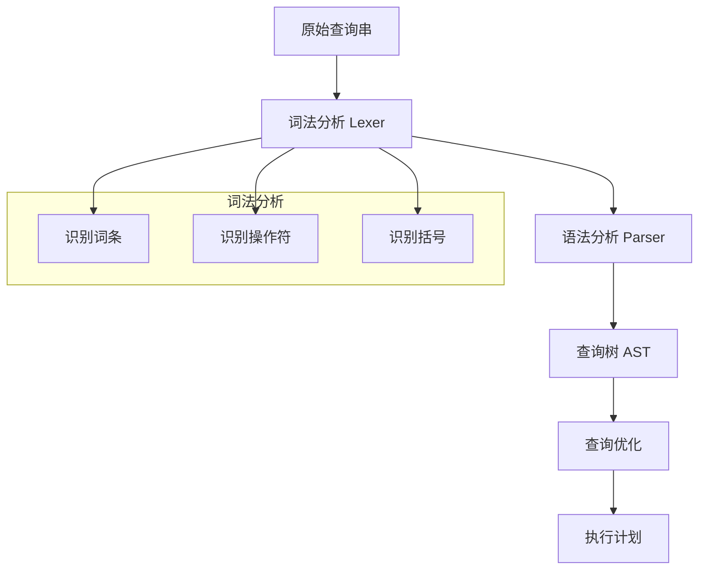

### 查询语法示例

```
简单查询：     apple
布尔查询：     apple AND banana
短语查询：     "quick brown fox"
模糊查询：     appple~2
组合查询：     (apple OR banana) AND NOT cherry
范围查询：     price:[100 TO 500]
通配符查询：   app*
```

### 查询树结构

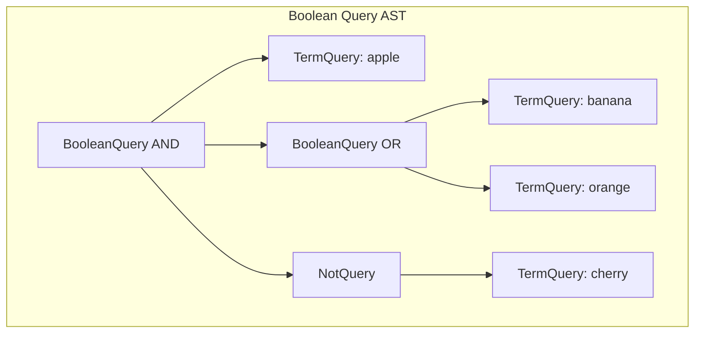

### 执行策略

**Term Query 执行**：

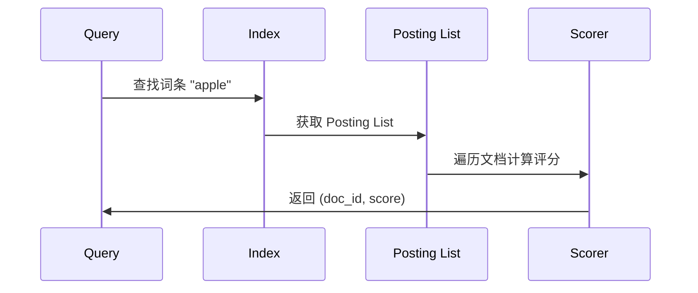

**Boolean Query 执行**：

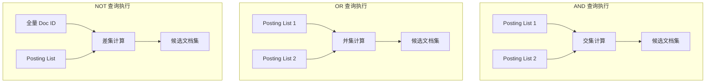

### 集合操作优化

| 操作 | 算法 | 时间复杂度 |
|------|------|------------|
| AND | 跳表交集 | O(n + m) |
| OR | 归并排序 | O(n + m) |
| NOT | 位图差集 | O(n) |

**跳表加速交集**：

```
Posting List A: [1, 3, 5, 7, 9, 11, 13, ...]
Posting List B: [2, 3, 6, 7, 10, 11, 14, ...]

跳表跳跃：A[3] vs B[3] → 匹配 ✓
跳表跳跃：A[7] vs B[6] → A 小，跳 A
跳表跳跃：A[7] vs B[7] → 匹配 ✓
```

## 评分算法

### TF-IDF 算法

**公式**：

$$
\text{TF-IDF}(t, d) = \text{TF}(t, d) \times \text{IDF}(t)
$$

其中：

$$
\text{TF}(t, d) = \frac{f_{t,d}}{\sum_{t' \in d} f_{t',d}}
$$

$$
\text{IDF}(t) = \log \frac{N}{n_t}
$$

| 变量 | 含义 |
|------|------|
| $f_{t,d}$ | 词条 t 在文档 d 中的出现次数 |
| $N$ | 文档总数 |
| $n_t$ | 包含词条 t 的文档数 |

### BM25 算法

**BM25** 是 TF-IDF 的改进版本，加入了文档长度归一化和饱和参数：

$$
\text{BM25}(t, d) = \frac{(k_1 + 1) \cdot f_{t,d}}{k_1 \cdot (1 - b + b \cdot \frac{|d|}{\text{avgdl}}) + f_{t,d}} \cdot \log \frac{N - n_t + 0.5}{n_t + 0.5}
$$

| 参数 | 含义 | 典型值 |
|------|------|--------|
| $k_1$ | 词条频率饱和参数 | 1.2~2.0 |
| $b$ | 文档长度归一化参数 | 0.75 |
| $\|d\|$ | 文档 d 的长度 | - |
| avgdl | 平均文档长度 | - |

### BM25 vs TF-IDF 对比

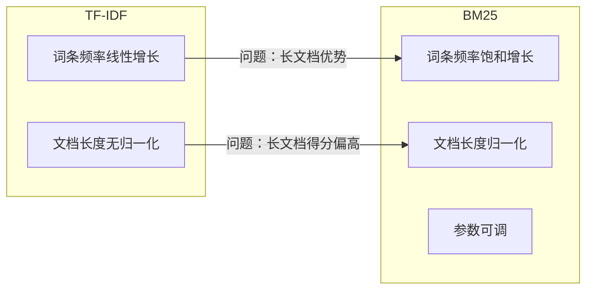

**TF 饱和效应对比**：

```
TF  TF-IDF 得分  BM25 得分 (k1=1.2)
1   1.0          0.55
2   2.0          0.78
5   5.0          0.95
10  10.0         0.98
20  20.0         0.99
```

### 评分流程

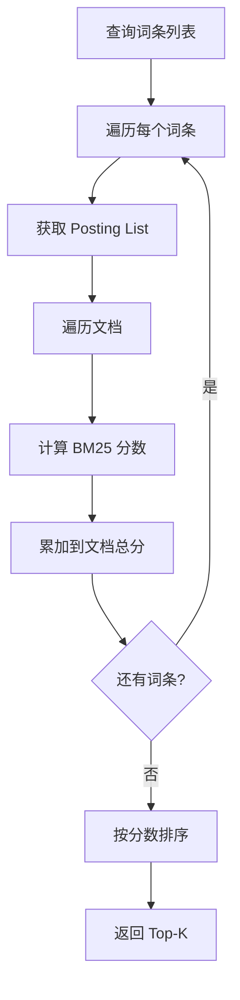

### 分数累加

多词条查询的分数计算：

$$
\text{Score}(q, d) = \sum_{t \in q} \text{BM25}(t, d)
$$

```c
// 项目 BM25 实现示意（简化）
float bm25_score_document(bm25_t *index, int doc_id, const char **terms, int term_count) {
    float total_score = 0.0f;
    for (int i = 0; i < term_count; i++) {
        float tf = get_term_frequency(index, terms[i], doc_id);
        float idf = get_idf(index, terms[i]);
        float doc_len = get_doc_length(index, doc_id);
        float avgdl = get_avg_doc_length(index);
        
        float tf_component = (tf * (K1 + 1)) / (tf + K1 * (1 - B + B * doc_len / avgdl));
        total_score += tf_component * idf;
    }
    return total_score;
}
```

## 查询类型详解

### 布尔查询（Boolean Query）

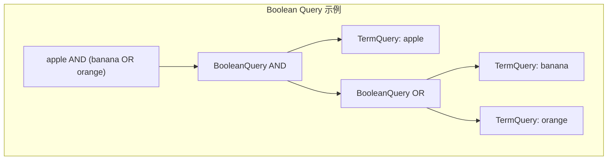

**执行逻辑**：

| 操作符 | 语义 | 集合操作 |
|--------|------|----------|
| AND | 交集 | A ∩ B |
| OR | 并集 | A ∪ B |
| NOT | 差集 | A - B |

**优化技巧**：

1. 按 Posting List 长度排序，先处理短列表
2. 使用位图加速集合运算
3. 提前终止（如果结果已足够）

### 短语查询（Phrase Query）

短语查询要求词条按特定顺序连续出现：

```
查询："quick brown fox"

文档 1: "The quick brown fox jumps" ✓ 匹配
文档 2: "The brown quick fox jumps" ✗ 顺序错误
文档 3: "A quick and brown fox" ✗ 不连续
```

**实现机制**：

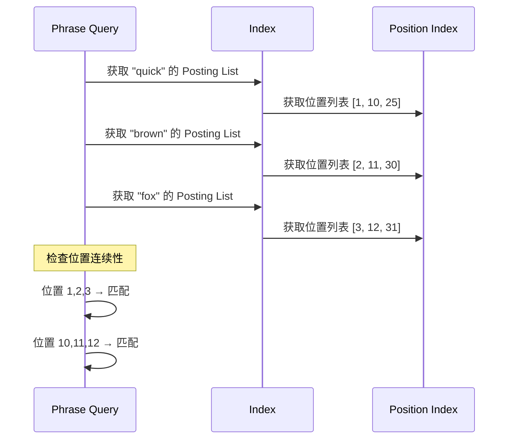

**位置索引存储**：

```
Term: "quick"
Doc 1: [位置 1, 位置 10]
Doc 5: [位置 3, 位置 15]
...
```

### 模糊查询（Fuzzy Query）

模糊查询支持编辑距离容错：

```
查询：appple~2

匹配：apple（编辑距离 1）
匹配：apply（编辑距离 2）
不匹配：banana（编辑距离 > 2）
```

**编辑距离计算**：

$$
d(s, t) = \min \begin{cases}
d(s-1, t) + 1 & \text{删除} \\
d(s, t-1) + 1 & \text{插入} \\
d(s-1, t-1) + \text{cost} & \text{替换}
\end{cases}
$$

**优化策略**：


### 前缀/通配符查询

```
前缀查询：app* → apple, application, apply
通配符查询：a*p*e → apple, alive
```

**实现方式**：

| 方式 | 说明 | 性能 |
|------|------|------|
| FST 前缀遍历 | 利用 FST 结构 | 高效 |
| N-gram 索引 | 预建 N-gram 倒排 | 中等 |
| 正则匹配 | 后验过滤 | 低效 |

## 结果排序与分页

### Top-K 选择算法

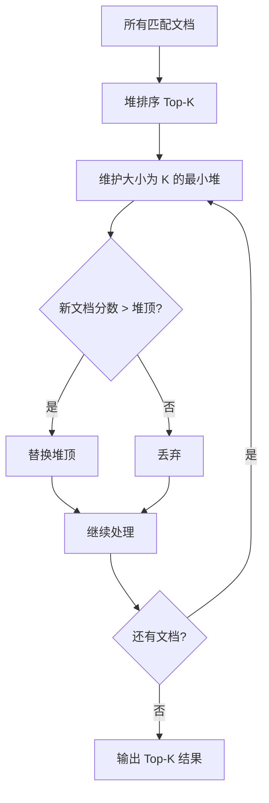

**堆选择算法**：

- 维护大小为 K 的最小堆
- 时间复杂度：O(n log K)
- 空间复杂度：O(K)

### 分页实现

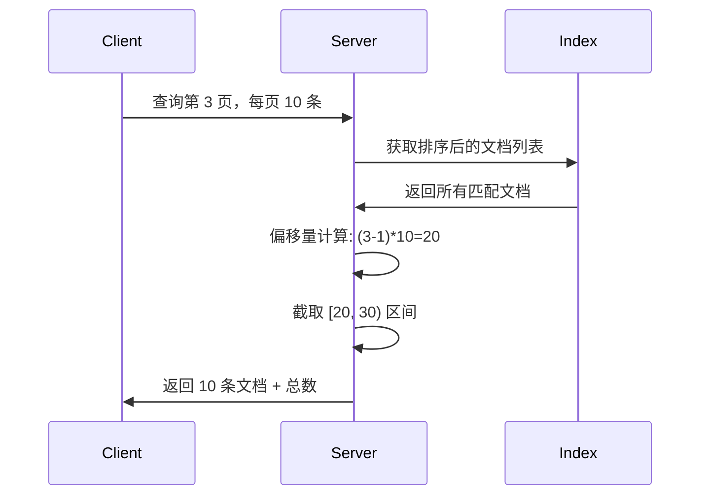

**深分页问题**：

```
查询第 10000 页，每页 10 条：
- 需要扫描前 100010 条文档
- 内存和计算开销大

优化方案：
- 游标分页（Cursor-based）
- 搜索_after 参数
```

### 跳表加速

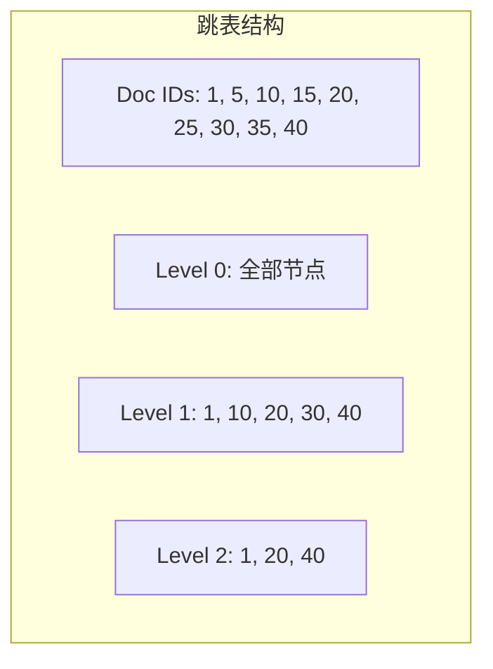

**跳表查询复杂度**：O(log n)

## 与项目 algo/ 模块关联

### 模块映射

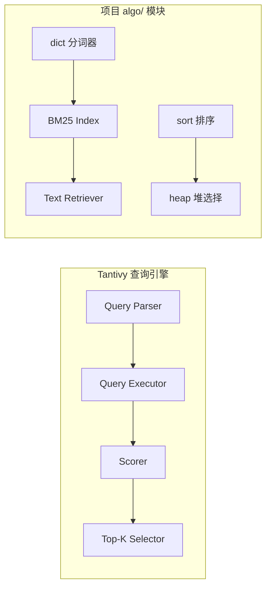

### 具体组件对应

| Tantivy 组件 | 项目对应 | 文件位置 |
|--------------|----------|----------|
| Term Query | BM25 词条查询 | `db/index/vector_index/BM25/bm25.h` |
| Boolean Query | GIN 布尔操作 | `db/index/gin/gin.h` |
| Phrase Query | 位置索引 | 待扩展 |
| Fuzzy Query | 编辑距离 | 待扩展 |
| Top-K 选择 | 堆排序 | `algo-prod/sort/sort.h` |
| 分词器 | Dict 分词 | `algo-prod/dict/dict.h` |

### 项目 BM25 查询示例

```c
// 项目 BM25 查询接口
bm25_t *index = bm25_index_create();
bm25_index_add_text(index, "文档内容...");

// 执行查询
int32_t doc_ids[10];
float scores[10];
int32_t hit_count;
bm25_index_search_text(index, "查询词", 10, scores, doc_ids);

// 获取搜索统计
bm25_search_stats_t stats;
bm25_index_get_last_search_stats(index, &stats);
```

### 算法复用

项目可从 Tantivy 借鉴的算法：

**1. 跳表交集算法**

```c
// 利用跳表加速 AND 查询
int intersect_sorted_lists(int *a, int n, int *b, int m, int *result) {
    int i = 0, j = 0, k = 0;
    while (i < n && j < m) {
        if (a[i] == b[j]) {
            result[k++] = a[i++];
            j++;
        } else if (a[i] < b[j]) {
            i = skip_forward(a, i, n, b[j]);  // 跳表跳跃
        } else {
            j = skip_forward(b, j, m, a[i]);
        }
    }
    return k;
}
```

**2. WAND 动态剪枝**

```c
// Top-K 查询优化：WAND 算法
// 提前跳过不可能进入 Top-K 的文档
typedef struct wand_cursor {
    float upper_bound;  // 该词条的最大可能得分
    posting_list_t *pl;
} wand_cursor_t;

int wand_search(wand_cursor_t *cursors, int n, float threshold) {
    // 按上界排序
    // 累加上界直到超过阈值
    // 动态调整阈值
}
```

**3. 堆选择算法**

```c
// 已有堆实现：algo-prod/priority_queue/priority_queue.h
// 用于 Top-K 选择
void top_k_select(doc_score_t *docs, int n, int k) {
    priority_queue_t *heap = pq_create(k, compare_min);
    for (int i = 0; i < n; i++) {
        if (pq_size(heap) < k) {
            pq_push(heap, docs[i]);
        } else if (docs[i].score > pq_peek(heap)->score) {
            pq_pop(heap);
            pq_push(heap, docs[i]);
        }
    }
}
```

## 要点总结

- 查询引擎将查询字符串转换为有序文档结果，核心流程：解析 → 执行 → 评分 → 排序
- BM25 是主流评分算法，通过 TF 饱和和文档长度归一化改进 TF-IDF
- 布尔查询通过集合运算实现 AND/OR/NOT，跳表可加速交集计算
- 短语查询依赖位置索引，模糊查询使用编辑距离或 N-gram 索引
- Top-K 选择使用最小堆，避免全量排序，时间复杂度 O(n log K)
- 项目的 BM25、GIN、Dict 模块已具备基础查询能力，可扩展短语/模糊查询

## 思考题

1. BM25 中的参数 k1 和 b 如何影响搜索结果？如何根据场景调优？
2. 短语查询与普通词条查询的主要区别是什么？为什么短语查询更耗资源？
3. 如何实现高效的深分页（如第 10000 页）？
4. 模糊查询的 N-gram 索引方式相比直接计算编辑距离有何优势？
5. 项目 BM25 模块如何支持布尔查询的组合？需要扩展哪些接口？

## 参考资料

- [Tantivy Query 文档](https://docs.rs/tantivy/latest/tantivy/query/trait.Query.html)
- [BM25 论文](https://en.wikipedia.org/wiki/Okapi_BM25)
- 《信息检索导论》- 评分模型章节
- 项目源码：`engineering/include/db/index/vector_index/BM25/bm25.h`
- 项目源码：`engineering/include/algo-prod/sort/sort.h`
- 项目源码：`engineering/include/algo-prod/priority_queue/priority_queue.h`